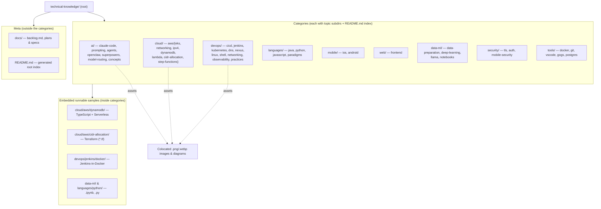

# CLAUDE.md

## Overview
Personal technical knowledge base / work notes. A collection of ~135 Markdown articles organized into **nine top-level categories**, each holding topic subdirectories, with supporting images, Jupyter notebooks, and a handful of small embedded code samples. This is a **documentation repo, not an application** — there is no top-level build, test, or run step. `README.md` at the root is the generated index; each category has its own `README.md` too.

## Architecture
Content is a two-level tree: `<category>/<topic>/<article>.md`. Assets (images, diagrams, notebooks, sample code) are colocated beside the article that references them, always via same-directory relative links. A few topic folders additionally contain runnable mini-projects.

Content breakdown: ~145 `.md` (incl. 10 generated `README.md`), ~60 images (`.png`/`.webp`/`.PNG`), ~16 `.ipynb`, plus scattered `.py`, `.ts`, `.tf`, `.yml`, `.sh`.

## Conventions
- **Notes are Markdown**, filed at `<category>/<topic>/`. Pick an existing category; add a topic subdirectory when the subject is genuinely new. Adding a tenth *category* should be rare.
- **Directory names are lowercase-kebab** (`claude-code/`, `mobile-security/`, `cidr-allocation/`). **Article filenames are left as authored** — mixed case, underscores and Chinese are all present and fine.
- **Colocate assets.** Images and diagrams live next to the article that references them; **links are same-directory relative (`./x.png`)** — never `../`. Anything an article links must move with it.
- **Diagrams:** prefer inline Mermaid for processes and relationships; use a drawio/exported image only when a diagram is too complex for readable Mermaid.
- **Bilingual:** filenames and content may be English or Chinese — both are expected.
- **Indexes are generated,** not hand-maintained. After adding or moving articles, regenerate the root and per-category `README.md` files rather than editing them by hand.
- There is no enforced lint/format tooling across the repo.

## Embedded projects (each self-contained, run from its own folder)
- `cloud/aws/dynamodb/` — TypeScript on the Serverless Framework (`serverless.yml`, `src/*.ts`).
- `cloud/aws/cidr-allocation/` — Terraform (`vpc.tf`, `variables.tf`).
- `devops/jenkins/docker/` — Jenkins in Docker; see `build.sh` / `run.sh` and `start-from-docker.md`.
- `data-ml/` and `languages/python/` — Jupyter notebooks and standalone Python scripts.

## Gotchas
- **macOS is case-insensitive.** A rename that changes only capitalisation (`Tools/` → `tools/`) fails or silently no-ops — do it in two steps via a temp name.
- `.gitignore` excludes `.DS_Store`, `jenkins_home`, `.ipynb_checkpoints/`, `__pycache__/` and `.pytest_cache/`. Do not commit secrets.
- No CI and no repo-wide test/build; verifying a change means opening the specific embedded project or rendering the Markdown, not running a root command.
- Some paths contain spaces and non-ASCII (Chinese) characters — quote paths in shell commands.
