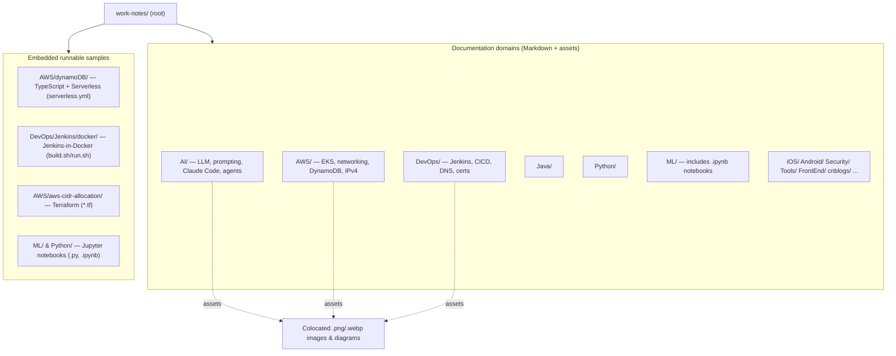

# CLAUDE.md

## Overview
Personal technical knowledge base / work notes. A collection of ~130 Markdown articles organized by topic domain (DevOps, AWS, Java, Python, AI, ML, iOS, and more), with supporting images, Jupyter notebooks, and a handful of small embedded code samples. This is a **documentation repo, not an application** — there is no top-level build, test, or run step.

## Architecture
The repo is a flat set of topic directories at the root. Each directory is a self-contained knowledge domain; articles are Markdown files with their assets (images, diagrams, notebooks, sample code) colocated alongside them. A few directories additionally contain runnable mini-projects.

Content breakdown: ~132 `.md`, ~60 images (`.png`/`.webp`/`.PNG`), ~16 `.ipynb`, plus scattered `.py`, `.ts`, `.tf`, `.yml`, `.sh`.

## Conventions
- **Notes are Markdown.** New content is a `.md` file placed in the matching top-level topic directory (create a new one only for a genuinely new domain).
- **Colocate assets.** Images and diagrams live next to the article that references them, using relative paths, not in a shared assets folder.
- **Diagrams:** prefer inline Mermaid for processes and relationships; use a drawio/exported image only when a diagram is too complex for readable Mermaid.
- **Bilingual:** filenames and content may be English or Chinese — both are expected.
- Root is a mix of code and prose; there is no enforced lint/format tooling across the repo.

## Embedded projects (each self-contained, run from its own folder)
- `AWS/dynamoDB/` — TypeScript on the Serverless Framework (`serverless.yml`, `src/*.ts`).
- `AWS/aws-cidr-allocation/` — Terraform (`vpc.tf`, `variables.tf`).
- `DevOps/Jenkins/docker/` — Jenkins in Docker; see `build.sh` / `run.sh` and `start-from-docker.md`.
- `ML/` and `Python/` — Jupyter notebooks and standalone Python scripts.

## Gotchas
- `.gitignore` excludes `.DS_Store`, `jenkins_home`, `.ipynb_checkpoints/`, `__pycache__/`, `.pytest_cache/`, and `cnblogs/.env`. Do not commit secrets — `cnblogs/` expects a local `.env`.
- No CI and no repo-wide test/build; verifying a change means opening the specific embedded project or rendering the Markdown, not running a root command.
- Some paths contain spaces and non-ASCII (Chinese) characters — quote paths in shell commands.
