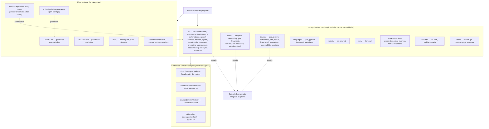

# CLAUDE.md

## Overview
Personal technical knowledge base / work notes. A collection of ~230 Markdown articles organized into **nine top-level categories**, each holding topic subdirectories, with supporting images, Jupyter notebooks, and a handful of small embedded code samples. This is a **documentation repo, not an application** — there is no top-level build, test, or run step. `README.md` at the root is the generated index; each category has its own `README.md` too. `LATEST.md` at the root is a second generated index — recent add/update activity plus the full catalogue by date added.

## Architecture
Content is a two-level tree: `<category>/<topic>/<article>.md`. Assets (images, diagrams, notebooks, sample code) are colocated beside the article that references them, always via same-directory relative links. A few topic folders additionally contain runnable mini-projects.



Content breakdown: ~250 `.md` (incl. 12 generated `README.md` and 5 series `index.md`), ~67 images (`.png`/`.webp`/`.PNG`), 16 `.ipynb`, plus scattered `.py`, `.ts`, `.tf`, `.yml`, `.sh`.

## Conventions
- **Notes are Markdown**, filed at `<category>/<topic>/`. Pick an existing category; add a topic subdirectory when the subject is genuinely new. Adding a tenth *category* should be rare.
- **Directory names are lowercase-kebab** (`claude-code/`, `mobile-security/`, `cidr-allocation/`). **Article filenames are left as authored** — mixed case, underscores and Chinese are all present and fine.
- **Never put a Jira ticket id in an article filename.** When an article is generated from a Jira ticket, name the file for its *subject*, not its ticket: `countdownlatch-in-java.md`, not `kan159-160-countdownlatch.md`. A ticket id means nothing to a reader, is unsearchable by topic, and goes stale when the tracker changes. Keep the traceability in the article **body** instead — the existing Jira-derived articles already open with a `> Source: Jira KAN-161 …` line, which is the right place for it. The same applies to the `# ` heading and any index entry.
- **Colocate assets.** Images and diagrams live next to the article that references them; **links are same-directory relative (`./x.png`)** — never `../`. Anything an article links must move with it.
- **Diagrams:** prefer inline Mermaid for processes and relationships; use a drawio/exported image only when a diagram is too complex for readable Mermaid.
- **Bilingual:** filenames and content may be English or Chinese — both are expected.
- **`raw/` is the source-of-record, category articles are the deliverable.** Rough study notes live at repo-root `raw/<topic>.md`; polished versions are filed in the normal category tree (currently `ai/llm-inference/`, tracked in its `index.md`). **Never edit a `raw/` note when polishing the derived article.**
- **Article series** (`ai/llm-inference/`, `ai/llm-fundamentals/`) keep a flat topic directory and cross-reference each other with same-directory relative links; `../<topic>/` is only for links across topics. Bilingual pairs are `<topic>.zh.md` + `<topic>.en.md`, where the English one is a parallel rewrite, not a literal translation.
- **Indexes are generated,** not hand-maintained. After adding or moving articles, regenerate the root and per-category `README.md` files rather than editing them by hand.
- **`LATEST.md` is generated by a script,** never by hand: `python3 scripts/gen-latest.py` (`--recent N` to list more activity). It has two sections answering two questions: *what did I touch lately* (newest add/update first, tagged `NEW`/`UPD`) and *when was this written* (every article by first-appearance date, traced through renames with `--follow`). The activity section deliberately skips `README.md`/`index.md` churn and pure file moves so it stays a shortcut rather than a changelog. **`CLAUDE.md` is never listed in `LATEST.md`** — it is a repo instruction file, not an article, and its edits are noise in a recent-docs index; the exclusion lives in `SKIP_NAMES` in the generator, so never add it back by hand. Articles already on CSDN are marked 📢 with a link to the live post — see **CSDN publishing** below.
- There is no enforced lint/format tooling across the repo.

## Embedded projects (each self-contained, run from its own folder)
- `cloud/aws/dynamodb/` — TypeScript on the Serverless Framework (`serverless.yml`, `src/*.ts`).
- `cloud/aws/cidr-allocation/` — Terraform (`vpc.tf`, `variables.tf`).
- `devops/jenkins/docker/` — Jenkins in Docker; see `build.sh` / `run.sh` and `start-from-docker.md`.
- `data-ml/` and `languages/python/` — Jupyter notebooks and standalone Python scripts.

## Git workflow
- **Standing authorization: always commit and push when there are local changes.** Do not stop to ask for confirmation — finish the work, then `git add` the relevant files, commit with a descriptive message, and `git push` to `origin master`. This applies to normal note-writing and index regeneration.
- **One article, one commit — commit as soon as an article is finished.** Do not leave a completed article uncommitted, and do not batch several articles into a single commit. The commit covers that article plus whatever moves with it: colocated assets it links, and any index regeneration it triggers.
- Still ask first for anything destructive or history-rewriting: force pushes, `reset --hard`, amending pushed commits, branch deletion, or discarding uncommitted work you did not create.
- **Refresh `LATEST.md` after the article commit lands, not before** — the generator reads *committed* history, so an article that is still unstaged will not appear in it. Commit the article first, then regenerate and commit the refreshed `LATEST.md`; an index refresh may ride along with the next article's commit rather than needing one of its own.
- Stage files by name rather than `git add -A`, and never commit secrets (see Gotchas).

## CSDN publishing
- **Publishing is not done until the URL is recorded in the repo.** After a successful publish, write the live URL into a `_url_map.json`, then regenerate `LATEST.md` so the article shows its 📢 marker. An article live on CSDN but absent from the map is indistinguishable from an unpublished one.
- **`_url_map.json` is the source of truth**, one per series directory (e.g. `ai/deepseek-harness/_url_map.json`), keyed by article filename relative to that directory. Create it if the series has none yet:
  ```json
  { "articles": {
      "01-why.zh.md": { "articleId": "164873889",
                        "url": "https://blog.csdn.net/PhilZhou/article/details/164873889" } } }
  ```
  The `csdn-publish` skill also documents a repo-level `.csdn-tools/articles/_url_map.json` using `src`/`url` entries; `scripts/gen-latest.py` reads **both** shapes, so either is fine — just be consistent within a series.
- **Then run `python3 scripts/gen-latest.py`.** **Never hand-edit `LATEST.md`** to add a 📢 — the file is generated and the edit will be overwritten on the next run.
- Series `index.md` files also carry a human-readable `- [x] CSDN 已发布：<url>` line. Keep it in sync where the series uses it; the generator falls back to those lines for articles missing from a URL map.
- **A bare `- [x]` checkbox in a series index means "this language version is written", not "published to CSDN."** Only an explicit `CSDN 已发布：<url>` line or a URL-map entry counts as published — do not infer publish state from the plain checkbox. All five series indexes carry a legend stating this; `ai/llm-inference/index.md` used the opposite meaning until 2026-09-18 and was converted; its URLs were then backfilled from the public article listing into `ai/llm-inference/_url_map.json` (9 published — one of its old checkboxes proved wrong, see that file's `_note`).
- Per the `csdn-publish` skill, do not rewrite links inside local Markdown articles as part of publishing. Recording the URL map and regenerating the generated indexes is the whole local footprint.

## Gotchas
- **macOS is case-insensitive.** A rename that changes only capitalisation (`Tools/` → `tools/`) fails or silently no-ops — do it in two steps via a temp name.
- `.gitignore` excludes `.DS_Store`, `jenkins_home`, `.ipynb_checkpoints/`, `__pycache__/` and `.pytest_cache/`. Do not commit secrets.
- No CI and no repo-wide test/build; verifying a change means opening the specific embedded project or rendering the Markdown, not running a root command.
- Some paths contain spaces and non-ASCII (Chinese) characters — quote paths in shell commands.
