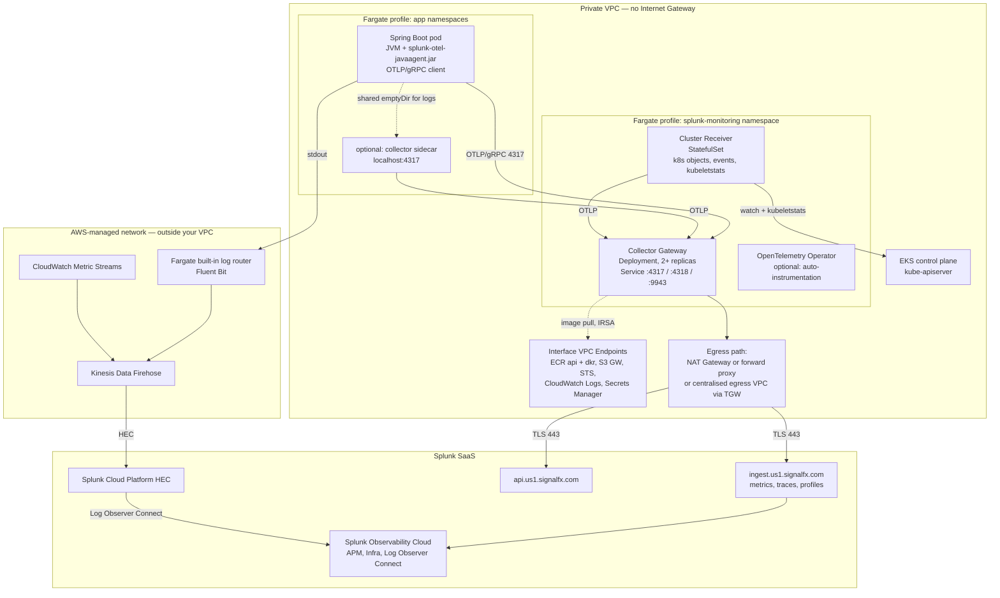
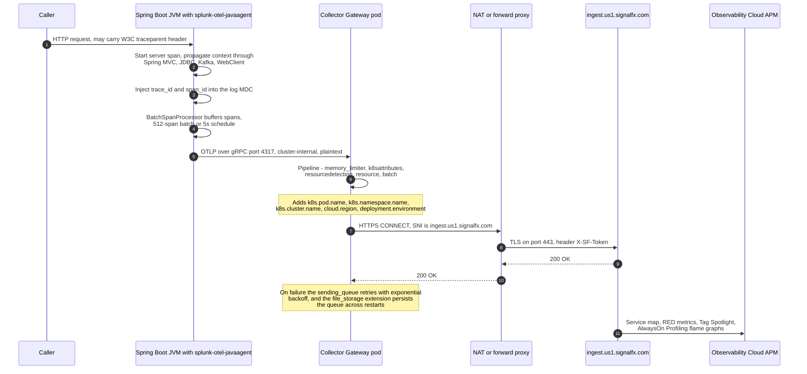
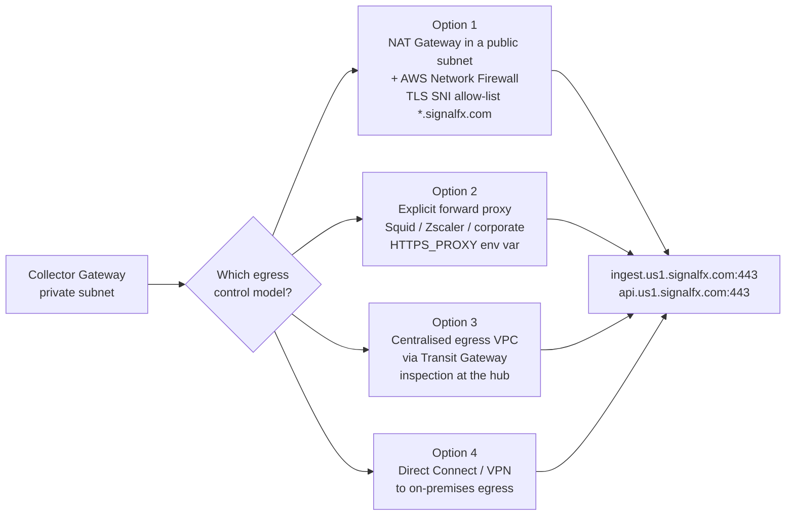
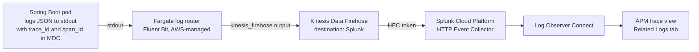

# Instrumenting a Java Spring Boot Application on AWS EKS Fargate with Splunk Observability Cloud

**Architecture and Data-Flow Design for a Private VPC with No Direct Internet Access**

Version 1.0 — 2026-07-29

---

## 1. Scope and Assumptions

This document explains how to get traces, metrics, profiles, and logs from a Java Spring Boot workload running on **AWS EKS (Elastic Kubernetes Service) Fargate** into **Splunk Observability Cloud**, when the Fargate pods run in **private subnets with no Internet Gateway attached**.

Assumptions used throughout:

| Item | Assumed value |
|---|---|
| Compute | EKS Fargate profiles only (no EC2 managed node groups) |
| Networking | Private subnets, no IGW (Internet Gateway) route, no public IP on pod ENIs |
| Application | Spring Boot 3.x on a JVM (Java Virtual Machine) base image, containerised |
| Backend | Splunk Observability Cloud SaaS in realm `us1` (substitute your realm) |
| Log destination | Splunk Cloud Platform, surfaced in Observability Cloud via Log Observer Connect |
| Identity | IRSA (IAM Roles for Service Accounts) enabled on the cluster |

The starting-point material in `prompt.md` describes the **standard EC2-node** installation path (Helm/EKS add-on deploying a DaemonSet agent, plus a `-javaagent` flag). Two of those assumptions break on Fargate and are the main subject of Sections 3–5.

---

## 2. Abbreviation Glossary

| Abbreviation | Full English name | 中文 |
|---|---|---|
| APM | Application Performance Monitoring | 应用性能监控 |
| CA | Certificate Authority | 证书颁发机构 |
| ECR | Elastic Container Registry | 弹性容器镜像仓库 |
| EKS | Elastic Kubernetes Service | 弹性 Kubernetes 服务 |
| ENI | Elastic Network Interface | 弹性网络接口 |
| HEC | HTTP Event Collector | HTTP 事件收集器 |
| IGW | Internet Gateway | 互联网网关 |
| IRSA | IAM Roles for Service Accounts | 服务账号 IAM 角色 |
| JVM | Java Virtual Machine | Java 虚拟机 |
| MDC | Mapped Diagnostic Context | 映射诊断上下文（日志） |
| NAT | Network Address Translation | 网络地址转换 |
| OTLP | OpenTelemetry Protocol | OpenTelemetry 协议 |
| OTel | OpenTelemetry | 开放遥测标准 |
| RUM | Real User Monitoring | 真实用户监控 |
| SNI | Server Name Indication | 服务器名称指示（TLS 扩展） |
| STS | Security Token Service | 安全令牌服务 |
| TGW | Transit Gateway | 中转网关 |
| TLS | Transport Layer Security | 传输层安全协议 |
| VPC | Virtual Private Cloud | 虚拟私有云 |

---

## 3. What Fargate Takes Away

EKS Fargate is a pod-per-microVM runtime. Each pod gets its own dedicated ENI in your private subnet and its own kernel. There is no node you can log into, no shared host filesystem, and no node-level agent slot. This invalidates several defaults in the standard Splunk OTel Collector installation.

| Standard EC2-node design | Status on Fargate | Consequence |
|---|---|---|
| Collector **agent as a DaemonSet** | **Not supported** — Fargate has no schedulable nodes for DaemonSets | Must use a gateway `Deployment` or a per-pod sidecar |
| App sends OTLP to `status.hostIP:4317` via the Downward API | **Silently wrong** — on Fargate `status.hostIP` equals the pod's own IP | App would export to itself and drop all telemetry |
| `hostPath` volume for `/var/log/pods` (filelog receiver) | **Not supported** — host paths are blocked | No node-level log tailing |
| `hostNetwork`, `hostPort`, privileged containers | **Not supported** | No host metrics receiver, no node-level scraping |
| Node/host infrastructure metrics (CPU, memory, disk of the host) | **Not available** | Pod-level metrics only; "node" objects are virtual |
| Image pulled from public registries at runtime | **Blocked** by the no-Internet constraint | Mirror all images into ECR |

The third-to-last row is the most commonly missed trap: the Downward API pattern published in the standard Splunk documentation *appears* to work on Fargate (the pod starts, no error), but every span is exported to the application's own IP address on port 4317 and disappears. Any design must replace it explicitly.

---

## 4. Target Architecture

The design separates telemetry into **four independent planes**, and — critically for the no-Internet constraint — only **one** of them requires egress from your VPC.



### 4.1 The four planes

| Plane | Producer | Path | Needs VPC egress? |
|---|---|---|---|
| **A. APM — traces, spans, JVM metrics, AlwaysOn Profiling** | Java agent in the app pod | App → Collector Gateway → `ingest.<realm>.signalfx.com` | **Yes** (gateway only) |
| **B. Kubernetes infrastructure metrics and events** | Cluster Receiver | `kube-apiserver` → Cluster Receiver → Gateway → ingest | **Yes** (gateway only) |
| **C. AWS service metrics — ELB, RDS, SQS, EKS control plane** | CloudWatch | Metric Streams → Firehose → Splunk ingest, **or** Splunk polls the CloudWatch API using an assumed IAM role | **No** |
| **D. Application logs** | Container stdout | Fargate log router → Firehose → Splunk Cloud HEC → Log Observer Connect | **No** |

The key architectural insight for a locked-down VPC: **planes C and D travel entirely over AWS-managed networking.** CloudWatch Metric Streams, Kinesis Data Firehose, and the Fargate log router all run outside your VPC's routing domain. You therefore only have to solve outbound connectivity for a small, fixed set of collector pods in one namespace, rather than for every application pod.

---

## 5. Plane A in Detail: The Trace and Metric Path

### 5.1 Choosing where the collector runs

Because the DaemonSet is unavailable, there are three viable topologies.

| Option | How the app addresses it | Pros | Cons | Recommendation |
|---|---|---|---|---|
| **A. Gateway Deployment** (ClusterIP Service) | `http://splunk-otel-collector.splunk-monitoring.svc.cluster.local:4317` | One egress point, one token, central batching and retry, cheapest | One extra network hop; gateway is a shared failure domain; needs HPA sizing | **Default choice** |
| **B. Sidecar collector per pod** | `http://localhost:4317` | No cross-pod hop, per-pod buffering, isolates noisy neighbours | Each Fargate pod's size is the **sum of all container requests rounded up** to the next Fargate configuration — a 200m/256Mi sidecar can push a 0.25 vCPU/0.5 GB pod to 0.5 vCPU/1 GB and roughly double its cost | Use only for latency-critical or very high-cardinality services |
| **C. Java agent exports directly to Splunk** (`SPLUNK_REALM` + `SPLUNK_ACCESS_TOKEN`, no collector) | n/a | Fewest moving parts | Every app pod needs Internet egress and holds an ingest token; no central enrichment, redaction, sampling, or retry; loses `k8sattributes` enrichment | **Avoid** under this constraint |

The recommended production shape is **A for all services, with B applied selectively**. A hybrid works fine: the sidecar simply forwards to the same gateway Service instead of exporting to Splunk directly.

### 5.2 Span journey, end to end



### 5.3 What the Java agent emits

A single `-javaagent` flag turns on four data types at once:

| Data type | Wire format | Default destination | Landing place in Splunk |
|---|---|---|---|
| Traces / spans | OTLP | `OTEL_EXPORTER_OTLP_ENDPOINT` | APM service map, Tag Spotlight |
| JVM and runtime metrics | OTLP | same endpoint | Infrastructure → Java dashboards |
| AlwaysOn Profiling — CPU and memory | OTLP logs | same endpoint | APM → Profiling flame graphs |
| Log correlation IDs | Injected into MDC, not exported | app stdout | Joined with logs via Log Observer Connect |

---

## 6. Solving the Egress Constraint

Splunk Observability Cloud ingest is a public SaaS endpoint. **There is no AWS PrivateLink service for Observability Cloud ingest**, so the collector must reach `*.signalfx.com` over the public Internet by some route. "No Internet access" in practice means "no unrestricted, unaudited Internet access" — the design goal is a narrow, allow-listed, auditable egress channel for exactly one namespace.



**Recommendation:** Option 1 or Option 3, depending on whether your organisation already runs a centralised egress hub. Both give you a domain allow-list and flow logs without putting an HTTP proxy in the telemetry path. Option 2 is the right answer when corporate policy mandates a proxy — the collector is a Go binary and honours `HTTPS_PROXY` / `NO_PROXY` natively.

### 6.1 Endpoints to allow-list

| Destination | Port | Purpose | Required? |
|---|---|---|---|
| `ingest.<realm>.signalfx.com` | 443 | Metrics, traces, events, profiling | Yes |
| `api.<realm>.signalfx.com` | 443 | Token validation, some collector features | Yes |
| `rum-ingest.<realm>.signalfx.com` | 443 | Browser RUM beacons | Only if browsers are outside this VPC |
| `app.<realm>.signalfx.com` | 443 | Human web console | Operator workstations only — not the cluster |

Substitute your realm (`us0`, `us1`, `eu0`, `jp0`, …). The realm is visible under your Observability Cloud profile.

### 6.2 If the proxy terminates TLS

A TLS-inspecting proxy re-signs the connection with a corporate CA. The collector will reject it with `x509: certificate signed by unknown authority` unless you mount that CA. Mount the CA bundle as a ConfigMap and set `SSL_CERT_FILE` — the collector's Go runtime honours it — or set `tls.ca_file` on the exporter. Do the same for the Java agent if you ever choose topology C.

### 6.3 VPC endpoints you need regardless

These are not for Splunk — they are what makes a Fargate pod able to start at all in a private subnet:

| Service | Endpoint type | Why |
|---|---|---|
| `com.amazonaws.<region>.ecr.api` | Interface | Image pull authorisation |
| `com.amazonaws.<region>.ecr.dkr` | Interface | Image layer pull |
| `com.amazonaws.<region>.s3` | **Gateway** | ECR stores layers in S3 |
| `com.amazonaws.<region>.logs` | Interface | Fargate log router to CloudWatch |
| `com.amazonaws.<region>.sts` | Interface | IRSA token exchange |
| `com.amazonaws.<region>.secretsmanager` | Interface | Only if the access token lives in Secrets Manager |

### 6.4 Air-gapped artefact handling

With no Internet, nothing may be downloaded at runtime:

1. **Mirror the collector image** `quay.io/signalfx/splunk-otel-collector` into ECR and override `image.otelcol.repository` in the Helm values.
2. **Bake the Java agent into the application image** at build time. Do not fetch `splunk-otel-javaagent.jar` from GitHub in an entrypoint script.
3. **Mirror the Helm chart** into an internal chart repository or vendor it into your Git repository, since `helm repo add https://signalfx.github.io/...` will fail.
4. If you use the OpenTelemetry Operator's auto-instrumentation, **mirror the auto-instrumentation image** (`ghcr.io/signalfx/splunk-otel-java/splunk-otel-java`) too — the operator injects it as an init container that copies the jar into a shared volume, and that pull happens from inside your VPC.

---

## 7. Deployment Configuration

### 7.1 Fargate profile

The collector namespace must be covered by a Fargate profile, or its pods stay `Pending` forever with no obvious error.

```yaml
# eksctl or CloudFormation equivalent
fargateProfiles:
  - name: splunk-monitoring
    selectors:
      - namespace: splunk-monitoring
    subnets: [subnet-private-a, subnet-private-b]
```

### 7.2 Helm values

```yaml
clusterName: prod-eks-fargate
distribution: eks/fargate          # tells the chart to use the Fargate-safe layout
cloudProvider: aws
environment: prod                  # becomes deployment.environment on every signal

splunkObservability:
  realm: us1
  accessToken: ""                  # empty: read from the pre-created secret below

secret:
  create: false
  name: splunk-otel-tokens         # kubectl-created, or synced from Secrets Manager

agent:
  enabled: false                   # DaemonSets cannot run on Fargate

gateway:
  enabled: true
  replicaCount: 2                  # spread across availability zones
  resources:
    requests: { cpu: 500m,  memory: 1Gi }
    limits:   { cpu: 2000m, memory: 4Gi }
  extraEnvs:
    - name: HTTPS_PROXY
      value: "http://proxy.internal.example.com:3128"
    - name: NO_PROXY
      value: "localhost,127.0.0.1,.svc,.cluster.local,169.254.169.254,169.254.170.2,10.0.0.0/8"
    - name: SSL_CERT_FILE          # only with a TLS-inspecting proxy
      value: "/etc/ssl/corp/ca-bundle.crt"

clusterReceiver:
  enabled: true
  eventsEnabled: true              # Kubernetes events into Observability Cloud

image:
  otelcol:
    repository: <acct>.dkr.ecr.<region>.amazonaws.com/splunk/splunk-otel-collector
```

Two notes on this file:

- `distribution: eks/fargate` is doing real work. It makes the chart deploy node-level metric collection through the Cluster Receiver StatefulSet (scraping kubelet stats through the API server) instead of assuming a DaemonSet, because on Fargate each pod is presented as its own virtual node.
- Verify the exact values keys against the chart version you pin. The chart evolves; treat this as the shape, not the literal contract.

### 7.3 Access token handling

The `prompt.md` reference to secure token handling matters more here, not less, because a locked-down VPC usually accompanies a strict secrets policy.

- Create an **organisation access token** scoped to `INGEST` only. Do not use a user API token — it dies when the user leaves.
- Store it in a Kubernetes Secret created out-of-band, or sync it from AWS Secrets Manager with the External Secrets Operator. Never put it in the Helm values file that lands in Git.
- Set `secret.create: false` and point `secret.name` at it, so `helm upgrade` never re-templates the token.
- Rotate by updating the Secret and rolling the gateway Deployment. Because only the gateway holds the token, rotation touches two pods rather than every application pod — a direct benefit of topology A over topology C.

### 7.4 EKS add-on versus Helm

The AWS Marketplace EKS add-on is a packaging of the same Helm chart and is the smoother path on EC2 node groups. On a Fargate-only cluster, prefer **Helm directly**: you need to override `distribution`, disable the agent, inject proxy environment variables, and repoint the image registry — all of which are cleaner as values than as add-on configuration JSON. If your organisation mandates the add-on, confirm that its configuration schema exposes these fields for the add-on version you are pinning.

---

## 8. Instrumenting the Spring Boot Application

### 8.1 Image build — agent baked in

```dockerfile
FROM <acct>.dkr.ecr.<region>.amazonaws.com/base/eclipse-temurin:21-jre AS runtime

# Copied from an internal artefact repository at build time — never fetched at runtime
COPY --chown=app:app splunk-otel-javaagent.jar /opt/splunk/splunk-otel-javaagent.jar
COPY --chown=app:app app.jar /opt/app/app.jar

USER app
ENTRYPOINT ["java", "-javaagent:/opt/splunk/splunk-otel-javaagent.jar", "-jar", "/opt/app/app.jar"]
```

Putting `-javaagent` in the `ENTRYPOINT` is more robust than `JAVA_TOOL_OPTIONS`, which some base images and Spring Boot launchers override.

### 8.2 Deployment manifest — the Fargate-correct endpoint

```yaml
apiVersion: apps/v1
kind: Deployment
metadata:
  name: orders-service
  namespace: payments
spec:
  template:
    spec:
      containers:
        - name: app
          image: <acct>.dkr.ecr.<region>.amazonaws.com/payments/orders-service:1.4.2
          env:
            # ---- Correct on Fargate: a stable cluster DNS name, NOT status.hostIP ----
            - name: OTEL_EXPORTER_OTLP_ENDPOINT
              value: "http://splunk-otel-collector.splunk-monitoring.svc.cluster.local:4317"
            - name: OTEL_EXPORTER_OTLP_PROTOCOL
              value: "grpc"

            - name: OTEL_SERVICE_NAME
              value: "orders-service"
            - name: OTEL_RESOURCE_ATTRIBUTES
              value: "deployment.environment=prod,service.version=1.4.2"

            - name: SPLUNK_PROFILER_ENABLED
              value: "true"
            - name: SPLUNK_PROFILER_MEMORY_ENABLED
              value: "true"

            # Useful correlation attributes, from the Downward API
            - name: OTEL_RESOURCE_ATTRIBUTES_POD_NAME
              valueFrom: { fieldRef: { fieldPath: metadata.name } }
```

> **The single most important line in this document:** on EKS Fargate, do **not** use
> `valueFrom: fieldRef: status.hostIP` to build the OTLP endpoint. `status.hostIP` equals the pod's
> own IP on Fargate, so the application exports every span to itself and the data vanishes with no
> error in the application log. Use the collector Service's DNS name.

### 8.3 Optional: operator-based auto-instrumentation

If you do not control every Dockerfile, install the OpenTelemetry Operator (bundled with the Splunk chart via `operator.enabled: true`) and annotate namespaces:

```yaml
metadata:
  annotations:
    instrumentation.opentelemetry.io/inject-java: "splunk-monitoring/splunk-otel-collector"
```

The operator mutating webhook injects an init container that copies the agent jar into a shared volume and sets the JVM flags. This works on Fargate — the operator and its webhook are ordinary Deployments — with two caveats: the auto-instrumentation image must be mirrored to ECR (Section 6.4), and pods must be **recreated**, not just re-annotated, for injection to take effect.

---

## 9. Plane D in Detail: Logs Without a Node Agent

There is no `/var/log/pods` to tail, so the filelog receiver is unavailable. Two workable patterns:

### 9.1 Fargate built-in log router (recommended)

Fargate ships an AWS-managed Fluent Bit. You configure it with a ConfigMap named `aws-logging` in the `aws-observability` namespace, and it supports the `cloudwatch_logs`, `kinesis_firehose`, `kinesis_streams`, and `opensearch` output plugins — **note that there is no direct Splunk output plugin**, which is why Firehose is the bridge.



This path leaves your VPC's routing domain entirely — Fluent Bit and Firehose are AWS-managed — so it needs no NAT gateway and no proxy. You do need the CloudWatch Logs VPC endpoint for the log router's own error channel, and the Splunk Cloud HEC endpoint must accept Firehose source addresses.

### 9.2 Sidecar collector reading a shared volume

Where you need OTel-native processing of logs (redaction, attribute enrichment, sampling), have the application also write to a file on an `emptyDir` volume shared with a sidecar collector running the filelog receiver. This is legal on Fargate because `emptyDir` is a pod-local volume, unlike `hostPath`. It costs the sidecar's Fargate rounding penalty, so reserve it for services with genuine log-processing requirements.

### 9.3 Trace-to-log correlation

The Splunk Java agent injects `trace_id`, `span_id`, `service.name`, and `deployment.environment` into the logging MDC automatically. Emit logs as JSON and include those fields in the pattern; Log Observer Connect then joins a span in the APM waterfall to its exact log lines. Without this, logs and traces remain two disconnected products.

---

## 10. Plane C in Detail: AWS Service Metrics

Connecting the AWS account (step one in `prompt.md`) is unaffected by the private VPC, because neither mechanism traverses it:

| Mechanism | How it works | Latency | Best for |
|---|---|---|---|
| **Polling** (integration wizard default) | Splunk's SaaS assumes an IAM role in your account with an external ID and calls the CloudWatch API from Splunk's network | 5–10 minutes | Simple setup, low-cardinality services |
| **CloudWatch Metric Streams** | CloudWatch pushes to Firehose, Firehose delivers to the Splunk ingest endpoint | Under 2 minutes | Production; lower cost at scale, near-real-time |

Prefer Metric Streams. Note that the value here is contextual, not primary: it gives you ALB (Application Load Balancer) target 5xx rates, RDS connection saturation, and EKS control plane metrics alongside the APM data, which is exactly what you need when a Spring Boot latency spike turns out to be a database problem.

---

## 11. Sizing, Cost, and Resilience Notes

- **Gateway sizing.** Start at 2 replicas × 500m CPU / 1 Gi memory. A collector replica handles roughly 10–15k spans/second at that size; scale on CPU with an HPA and watch `otelcol_exporter_send_failed_spans`.
- **Fargate rounding is the sidecar tax.** Fargate bills the sum of container requests rounded up to the next configuration step. Adding a 200m/256Mi sidecar to a fleet of 200 small pods can cost more than the entire gateway tier. Model this before choosing topology B.
- **Persistent queueing.** Enable the `file_storage` extension with an `emptyDir` on the gateway so an ingest outage or a proxy restart does not drop in-flight batches. The buffer dies with the pod, which is acceptable for a stateless gateway; size it for your worst realistic proxy outage.
- **Availability zone spread.** Use `topologySpreadConstraints` on the gateway. Fargate places pods per-subnet, and a single-AZ gateway plus an AZ outage means total telemetry loss precisely when you need telemetry most.
- **Backpressure.** Put `memory_limiter` first in every pipeline. A gateway that OOMs under a trace storm takes the whole observability plane down.
- **Do not forget the security group.** Fargate pods use the cluster security group and cannot have per-pod security groups. It must allow egress on 443 to the NAT gateway or proxy, and allow 4317/4318 within the VPC CIDR.

---

## 12. Validation Checklist

Run these in order after deployment; each isolates one hop in the chain.

| # | Check | Command or method | Expected result |
|---|---|---|---|
| 1 | Collector pods are running, not Pending | `kubectl get pods -n splunk-monitoring` | All `Running` — `Pending` almost always means a missing Fargate profile |
| 2 | Collector health | `kubectl port-forward svc/splunk-otel-collector 13133` then `curl localhost:13133` | HTTP 200 |
| 3 | Egress to Splunk works | Collector logs at `--set logLevel=debug` | No `context deadline exceeded` or `x509` errors |
| 4 | Token is valid | Collector logs | No `401` or `Invalid access token` |
| 5 | App reaches the collector | `kubectl exec` into the app pod, `nc -zv splunk-otel-collector.splunk-monitoring 4317` | Connection succeeds |
| 6 | App is not exporting to itself | Verify `OTEL_EXPORTER_OTLP_ENDPOINT` resolves to the Service, not the pod IP | DNS name, never `status.hostIP` |
| 7 | Spans arrive | Observability Cloud → APM → Service Map | Service appears within ~1 minute of traffic |
| 8 | Profiling arrives | APM → the service → Profiling tab | Flame graph populates |
| 9 | Infrastructure metrics arrive | Infrastructure → Kubernetes navigator | Cluster, namespaces, and pods visible |
| 10 | Logs correlate | APM → a trace → Related Logs | Log lines for that exact `trace_id` |

### Common failure signatures

| Symptom | Most likely cause |
|---|---|
| App logs clean, zero spans in Splunk | `status.hostIP` used as the OTLP endpoint (Section 8.2) |
| Collector logs `x509: certificate signed by unknown authority` | TLS-inspecting proxy without the corporate CA mounted (Section 6.2) |
| Collector logs `context deadline exceeded` to `ingest.*` | Missing egress route or the domain is not in the firewall allow-list |
| Collector pod stuck `Pending`, no events | Namespace not matched by any Fargate profile |
| `ImagePullBackOff` on the collector | Image not mirrored to ECR, or the ECR/S3 VPC endpoints are missing |
| Infrastructure metrics missing but APM works | `distribution: eks/fargate` not set, or Cluster Receiver disabled |
| Traces present but logs unlinked | MDC fields not in the log pattern, or logs not emitted as JSON |

---

## 13. Conclusions

1. **Fargate's constraint is structural, not incidental.** The absence of DaemonSets means the standard Splunk installation path must be replaced by a gateway `Deployment`, and the `status.hostIP` endpoint pattern must be replaced by the collector Service's DNS name. Everything else in the Java instrumentation story — the `-javaagent` flag, the environment variables, the four data types — is unchanged.

2. **The no-Internet constraint is smaller than it looks, if you route around it.** Only the collector gateway needs outbound access, to two hostnames on port 443. AWS service metrics and application logs can be delivered entirely over AWS-managed networking via CloudWatch Metric Streams and Kinesis Data Firehose, never touching your VPC's egress path.

3. **There is no PrivateLink shortcut for Observability Cloud ingest.** Plan for a NAT gateway with an AWS Network Firewall domain allow-list, a centralised egress VPC, or a forward proxy. Budget time for the corporate CA if the proxy inspects TLS — that is the most common multi-day delay in this build.

4. **Air-gapping shifts work to build time.** The agent jar, the collector image, the auto-instrumentation image, and the Helm chart must all be vendored into internal registries. Anything the runtime tries to download will fail.

5. **Centralising the token at the gateway is a security win, not just an architectural one.** Ingest credentials live in one namespace on two pods, rotation is a two-pod roll, and application teams never handle a Splunk token.

---

## 14. References

- Monitoring Amazon EKS with Splunk Observability Cloud — https://lantern.splunk.com/Observability_Use_Cases/Monitor_Business/Monitoring_Amazon_EKS_with_Splunk_Observability_Cloud
- Install the EKS add-on with secure token handling — https://help.splunk.com/en/splunk-observability-cloud/manage-data/splunk-distribution-of-the-opentelemetry-collector/get-started-with-the-splunk-distribution-of-the-opentelemetry-collector/collector-for-kubernetes/kubernetes-eks-add-on/install-the-eks-add-on-with-secure-token-handling
- Create and manage organization access tokens — https://help.splunk.com/en/splunk-observability-cloud/administer/authentication-and-security/authentication-tokens/org-access-tokens
- Splunk OpenTelemetry Collector Helm chart — https://github.com/signalfx/splunk-otel-collector-chart
- Splunk Distribution of OpenTelemetry Java — https://github.com/signalfx/splunk-otel-java
- Amazon EKS Fargate considerations — https://docs.aws.amazon.com/eks/latest/userguide/fargate.html
- Fargate log routing — https://docs.aws.amazon.com/eks/latest/userguide/fargate-logging.html

**Verification note:** Helm values keys, chart behaviour under `distribution: eks/fargate`, and the EKS add-on's configuration schema change between releases. Pin a chart version and confirm the exact keys in Section 7.2 against that version's `values.yaml` before rollout.
