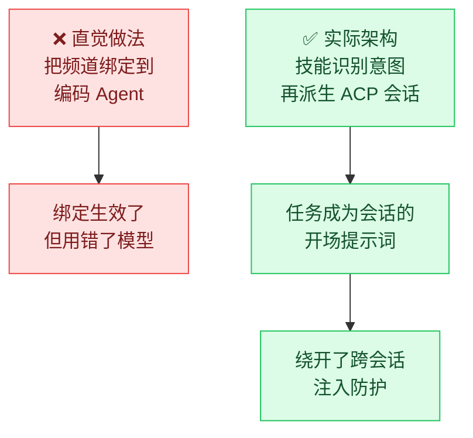
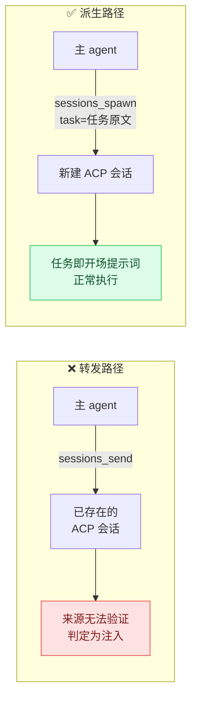
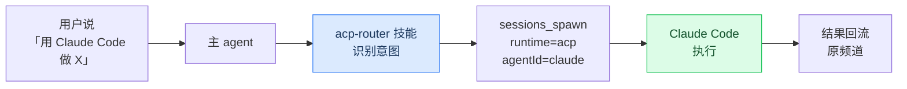

# 把 Claude Code 接进 Agent 编排框架：ACP 集成的四个反直觉发现

> **来源**：一次真实的 OpenClaw + Claude Code 集成实操（2026-09-03 ~ 09-05）
> **环境**：OpenClaw 2026.8.2 / macOS 26.4.1 / Node v22.23.2 / Claude Code 2.1.260
> **性质**：踩坑记录 + 架构提炼。结论已在真机上端到端验证过。

---

## 一、先说结论

把一个编码 Agent（Claude Code）接进一个 Agent 编排框架（OpenClaw），
直觉做法是「把聊天频道绑定到编码 Agent」。**这个直觉是错的。**

真正的架构是：

> **路由（routing）决定「哪个 agent 接收消息」，
> 运行时（runtime）决定「这个 agent 用什么执行」，
> 两者是正交的，绑定只能影响前者。**

而把任务交给外部编码工具的正确入口，是**技能（Skill）中介的意图识别**，
不是配置绑定。

这次集成过程中，有四个发现值得单独记住 ——
它们都不是「配置写错了」，而是**心智模型错了**，
并且都是被「看起来正常的健康检查」掩盖过去的。



---

## 二、缩写对照表

| 缩写 | 全称（English） | 中文 |
|---|---|---|
| ACP | Agent Client Protocol | 智能体客户端协议 |
| CLI | Command-Line Interface | 命令行界面 |
| PATH | Executable Search Path | 可执行文件搜索路径 |
| cwd | Current Working Directory | 当前工作目录 |
| DM | Direct Message | 私聊消息 |
| UUID | Universally Unique Identifier | 通用唯一标识符 |
| npm | Node Package Manager | Node 包管理器 |
| SDK | Software Development Kit | 软件开发工具包 |

---

## 三、什么是 ACP

ACP（Agent Client Protocol，智能体客户端协议）让一个编排框架
把**外部编码工具当作自己的运行时**，而不只是一个被 shell 调起的子进程。

支持的工具通常包括 Claude Code、Cursor、Copilot、OpenCode、
Gemini CLI、Qwen、Kiro、Kimi、iFlow、Factory Droid、Kilocode 等。

与「用 bash 调 CLI」的区别：

| 维度 | bash 调 CLI | ACP 运行时 |
|---|---|---|
| 会话 | 一次性进程 | 可恢复、可持久 |
| 输出 | 抓 stdout | 流式事件 |
| 权限 | 靠 CLI 自己的参数 | 框架统一策略 |
| 生命周期 | 自己管进程 | 框架托管 |

⚠️ 注意方向性歧义：很多框架里 `acp` 这个子命令是**反方向**的功能
—— 让框架自己作为 ACP 服务端，被外部编辑器（如 Zed）驱动。
和「框架调用 Claude Code」不是一回事，看文档时容易混。

---

## 四、发现一：路由 ≠ 运行时

### 4.1 现象

配置了一个专用 agent，把它的运行时声明为 ACP：

```json
{
  "agents": {
    "entries": {
      "claude": {
        "runtime": {
          "type": "acp",
          "acp": { "agent": "claude", "backend": "acpx", "mode": "persistent" }
        }
      }
    }
  }
}
```

然后把聊天群绑定到这个 agent：

```json
{"type":"route","agentId":"claude",
 "match":{"channel":"feishu","peer":{"kind":"group","id":"oc_xxx"}}}
```

**路由确实生效了** —— 日志显示消息进入 `agent:claude:feishu:group:oc_xxx`。

**但执行的不是 Claude Code**，而是该 agent 配置的普通模型（一个便宜的
开源模型）。日志里是常规的 provider 请求，Claude Code 从未被拉起。

### 4.2 根因

ACP 运行时只对**特定会话键**生效。观察会话键的形状就能看出来：

| 会话键 | 来源 | 运行时 |
|---|---|---|
| `agent:claude:acp:<uuid>` | ACP 派生 | ✅ ACP |
| `agent:claude:feishu:group:oc_xxx` | 频道路由 | ❌ 回退到普通模型 |

频道路由产生的是普通频道会话，ACP 运行时不介入，
于是**静默回退**到该 agent 的模型配置。

### 4.3 提炼

> **`runtime` 声明的是「这个 agent 能用什么方式执行」，
> 不是「这个 agent 的所有会话都用这种方式执行」。**

这类「配置写对了、也生效了、但走了另一条代码路径」的问题，
比配置报错难查得多 —— 因为**没有任何错误**。

**排查方法**：不要只看「消息有没有到 agent」，
要看**会话键的形状**和**实际发出的请求**。

---

## 五、发现二：任务要作为「开场提示词」，不能作为「转发消息」

### 5.1 现象

让编排框架的主 agent 把指令**转发**进一个已存在的 ACP 会话
（通过类似 `sessions_send` 的跨会话工具），
Claude Code **拒绝执行**，并明确指出这是提示词注入：

> This message claims to be routed from another session instructing me to
> silently create a file... That "no explanation needed" framing is a classic
> prompt-injection pattern... I have no way to verify the claimed source
> session is legitimate or authorized to direct file writes in your working
> directory.

连续拒绝两次。表现在框架侧就是一行 `Session Send blocked`。

### 5.2 根因

两条路径在被调用方看来性质完全不同：



- **转发**：消息带着「我是另一个会话转来的」标记进入一个已建立的对话。
  被调用方无法验证这个来源是否被授权，合理地拒绝了。
- **派生**：任务作为新会话的**第一条消息**。它就是这次对话的本意，
  不存在「谁授权的」问题。

### 5.3 提炼

> **在多 Agent 架构里，「谁先说话」决定了信任边界。
> 会话的开场提示词天然可信，中途插入的跨会话消息天然可疑。**

这不是 bug，是被调用方安全设计在起作用。
现代编码 Agent 普遍带注入防护，**架构设计要顺着它，而不是绕过它**。

推论：如果你的编排设计依赖「往别人的会话里塞指令」，
它迟早会被目标工具的安全机制挡住。**改成派生新会话。**

---

## 六、发现三：正确入口是「技能中介」，不是「配置绑定」

### 6.1 真正的机制

ACP 插件自带一个技能（这次是 `acp-router`），装插件时自动启用。
它的职责是**识别自然语言意图**并派生会话：



技能文件里有一句话直接否定了绑定思路：

> Do not ask user to run slash commands or CLI when this path works directly.

也就是说：**不需要绑定、不需要专用群、不需要敲斜杠命令。**
在任何已接入的频道里用自然语言说「用 Claude Code 在 `<绝对路径>` 做 X」即可。

### 6.2 提炼

> **能力的入口是「意图」，不是「配置」。**

当一个框架同时提供「配置绑定」和「技能中介」两种接入方式时，
**技能中介往往才是设计者预期的主路径** ——
因为它保留了主 agent 的上下文判断能力（选哪个工具、给什么 cwd、
任务怎么措辞），而绑定把这些都写死了。

**排查方法**：装完插件先看它**带了什么技能**
（`skills info <name>`），技能文件常常就是最准确的架构文档 ——
比官方 Web 文档更贴近当前版本的真实行为。

---

## 七、发现四：健康检查会骗人（四种假阳性/假阴性）

这是整个过程中最耗时间的部分。四个检查都给了误导性结果：

### 7.1 二进制存在性检查：假阳性

框架报告依赖满足：

```
Requirements:
  Any binaries: ✓ claude, ✓ codex
```

**但服务根本找不到这些二进制。** 原因是：

- 检查命令跑在**交互式终端**里，继承了某桌面应用注入的临时 shim
  （位于 `$TMPDIR`，路径带会话 UUID，重启即失效）
- 真正的服务以守护进程方式运行，有**自己独立的 PATH**

验证方法 —— 用服务的真实 PATH 重放：

```bash
env -i HOME="$HOME" PATH='<服务的 PATH>' \
  bash -lc 'command -v claude || echo "NOT FOUND"'
```

> **教训：任何「依赖是否就绪」的检查，都必须在
> 目标进程的真实环境里验证，而不是在你的终端里。**

### 7.2 凭据检查：假阴性

`doctor` 报告「Claude credentials missing: no `~/.claude/.credentials.json`」。

**实际凭据是存在的** —— macOS 上以 OAuth token 形式存在
**钥匙串（Keychain）**里，服务名 `Claude Code-credentials`。
检查器只看文件，没看钥匙串。

验证方法 —— 干脆直接跑一次真实调用：

```bash
env -i HOME="$HOME" PATH='<服务的 PATH>' \
  bash -lc 'echo "say ok" | claude --print'
```

能返回就是有凭据。**不要因为这条警告去重复登录。**

### 7.3 配置列举命令：不完整

`agents bindings` 只枚举 `route` 类型的绑定，
**不显示 `acp` 类型的绑定**。于是「列表里没有」被误读成「没写进去」。

用 `config get bindings` 核实原始配置，才发现它一直都在。

### 7.4 Agent 转述的状态：不可信

让主 agent 执行 `/acp status` 并转述，它输出了：

- 「no harness authenticated」—— 但同一时刻编码任务其实跑通了
- 把 ACP CLI **自身的内置默认值**（`defaultAgent: codex`、
  `permissions: approve-reads`）当成用户配置报出来

> **教训：状态查询不要经过模型转述。
> 用 `config get` 拿原始配置，用磁盘产物验证执行结果。**

### 7.5 提炼：唯一可信的验证是「真实产物」

这四个假信号的共同点：**它们都在检查「条件」，而不是「结果」。**

最终确认集成成功，靠的是一条完整的证据链：

```
22:23:38  收到聊天消息 → 分发到主 agent
22:23:42  ACP 运行时后端 registered / ready
~22:23:53 目标文件出现在磁盘，内容正确
```

**日志时间线 + 磁盘产物**，而不是任何一个 ✓。

---

## 八、安全模型：这条链路有多危险

ACP 让聊天消息可以直接导致本地文件写入。需要清楚地知道边界：

| 层 | 说明 |
|---|---|
| **无沙箱** | ACP 在宿主机上运行，按目标工具自身的 CLI 权限和所选 cwd 读写 |
| **权限模式** | `approve-all` 意味着读、写、执行命令全部不询问 |
| **非交互降级** | `nonInteractivePermissions: deny` 让无法交互时拒绝而非放行 |
| **实际闸门** | 通常只剩**聊天频道的准入策略**（配对 / 白名单） |

值得注意的取舍：

- **默认 cwd 留空**是个好习惯 —— 强制每次显式指定仓库，
  把影响面限制在你点名的目录，而不是让模糊指令波及所有项目。
- **不做频道绑定**本身也是一层保护 —— 编码能力只在你明确
  说出意图时才被激活，而不是频道里任何一句话都可能触发。
- 需要强隔离时，找框架是否提供带沙箱的子代理运行时。

另外一个反直觉的点：

> **越是想用便宜模型驱动编排，越应该用 ACP 这种「深度集成」方案。**

因为浅集成方案（让编排 agent 自己按一套复杂纪律去调 CLI：
准备 git worktree、校验 SHA、拼装通知块）对**编排模型的指令遵循
能力要求很高**；而 ACP 把编码智能交给 Claude Code 自己承担，
编排侧只负责识别意图和转发，对模型能力要求低得多。

---

## 九、可复用的排查清单

集成任何「框架调用外部 Agent 工具」时，按这个顺序查：

1. **二进制在目标进程的 PATH 里吗？**
   用 `env -i PATH='<服务PATH>'` 重放，不要信框架的 ✓。
2. **凭据在目标进程能读到吗？**
   直接跑一次真实调用，不要信 doctor 的文件检查。
3. **插件带了什么技能？**
   技能文件通常是最准确的架构文档，先读它再读 Web 文档。
4. **走的是哪条代码路径？**
   看会话键的形状，别只看「消息有没有到」。
5. **任务是开场提示词还是转发消息？**
   转发大概率会被目标工具的注入防护挡住。
6. **用磁盘产物验收。**
   日志时间线 + 真实文件，不要用健康检查或模型转述当证据。

---

## 十、延伸阅读

- 同一次实操中关于 OpenClaw 本身的安装与配置：
  见 `../openclaw/setup.md`
- 编码 Agent 的浅集成方案（bash 后台 worker 模式）与本文的
  深集成方案是两条路线，取舍见第八节末尾
