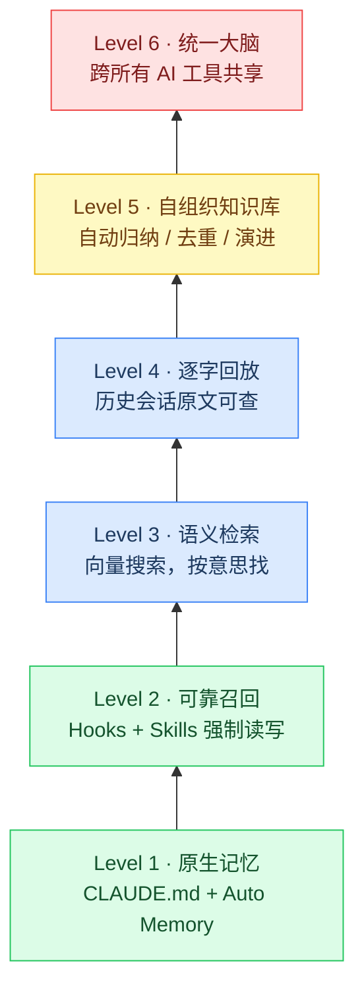
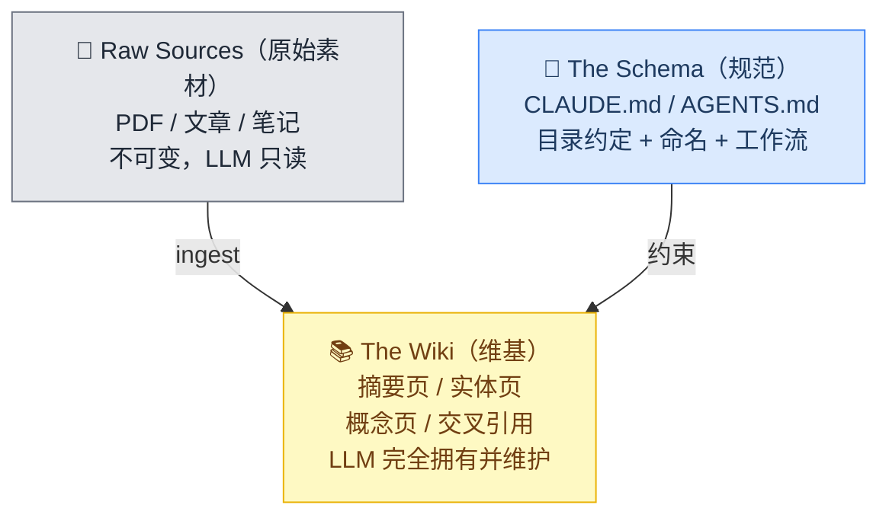
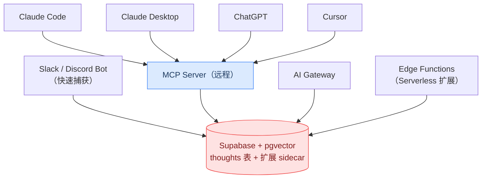

# AI Agent 记忆的 6 个层级：从 CLAUDE.md 到「统一大脑」

> **视频来源**：The 6 Levels of Claude Code Memory — [Simon Scrapes](https://www.youtube.com/@simonscrapes)
> **发布**：2026-04-24 | **播放**：144,920
> **整理**：视频只给了目录和链接，本文把里面每个工具的仓库、文档、论文都翻了一遍，补齐了架构、命令、跑分和取舍。
> **核实日期**：2026-07-23（版本号和跑分会变，用之前请复核）

---

## 一、先说结论

从 Mem0 到 Karpathy 的 LLM Wiki，AI 记忆方案一周一个新轮子，很容易 FOMO。但真正的问题只有一个：

> **Agent 每开一个新会话，就是一次「失忆」。你要用多大成本，把上一次的上下文还给它？**

围绕这个问题，记忆方案可以分成 6 层。**层级越高，能力越强，维护成本也越高**——绝大多数人停在 Level 2 就够了，Level 3~4 是重度用户的收益区，Level 5~6 属于「你要为它做一份工程」。



**一个贯穿全文的主线**：你会发现从 Level 1 到 Level 6，所有方案最后都收敛到同一个模式——

> **一份常驻的「索引」+ 一堆按需读取的「正文」。**

Claude Code 的 `MEMORY.md`、MemSearch 的三层渐进检索、Karpathy 的 `index.md`、MemPalace 的 Wing/Room/Drawer、Mem0 的压缩引擎，本质上都在做同一件事：**用一行摘要的 token，换一整份内容的可达性**。看懂这一点，选型就不难了。

---

## 二、Level 1：原生自带的记忆（比你以为的强得多）

很多「Claude Code 记忆方案」的教程还停留在「手写 CLAUDE.md」的年代。实际上现在的 Claude Code 原生有**两套并行的记忆系统**，加载机制完全不同。

### 2.1 两套系统的分工

| | **CLAUDE.md** | **Auto Memory（自动记忆）** |
|---|---|---|
| 谁来写 | 你 | Claude 自己 |
| 内容 | 指令、规范、约束 | 它学到的经验、模式、你的纠正 |
| 作用域 | 项目 / 用户 / 组织 | 按 **git 仓库** 划分，worktree 之间共享 |
| 加载方式 | **每次会话全量加载** | 每次会话加载 `MEMORY.md` 的**前 200 行或 25KB** |
| 存储位置 | 见下方层级表 | `~/.claude/projects/<project>/memory/` |
| 开关 | —— | 默认开启，`/memory` 切换或 `autoMemoryEnabled: false` |

关键点：**Auto Memory 本身就是一个迷你版的 Level 5**。它的目录长这样：

```text
~/.claude/projects/<project>/memory/
├── MEMORY.md          # 索引，每次会话都加载（前 200 行 / 25KB）
├── debugging.md       # 主题文件，按需读取
├── api-conventions.md
└── ...
```

`MEMORY.md` 是索引，主题文件**不在启动时加载**，Claude 需要时才用文件工具去读。这正是「索引 + 按需展开」模式。而且从 v2.1.210 起，Claude 写完 `MEMORY.md` 后 harness 会**主动量它的体积**：接近上限就提醒精简，超了直接报错要求重写索引——因为超出部分下次加载会被静默丢弃。这是原生方案里唯一带**强制淘汰压力**的机制。

> 💡 v2.1.214 起，带 frontmatter 的记忆文件在每次写入时会自动记录 `modified` ISO 8601 时间戳——**记忆的新鲜度是可见的**，这一点在自建方案里往往被忽略。

### 2.2 CLAUDE.md 的加载层级（按加载顺序，从宽到窄）

| 作用域 | 位置 | 用途 |
|---|---|---|
| 组织策略 | macOS `/Library/Application Support/ClaudeCode/CLAUDE.md`<br>Linux `/etc/claude-code/CLAUDE.md` | 全公司规范，**个人无法排除** |
| 用户 | `~/.claude/CLAUDE.md` | 跨项目个人偏好 |
| 项目 | `./CLAUDE.md` 或 `./.claude/CLAUDE.md` | 团队共享，进版本库 |
| 本地 | `./CLAUDE.local.md` | 个人项目偏好，加 `.gitignore` |

加载规则的几个坑：

- **向上遍历目录树**，`foo/CLAUDE.md` 排在 `foo/bar/CLAUDE.md` 之前——**离你启动目录越近的指令，越靠后被读到**；
- 子目录里的 `CLAUDE.md` **不在启动时加载**，等 Claude 读到那个目录的文件时才生效；
- `@path/to/file` 导入**最多 4 跳**，而且**导入不省 token**——被导入的文件在启动时同样全量进上下文。想省上下文得用别的办法；
- 块级 HTML 注释 `<!-- ... -->` 在注入前会被**剥掉**，可以拿来写给人看的维护说明而不花 token。

### 2.3 `.claude/rules/`：被低估的省 token 手段

这是真正能**减少常驻上下文**的机制。规则文件带 `paths` frontmatter 后，只在 Claude 读到匹配文件时才加载：

```markdown
---
paths:
  - "src/api/**/*.ts"
  - "lib/**/*.{ts,tsx}"
---

# API 开发规则
- 所有 endpoint 必须做入参校验
- 使用统一错误响应格式
```

不带 `paths` 的规则则无条件加载，优先级等同 `.claude/CLAUDE.md`。`~/.claude/rules/` 是用户级规则，在项目规则之前加载（**项目规则优先级更高**）。

### 2.4 Level 1 的天花板

1. **CLAUDE.md 全量常驻**，官方建议**单文件 200 行以内**——"Longer files consume more context and reduce adherence"（越长越不遵守，这是个反直觉但很重要的事实）；
2. **它是上下文，不是配置**。官方原文：*"Claude treats them as context, not enforced configuration."* 想强制阻断某个行为，得用 **PreToolUse hook**；
3. **Auto Memory 是机器本地的**，不跨设备、不进云端环境；
4. **子 agent 默认继承不到主会话的 auto memory**（fork 除外）；
5. **只有加载，没有检索**——它不会「想起」，只是每次被塞一遍。

> 📌 **实践三条**：① CLAUDE.md 压到 200 行内，只写「不写就会做错的事」；② 长内容改成 `.claude/rules/` + `paths`；③ 用 `/context` 确认到底加载了哪些文件，用 `/doctor`（v2.1.206+）让它帮你裁剪 CLAUDE.md。

---

## 三、Level 2：把记忆的读写变成确定性动作

**问题**：你把知识写进了 `notes/`，但模型「想不起来去读」。记忆系统的失败绝大多数不是存不下，是**召回不触发**。

### 3.1 最小可用版本（Paweł Huryn 的原始配方）

Paweł Huryn（The Product Compass）最早流传的那段，简单到可以直接抄进 CLAUDE.md：

```markdown
## Memory Management
When you discover something valuable for future sessions — architectural
decisions, bug fixes, gotchas, environment quirks — immediately append it
to .claude/memory.md
```

他后来又补了一层「知识分类」，这个分法很有用：

```markdown
## Learning
Track two types of knowledge:
- Domain: what things are (product context, user preferences, APIs,
  naming conventions, team decisions)
- Procedural: how to do things (deployment steps, debugging workflows)
```

> ⚠️ 注意 Paweł 本人后来的更新：*"Since posting this note Claude Code got auto memory."* ——**Level 1 已经原生覆盖了这段配方的大部分**。今天再抄这段，价值主要在于**分类规范**，而不是「让它记东西」这个动作本身。

### 3.2 完整版（John Conneely 的结构化系统）

John Conneely 在 [How I Finally Sorted My Claude Code Memory](https://www.youngleaders.tech/p/how-i-finally-sorted-my-claude-code-memory) 里把它做成了完整目录：

```text
~/.claude/memory/
├── memory.md          # 索引：所有记忆文件的目录
├── general.md         # 跨项目通用约定
├── domain/{topic}.md  # 领域知识
└── tools/{tool}.md    # 工具配置
```

配套的三条规则（原文）：

- *"When you learn something worth remembering, write it to the right file immediately"*
- *"Read memory.md at session start. Load other files only when relevant."*
- *"Before removing or modifying any existing memory entry, use AskUserQuestion to confirm with the user."*

**第三条是最容易被忽略、也最关键的一条**：给删除加一道人工确认。自动记忆系统最危险的失败模式不是记错，是**悄悄删掉正确的东西**。

**成效**：作者把 CLAUDE.md 从 **189 行压到 63 行**，办法是进 plan mode 跑一句 `reorganize memory`，把密集的参考内容抽到主题文件里。

### 3.3 用 Hook 兜底：不依赖模型的自觉

系统的第二部分是一个 **PreToolUse hook**，用 bash 包一层 Python 脚本，*"injects your project memory and global index before the first tool call of every session—including for new subagents."*

去重技巧值得抄：脚本用**父进程 PID** 做一次性标记，检查 `/tmp/claude-memory-loaded-{ppid}` 是否存在——**每个会话上下文只注入一次**，子 agent 因为 ppid 不同会各自触发一次。

选 hook 事件的原则：

| Hook 事件 | 适合干什么 |
|---|---|
| `SessionStart` | 注入上次的工作摘要（最常用） |
| `PreToolUse` | 兜底注入 + **硬阻断**（唯一能真正阻止动作的机制） |
| `PreCompact` | **压缩前抢救现场**——把关键结论落盘，防止被摘要吃掉 |
| `Stop` / `SessionEnd` | 收尾时沉淀本次发现 |
| `InstructionsLoaded` | 调试：日志记录到底加载了哪些指令文件 |

> ✅ **这一层投入产出比最高**。写入规范 + 召回钩子 + 删除确认，三件事做完，Agent 才算真的「记得住」。

---

## 四、Level 3：按意思搜，而不是按关键词

关键词搜索的致命伤：你搜 `auth failure`，笔记里写的却是「登录态过期导致 401」。

### 4.1 MemSearch（Zilliz 出品）

[zilliztech/memsearch](https://github.com/zilliztech/memsearch)，MIT，约 2.4k star，Python 为主。它是这一层里工程完成度最高的。

**核心设计哲学**（原文）：

> *"Markdown files are always the source of truth — Milvus is a rebuildable shadow index."*

**这句话值得裱起来**。向量库只是可重建的影子索引，Markdown 才是真相。这直接解决了向量方案最大的信任问题：索引崩了、模型换了、embedding 版本变了——重建就行，数据不丢。

**三层记忆模型**：

| 层 | 内容 | 文件 |
|---|---|---|
| Episodic（情景） | 每日对话日志 | `.memsearch/memory/*.md`，带 `<!-- session:UUID -->` 锚点 |
| Semantic（语义） | 项目状态、用户偏好 | `PROJECT.md`、`USER.md` |
| Procedural（程序） | 反复出现的工作流蒸馏成 skill | 可安装的 `/` 命令 |

**三层渐进检索**——这是它最值得学的部分：


**上下文按需膨胀，而不是一次灌满**。注意 L3 已经踩到了 Level 4 的地盘——好的方案本来就不是单层的。

**技术栈**：

- 向量库：**Milvus**，三种部署形态——Milvus Lite（默认，纯文件）/ Zilliz Cloud（有免费额度）/ 自建 Docker
- Embedding：默认 **ONNX bge-m3**，本地 CPU 跑，**首次下载约 558 MB**；也可切 OpenAI / Ollama
- 检索：**BM25 稀疏 + 稠密向量混合，RRF 重排**（不是纯向量，关键词精确匹配的场景不会退化）
- 增量：**SHA-256 内容哈希**跳过未变更内容，省 embedding 调用

**安装与使用**：

```bash
uv tool install "memsearch[onnx]"       # 或 pipx / pip install memsearch

memsearch config init
memsearch config set embedding.provider onnx

memsearch index ./memory/               # 建索引
memsearch search "Redis caching"        # 混合检索
memsearch expand <chunk_hash>           # 展开上下文（L2）
memsearch watch ./memory/               # 文件监听，实时增量索引
memsearch compact                       # LLM 摘要压缩
```

Claude Code 插件安装：

```bash
/plugin marketplace add zilliztech/memsearch
/plugin install memsearch
```

还支持 OpenClaw、OpenCode、Codex CLI——**这已经是半个 Level 6 了**（同一份记忆多端可读），只是靠共享文件系统而非服务端。

Python API：

```python
from memsearch import MemSearch
mem = MemSearch(paths=["./memory"])
await mem.index()
results = await mem.search("Redis config", top_k=3)
```

**限制**：ONNX 模型 558 MB 首次下载；后台维护任务默认关闭需手动开；skill 蒸馏出的候选项要手动安装才生效；文档未提供 MCP 接入。

### 4.2 什么时候该上这一层

**代价**：向量库 + embedding 调用；**索引更新策略**（写了没入库 = 检索不到，比没搜索更糟）；召回不准会引入噪声上下文反而干扰模型。

> ⚖️ **判断标准**：如果 `grep` + 目录结构还能找到，就先别上向量库。真正的分水岭是「你自己都想不起来当初写在哪个文件」。
>
> ⚖️ **选型时先问一句**：这个方案的**真相源**是什么？如果向量库本身就是真相源（不可重建），它坏掉的那天你会失去所有记忆。

---

## 五、Level 4：逐字回放历史会话

前三层存的都是「**结论**」——摘要、规范、经验。但有时你要的是**原话**：

> 「上周我们讨论限流方案时，我到底否决了哪个选项，理由是什么？」

摘要一定会丢掉这些细节。而 Claude Code 的会话 JSONL 里，那句话原封不动地躺着。

### 5.1 视频里的 Recall vs 你真正需要的 recall

⚠️ **这里有个需要说清楚的歧义**：视频链接的 [recall.it](https://www.recall.it/) 是一个**个人知识库产品**——存 YouTube / 播客 / PDF / 文章，自动打标签、建知识图谱、配间隔重复测验，浏览器插件 + 移动端，50 万用户。它做的是**外部内容**的收集与理解，**不是**你和 Agent 的会话历史检索。

如果你要的是标题里那件事（recall **verbatim conversations**），真正对口的是这些：

| 工具 | 索引什么 | 技术 |
|---|---|---|
| [arjunkmrm/recall](https://github.com/arjunkmrm/recall) | `~/.claude/projects/`、`~/.codex/sessions/`、`~/.pi/agent/sessions/` 的 `*.jsonl` | SQLite **FTS5** + BM25 |
| [akatz-ai/cc-conversation-search](https://github.com/akatz-ai/cc-conversation-search) | Claude Code 会话 | 语义搜索，返回 session ID 供 `claude --resume` |
| claude-historian | Claude Code 会话 | MCP server |

### 5.2 arjunkmrm/recall 拆解

```bash
npx skills add arjunkmrm/recall
```

然后在 Claude Code / Codex / pi 里 `/recall`，或者直接说「找一下我们之前聊 XX 的那个会话」。

**实现细节**（都是可以直接抄的工程选择）：

- 索引库：`~/.recall.db`，**SQLite FTS5**，纯 Python stdlib，无外部依赖（Python 3.9+）
- **双分词表**：英文用 Porter 词干还原，CJK 用 **trigram 分词器**——中文用户尤其要看这条，很多方案在中文上直接退化成不可用
- 排序：**BM25 + 时间衰减**，30 天半衰期，近期会话最多加权 20%
- 增量：按文件 mtime 更新
- **排除** `tool_use` / `tool_result` / thinking / image 块——只索引真正的对话内容，这是索引质量的关键

**天然限制**：**只在本机**。笔记本和台式机的会话互相看不见，除非你自己同步 `~/.claude/projects/`。

### 5.3 用法边界

**适合**：决策复盘、写文档、找「当时到底怎么说的」证据、找回丢失的会话去 `--resume`。
**不适合**：日常上下文注入——原文太长太吵，直接塞进上下文是灾难。

> 📌 **正确定位**：**按需查询的档案馆**，不是常驻记忆。
> 📌 **顺带一提**：Claude Code 会话默认 **30 天后过期**（MemPalace 文档明确提到这点，并以此论证自动存档 hook 的必要性）。你的「档案馆」如果不主动落盘，是有保质期的。

---

## 六、Level 5：会自己长大的知识库

到这一层，记忆不再只是「存 + 搜」，而是**有维护行为**：新信息进来判断新增还是更新、定期去重合并、清理失效、建立交叉引用。

### 6.1 Karpathy 的 LLM Wiki：极简但完整的范式

[gist.github.com/karpathy/442a6bf555914893e9891c11519de94f](https://gist.github.com/karpathy/442a6bf555914893e9891c11519de94f)（2026 年 4 月）

**它反对的是什么**（原文）：

> *"Most people's experience with LLMs and documents looks like RAG: you upload files, the LLM retrieves relevant chunks, and generates an answer. This works, but **the LLM is rediscovering knowledge from scratch every question**."*

**它主张的是什么**：

> *"the wiki is a persistent, compounding artifact. The cross-references are already there."*

RAG 是**每次重新发现**，Wiki 是**一次编译、持续复利**。

**三层架构**：



Schema 层的作用，用原文说是把 LLM 变成 *"a disciplined wiki maintainer rather than a generic chatbot"*（一个有纪律的维基维护者，而不是通用聊天机器人）。

**三个操作**：

| 操作 | 做什么 |
|---|---|
| **Ingest** | 读素材 → 写摘要页 → 更新 index → 修订实体页和概念页 → 记 log。**一份素材通常牵动 10~15 个 wiki 页面** |
| **Query** | 检索 wiki → 带引用综合作答 → *"good answers can be filed back into the wiki as new pages"*——**问答本身也在积累知识** |
| **Lint** | 定期体检：页面间矛盾、被新素材推翻的过时断言、无入链的孤儿页、缺失的交叉引用、数据缺口 |

**两个基础设施文件**：

- `index.md`：每个页面一行摘要 + 元数据，按类别组织，每次 ingest 更新。**LLM 回答问题时先读它——这就是不需要 embedding 基础设施的原因**（又是「索引 + 按需展开」）
- `log.md`：只追加的时间线，统一前缀如 `## [2026-04-02] ingest | Article Title`，标准工具可解析，充当审计轨迹

**为什么这个模式成立**（全文最好的一句）：

> *"maintaining a knowledge base isn't the reading or thinking—it's the bookkeeping. Updating cross-references, keeping summaries current, noting when new data contradicts old claims."*

维护知识库的痛点从来不是读和想，是**记账**。而记账正是 LLM 不知疲倦、不会遗漏的强项。Karpathy 把分工说得很干脆：*"The human's job is to curate sources, direct the analysis, ask good questions, and think about what it all means. The LLM's job is everything else."*

gist 刻意不给实现细节：*"directory structure, schema conventions, page formats, tooling—all that will depend on your domain, your preferences, and your LLM of choice."* ——**它是一个 idea 文件，设计上就是让你贴给自己的 Agent，让 Agent 陪你把细节长出来。**

### 6.2 MemPalace：把 Wiki 思路做成工程

[MemPalace/mempalace](https://github.com/MemPalace/mempalace)，本地优先，逐字存储 + 语义检索。

**跑分**：LongMemEval **96.6% R@5**，且 *"zero API calls"*——不调云端、不用 LLM 重排就能达到这个基线召回。它同时在 LoCoMo、ConvoMem、MemBench 上有可复现结果。

**三级空间结构**：

| 层级 | 含义 |
|---|---|
| **Wings（翼）** | 按人 / 项目划分的集合 |
| **Rooms（房间）** | 翼内的主题分组 |
| **Drawers（抽屉）** | 具体的原始内容 |

意义在于**限定检索范围**而不是全库平铺召回——这是精度的主要来源。

**可插拔后端**（接口在 `mempalace/backends/base.py`）：

| 后端 | 类型 | 命名空间 | 词法检索 |
|---|---|---|---|
| `chroma`（默认） | 本地嵌入式 | ✗ | ✓ |
| `sqlite_exact` | 本地精确 | ✗ | ✓ |
| `milvus` | 本地 / 服务端 | ✓ | ✓ |
| `qdrant` | 服务端 REST | ✓ | ✓ |
| `pgvector` | Postgres | ✓ | ✓ |

**命令**：

```bash
uv tool install mempalace          # 或 pipx install mempalace
mempalace init ~/projects/myapp

mempalace mine ~/projects/myapp                    # 挖项目文件
mempalace mine ~/.claude/projects/ --mode convos   # 挖 Claude Code 会话

mempalace search "why did we switch to GraphQL"
mempalace wake-up                                  # 新会话加载上下文
```

**其他值得注意的**：

- **知识图谱**：SQLite 支撑的时序实体关系图，**带有效期窗口**（validity windows）——这是少见的、把「事实会过期」做进 schema 的设计
- **36 个 MCP 工具**，运行时通过 `mempalace_list_agents` 发现，*"no system-prompt bloat"*（不预先撑爆系统提示词，这个取舍很聪明）
- 专家 agent 各自拥有独立的 wing 和 diary
- Embedding 模型支持 100+ 语言，约 **300 MB** 磁盘，核心检索**不需要 API key**
- Claude Code 自动存档 hook：在上下文压缩前保存会话——*"Claude Code sessions expire in 30 days without auto-save hooks wired."*
- ⚠️ 官方明确提醒有**仿冒站点**，认准 GitHub 仓库 / PyPI 包 / mempalaceofficial.com

### 6.3 Mem0：托管式记忆层

[mem0.ai](https://mem0.ai/)，三步走：**Add → Learn → Retrieve**。核心是「记忆压缩引擎」，*"automatically condenses chat history into compact memories that cut tokens and latency while keeping the right context."*

技术上是 **single-pass hierarchical distillation（单遍分层蒸馏）+ multi-signal retrieval（多信号检索）**。

**官方跑分**：

| 基准 | 准确率 | 每次检索平均 token |
|---|---|---|
| LoCoMo | 92.5% | 6,956 |
| LongMemEval | 94.4% | 6,787 |
| BEAM 1M | 64.1% | 6,719 |
| BEAM 10M | 48.6% | 6,914 |

对照组说法是 *"Full-context approaches on these benchmarks routinely consume 25,000+ tokens per query"*，即**约 3~4 倍 token 节省**。

> ⚠️ **读跑分要注意**：论文给了 Mem0 自己的准确率和 token 数，但**没有给出被对比方法的准确率数字**，也没点名 OpenAI Memory 等竞品做头对头比较。所以「3~4 倍 token 节省」是可信的，「准确率更高」则缺乏同表对照。另外注意 BEAM 10M 掉到 48.6%——**规模上去之后所有记忆系统都会显著退化**，这是行业现状，不是 Mem0 的问题。

**部署与合规**：云托管（app.mem0.ai）或自托管（K8s / 私有云 / 气隙环境），*"the same API everywhere"*；Python 和 Node.js SDK；SOC 2 Type 1、HIPAA、BYOK 加密、读写全审计日志。另有「Claude Code 集成减少 97% 记忆占用」的宣称。

### 6.4 三者怎么选

| | LLM Wiki | MemPalace | Mem0 |
|---|---|---|---|
| 形态 | 一份 idea 文档 | 本地 CLI + MCP | 托管服务 / SDK |
| 谁维护知识 | 你的 Agent | 工具 + Agent | 服务自动抽取 |
| 数据在哪 | 你的 markdown | 你的机器 | 云端或自托管 |
| 上手成本 | 低（贴给 Agent 即可） | 中 | 低（但要接 API） |
| 可审计 | ✅ 全是 markdown | ✅ 本地文件 | ⚠️ 靠审计日志 |
| 适合 | 个人研究、写作、长期主题积累 | 重度本地 Agent 用户、多项目 | 产品里给终端用户做记忆 |

> **核心难点是「遗忘」，不是「记住」**。一个只增不减的知识库，两个月后就是上下文污染源。评估任何 Level 5 方案，**先看它的 Lint / 淘汰 / 有效期机制**，再看写入能力。上面三家分别对应三种答案：LLM Wiki 的 `lint` 操作、MemPalace 的 validity windows、Mem0 的压缩引擎。**没有这一项的方案，直接淘汰。**

---

## 七、Level 6：所有 AI 工具共用一个大脑

前五层基本都绑在单一工具（或单台机器）上。Level 6 的目标：

> Claude、ChatGPT、Cursor、Claude Code、以及下个月刚出的那个……**共享同一份对你的持久记忆**。

### 7.1 OB1 / Open Brain

[NateBJones-Projects/OB1](https://github.com/NateBJones-Projects/OB1)，2026-03-11 发布，slogan 直白：

> *"The infrastructure layer for your thinking. One database, one AI gateway, one chat channel — any AI plugs in. No middleware, no SaaS."*

发布后 5 天拿到 259 star，热度来自它的成本主张：**用各家免费额度，月成本约 $0.10~$0.30**。

**架构**：



- **数据库**：Supabase + **pgvector**；也可纯 K8s 自托管 PostgreSQL + pgvector，不依赖 Supabase
- **Schema**：核心是一张 `thoughts` 表；扩展以 **sidecar** 形式挂载而非改基表——Agent Memory schema 记录来源、审核状态、使用策略、引用和审计轨迹；社区还有家庭维护、日历、备餐、CRM、求职跟踪等自定义表
- **接入**：全部走 **MCP**，无 Zapier 之类中间件
- **多用户**：PostgreSQL **Row Level Security** 做基于角色的隔离，够家庭 / 小团队用
- **栈**：TypeScript 46% / JavaScript 32% / Python 10.5% / PL-pgSQL 7%，SvelteKit 和 Next.js 两套 dashboard
- **搭建**：官方称 **45 分钟**，无需编码经验

**限制**：偏向向量检索和语义召回，不是传统关系型查询场景；共享模型止步于家庭 / 团队规模。

> 🔎 生态信号：OpenClaw 有 issue 讨论把 OB1 MCP 作为一等公民记忆目标，说明「记忆后端与 Agent 客户端解耦」这个方向不止一家在推。

### 7.2 真实代价

**收益**：终端里踩过的坑，IDE 和网页端不会重踩。

**代价**（这些没人在教程里讲）：

1. 你多了一个必须**自己运维的有状态服务**——权限、同步、备份、schema 迁移、隐私边界；
2. **它是单点**。大脑挂了，所有工具一起失忆，而且是在你最需要的时候；
3. **隐私面变大**。所有工具的上下文汇聚到一处，一次泄露的爆炸半径远大于分散存储；
4. **写入质量的锅变大**。一个客户端写进去的垃圾记忆，会污染所有其他客户端——**跨工具共享放大的不只是好记忆**。

> ⚖️ **建议**：只有当你**确实在 3 个以上工具里重度工作**、并且已经把 Level 2 做扎实了，再上这一层。否则你只是给自己加了一个新的故障源。

---

## 八、选型总表

| 层级 | 解决的问题 | 代表方案 | 数据在哪 | 成本 | 建议 |
|---|---|---|---|---|---|
| **L1** 原生 | 基础约定不用重复说 | CLAUDE.md + Auto Memory + `.claude/rules/` | 本机 | 极低 | **所有人必做** |
| **L2** 可靠召回 | 记了但想不起来 | Hooks + Skills + 结构化记忆目录 | 本机 | 低 | **性价比最高** |
| **L3** 语义检索 | 记忆多到 grep 不动 | MemSearch（Milvus + bge-m3 + RRF） | 本机 / Zilliz Cloud | 中 | 条目上千再上 |
| **L4** 逐字回放 | 要原话不要摘要 | recall（FTS5）、cc-conversation-search | 本机 | 中 | 复盘 / 找回会话需求强再上 |
| **L5** 自组织 | 知识库自己会腐烂 | LLM Wiki / MemPalace / Mem0 | 视方案 | 高 | 长期知识沉淀才值得 |
| **L6** 统一大脑 | 多工具记忆割裂 | OB1（Supabase + pgvector + MCP） | 自建云 | 很高 | 3+ 工具重度用户 |

**选型五问：**

1. 我丢失的到底是**规则**（→ L1/L2）、**事实**（→ L3）还是**原话**（→ L4）？
2. 这套方案的**真相源**是什么？向量库能不能重建？（MemSearch 的答案是「Markdown 是真相，Milvus 是影子」——这是黄金标准）
3. 它有**淘汰机制**吗？lint / 有效期 / 体积上限，至少要有一个。
4. 它对**中文**友好吗？（看有没有 trigram 分词或多语 embedding——很多方案在这里静默退化）
5. 它**坏掉时我能发现吗**？静默失效的记忆系统 = 负资产。

---

## 九、几条容易被忽略的原则

1. **记忆的成本是上下文预算，不是磁盘**。存下来不要钱，塞进上下文才要钱——所以「索引 + 按需展开」永远优于「全量注入」。所有六层最后都收敛到这个模式。
2. **文件越长，遵守度越低**。官方原话：*"Longer files consume more context and reduce adherence."* 写得多 ≠ 记得牢，往往相反。
3. **上下文不是强制力**。要硬阻断某个行为，用 hook，不要用记忆文件写「禁止 XXX」。
4. **给删除加确认**。自动记忆最危险的失败不是记错，是悄悄删掉对的东西。
5. **不要记录代码本身已经记录的东西**。目录结构、函数签名、git history——模型可以现场读，重复存只会过期得比代码还快。`/doctor` 的裁剪逻辑正是这个原则。
6. **记忆会过期**。写入时把「上周」「下个月」换成绝对日期；记录 `modified` 时间戳；引用文件路径的记忆，用之前先确认文件还在。
7. **规模上去了都会退化**。看看 Mem0 在 BEAM 10M 上的 48.6%——**别指望任何方案在无限增长的记忆上保持精度**。定期修剪比换更强的工具有效得多。
8. **先跑通 L1 + L2，用一个月**。多数人以为自己需要向量库，实际只是没写好那 20 行 hook。

---

## 十、参考链接

**原始视频提到的**

- Karpathy's LLM Wiki — <https://gist.github.com/karpathy/442a6bf555914893e9891c11519de94f>
- MemSearch（Zilliz） — <https://github.com/zilliztech/memsearch>
- MemPalace — <https://github.com/MemPalace/mempalace>
- Mem0 — <https://mem0.ai/>
- Recall（个人知识库产品） — <https://www.recall.it/>
- OpenBrain / OB1 — <https://github.com/NateBJones-Projects/OB1>
- John Conneely《How I Finally Sorted My Claude Code Memory》— <https://www.youngleaders.tech/p/how-i-finally-sorted-my-claude-code-memory>
- Paweł Huryn 的 Substack — <https://substack.com/@huryn>

**补充查证的**

- Claude Code 官方记忆文档 — <https://code.claude.com/docs/en/memory>
- arjunkmrm/recall（会话逐字检索 skill） — <https://github.com/arjunkmrm/recall>
- akatz-ai/cc-conversation-search — <https://github.com/akatz-ai/cc-conversation-search>
- Paweł Huryn《The Guide to Claude Code for PMs》— <https://www.productcompass.pm/p/claude-code-guide>
