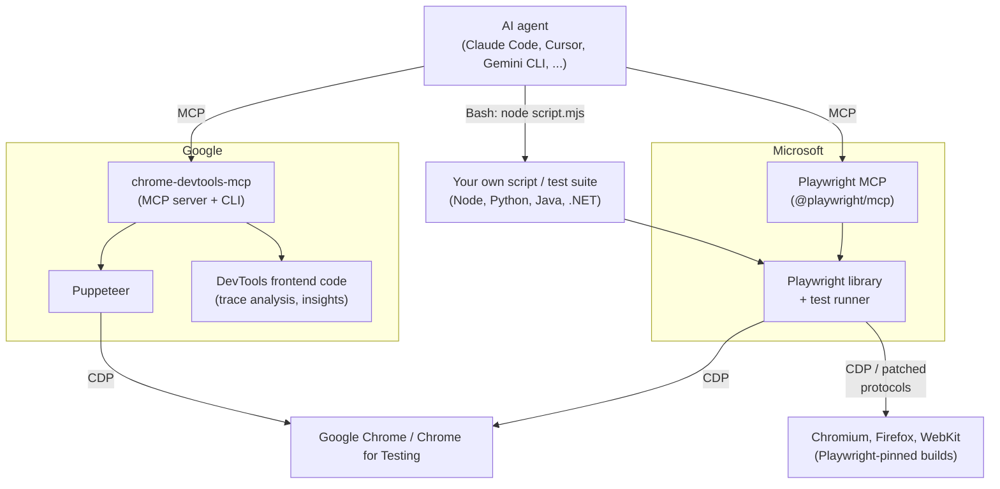
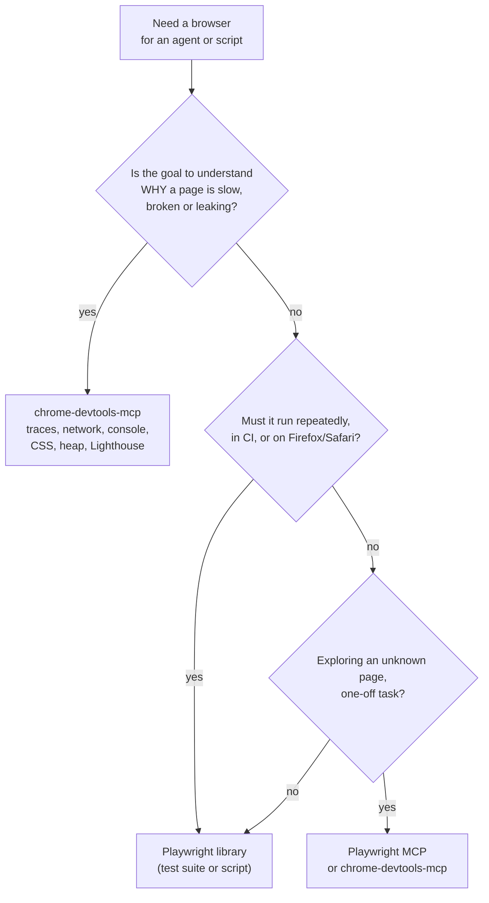

# chrome-devtools-mcp vs. Playwright: Debugger's Eyes vs. Tester's Hands

## Abbreviations

| Abbreviation | Full name | Meaning |
|---|---|---|
| MCP | Model Context Protocol | Standard for exposing tools to an AI agent |
| CDP | Chrome DevTools Protocol | Chrome's wire protocol for remote control and inspection |
| a11y | Accessibility (11 letters between "a" and "y") | Here: the accessibility tree a page exposes |
| DOM | Document Object Model | The page's element tree |
| CLI | Command-Line Interface | — |
| E2E | End-to-End (testing) | Tests that drive the real UI |
| CI | Continuous Integration | — |
| LCP / INP / CLS | Largest Contentful Paint / Interaction to Next Paint / Cumulative Layout Shift | Core Web Vitals |
| CrUX | Chrome User Experience Report | Google's field performance data |
| PWA | Progressive Web App | — |

## 1. The short answer

Both let a program — or an AI agent — drive a real browser. They were built for different jobs:

- **Playwright** (Microsoft, 2020) is a **browser automation library and test framework**. Its purpose is to *act* on pages reliably across Chromium, Firefox and WebKit, mostly so you can write repeatable E2E tests and scripts. **Playwright MCP** is a separate, thin MCP server that exposes Playwright to AI agents.
- **chrome-devtools-mcp** (Google's Chrome DevTools team, 2025) is an **MCP server that gives an AI agent Chrome DevTools**. Its purpose is to *inspect and debug* a page the way a human developer does in DevTools: performance traces, network requests, console, CSS, memory heap snapshots, Lighthouse. It can click and type too, but that is a means, not the point.

A one-line way to remember it: **Playwright is the tester's hands; chrome-devtools-mcp is the debugger's eyes.**

## 2. Where they sit in the stack

*This diagram answers: what does each tool sit on, and how does an agent reach it?*

Points the diagram makes explicit:

- **Both speak CDP to Chrome.** At the wire level they do the same thing; the difference is what they choose to expose on top of it.
- **chrome-devtools-mcp is built on Puppeteer**, Google's older Node automation library, plus code from the DevTools frontend itself — which is how it can produce the same performance insights the DevTools Performance panel shows.
- **Playwright was started by the engineers who originally built Puppeteer**, after they moved to Microsoft. It generalised the idea to three browser engines and multiple languages.
- **Playwright is a library first.** You can use it with no AI at all — and with an AI agent you can call it through the MCP server *or* through scripts the agent runs with Bash.
- **chrome-devtools-mcp is an MCP server first** (it also ships a CLI). You do not write programs against it.

## 3. Side-by-side

| Dimension | chrome-devtools-mcp | Playwright (+ Playwright MCP) |
|---|---|---|
| Maintainer | Google, Chrome DevTools team | Microsoft |
| Primary purpose | Debugging, inspection, performance analysis | Automation and E2E testing |
| Primary form | MCP server (plus a CLI) | Library + test runner; MCP server is an add-on |
| Built on | Puppeteer + CDP + DevTools frontend | Its own engine; CDP for Chromium, patched protocols for Firefox/WebKit |
| Browsers | Google Chrome / Chrome for Testing only (other Chromium "may work") | Chromium, Chrome, Edge, Firefox, WebKit (Safari engine) |
| Languages | None — consumed via MCP / CLI | TypeScript/JavaScript, Python, Java, .NET |
| Page representation for the agent | Text snapshot of the a11y tree with a `uid` per element; screenshots on request | Text snapshot of the a11y tree with a `ref` per element; screenshots on request; optional coordinate "vision" mode |
| Automation tools | click, fill, fill_form, hover, drag, press_key, type_text, upload_file, handle_dialog, navigate/new/close/select page, wait_for | navigate, click, type, fill form, select, hover, drag, press key, upload, dialogs, tabs, wait |
| Distinctive extras | **Performance traces** with Core Web Vitals (LCP, INP, CLS) and per-insight analysis, CrUX field data, **Lighthouse** audits, network request list/detail, console messages with source-mapped stacks, computed **CSS styles**, **heap snapshots** and memory analysis, extension and PWA management, CPU/network emulation | **Network mocking**, cookie/localStorage control, **test assertions and locator generation**, PDF output, tracing and video recording, device emulation (`--device "iPhone 15"`), and — outside MCP — codegen, auto-waiting locators, parallel test runner, HTML reports |
| Waiting model | Waits for the action's effects (navigation, network) before returning | Auto-waits on locators for actionability (visible, stable, enabled) |
| Browser binaries | Uses your installed stable Chrome | Downloads browser builds **pinned to the Playwright version** |
| Attach to an existing browser | Yes (`--browser-url` / running-instance mode) | Yes (`--cdp-endpoint`, or `--extension` for your real Chrome/Edge) |
| Token-saving option | `--slim` (basic browser tasks only) | Playwright CLI + skills (scripts instead of a large tool schema) |

The pinned-binaries row is not academic. In this repo's `csdn-publish` skill, the installed Playwright expected `chromium-1228`, only `1217`/`1243` were on disk, and the launch failed until an `executablePath` override was added. chrome-devtools-mcp avoids that class of problem by using the Chrome you already have — at the price of supporting only Chrome.

## 4. What they have in common

It is easy to over-state the difference, so to be fair:

- **Same page model for the agent.** Both default to an accessibility-tree text snapshot with stable element ids, rather than screenshots. Both chose this because text is cheaper and less ambiguous for an LLM than pixels.
- **Same basic actions.** For "open this page, fill this form, click submit", either works.
- **Same security caveat.** Each exposes the whole browser session to the MCP client. Anything signed in to that profile is visible to the agent. Use an isolated profile (`--isolated` in both) unless you specifically need your real session.

## 5. When to use which

*This diagram answers: given a task, which tool should I reach for first?*

Concrete cases:

| Task | Pick | Why |
|---|---|---|
| "Why is LCP 4 s on the product page?" | chrome-devtools-mcp | Records a trace and reads the same insights the Performance panel shows |
| "This button does nothing — find out why" | chrome-devtools-mcp | Console errors with source-mapped stacks, failing network requests, computed styles |
| "Is this SPA leaking memory after navigation?" | chrome-devtools-mcp | Heap snapshots, compare, retaining paths |
| "Write a regression test for checkout" | Playwright | Assertions, auto-waiting locators, test runner, CI, cross-browser |
| "Publish this article to CSDN every week" | Playwright library script | Deterministic, zero tokens per step (this repo's `csdn-publish` skill) |
| "Upload this video through a site I have never automated" | Playwright MCP | Agent explores step by step (this repo's `bilibili-uploader` skill) |
| "Does it work in Safari?" | Playwright | Only option with WebKit |

They are not exclusive. A natural loop for an agent: reproduce and diagnose with **chrome-devtools-mcp**, fix the code, then lock the fix in with a **Playwright** test.

## 6. Conclusion

- **Playwright** answers *"make the browser do this, reliably, everywhere"*. It is a cross-browser, multi-language automation library and test framework; Playwright MCP is its agent-facing wrapper.
- **chrome-devtools-mcp** answers *"tell me what is going on inside this Chrome page"*. It is an agent-only window into Chrome DevTools — performance, network, console, styles and memory — with enough automation to reach the state you want to inspect.
- They share the same foundation (CDP) and the same agent-facing page model (a11y snapshots), so simple navigation tasks work with either. Pick by the job: **debugging → chrome-devtools-mcp; testing and repeatable automation → Playwright.**

For how Playwright is wired into Claude Code in this repo (MCP server vs. library-via-Bash), see [How Playwright Works with Claude Code](./playwright-with-claude-code.md).

## References

- chrome-devtools-mcp repository and tool reference: <https://github.com/ChromeDevTools/chrome-devtools-mcp> (tool list checked 2026-10-08; it grows quickly)
- Playwright MCP: <https://github.com/microsoft/playwright-mcp>
- Playwright documentation: <https://playwright.dev>
- Puppeteer: <https://pptr.dev>
