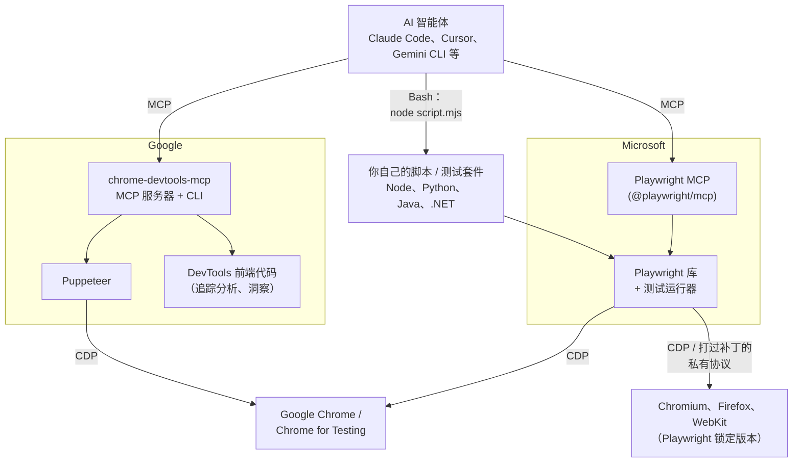
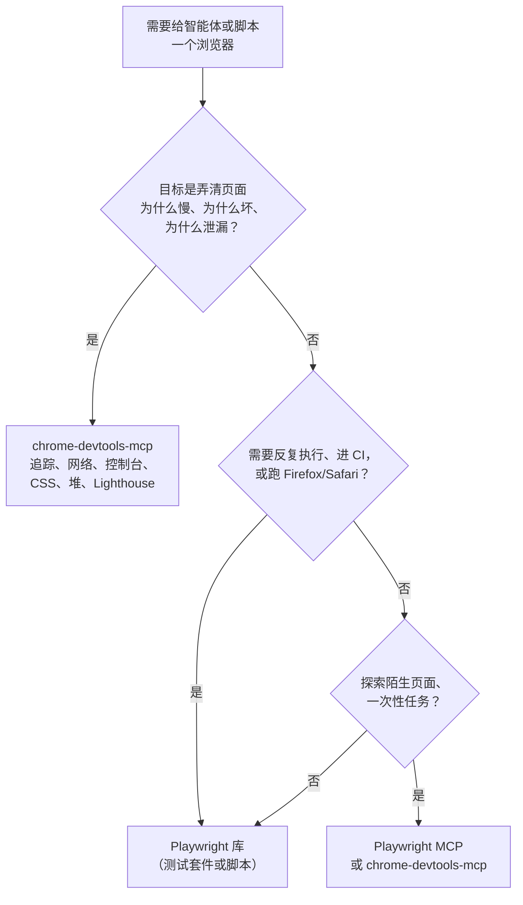

# chrome-devtools-mcp 与 Playwright：调试者的眼睛 vs. 测试者的手

## 缩写对照表

| 缩写 | 英文全称 | 中文 |
|---|---|---|
| MCP | Model Context Protocol | 模型上下文协议（向 AI 智能体暴露工具的标准） |
| CDP | Chrome DevTools Protocol | Chrome 开发者工具协议 |
| a11y | Accessibility（a 与 y 之间 11 个字母） | 无障碍；此处指页面的无障碍树 |
| DOM | Document Object Model | 文档对象模型 |
| CLI | Command-Line Interface | 命令行界面 |
| E2E | End-to-End（testing） | 端到端测试 |
| CI | Continuous Integration | 持续集成 |
| LCP / INP / CLS | Largest Contentful Paint / Interaction to Next Paint / Cumulative Layout Shift | 最大内容绘制 / 交互到下一次绘制 / 累积布局偏移（核心 Web 指标） |
| CrUX | Chrome User Experience Report | Chrome 用户体验报告（真实用户性能数据） |
| PWA | Progressive Web App | 渐进式 Web 应用 |
| SPA | Single-Page Application | 单页应用 |

## 一、一句话回答

两者都能让程序——或 AI 智能体——操控一个真实浏览器，但它们是为不同的活儿造的：

- **Playwright**（微软，2020）是一个**浏览器自动化库 + 测试框架**。它的使命是在 Chromium、Firefox、WebKit 上*稳定地操作*页面，主要用来写可重复执行的 E2E（End-to-End，端到端）测试和脚本。**Playwright MCP** 是另一个独立的薄层 MCP（Model Context Protocol，模型上下文协议）服务器，把 Playwright 暴露给 AI 智能体。
- **chrome-devtools-mcp**（Google Chrome DevTools 团队，2025）是一个**把 Chrome 开发者工具交给 AI 智能体的 MCP 服务器**。它的使命是像人类开发者打开 DevTools 那样*检查和调试*页面：性能追踪、网络请求、控制台、CSS、内存堆快照、Lighthouse。它也能点击和输入，但那只是手段，不是目的。

一句话记住：**Playwright 是测试者的手；chrome-devtools-mcp 是调试者的眼睛。**

## 二、它们在技术栈里的位置

*这张图回答：每个工具建立在什么之上，智能体又是通过什么路径调用它的？*

图里值得点明的几件事：

- **两者对 Chrome 说的都是 CDP（Chrome DevTools Protocol，Chrome 开发者工具协议）。** 在线路层面它们做的是同一件事，区别在于各自往上暴露了什么能力。
- **chrome-devtools-mcp 建立在 Puppeteer 之上**（Google 更早的 Node 自动化库），并复用了 DevTools 前端本身的代码——所以它能给出和 DevTools 性能面板一模一样的性能洞察。
- **Playwright 是由最初开发 Puppeteer 的那批工程师**跳槽到微软后启动的。它把同样的思路推广到了三种浏览器引擎和多种编程语言。
- **Playwright 首先是一个库。** 完全不用 AI 也能用；配合 AI 智能体时，既可以走 MCP 服务器，*也可以*让智能体用 Bash 跑你写好的脚本。
- **chrome-devtools-mcp 首先是一个 MCP 服务器**（另附一个 CLI，Command-Line Interface，命令行界面）。你不会针对它写程序。

## 三、逐项对比

| 维度 | chrome-devtools-mcp | Playwright（+ Playwright MCP） |
|---|---|---|
| 维护方 | Google Chrome DevTools 团队 | 微软 |
| 核心目的 | 调试、检查、性能分析 | 自动化与 E2E 测试 |
| 主要形态 | MCP 服务器（附 CLI） | 库 + 测试运行器；MCP 服务器是附加件 |
| 底层 | Puppeteer + CDP + DevTools 前端 | 自研引擎；Chromium 走 CDP，Firefox/WebKit 走打过补丁的协议 |
| 支持浏览器 | 仅 Google Chrome / Chrome for Testing（其他 Chromium 系"可能可用"） | Chromium、Chrome、Edge、Firefox、WebKit（Safari 内核） |
| 编程语言 | 无——只通过 MCP / CLI 使用 | TypeScript/JavaScript、Python、Java、.NET |
| 页面给智能体的形态 | a11y（无障碍）树文本快照，每个元素带 `uid`；按需截图 | a11y 树文本快照，每个元素带 `ref`；按需截图；可选按坐标操作的 "vision" 模式 |
| 自动化工具 | click、fill、fill_form、hover、drag、press_key、type_text、upload_file、handle_dialog、页面的新建/导航/关闭/切换、wait_for | 导航、点击、输入、填表、下拉选择、悬停、拖拽、按键、上传、对话框、标签页、等待 |
| 独有能力 | **性能追踪**（含 LCP、INP、CLS 等核心 Web 指标）及逐条洞察分析、CrUX 真实用户数据、**Lighthouse** 审计、网络请求列表与详情、带 source map 还原堆栈的控制台消息、计算后的 **CSS 样式**、**堆快照**与内存分析、扩展与 PWA 管理、CPU/网络限速模拟 | **网络 mock**、Cookie/localStorage 控制、**测试断言与定位器生成**、PDF 输出、追踪与录屏、设备模拟（`--device "iPhone 15"`）；MCP 之外还有 codegen 录制、自动等待的定位器、并行测试运行器、HTML 报告 |
| 等待模型 | 等动作的副作用（导航、网络）完成后才返回 | 定位器自动等待元素可操作（可见、稳定、可用） |
| 浏览器二进制 | 使用你本机已安装的稳定版 Chrome | 下载**与 Playwright 版本绑定**的浏览器构建 |
| 连接已打开的浏览器 | 支持（`--browser-url` / 连接运行中实例） | 支持（`--cdp-endpoint`，或用 `--extension` 连你真实的 Chrome/Edge） |
| 省 token 方案 | `--slim`（只保留基础浏览器操作） | Playwright CLI + skills（用脚本代替庞大的工具 schema） |

"浏览器二进制"这一行不是纸上谈兵。本仓库的 `csdn-publish` skill 里，已安装的 Playwright 要求 `chromium-1228`，而磁盘上只有 `1217`/`1243`，启动直接失败，直到加了 `executablePath` 覆盖才恢复。chrome-devtools-mcp 直接用你已经装好的 Chrome，天然避开这类问题——代价是只支持 Chrome。

## 四、它们的共同点

两者的差异容易被夸大，公平起见：

- **给智能体的页面模型相同。** 两者默认都用带稳定元素 id 的 a11y 树文本快照，而不是截图。原因也一样：对 LLM 来说，文本比像素便宜，也更不容易产生歧义。
- **基础动作相同。** "打开页面、填表、点提交"这种活，用哪个都行。
- **安全提醒相同。** 两者都会把整个浏览器会话暴露给 MCP 客户端，该配置文件里登录过的一切智能体都看得见。除非确实需要你的真实会话，否则请用隔离配置（两者都有 `--isolated`）。

## 五、怎么选

*这张图回答：面对一个具体任务，应该先拿哪个工具？*

具体场景：

| 任务 | 选择 | 理由 |
|---|---|---|
| "商品页 LCP 为什么要 4 秒？" | chrome-devtools-mcp | 录一段性能追踪，读出和性能面板一样的洞察 |
| "这个按钮点了没反应，查一下原因" | chrome-devtools-mcp | 带 source map 堆栈的控制台错误、失败的网络请求、计算样式 |
| "这个 SPA（Single-Page Application，单页应用）切换路由后是不是内存泄漏？" | chrome-devtools-mcp | 堆快照、快照对比、保留路径 |
| "给结账流程写回归测试" | Playwright | 断言、自动等待定位器、测试运行器、CI、跨浏览器 |
| "每周把文章发到 CSDN" | Playwright 库脚本 | 确定性强，每一步零 token（本仓库的 `csdn-publish` skill） |
| "在一个从没自动化过的网站上传视频" | Playwright MCP | 智能体逐步探索（本仓库的 `bilibili-uploader` skill） |
| "在 Safari 上能不能用？" | Playwright | 唯一支持 WebKit 的选项 |

二者并不互斥。智能体的一个自然闭环是：用 **chrome-devtools-mcp** 复现并诊断问题，修改代码，再用 **Playwright** 测试把修复固化下来。

## 六、结论

- **Playwright** 回答的是 *"让浏览器做这件事，稳定地、在哪都能做"*。它是跨浏览器、多语言的自动化库和测试框架；Playwright MCP 是它面向智能体的包装。
- **chrome-devtools-mcp** 回答的是 *"告诉我这个 Chrome 页面里到底发生了什么"*。它是专供智能体使用的 Chrome DevTools 窗口——性能、网络、控制台、样式、内存——外加刚好够用的自动化能力，用来把页面带到你想检查的状态。
- 两者底层相同（CDP），给智能体的页面模型也相同（a11y 快照），所以简单的导航任务用哪个都行。按活儿来选：**调试 → chrome-devtools-mcp；测试和可重复的自动化 → Playwright。**

关于 Playwright 在本仓库中如何接入 Claude Code（MCP 服务器 vs. 通过 Bash 调用库），见 [How Playwright Works with Claude Code](./playwright-with-claude-code.md)。

## 参考资料

- chrome-devtools-mcp 仓库与工具参考：<https://github.com/ChromeDevTools/chrome-devtools-mcp>（工具列表核对于 2026-10-08，更新很快）
- Playwright MCP：<https://github.com/microsoft/playwright-mcp>
- Playwright 文档：<https://playwright.dev>
- Puppeteer：<https://pptr.dev>
