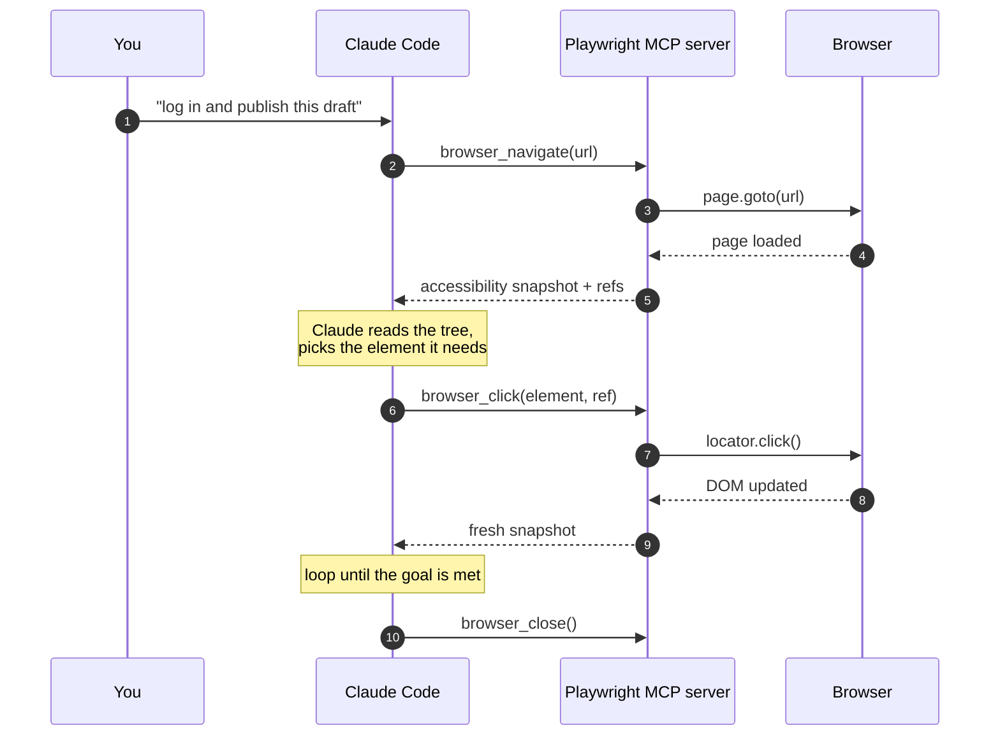
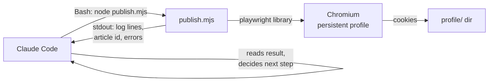
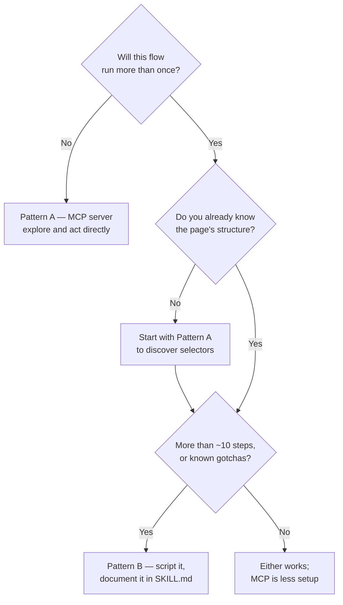

# How Playwright Works with Claude Code

## Abbreviation Glossary

| Abbreviation | Full English name | 中文 |
|---|---|---|
| MCP | Model Context Protocol | 模型上下文协议 |
| CDP | Chrome DevTools Protocol | Chrome 开发者工具协议 |
| DOM | Document Object Model | 文档对象模型 |
| ARIA | Accessible Rich Internet Applications | 无障碍富互联网应用（可访问性标准） |
| CLI | Command-Line Interface | 命令行界面 |
| SSE | Server-Sent Events | 服务器推送事件 |
| UA | User Agent | 用户代理（浏览器标识） |
| XHR | XMLHttpRequest | 浏览器异步请求 |
| CI | Continuous Integration | 持续集成 |

---

## 1. The Short Answer

Claude Code cannot click a web page on its own. Playwright is the thing that gives it
hands — but there are **two genuinely different ways to wire it up**, and picking the
wrong one is the most common mistake:

| | **Pattern A — Playwright MCP server** | **Pattern B — Playwright as a library** |
|---|---|---|
| Claude's interface | Dedicated `browser_*` tools | The `Bash` tool running `node script.mjs` |
| Who writes the steps | Claude, one action at a time | You, ahead of time, in a script |
| Claude sees | An accessibility snapshot after every action | Whatever the script prints to stdout |
| Best for | Exploration, one-off tasks, unknown pages | Repeatable flows on a page you already know |
| Cost | Tokens per step (a snapshot each time) | One Bash call, near-zero tokens |
| In your repo | `bilibili-uploader` skill | `csdn-publish` skill |

Both are live in your setup already. The rest of this document explains each, then when
to reach for which.

---

## 2. Pattern A — The Playwright MCP Server

### 2.1 What it is

`@playwright/mcp` is an MCP server that wraps a real browser and exposes it to Claude as
a set of tools. Claude does not write Playwright code; it **calls tools**, and the server
translates each call into a Playwright action.

Your existing configuration (from `~/.claude.json`, two other projects):

```json
{
  "mcpServers": {
    "playwright": {
      "type": "stdio",
      "command": "npx",
      "args": ["-y", "@playwright/mcp@latest"],
      "env": {}
    }
  }
}
```

`type: "stdio"` means Claude Code spawns the server as a child process and talks to it
over stdin/stdout. Nothing listens on a port. The server launches the browser lazily on
the first tool call.

To add it to this repo:

```bash
claude mcp add playwright -- npx -y @playwright/mcp@latest      # project scope
claude mcp add -s user playwright -- npx -y @playwright/mcp@latest   # all projects
```

### 2.2 The key design decision: snapshots, not screenshots

This is the part worth understanding, because it is what makes the whole thing work.

A naive browser agent screenshots the page and asks the model to find the button
visually. That is slow, expensive, and imprecise. Playwright MCP **defaults to an
accessibility snapshot instead** — a structured text tree derived from the browser's
ARIA model:

```yaml
- button "发布文章" [ref=e47]
- textbox "文章标题" [ref=e12]
- link "返回首页" [ref=e3]
```

Each element carries a **`ref`**. Claude clicks by passing that ref back, not by guessing
pixel coordinates:

```
browser_click(element: "发布文章 button", ref: "e47")
```

Three consequences:

- **Deterministic.** The ref resolves to one specific element — no ambiguity about which
  of five similar buttons was meant.
- **Cheap.** Text costs far fewer tokens than an image, and it is losslessly precise.
- **No vision model required.** The page is *read*, not *looked at*.

Screenshots remain available (`browser_take_screenshot`), and coordinate-based clicking
can be enabled with `--caps vision` — but that is the fallback, not the default path.

### 2.3 The tool surface

Roughly grouped, the server exposes:

| Group | Tools |
|---|---|
| Observe | `browser_snapshot`, `browser_take_screenshot`, `browser_console_messages`, `browser_network_requests` |
| Navigate | `browser_navigate`, `browser_navigate_back`, `browser_tabs` |
| Act | `browser_click`, `browser_type`, `browser_fill_form`, `browser_press_key`, `browser_hover`, `browser_select_option`, `browser_drag` |
| Escape hatches | `browser_evaluate` (run arbitrary JavaScript in the page), `browser_file_upload`, `browser_handle_dialog` |
| Control | `browser_wait_for`, `browser_resize`, `browser_close` |

`browser_evaluate` is the pressure-release valve: anything the tool set cannot express,
you do in JavaScript. Your `bilibili-uploader` skill leans on exactly this — it drives
file drops through `browser_evaluate` because `browser_file_upload` triggers a `change`
event that makes Bilibili's CDN return HTTP 400.

### 2.4 The loop



*This diagram answers: what actually happens between "click the button" and the click.*

The important detail is the **return value**: every action hands Claude a fresh snapshot.
That is what makes it agentic — Claude sees the consequence of each action and decides the
next one. It is also what makes it token-hungry on complex pages.

### 2.5 Flags worth knowing

Verified against `@playwright/mcp` **v0.0.81**:

| Flag | Why you care |
|---|---|
| `--headless` | Headed by default. CI needs this; a human login step does not. |
| `--user-data-dir <path>` | Persist cookies across runs. Without it you get a temp profile and log in every time. |
| `--isolated` | Opposite: keep the profile in memory, discard on exit. Pair with `--storage-state` to seed a logged-in session. |
| `--allowed-origins` / `--blocked-origins` | Constrain where the browser may go. Note the help text's own warning: **not a security boundary**. |
| `--allow-unrestricted-file-access` | By default file access is restricted to workspace roots, and `file://` navigation is blocked. |
| `--secrets <path>` | Dotenv-format secrets the model never has to see in plaintext. |
| `--caps vision,pdf,devtools` | Opt into coordinate clicking, PDF output, devtools access. |
| `--device "iPhone 15"` / `--mobile` | Mobile pages are lighter, **which saves tokens** — a real optimisation, not just emulation. |
| `--snapshot-mode none` | Stop returning snapshots entirely when you are scripting blind actions. |
| `--timeout-settle` | How long to wait after each action for triggered work to settle (default 500 ms). |
| `--save-trace` / `--save-session` | Post-mortem debugging of what the agent actually did. |

### 2.6 When Pattern A is right

- The page is **new to you** — you need to look before you can script.
- The task is **one-off**: "check whether this form still submits".
- The flow is **short** and the page is small.
- You are **writing** a script and want Claude to discover the selectors first.

---

## 3. Pattern B — Playwright as a Library, Driven Through Bash

### 3.1 What it is

No MCP server involved. You write ordinary Playwright scripts; Claude runs them with the
`Bash` tool and reads their output. Claude's role shifts from *operator* to *orchestrator*.

Your `csdn-publish` skill is the reference implementation:

```
~/.claude/skills/csdn-publish/
├── SKILL.md              # when to use it, gotchas, exact commands
└── scripts/
    ├── package.json      # playwright as a local dependency
    ├── login.mjs         # headed, human logs in once
    ├── publish.mjs       # publish one article
    ├── update.mjs        # edit an existing article
    ├── verify.mjs        # confirm the result
    └── profile/          # persistent cookie jar (gitignored)
```

The session mechanism is `launchPersistentContext`:

```javascript
const profileDir = process.env.CSDN_PROFILE || join(__dirname, 'profile');
const ctx = await chromium.launchPersistentContext(profileDir, {
  headless: false,
  permissions: ['clipboard-read', 'clipboard-write'],
});
```

You run `node login.mjs` once, log in as a human, and the cookies land in `profile/`.
Every later script reuses that directory and is already authenticated. **This is the
cleanest answer to "how does the agent get past the login wall": it doesn't — you do,
once, and it inherits the session.**

### 3.2 How Claude drives it

`SKILL.md` tells Claude the exact commands and the parameters they take:

```bash
cd scripts && node login.mjs
CSDN_COLUMN="Transformer 与注意力机制" \
CSDN_TAGS="深度学习,Transformer" \
  node publish.mjs ../ai/transformer/01-why.zh.md
```

Claude picks the arguments, runs one Bash call, and reads stdout. The browser
interaction itself — dozens of clicks, waits and assertions — costs **zero** context,
because Claude never sees it. It sees a result line.



*This diagram answers: where the browser work happens when Claude only runs a script.*

### 3.3 Why this wins for repeatable flows

The `csdn-publish` SKILL.md is, in effect, a written record of everything that went wrong
once and must never go wrong again:

- Insert the article body with a **clipboard paste**, never `keyboard.insertText` — the
  latter collapses newlines and the whole post renders as one garbled paragraph. The
  script now **aborts** if the pasted body has too few newlines.
- Set **多平台发布 to 否** before publishing, or the click silently fails validation with
  no network request at all — indistinguishable from a quota block unless you know.
- Wait for the AI-generated summary field to **settle for 3 seconds** before stripping a
  stray `<think>` block, or you strip nothing and publish the model's reasoning.

None of this is knowledge an agent should have to rediscover at runtime. Encoded in a
script, it is enforced. Re-derived through MCP tool calls each time, it is a coin flip.

**That is the real argument for Pattern B: hard-won correctness becomes permanent.**

### 3.4 When Pattern B is right

- The flow runs **more than once**.
- It has **gotchas you have already paid for** and refuse to pay again.
- It is **long** — dozens of steps would flood the context window.
- It needs **real Playwright features**: auto-waiting, retries, `expect` assertions,
  network interception, tracing.
- You want it runnable **without Claude at all**, in CI or by hand.

---

## 4. Choosing Between Them



*This diagram answers: which integration to reach for on a new browser task.*

The mature workflow uses **both, in sequence**: explore with the MCP server, then
graduate what worked into a script. That is visibly the history of your `csdn-publish`
skill — the gotchas in its SKILL.md read like the transcript of an agent discovering
CSDN's editor the hard way.

---

## 5. Gotchas

| Gotcha | Detail |
|---|---|
| **Workspace file roots** | Playwright MCP restricts file access to workspace roots and blocks `file://` navigation by default. Your `bilibili-uploader` notes hit exactly this: SRT files must sit inside the project dir for `browser_file_upload`, not in `~/workspace`. Override with `--allow-unrestricted-file-access` only if you accept the consequences. |
| **Headed vs headless** | The server is **headed by default**. That is right for a human login step and wrong for CI. Scripts face the same choice — `csdn-publish` deliberately runs `headless: false`. |
| **Snapshot token cost** | Every action returns a full accessibility tree. On a heavy page that is thousands of tokens per click. Mitigate with `--mobile`, `--snapshot-mode none`, or move to Pattern B. |
| **Uploads are fragile** | `browser_file_upload` fires a `change` event some sites reject (Bilibili's CDN returns 400). The workaround in your skill is a drag-drop synthesised through `browser_evaluate`. |
| **Clipboard needs permission** | `permissions: ['clipboard-read', 'clipboard-write']` in the script, or `--grant-permissions` on the server. Without it, paste-based input silently does nothing. |
| **Sessions are files** | A persistent profile directory is a **credential**. Keep it gitignored — `csdn-publish` says so explicitly. Prefer `--secrets` over putting passwords in prompts. |
| **Sandboxing** | A sandboxed Bash tool may block the browser download or launch. Both your skills note this; run unsandboxed when installing Chromium. |
| **`npx -y` on every start** | Convenient, but it hits the network and pins nothing. For anything load-bearing, install a fixed version and point `command` at the local binary. |

---

## 6. Setup Checklist

**Pattern A:**

```bash
claude mcp add playwright -- npx -y @playwright/mcp@latest
claude mcp list                      # confirm it connects
# then just ask Claude to open a page
```

**Pattern B:**

```bash
mkdir -p scripts && cd scripts
npm init -y && npm i playwright && npx playwright install chromium
# write login.mjs with launchPersistentContext(profileDir, { headless: false })
node login.mjs                       # log in as a human, once
echo "scripts/profile/" >> ../.gitignore
```

Then write a `SKILL.md` next to the scripts describing **when** to use them, the exact
commands, and every gotcha you hit — that file is what turns a pile of scripts into
something Claude can operate reliably.

---

## 7. Conclusions

1. **Playwright is Claude Code's hands, but there are two wiring diagrams**, not one. MCP
   server = Claude operates the browser step by step. Library + Bash = Claude runs a
   script you wrote.
2. **The MCP server's defining choice is the accessibility snapshot**, not screenshots.
   Elements come back with stable `ref` identifiers, so clicking is deterministic and
   cheap, and no vision model is involved.
3. **Token cost is the deciding factor at scale.** Every MCP action returns a fresh page
   tree. A 40-step publish flow through MCP tools can cost more context than the article
   being published; the same flow as one `node publish.mjs` call costs a few lines.
4. **Scripts make correctness permanent.** The clipboard-paste rule, the 多平台发布
   toggle, the summary-settling wait — each was a real failure. In a script they are
   enforced; re-derived per run, they will eventually be re-broken.
5. **Use both, in order:** explore with the MCP server, then graduate the working path
   into a script with a `SKILL.md`. That is how `csdn-publish` got to where it is.

---

## See Also

- [claude skill](claude-skill.md) — how skills package this kind of tooling
- [One Layer vs Two Layers: Claude Skill Structure](One-layer-vs-two-layers-skill.md)
- [Using Claude Code Efficiently](guide.md)
