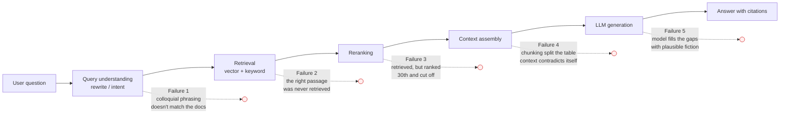
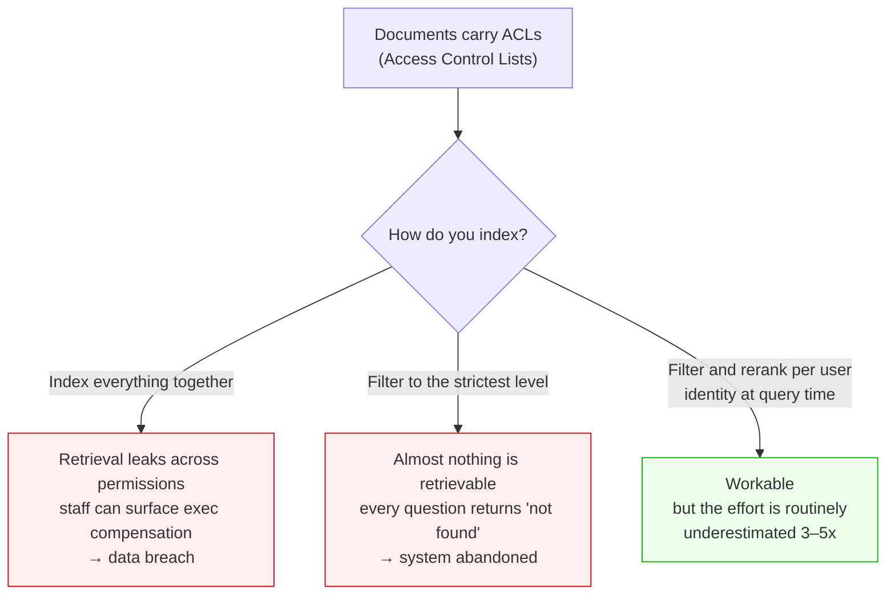
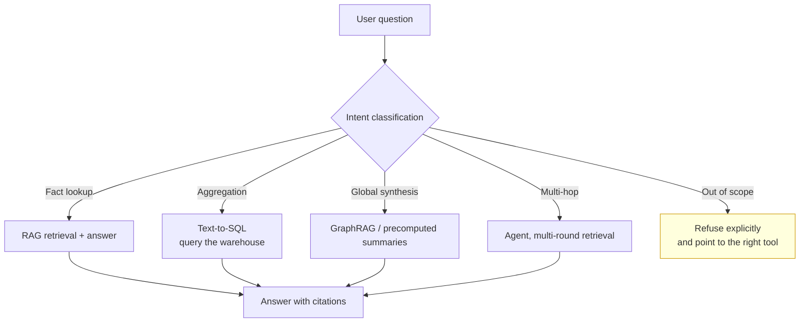

# Why So Many Companies Adopt RAG, and So Few Actually Succeed

> Over the past two years, nearly every company of any size has built a version of the
> "enterprise knowledge assistant." The demo was stunning. The project got funded. It shipped
> three months later — and users stopped opening it after two weeks.
>
> This article answers three questions: **where exactly does the path from demo to production
> break? What is the root-cause difference between teams that succeed and teams that don't?
> And what is genuinely wrong with the RAG architecture itself?**

## Abbreviations

| Abbreviation | Full name | What it means |
| --- | --- | --- |
| RAG | Retrieval-Augmented Generation | Retrieve relevant text, then let a model answer from it |
| LLM | Large Language Model | The generative model doing the answering |
| POC | Proof of Concept | The pilot demo used to get the project funded |
| ROI | Return on Investment | Whether the thing paid for itself |
| BM25 | Best Matching 25 | A classic keyword-based ranking algorithm |
| ACL | Access Control List | Per-document permissions |
| SQL | Structured Query Language | The query language for structured data |
| OCR | Optical Character Recognition | Turning scanned images into text |
| Recall@k | Recall at k | Whether the correct evidence made it into the top k results |
| HyDE | Hypothetical Document Embeddings | A query-rewriting trick: embed a hypothetical answer |
| SFT | Supervised Fine-Tuning | Adapting a model's behaviour with labelled examples |

---

## 1. First, understand why the demo was so easy

To understand the failure, you have to understand where that impressive demo came from.
A typical Proof of Concept (POC) looks like this:

- **Corpus:** 20 hand-picked, clean documents. Well-formatted PDFs. No scans, no screenshots of tables.
- **Questions:** asked live by **someone who has read those documents**.
- **Judgement:** a product manager glances at the answer and says, "yeah, that's about right."

Every one of those three conditions manufactures a systematic illusion:

1. **With 20 documents, retrieval barely has to work.** The corpus is small enough that you could
   stuff the whole thing into the context window. The retrieval component was never actually tested.
2. **The person asking has read the corpus**, so every question they ask has an answer in it.
   Real users ask about things that simply aren't there.
3. **"About right" is not a metric.** Nobody counted: out of 100 real questions, how many were
   correct, how many were wrong, and — crucially — how many of the wrong ones a user could
   have caught on their own.

Production inverts all three: 20 documents become 200,000; the person asking is a frontline
employee with no idea what's in the corpus; and "about right" becomes "I have to check every
line before I dare use this."

**A demo proves the pipeline runs. A product lives or dies on the answer rate against real
questions over messy data. Between those two things sits the entire engineering effort.**

## 2. The bottleneck is retrieval, not generation

This is the most common and most expensive misconception: teams pour 80% of their effort into
prompts and swapping in stronger models, when the ceiling is set one step earlier.

**The key point: generation quality is hard-capped by retrieval recall.** If the correct passage
never entered the context, no model can rescue you. It can only say "I don't know" (bad
experience) or invent something (worse).

### Do the arithmetic

Suppose Recall@5 — the probability the correct evidence lands in the top 5 results — is 70%,
and generation is flawless. End-to-end accuracy is capped at **70%**.

But most real questions need **several** pieces of evidence at once. If a question requires
3 facts, each independently retrieved at 90%, the probability all three arrive is
0.9 × 0.9 × 0.9 ≈ **73%**.

A per-item 90% that looks perfectly respectable **collapses to the low 70s on compound
questions**. This is precisely why users report: "simple questions are fine, but anything
slightly complex is unreliable."

### Semantic similarity ≠ relevance

Vector search matches on **semantic similarity**, but user intent frequently requires
**exact matching**:

| User asks | Why vector search fails |
| --- | --- |
| "How do I fix error ORA-01555?" | An error code is a meaningless token string; embeddings barely discriminate between codes |
| "What's the 2025 expense policy?" | The 2024 and 2025 versions are near-identical text; their vectors are nearly identical too |
| "Which models do **not** support 5G?" | Negation gets diluted in the embedding; you retrieve passages about models that *do* |
| "What's the difference between product A and B?" | Needs two documents retrieved together; a single query vector leans toward one |

This is why **hybrid retrieval (BM25 keyword + vector) plus a reranker is effectively table
stakes in production** — pure vector search is an artifact of the demo phase.

## 3. Root cause 1: the corpus is the product, and nobody owns it

Engineering teams assume "the documents already exist, we just point at them." The actual state
of enterprise knowledge is:

- **Self-contradictory:** the 2019 policy and the 2024 policy are both in the index, neither marked obsolete.
- **Redundant:** the same policy exists as v1, v2, `final`, `final_v2`, `final_v2_FINAL_reviewed.docx`.
- **Format hostile:** scanned PDFs, tables as screenshots, the critical process diagram trapped
  inside a PowerPoint slide — Optical Character Recognition (OCR) turns most of it into noise.
- **Permission soup:** HR compensation bands sitting in the same index as the all-hands handbook.

RAG has an **amplification effect** here: it takes a stale document nobody reads and converts it
into an answer that is **confident, well-formatted, and authoritative-sounding**. Before, an
employee stumbling onto an old file would at least glance at the date. Now the system states
flatly: "Per policy, the reimbursement limit is $500" — and that was the 2019 number.

> **Garbage in, confident garbage out.**

Permissions are harder still, and there are only two ways to get it wrong:

**Corpus governance is not an IT project — it's a knowledge-management project.** Without someone
on the business side who retires obsolete documents, marks the authoritative version, and adds
metadata, every downstream algorithmic improvement is just reordering contradictory material.

## 4. Root cause 2: an entire class of questions RAG structurally cannot answer

This is the most underestimated point. RAG's mechanism — retrieve top-k passages, answer from
them — means it can **only answer questions whose answer is already written down in some passage**.

| Question type | Example | Why RAG structurally can't |
| --- | --- | --- |
| **Aggregation** | "How many customers churned last quarter?" | The answer isn't in any passage; it requires a SQL aggregation |
| **Global synthesis** | "What are the common themes across all incident reports?" | top-k sees a few dozen passages, never the whole corpus |
| **Multi-hop** | "Who is the manager of the person running project A?" | Needs A→person, then person→manager; one retrieval round can't chain |
| **Negation / absence** | "Which contracts have **no** confidentiality clause?" | Retrieval finds what exists, not what's missing |
| **Recency / authority** | "What is the **current** travel policy?" | Similarity has no concept of "latest" or "in force" |
| **Computation** | "At this depreciation rate, what's the year-5 book value?" | Requires executing a calculation, not retrieving one |

What makes this lethal: **users don't know where the boundary is.** Nobody thinks "ah, this is an
aggregation query, I should use a different tool." They just ask, receive an answer delivered with
identical confidence, and conclude — permanently — that the system can't be trusted.

**Teams that succeed put an intent router in front of retrieval:**

**That "refuse explicitly" branch is the line between a toy and a product.** An assistant willing
to say "I can't answer that — check system X instead" is far more useful than one that answers
everything with 30% of it quietly wrong.

## 5. Root cause 3: no evaluation means no iteration

Ask a team currently building RAG: "you changed chunk size from 512 to 256 — did that make things
better or worse?" Most can't answer, because they have **no quantified evaluation set**.

The absence of evaluation causes three things directly:

1. **Tuning becomes superstition.** New embedding model, different chunking, add a reranker —
   each judged by "I think that feels a bit better?"
2. **You can't localise failures.** The answer was wrong: was it retrieval, ranking, or
   hallucination? Those three stages have to be **measured separately**.
3. **You can't prevent regressions.** You fix problem A and quietly break problem B, and find out
   in production.

A minimum viable evaluation has two layers:

| Layer | Metric | Question it answers |
| --- | --- | --- |
| Retrieval | Recall@k, hit rate | Did the correct evidence actually reach the context? |
| Generation | Faithfulness, accuracy, refusal rate | Given the evidence, did it invent anything? Did it refuse when it should? |

**The cost is lower than people assume:** **100–200** real questions labelled with their correct
supporting evidence by a domain expert is enough to power the entire iteration loop. There's no
shortcut here — going from 60% to 90% takes twenty evidence-driven iterations, not one heroic
model upgrade.

## 6. Root cause 4: trust economics are asymmetric

This explains why systems with respectable technical metrics still go unused.

**Users don't actually care about accuracy — they care about time saved.** And there's a brutal
identity buried in that:

> If a user **can't tell** which answers are correct, they must **verify every single one**.
> At that point, even 95% accuracy leaves their verification cost unchanged — and the
> **net benefit is close to zero**.

Layered on top is a second asymmetry:

- 100 correct answers build trust **linearly**;
- 1 confidently wrong answer — especially in legal, financial, or medical contexts — destroys it
  **off a cliff**.

Which means two design decisions outrank model tuning:

1. **Mandatory citations.** Every claim links to its source, so verification drops from
   "search for it again myself" to "glance at it." This is what pulls the net benefit back above zero.
2. **Willingness to say "I don't know."** Better to refuse than to fabricate. A calibrated
   "I'm not sure" is worth far more than false confidence.

## 7. Root cause 5: organisational and ROI mismatch

Beyond technology, three organisational pathologies recur:

- **Buying a platform instead of solving a problem.** "We procured a vector database" is not a
  goal. Successful projects start absurdly narrow: *one department, one question type, one corpus* —
  for example, product-manual lookup for support tickets, and nothing else.
- **Success measured as "shipped," not "used."** The funding KPI reads "launch the AI assistant in
  Q3," so the team ships something nobody uses in Q3 and the project is declared a success.
- **Nobody owns answer quality.** IT owns infrastructure, the business owns content, the ML team
  owns the model. All three do their jobs, and "a user asked a question and got a wrong answer"
  has no owner.

## 8. Being honest: what's wrong with RAG itself

Everything above is about *using it badly*. This section is about flaws in the architecture:

1. **Chunking is a lossy workaround.** It exists solely because context windows used to be small.
   It severs tables, orphans headings, and breaks cross-references — a structured document gets
   flattened into unrelated fragments.
2. **top-k is a fixed budget against variable difficulty.** Easy questions need 3 passages, hard
   ones need 30, and k is usually a hard-coded constant.
3. **A single vector can't hold multi-aspect meaning.** A passage covering both *pricing* and
   *renewal terms*, compressed to one vector, represents neither well.
4. **Embedding models don't know your jargon.** Trained on general text, they discriminate poorly
   between internal acronyms, product codenames, and proprietary process terms.
5. **Similarity has no notion of authority, recency, or correctness.** A superseded proposal and
   the current one can sit right next to each other in vector space.
6. **The retriever and generator are trained separately** — no end-to-end optimisation, so the
   retriever has no signal about what actually helps generation.
7. **More context isn't monotonically better.** Information buried mid-context tends to be
   overlooked (lost-in-the-middle), and attention gets diluted by irrelevant passages.

These flaws are what drove the successor techniques — hybrid retrieval, reranking, query rewriting
(such as HyDE, Hypothetical Document Embeddings), GraphRAG, agentic search, and simply stuffing
long contexts directly. **Be clear about what those are: patches for structural gaps, not garnish.**

## 9. The difference, in one sentence

Compress every root cause into a single line:

> **Teams that succeed treat it as a search product with an LLM front-end.
> Teams that fail treat it as an LLM product with a search backend.**

That difference in framing determines every downstream choice:

| Dimension | Treated as an LLM project (usually fails) | Treated as a search product (usually works) |
| --- | --- | --- |
| Team focus | Prompt engineering, stronger models | Retrieval quality, corpus governance |
| Primary metric | Whether answers *read* well | Recall@k, task completion, verification time |
| Corpus | "Just point it at the shared drive" | Owned, deduplicated, tagged for recency and authority |
| Scope | The whole company's knowledge, at once | One department, one question type, done properly |
| Out-of-scope questions | Answer anyway | Route to SQL / agent, or refuse explicitly |
| Evaluation | A few dozen manual spot-checks pre-launch | A standing golden set, measured per stage |
| Interface | A chat box | Citations, provenance, confidence, feedback loop |

The five highest-priority moves in practice:

1. **Cut the scope hard** — one department, one question type, one corpus.
2. **Hybrid retrieval plus reranking** — don't ship pure vector search to production.
3. **Intent routing with a real refusal path** — keep questions RAG can't answer *out*.
4. **Build the eval set on day one** — 100 real questions, retrieval and generation measured separately.
5. **Make every answer traceable** — citations aren't decoration, they're what makes the net benefit positive.

## 10. When you shouldn't use RAG at all

| Situation | Better approach |
| --- | --- |
| Small corpus (dozens of documents, fits in context) | Long-context stuffing — skip the retrieval pipeline entirely |
| You need to change the model's **style, format, or tone** | Fine-tuning (SFT, Supervised Fine-Tuning) |
| Questions are mostly statistics, aggregates, reports | Text-to-SQL against the warehouse |
| Global synthesis, cross-document theme analysis | GraphRAG or precomputed summaries |
| Facts must be 100% correct, zero tolerance | Deterministic system plus human review; the LLM assists only |
| Knowledge changes by the minute | Call the live API directly; don't index it |

## Summary

- **Between a working demo and a working product sit three things:** messy real data, users who
  don't know the corpus boundary, and a quantified evaluation set.
- **Generation quality is capped by retrieval recall** — spending your effort on prompts instead of
  retrieval is the single most common misallocation.
- **The corpus is the product, not raw material.** With no content owner, algorithmic tuning just
  reorders contradictory documents.
- **A whole class of questions — aggregation, global synthesis, multi-hop, negation, recency — is
  structurally out of reach.** Route them away rather than answering them badly.
- **No eval set means no iteration.** A stronger model is not a substitute for twenty
  evidence-driven improvements.
- **Trust is asymmetric:** one confident error outweighs a hundred correct answers, which is why
  citations and refusal outrank parameter tuning.

One line to remember: **the hard part of RAG was never the G. It's the R — and the pile of
documents behind it that nobody maintains.**

---

Related: [中文版](./why-rag-projects-fail.zh.md) ·
[AI 核心概念梳理：LLM / Prompt / Agent / RAG / MCP / Skill / Context / Harness](./AI核心概念梳理-LLM-Prompt-Agent-RAG-MCP-Skill-Context-Harness.md)
