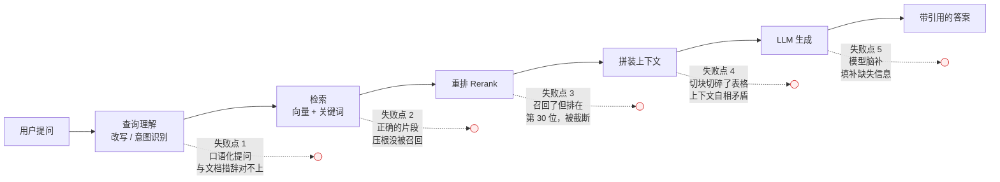
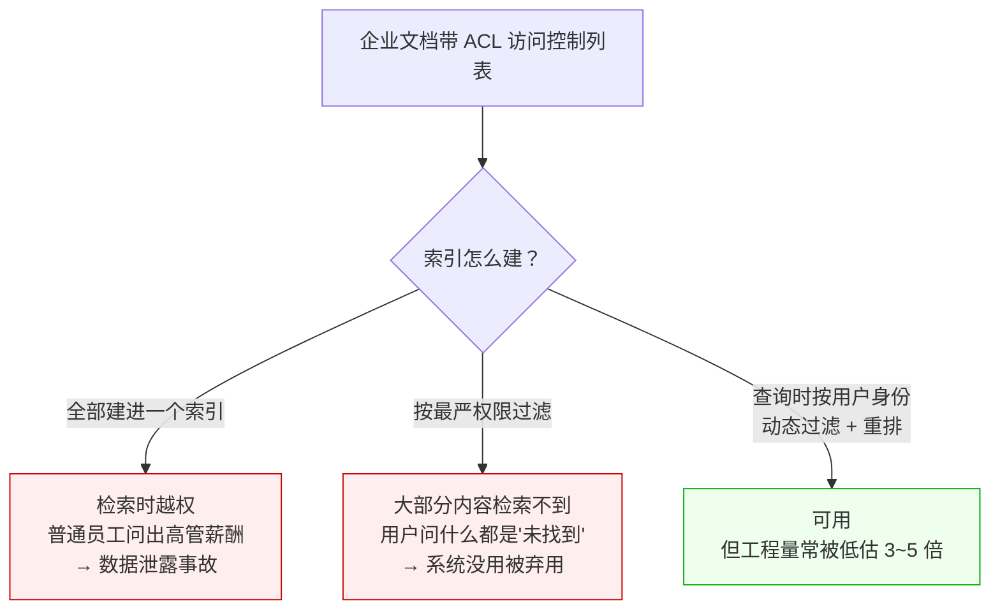
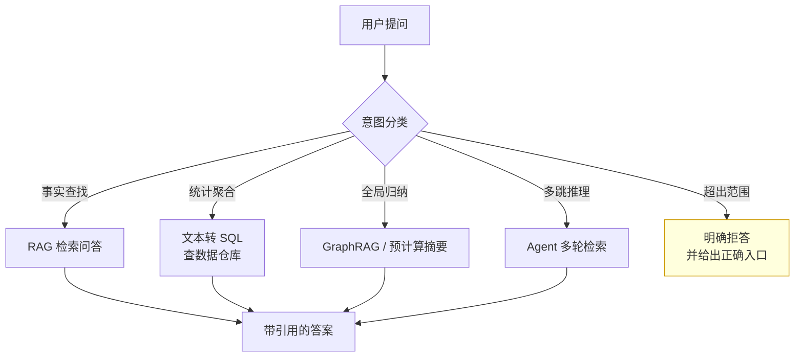

# 为什么大量公司上了 RAG，却很少真正做成？

> 过去两年，几乎每家有点规模的公司都做过一版「企业知识库问答」。Demo 演示效果惊艳，
> 立项顺利，三个月后上线，然后——用户用了两周就不用了。
>
> 这篇文章回答三个问题：**Demo 到生产之间到底断在哪里？做成的团队和没做成的团队，
> 根因差别是什么？以及，RAG 这套架构本身有哪些绕不过去的缺陷？**

## 缩写对照表

| 缩写 | 英文全称 | 中文 |
| --- | --- | --- |
| RAG | Retrieval-Augmented Generation | 检索增强生成 |
| LLM | Large Language Model | 大语言模型 |
| POC | Proof of Concept | 概念验证 / 试点demo |
| ROI | Return on Investment | 投资回报率 |
| BM25 | Best Matching 25 | 一种经典的关键词检索排序算法 |
| ACL | Access Control List | 访问控制列表（权限） |
| SQL | Structured Query Language | 结构化查询语言 |
| OCR | Optical Character Recognition | 光学字符识别 |
| PII | Personally Identifiable Information | 个人身份信息 |
| Recall@k | Recall at k | 前 k 个检索结果的召回率 |
| HyDE | Hypothetical Document Embeddings | 假设性文档嵌入（一种查询改写技巧） |
| SFT | Supervised Fine-Tuning | 监督微调 |

---

## 一、先看清楚：Demo 为什么那么容易成功

要理解失败，得先理解那个「成功的 Demo」是怎么来的。典型的 POC（Proof of Concept，概念验证）长这样：

- 语料：精挑细选的 **20 份**干净文档，PDF 排版规整，没有扫描件，没有表格截图；
- 问题：由**读过这些文档的人**现场提出；
- 评判：产品经理看了一眼答案，「嗯，说得挺对」。

这三条每一条都在系统性地制造假象：

1. **20 份文档时，检索几乎不会错。** 语料小到把所有内容塞进上下文都行，检索模块实际上没被考验；
2. **出题人读过语料，所以他问的每个问题都有答案。** 真实用户会问语料里根本没有的东西；
3. **「说得挺对」不是指标。** 没有人去数：100 个真实问题里答对几个、答错几个、答错的那几个用户能不能自己发现。

生产环境把这三个前提全部反转：20 份变 20 万份，出题人变成不了解语料边界的一线员工，
「挺对」变成「我得逐条核对才敢用」。**Demo 验证的是「技术链路能跑通」，
而项目的成败取决于「在脏语料上对真实问题的答对率」——这两件事之间隔着整个工程。**

## 二、真正的瓶颈不在生成，而在检索

这是最普遍、也最贵的一个误解：团队把 80% 的精力花在 prompt 和换模型上，
而真正决定天花板的是前面那一步。

**关键结论：生成质量的上限，被检索召回率死死锁住。**
如果正确的那段文字压根没进上下文，再强的模型也只能：要么说不知道（体验差），要么编（更糟）。

### 一笔简单的账

设检索的 Recall@5（前 5 条命中正确依据的概率）= 70%，生成环节完美无缺，
那么端到端正确率的上限就是 **70%**。而多数真实问题需要**多个**依据同时到位：

若一个问题需要 3 条事实，每条独立召回率 90%，则三条同时召回的概率是
0.9 × 0.9 × 0.9 ≈ **73%**。

也就是说，**单点看起来"还不错"的 90%，在复合问题上会迅速塌到 70% 出头。**
这就是为什么用户感觉「简单问题还行，稍微复杂一点就不靠谱」。

### 向量相似 ≠ 相关

向量检索的本质是**语义相似度**，但用户的真实意图经常需要**精确匹配**：

| 用户提问 | 向量检索为什么会翻车 |
| --- | --- |
| 「错误码 ORA-01555 怎么处理」 | 错误码是无语义的符号串，嵌入模型对它几乎没有分辨力 |
| 「2025 版报销政策」 | 2024 版和 2025 版文本高度相似，向量几乎分不开 |
| 「哪些机型**不**支持 5G」 | 否定词在嵌入里被稀释，检索回来的全是「支持 5G」的段落 |
| 「A 产品和 B 产品的差异」 | 需要两篇文档同时召回，单一查询向量偏向其中一篇 |

这就是**混合检索（BM25 关键词 + 向量）+ 重排（Rerank）几乎是生产系统标配**的原因——
纯向量方案是 Demo 阶段的产物。

## 三、根因一：语料才是产品，但没有人对它负责

技术团队默认「文档是现成的，我们只管接进来」。而企业知识库的真实状态是：

- **自相矛盾**：2019 年的制度和 2024 年的制度都在库里，都没标失效；
- **重复冗余**：同一份政策有 v1、v2、终版、终版（最终）、终版（真的最终）；
- **格式灾难**：扫描件 PDF、表格截图、PPT 里的关键流程图——OCR（光学字符识别）之后全是乱码；
- **权限混杂**：HR 的薪酬细则和全员手册躺在同一个索引里。

RAG 在这里有一个**放大效应**：它把一份没人看的过期文档，
变成了一个**语气笃定、格式规整、看起来很权威的答案**。
原来员工翻到旧文档还知道看一眼日期，现在系统直接告诉他「根据规定，报销上限为 500 元」——
而那是 2019 年的标准。

> **垃圾进，自信的垃圾出。**（Garbage in, confident garbage out.）

权限问题更棘手，且只有两种失败方式：

**语料治理不是 IT 项目，是知识管理项目。**
没有一个业务侧的「内容负责人」去下线过期文档、标注权威版本、补充元数据，
后面所有的算法优化都是在给一堆矛盾的材料排序。

## 四、根因二：有一整类问题，RAG 在结构上就答不了

这是最被低估的一条。RAG 的机制是「检索 top-k 个片段 → 让模型基于片段作答」，
这决定了它**天然只能回答"答案已经写在某一段文字里"的问题**。

| 问题类型 | 例子 | 为什么 RAG 结构上做不到 |
| --- | --- | --- |
| **聚合统计** | 「上季度有多少客户流失？」 | 答案不在任何一段文字里，需要对结构化数据做 SQL 聚合 |
| **全局归纳** | 「所有故障报告的共性主题是什么？」 | top-k 只能看到几十段，看不到全量语料 |
| **多跳推理** | 「负责 A 项目的人，他的上级是谁？」 | 需要先查 A→人，再查人→上级；单轮检索无法串联 |
| **否定 / 缺失** | 「哪些合同**没有**保密条款？」 | 检索找得到"存在什么"，找不到"不存在什么" |
| **时效 / 权威** | 「**现行**的差旅标准是？」 | 相似度不理解"最新"和"生效中"，新旧版本一起召回 |
| **计算推演** | 「按这个折旧率，第 5 年账面价值？」 | 需要执行计算，不是检索 |

致命之处在于：**用户不知道这条边界在哪里。**
他不会因为「这是聚合类问题」就换个工具，他只会问出来，
拿到一个**语气同样笃定的错误答案**，然后得出结论——「这系统不靠谱」。

**做成的团队会在检索之前加一层意图路由：**

**「明确拒答」那一支，是区分玩具和产品的分水岭。**
一个敢说「这个问题我答不了，请去 XX 系统查」的助手，
比一个什么都答、但有 30% 在胡说的助手有用得多。

## 五、根因三：没有评测，就没有迭代

问一个正在做 RAG 的团队：「你把 chunk size 从 512 改成 256，效果是变好还是变坏？」
大多数团队答不上来——因为他们**没有可量化的评测集**。

没有评测，会直接导致三个后果：

1. **调优变成玄学。** 换嵌入模型、改切块、加重排，每一次都靠「我感觉好像好点了」；
2. **无法定位。** 答案错了，是检索没召回、重排排错了、还是模型幻觉？三个环节要**分段测**；
3. **无法防止回退。** 修好了 A 问题，悄悄弄坏了 B 问题，上线才发现。

最小可用的评测应该分两层：

| 层次 | 指标 | 回答什么问题 |
| --- | --- | --- |
| 检索层 | Recall@k、命中率 | 正确依据到底进没进上下文？ |
| 生成层 | 忠实度（答案是否有依据支撑）、正确率、拒答率 | 拿到依据后有没有编？该拒答时拒了吗？ |

**成本没有想象中高**：由业务专家标注 **100~200 条**真实问题及其正确依据，
就足以支撑起整个迭代循环。这件事没有捷径——
把 60% 做到 90% 靠的是二十次有依据的迭代，而不是一次「换个更强的模型」。

## 六、根因四：信任经济学是不对称的

这条决定了「技术指标不错」的系统为什么照样没人用。

**用户真正在意的不是准确率，是「省下的时间」。** 而这里有一个残酷的算式：

> 如果用户**无法判断**哪个答案是对的，他就必须**逐条核对每一个答案**。
> 此时哪怕系统准确率 95%，用户的核对成本没有下降——**净收益接近零**。

再加上一条不对称性：

- 100 个正确答案，建立的信任是**线性**的；
- 1 个笃定的错误答案（尤其发生在法务、财务、医疗场景），摧毁的信任是**断崖式**的。

所以体验设计上有两件事的优先级高于模型调优：

1. **强制引用（Citation）**：每句结论都能一键跳到原文出处，把「核对」的成本从「重新搜一遍」
   降到「瞄一眼」——这是把净收益从 0 拉回正数的关键；
2. **敢于说不知道**：宁可拒答，不可编造。校准过的「不确定」，比虚假的笃定值钱得多。

## 七、根因五：组织与 ROI 的错配

技术之外，还有三个反复出现的组织病灶：

- **买平台，而不是解问题。** 「我们采购了向量数据库」不是一个目标。
  成功的项目往往起点极窄：*一个部门、一类问题、一批语料*——比如只做售后工单的产品手册查询；
- **成功指标是「上线」而不是「被使用」。** 立项 KPI 写的是「Q3 上线智能问答」，
  于是团队在 Q3 交付了一个没人用的系统，项目「成功」了；
- **没人对答案质量负责。** IT 管基础设施，业务管内容，算法管模型——
  三方都尽责，但「用户问了一个问题得到错误答案」这件事，没有 owner。

## 八、诚实地说：RAG 这套架构本身的缺陷

前面讲的是「用错了」，这一节讲「它本来就有的问题」：

1. **切块（Chunking）是个有损的权宜之计。**
   它存在的唯一理由是早期上下文窗口太小。切块会切断表格、剥离标题层级、破坏交叉引用——
   一份结构化文档被拍平成互不相关的碎片；
2. **top-k 是固定预算，问题难度却是可变的。**
   简单问题 3 段足够，复杂问题 30 段不够，而 k 通常是个写死的常数；
3. **单一向量装不下多面语义。**
   一段同时讲「价格」和「续约条款」的文字，被压成一个向量后，两个方面都表达得不充分；
4. **嵌入模型不认识你的黑话。**
   通用语料训练出的嵌入，对企业内部缩写、产品代号、专有工艺词的分辨力很差；
5. **相似度不理解权威性、时效性和正确性。**
   一份被推翻的旧方案和现行方案，在向量空间里可能挨得极近；
6. **检索器与生成器是分开训练的**，没有端到端优化——
   检索器不知道什么样的片段对生成最有用；
7. **上下文塞得越多，未必越好。**
   信息淹没在中间位置容易被忽略（lost-in-the-middle），注意力被无关片段稀释。

这些缺陷催生了后续的各种改良——混合检索、重排、查询改写（如 HyDE，
Hypothetical Document Embeddings，假设性文档嵌入）、GraphRAG、
Agentic Search（让模型自己多轮检索）、长上下文直接塞入等等。
**但要清楚：这些是在补结构性的短板，不是锦上添花。**

## 九、做成和没做成，差别就在这一句话

如果把所有根因压缩成一句：

> **做成的团队，把它当作「一个带 LLM 前端的搜索产品」；
> 没做成的团队，把它当作「一个带搜索后端的 LLM 产品」。**

这个视角差异，会一路决定下面每一个选择：

| 维度 | 当作 LLM 项目（多数失败） | 当作搜索产品（多数成功） |
| --- | --- | --- |
| 团队重心 | Prompt 工程、换更强的模型 | 检索质量、语料治理 |
| 首要指标 | 答案「读起来」好不好 | Recall@k、任务完成率、核对耗时 |
| 语料 | 「给我一个文件夹就行」 | 有专人治理、去重、标注时效与权威 |
| 范围 | 全公司知识库，一步到位 | 一个部门、一类问题，做深做透 |
| 边界外问题 | 硬答 | 路由到 SQL / Agent，或明确拒答 |
| 评测 | 上线前人工试几十条 | 常驻黄金评测集，分段量化 |
| 交互 | 一个聊天框 | 引用、溯源、置信度、反馈回路 |

落地时优先级最高的五件事：

1. **把范围砍窄**——一个部门、一类问题、一批语料；
2. **混合检索 + 重排**——别用纯向量方案上生产；
3. **意图路由 + 敢拒答**——把 RAG 答不了的问题挡在外面；
4. **从第一天就建评测集**——100 条真实问题，分段测检索和生成；
5. **答案必须可溯源**——引用不是装饰，是让净收益为正的前提。

## 十、什么时候根本不该用 RAG

| 场景 | 更合适的方案 |
| --- | --- |
| 语料很小（几十份文档、总量能进上下文） | 直接长上下文塞入，别建检索链路 |
| 要改变模型的**风格、格式、语气** | 微调（SFT，Supervised Fine-Tuning，监督微调） |
| 问题主要是统计、聚合、报表 | 文本转 SQL，查数据仓库 |
| 需要全局归纳、跨文档主题分析 | GraphRAG 或预计算摘要 |
| 事实必须 100% 准确、零容错 | 确定性系统 + 人工复核，LLM 只做辅助 |
| 知识更新极快（分钟级） | 直接调 API 取实时数据，别进索引 |

## 小结

- **Demo 成功和产品成功之间，隔着「脏语料 + 不了解边界的真实用户 + 可量化的评测」这三关**；
- **生成质量的天花板是检索召回率**——精力花在 prompt 上而不是检索上，是最常见的资源错配；
- **语料是产品，不是素材**，没有内容 owner，算法优化就是给矛盾材料排序；
- **有一整类问题（聚合、全局、多跳、否定、时效）RAG 结构上答不了**，
  必须靠意图路由挡在外面，而不是硬答；
- **没有评测集就没有迭代**，「换个更强的模型」代替不了二十次有依据的调优；
- **信任是不对称的**：一次笃定的错误，抵得过一百次正确——所以引用和拒答的优先级高于调参。

一句话记住：**RAG 的难点从来不在 G（生成），而在 R（检索）和它背后那堆没人管的文档。**

---

相关笔记：[English version](./why-rag-projects-fail.en.md) ·
[AI 核心概念梳理：LLM / Prompt / Agent / RAG / MCP / Skill / Context / Harness](./AI核心概念梳理-LLM-Prompt-Agent-RAG-MCP-Skill-Context-Harness.md)
