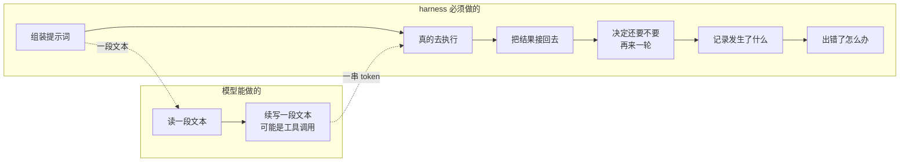
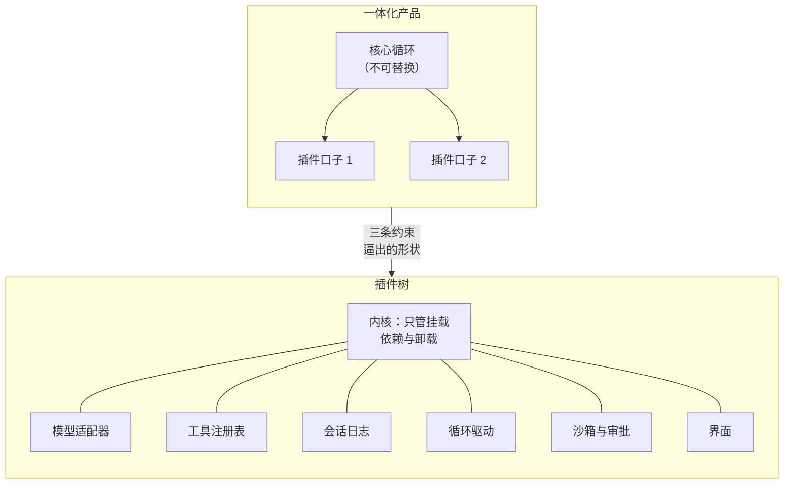

# 为什么需要 harness：模型再强，也不会自己去读文件

> 2025 年，你想给团队做一个"能改代码的 AI 助手"。你有一个很强的模型，也有 API key。于是你写了个循环：把用户的话发给模型 → 模型回一段 JSON 说要调 `read_file` → 你执行 → 把结果塞回去 → 再发一次。
>
> 两百行代码就跑通了 demo。然后你花了接下来的六个月，处理这些事：模型输出被截断怎么办、工具跑了 10 分钟怎么办、用户中途改主意怎么办、上下文超了怎么办、`rm -rf` 要不要拦、拦了怎么问用户、用户不在怎么办、换个模型厂商为什么全崩、上周那次它删错文件到底是怎么发生的——**日志里只有最后一次请求**。
>
> 这一篇讲清楚：那两百行和一个真正能用的 Agent 之间差的到底是什么、为什么这层壳（harness）在 2026 年成了一个独立的软件品类、以及为什么它必须是开源且可替换的。

---

## 缩写对照表

| 缩写 | 英文全称 | 中文 |
|---|---|---|
| LLM | Large Language Model | 大语言模型 |
| API | Application Programming Interface | 应用程序编程接口 |
| SDK | Software Development Kit | 软件开发工具包 |
| IDE | Integrated Development Environment | 集成开发环境 |
| CI | Continuous Integration | 持续集成 |
| MCP | Model Context Protocol | 模型上下文协议 |
| RL | Reinforcement Learning | 强化学习 |

---

## 一、先把话说清楚：模型交付的是 token，不是行为

一次 LLM 调用的输入输出，本质上只有一件事：**给定一段文本，续写一段文本**。哪怕它续写出来的是 `{"name":"read_file","arguments":{"path":"README.md"}}`，那也只是一串 token——**没有任何文件被读取**。

真正读文件的是别人。真正把结果塞回下一次请求的是别人。真正决定"这次要不要问用户一句"的也是别人。

这个"别人"，就是 harness（外壳/装置）。DeepSeek 官方把它写成一个等式：

> **Model + Harness = Agent**
>
> "The model is the soul of an agent. A harness lets an agent understand its environment, use tools, and keep working in real-world settings."
> （模型是 Agent 的灵魂。harness 让 Agent 理解环境、使用工具，并在真实场景里持续工作。）

所以问题不是"要不要 harness"——你只要写过那个循环，你就已经写了一个 harness，只是它很薄。问题是：**当它从两百行长到能上生产，它会长成什么形状？**

## 二、第一堵墙：那两百行会长成六千行，而且全是边界情况

把 demo 变成产品的过程，几乎全部是在处理**不发生在快乐路径上的事**。列一下真实清单：

| 你以为的一步 | 生产上真正要处理的 |
|---|---|
| "把工具结果塞回去" | 结果 20MB 怎么办？截断策略是什么？截断之后模型知道被截断了吗？ |
| "再发一次请求" | 上下文超了。压缩谁？丢哪一段？丢完还要不要重试？重试算不算新一轮？ |
| "执行工具" | 三个工具调用能不能并行？哪些并行是安全的？谁来判定？ |
| "等模型回复" | 厂商流卡住了。多久算卡住？超时了是重试还是报错？重试几次？ |
| "用户在等" | 用户中途又说了一句话。是打断当前这步，还是排到下一步，还是下一轮？ |
| "跑个命令" | 要不要问用户？用户没在看怎么办？CI 里没人可问怎么办？ |
| "出错了" | 是厂商 500、是网络、是模型返回空、还是工具本身失败？四种要不要区别对待？ |
| "复盘一下" | 上周那次它删错文件——你能重放当时模型看到的**每一个字节**吗？ |

这些没有一条是"AI 问题"，全是**系统工程问题**。而它们的答案彼此耦合：压缩策略要知道回合边界，回合边界要知道工具是否还欠一次请求，工具调度要知道取消信号从哪来，取消信号要知道用户消息进了哪条队列。

于是它们被写进同一个大循环里。**这就是第二堵墙的来源。**

## 三、第二堵墙：能力被焊死在产品里，你只能整包换

2025 年市面上成熟的 Agent 产品——Claude Code、Codex、各家 IDE 插件——都在这层壳上做得很好。但它们有一个共同形状：**壳和产品是一体的**。

你想换掉其中一小块，会发现换不了：

- 想**换模型**？可以，如果产品支持的话。产品不支持某个自建 endpoint，就到此为止。
- 想**换沙箱**——把命令放进公司的远程执行环境而不是本机？没有这个接口。
- 想**换循环本身**——比如你在做研究，想试一个"每步都强制先写计划"的变体？循环是产品的核心，不开放。
- 想**换 UI**——把它接进公司内部的工单系统？只有官方给的那几个入口。
- 想**加一条策略**——比如"任何触碰 `infra/` 目录的编辑都必须二次审批"？只能等官方支持。

这不是产品做错了。一个一体化产品本来就该做取舍。但结果是：**这层壳的每一个决策，都被打包成一个不可拆分的"要么全用要么全不用"**。

### 已有的替代方案为什么不够

| 方案 | 它解决的 | 卡在哪 |
|---|---|---|
| 自己写循环 | 完全可控 | 第二节那张表你得自己填完，六个月起步 |
| LangGraph / 各类编排 SDK | 把"多步流程"抽象成图 | 它抽象的是**你的业务流程**，不是 agent 与环境的关系：沙箱、审批、会话持久化、流式重放仍然是你自己的事 |
| MCP（模型上下文协议） | **工具**这一层的标准化，工具进程可独立发布 | 它只管工具这一个接缝。模型适配、循环、审批、日志、UI 全在协议之外 |
| 一体化产品的插件系统 | 在产品留的口子上扩展 | 口子是产品定的：能加工具，不能换循环；能加命令，不能换沙箱 |

MCP 这一条特别值得展开：它证明了"把一个接缝标准化"能带来多大的生态效应——工具可以被独立开发、独立发布、跨产品复用。**那为什么只有工具这一个接缝配得上这种待遇？** 模型适配、循环、会话存储、沙箱、审批、UI，每一个都同样值得被拔出来。

这正是 harness 作为独立品类的立论：**把"工具是插件"这件事，推广到每一个部件。**

## 四、第三堵墙：黑盒无法审计，也就无法评测

还有一个被低估的痛点，主要来自做模型的人和做评测的人。

当你想回答"这个模型在真实编码任务上表现如何"，你会立刻撞上一个问题：**你测的到底是模型，还是壳？**

同一个模型，配一个会自动补全上下文的壳，和配一个只给两个工具的壳，跑出来的分数能差出十几个点。你换了模型，分数变了——是模型变强了，还是恰好这个壳的提示词更合它的口味？没人说得清，因为壳是黑的。

于是评测领域出现了一个刚需：**一个可以把变量按住的壳**。

- 需要能**精确控制工具集**——极简两工具的对照组，和全功能实验组，跑在同一个循环上。
- 需要能**完整重放**——不是"日志里有这次请求"，而是"模型看到的每一个 token、每一次工具返回、每一次上下文注入，都在一条可回放的流里"。
- 需要能**换模型不换其他**——只替换适配器，其余一个字节不动。

DSH 把这件事写成了第二句设计信条：

> **"Everything is a plugin. Every run is traceable."**
> （一切皆插件。每一次运行都可追溯。）

第一句是为了对付第二堵墙，第二句是为了对付第三堵墙。

## 五、三个约束，逼出同一个形状

把三堵墙翻译成设计约束：

1. **每个部件都要能被替换**——包括循环本身、包括模型适配器、包括会话存储。这意味着不能有"特权核心"：一旦有一块代码是"内核"，它就是那个换不了的部分。
2. **替换必须来自配置，而不是 fork 代码**——否则"可替换"只是"你可以自己改源码"的委婉说法。
3. **模型看见的一切必须可重建**——不是事后打日志，而是"凡是进入过模型请求的东西，都必须先成为一条日志事件"。

这三条合起来，几乎只剩一种形状：

左边：核心决定一切，插件只能在它留的口子上活动。
右边：内核只负责"挂载、解析依赖、卸载"，**连循环都只是挂在树上的一个插件**——想换，写一个新的挂上去，把旧的那行配置注释掉。

## 六、如果它不存在，会怎样

回到最开始那个六个月的故事。如果没有一个开源、可替换、可追溯的 harness：

- 每一家做 Agent 产品的公司，都要把第二节那张表**再填一遍**——这是行业级的重复劳动。
- 每一个做模型评测的人，都要在别人的黑盒上比较，或者自己写一个壳（于是结果无法互相比较）。
- 每一个"我想给 Agent 加一条内部策略"的需求，都要等产品方排期。
- 每一次"上周它到底怎么删错文件的"，都只能靠猜。

**如果这东西不存在，总得有人把它发明出来。** 2026 年 8 月，DeepSeek 把自己内部那一份开源了：MIT 协议，Node.js 实现，命令名 `dsh`，仓库 `deepseek-ai/deepseek-harness`。几小时内三万多颗星——不是因为它是个新奇玩具，而是因为上面这三堵墙，撞上的人太多了。

## ⚓ 回到示例

本系列的运行示例是这一句：

> "读一下 package.json，给 README 补一个 Quick Start 小节，然后跑一次 `pnpm lint` 确认没问题。"

它看起来平平无奇，但请先记住它一路要碰到的东西：**读文件**（需要文件能力）、**改文件**（需要编辑工具和 diff 记录）、**跑命令**（需要 shell + 沙箱 + 审批）、**多步**（需要循环判断"还欠一次请求"）、**可复盘**（需要日志能重放这一分钟）。

到第 12 篇，你会知道这一分钟里，这些部件各自在第几毫秒做了什么、以及每一个都可以怎么被换掉。

---

**下一篇** → [02 · DeepSeek Harness 是什么：定义、边界与生态位置](02-what.zh.md)
**回到** → [系列索引](index.md)
