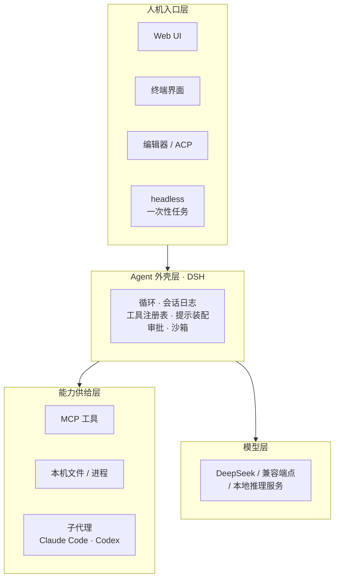

# DeepSeek Harness 是什么：定义、边界与生态位置

> 上一篇建立了痛点：模型交付 token，Agent 需要行为；这层壳每家都在写，但每家都把它焊死在自己产品里，于是没人能换、没人能审、没人能公平评测。
>
> 这一篇给出定义、划清边界、并把它放进生态里比较。读完你应该能判断：**这东西跟我有没有关系。**

---

## 缩写对照表

| 缩写 | 英文全称 | 中文 |
|---|---|---|
| DSH | DeepSeek Harness | 本文主角，命令名 `dsh` |
| MIT | MIT License | 一种宽松开源许可证 |
| CLI | Command Line Interface | 命令行界面 |
| TUI | Terminal User Interface | 终端用户界面 |
| UI | User Interface | 用户界面 |
| SDK | Software Development Kit | 软件开发工具包 |
| MCP | Model Context Protocol | 模型上下文协议 |
| ACP | Agent Client Protocol | 智能体客户端协议 |
| PTC | Programmatic Tool Calling | 程序化工具调用 |
| YAML | YAML Ain't Markup Language | 一种配置文件格式 |
| HMR | Hot Module Replacement | 模块热替换 |

---

## 一、一句话定义

> **DeepSeek Harness（`dsh`）是一个开源的 Agent 运行外壳：它把"让模型在真实环境里持续工作"所需要的每一个部件——模型适配器、工具注册表、会话日志、审批与沙箱、乃至驱动循环本身——都实现成一个可以从配置里换掉的插件，运行在一个只负责挂载与依赖解析的微内核（Cordis）之上。**

逐段拆：

| 片段 | 意思 | 对应上一篇的哪堵墙 |
|---|---|---|
| "Agent 运行外壳" | 它的品类。不是模型、不是编排 SDK、不是 IDE | — |
| "让模型在真实环境里持续工作" | 它的职责边界：环境、工具、持续性 | 第一堵墙（边界情况） |
| "每一个部件……都是插件" | 核心机制。**包括循环本身** | 第二堵墙（焊死） |
| "从配置里换掉" | 替换的方式是配置，不是 fork 源码 | 第二堵墙 |
| "只负责挂载与依赖解析的微内核" | 没有特权核心可以打补丁 | 第二堵墙 |

官方仓库首页只有一句话概括：

> "It uses an architecture where **everything is a plugin**, and is powered by [Cordis](https://github.com/cordiverse/cordis)."

而 `docs/architecture.md` 把这句话说得更狠：

> "Every part of the product is a plugin, including **the model adapter, the tool registry, the session log, and the agent loop itself**, so every part is replaceable from configuration. **There is no privileged core to patch**."

## 二、两句设计信条，各换来什么

DSH 官网把设计原则压成两句：**"Everything is a plugin. Every run is traceable."**

这不是两句并列的口号，而是两条各有代价、各有回报的工程决策。

### 信条一：Everything is a plugin（一切皆插件）

**换来的**：任何部件都能替换、并存、卸载。想让命令跑在远程沙箱？换一个 provider 行。想试一个新的循环策略？写一个新的 driver 挂上去。想给某类会话一套完全不同的工具？写一个 preset。

**代价**：配置成为一等公民。你必须理解插件树是怎么叠出来的，才能理解"我这个环境里到底跑着什么"。这也是为什么第 5 篇会说 `dsh --dump-config` 是这个项目最该先跑的命令。

### 信条二：Every run is traceable（每次运行都可追溯）

官方的说法是：

> "Everything the model sees is recorded in an **append-only session log**: system prompts, reasoning, tool calls and results, subagent scheduling, and every context injection."
> （模型看见的一切都记录在一条只追加的会话日志里：系统提示、推理过程、工具调用与结果、子代理调度，以及每一次上下文注入。）

**换来的**：重放、复盘、评测、fork（从历史某点分叉出一条新会话）、崩溃恢复——全部是同一个机制的自然结果。

**代价**：一条硬约束——**模型可见即已记录**（model-visible means logged）。任何东西想进入模型请求，必须先成为一条日志事件；仓库里甚至有一条运行时不变量在断言这件事。这条约束会反过来塑造每一个想给模型加信息的插件的写法（见第 6 篇）。

## 三、它不是什么

边界比定义更能防止误用。DSH **不是**下面这些东西：

| 它不是 | 为什么容易混 | 实际关系 |
|---|---|---|
| **一个模型** | 名字里有 DeepSeek | 模型是外部的，通过适配器接入；DSH 自己不含任何权重 |
| **一个 IDE 或编辑器** | 它带 Web UI，能改代码 | UI 也只是一个插件（`dsh-web-app` bundle）；换成终端界面、换成接入别的编辑器都是换插件 |
| **又一个 Agent 编排 SDK** | 都在讲"多步""工具""状态" | 编排 SDK 抽象的是**你的业务流程**（图、节点、状态机）；DSH 抽象的是**agent 与环境的关系**（工具、文件、进程、审批、日志） |
| **MCP 的替代品** | 都在讲工具 | 互补。MCP 标准化"工具"这一个接缝；DSH 把这种可替换性推广到所有接缝，并且它自己就带 `packages/mcp`，可以消费 MCP 工具 |
| **一个云服务** | — | 纯本地 Node.js 进程；`npx @deepseek-ai/dsh web` 起在 `127.0.0.1:3080` |
| **一个稳定产品** | 星标很多 | 官方原话：*developer preview*，**会有破坏性变更** |

还有一条特别容易误解的：**它不是"DeepSeek 模型专用"**。适配器是接缝，仓库里同时存在直连 DeepSeek 的适配器和一个库支撑的通用适配器（`llm-pi-ai`），并且 Web UI 的 Settings → Models 里可以配置自定义 OpenAI 兼容端点。

## 四、生态位置

同层邻居怎么比：

| 邻居 | 关系 |
|---|---|
| **Claude Code / Codex** | 同层竞品，但 DSH 把它们也变成了**可调用的子代理**——仓库里就有 `tool-subagent-codex`、`tool-subagent-claude-code` 两行配置。一个 DSH 会话可以把一段活派给 Claude Code 去干 |
| **LangGraph 等编排框架** | 不同层。你完全可以在一个 LangGraph 节点里调一次 DSH，反之亦然 |
| **MCP** | 下层协议。DSH 消费 MCP 工具，同时自己有一套内部工具注册表（比 MCP 多了并发调度、审批、UI 呈现等宿主侧信息） |
| **ACP（Agent Client Protocol）** | 编辑器接入协议，DSH 带 `packages/acp` 实现，让编辑器可以驱动一个 DSH agent |

## 五、四个 preset：同一个壳的四种脸

DSH 出厂带四套 **agent preset**（会话级的插件组合，第 5 篇细讲）。它们最能说明"一切皆插件"意味着什么——**四个 preset 就是四份 YAML，跑在同一个循环上**：

| preset | 官方中文名 | 是什么 | 典型用途 |
|---|---|---|---|
| `standard` | 标准模式 | 全功能编码 agent：文件编辑、Shell、文件与网页检索、Skills、计划、目标、子代理、工作流 | 日常干活 |
| `code` | PTC 模式 | 具备标准模式全部能力，但工具以 SDK 形式呈现，模型写**一段 TypeScript 程序**来组合多步操作 | 把五次往返压成一次 |
| `minimal` | 极简模式 | **只有两个工具**：持久 bash 与 `str_replace_editor` | 评测基线、对照实验 |
| `cordis` | 创造模式 | 标准模式 + 运行时检查 + 插件实验 + preset 创作指导 | 用来创作新 preset |

`minimal` 这个 preset 是第 01 篇"第三堵墙"的直接答案：它的人格段落只有一句 `You are a helpful software engineer assistant.`，并且标了 `complete: true`（独占整个系统提示）、`includeRuntimeContext: false`（连运行时上下文都不注入）。**变量被按死了**，剩下的差异就是模型本身。

`code` 模式则值得单独说一句：PTC = Programmatic Tool Calling（程序化工具调用）。常规模式下模型每调一个工具就要一次往返；PTC 模式下模型写一段程序，把"读三个文件、筛一遍、改其中两个"写成一段 TypeScript，由 `run_code` 一次执行完。官方注释里写得很直白：*"a sequence that would be five round trips becomes one"*（本来五次往返，变成一次）。

## 六、怎么判断"跟我有没有关系"

| 你的处境 | 相关度 | 理由 |
|---|---|---|
| 想有个能改代码的本地 agent | 中 | 能用，但成熟度不如一体化产品；胜在能改 |
| 在给公司做内部 agent 平台 | **高** | 你要的正是"能加策略、能换沙箱、能接内部系统"，这是它的设计目标 |
| 在做模型评测 / RL 环境 | **高** | 可控工具集 + 完整可重放日志，正是评测的刚需 |
| 在做 agent 相关研究（循环、记忆、多代理） | **高** | 循环本身可替换，这在别处很难得到 |
| 想学"生产级 agent 到底长什么样" | **高** | 它的 `docs/` 把每个决策连同理由写下来了，是极好的教材 |
| 只想用 AI 补全代码 | 低 | 用编辑器插件更省事 |

## ⚓ 回到示例

有了定义，可以给运行示例定位了：

> "读一下 package.json，给 README 补一个 Quick Start 小节，然后跑一次 `pnpm lint` 确认没问题。"

这句话跑在 **`web` profile（启动层组合）+ `standard` preset（会话层组合）** 上。它至少会碰到四个可替换的接缝：**模型**（DeepSeek 适配器）、**文件**（`ctx.fs`）、**命令**（`ctx.shell` + `ctx.sandbox`）、**审批**（`ctx.approval`）。

四个都换掉，示例仍然能跑——这就是"一切皆插件"在这个例子上的具体含义。第 11 篇会把这四个接缝逐个拆开。

---

**上一篇** ← [01 · 为什么需要 harness](01-why.zh.md)
**下一篇** → [03 · 概念地图：八个概念、八个角色、一个运行示例](03-concept-map.zh.md)
**回到** → [系列索引](index.md)
