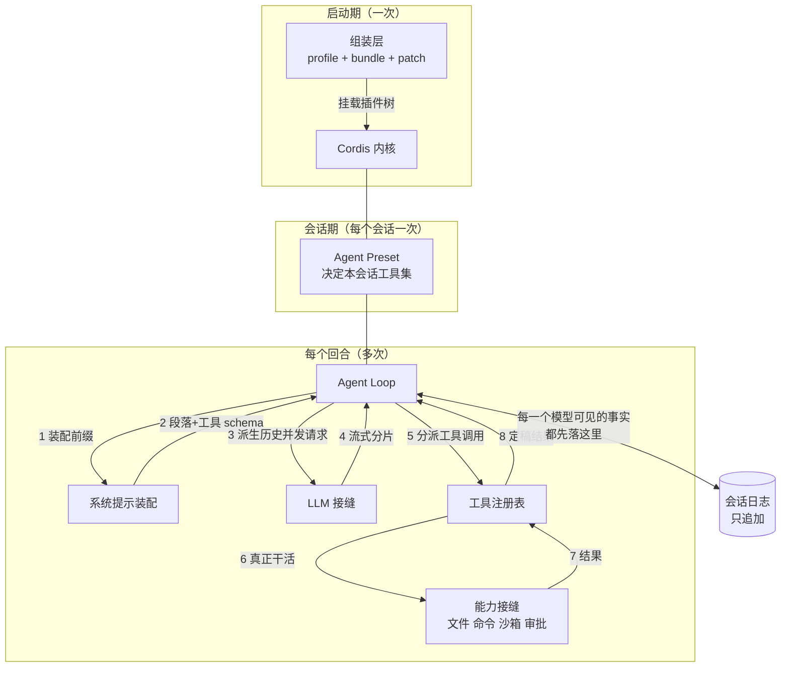

# 概念地图：八个概念、八个角色、一个运行示例

> 前两篇建立了问题和定义。这一篇一次性摊开整张地图：**八个核心概念**（按依赖顺序）、**八个关键角色**（各自的唯一职责）、**一张协作总览图**，以及贯穿全系列的**运行示例**的完整定义与 12 步浅层追踪。
>
> 读完这一篇，你应该能在白板上画出 DSH 的整体架构，并说出每个部件为什么存在——**哪怕你还不知道任何一个部件内部怎么实现**。后面八篇才逐个下潜。

---

## 缩写对照表

| 缩写 | 英文全称 | 中文 |
|---|---|---|
| DSH | DeepSeek Harness | 本系列主角 |
| LLM | Large Language Model | 大语言模型 |
| API | Application Programming Interface | 应用程序编程接口 |
| UI | User Interface | 用户界面 |
| YAML | YAML Ain't Markup Language | 一种配置文件格式 |
| JSON | JSON Object Notation | 一种数据交换格式 |
| HMR | Hot Module Replacement | 模块热替换 |
| KV Cache | Key-Value Cache | 键值缓存（推理侧的提示复用机制） |

---

## 一、领域映射：从问题到概念

一个设计良好的系统，会把问题域**映射**成它自己的一组概念。DSH 的映射如下（按依赖顺序，后面的概念依赖前面的）：

| 现实问题里的东西 | DSH 的概念 | 为什么要这个抽象 |
|---|---|---|
| "这个功能该由谁提供" | **插件（Plugin）与上下文（Context）** | 上下文是一个服务仓库；插件往里放服务、按名字（不是按导入路径）找服务——于是实现可以整个换掉 |
| "装上去的东西要能卸下来" | **可撤销效果（Effect）** | 注册提示词段落、工具、监听器都是"效果"，插件卸载时按相反顺序自动回滚 |
| "部件之间怎么说话" | **类型化事件（Typed Event）** | 四种派发语义（观察 / 环绕 / 并行 / 串行）区分"我只想看"和"我要拦" |
| "这台机器上到底跑着什么" | **Profile / Bundle / Patch** | 启动期的插件树 = 空列表叠上一层层配置补丁，可离线 dump 出来 |
| "这个会话能用哪些工具" | **Agent Preset 与 Scope（作用域）** | 会话期的组合。同一进程里不同会话可以有完全不同的工具集，靠作用域隔离 |
| "刚才到底发生了什么" | **会话日志（Session Log）** | 只追加的事件流，是唯一真相源；消息历史是从它**派生**的，不是另存的 |
| "一次'干活'的边界在哪" | **Turn（回合）与 Step（步骤）** | step = 一次模型请求 + 它引发的工具调用；turn = 零个或多个 step，直到不欠任何东西 |
| "这个能力能不能换个实现" | **能力接缝（Capability Seam）** | 一个接缝 = 服务定义 + 提供者 + 消费者三个角色；三者齐全才叫接缝 |

八个概念，一句话各自复述一遍：

1. **插件 / 上下文** —— 插件是实现 Service 的对象；上下文是按 `ctx.<key>` 索引的服务仓库。
2. **可撤销效果** —— 所有注册都返回一个 disposer，卸载即回滚。
3. **类型化事件** —— `emit` / `waterfall` / `parallel` / `serial`，派发模式是公开契约的一部分。
4. **Profile / Bundle / Patch** —— 启动组合：profile 列出 bundle，bundle 是一份配置补丁，用户补丁叠在最上面。
5. **Agent Preset / Scope** —— 会话组合：一份 `agent.cordis.yml`，每进程挂载一次，会话通过作用域父子链加入。
6. **会话日志** —— `SessionEvent` 的只追加数组；`deriveMessages()` 从它算出模型历史。
7. **Turn / Step** —— 循环的两级边界，都是**持久化的日志事件**而不是内存状态。
8. **能力接缝** —— 服务定义（抽象类）／提供者（实现）／消费者（通常是面向模型的工具）。

> ⚠️ 一个反直觉的点：**turn 和 step 是日志事件，不是变量。** 这不是实现细节，而是"模型可见即已记录"这条约束的必然结果——回合边界会影响模型看到什么，所以它必须可重建。

## 二、八个关键角色

每个角色一段身份说明：**拥有什么**（唯一职责）／**知道什么**（它持有的状态）／**刻意不做什么**（设计优雅之处往往在这一行）。这张表同时也是后面八篇深度篇的目录。

### 1. Cordis 内核 —— `第 4 篇`

- **拥有**：插件的挂载、依赖解析、卸载；服务注册表；事件派发；效果回滚。
- **知道**：当前这棵插件树长什么样、每个服务由谁提供、每个注册对应哪个 disposer。
- **刻意不做**：**任何业务**。它不知道什么是 agent、什么是工具、什么是模型。这正是"没有特权核心"的实现方式——内核对产品一无所知，所以产品的任何一块都可以换。

### 2. 组装层（app-boot / profile / bundle / agent-presets） —— `第 5 篇`

- **拥有**：决定"这次启动到底挂哪些插件、按什么顺序"，以及"这个会话用哪一份 agent 组合"。
- **知道**：`$DSH_HOME/profiles/<name>` 下的 profile 清单、各 bundle 的补丁文件、用户的 `cordis.patch.yml`、磁盘上有哪些 preset 及其健康状态。
- **刻意不做**：**不参与运行**。组合算法（`composeEntries`）用的是 include 插件自己的补丁算法，所以 `--dump-config` 打出来的树和真正 boot 的树**不可能漂移**。

### 3. 会话日志（`ctx.sessions`） —— `第 6 篇`

- **拥有**：只追加的 `SessionEvent` 日志，以及从它派生模型历史的投影函数。
- **知道**：这个会话从第一个字节到现在的全部事实——包括每一个原始流式分片。
- **刻意不做**：**不存消息历史**。历史是每次现算的（`deriveMessages()`）。少存一份，就少一个会和日志不一致的副本。它也不管持久化（那是隔壁 `persistence` 接缝的事）。

### 4. Agent Loop（`ctx.agents` / `ctx.agentLoop`） —— `第 7 篇`

- **拥有**：把"用户说了句话"变成"一个或多个模型请求 + 工具执行"的驱动过程；turn/step 边界；取消与错误恢复。
- **知道**：inbox 里还有什么没处理、当前 turn/step 编号、当前是 `idle` 还是 `running`。
- **刻意不做**：**不决定模型看见什么**（交给系统提示装配与 `agent/pre-step` 拦截器）、**不决定工具能不能跑**（交给工具管线）、**不知道怎么跟厂商说话**（交给 LLM 接缝）。它只管"下一步该发生什么"。

### 5. 系统提示装配（`ctx.systemPrompt`） —— `第 8 篇`

- **拥有**：把各插件注册的提示段落、动态上下文、工具 schema、变量，按序装配成一次请求的前缀。
- **知道**：谁注册了哪些段落、各自的 order、哪些是本作用域私有的。
- **刻意不做**：**不发请求**、**不缓存**。它每次装配都重新求值——因为段落文本可能依赖当前工作区、当前权限策略这些会变的东西。

### 6. LLM 接缝（`ctx.llm`） —— `第 9 篇`

- **拥有**：消息与流式分片的词汇表（`Message` / `ContentBlock` / `StreamChunk`）、适配器契约、路由与重试策略。
- **知道**：注册了哪些 provider、每条路由绑的是哪个适配器实例、这条路由的重试策略。
- **刻意不做**：**不管重试循环之外的恢复**（一次适配器调用 = 一次厂商尝试，agent 级恢复要另开一个持久化 turn）、**不管块重组**（`BlockAssembler` 统一处理，适配器只要吐出格式正确的分片）。

### 7. 工具注册表与执行管线（`ctx.tools`） —— `第 10 篇`

- **拥有**：工具定义的注册与作用域过滤；一次调用从"模型说要调"到"结果定稿"的五段管线；并发调度分类。
- **知道**：当前作用域可见哪些工具、每个工具是否并发安全、每次执行的身份与取消信号。
- **刻意不做**：**不自己做审批**（它只把 `ask` 决定转交给 `ctx.approval`）、**不把宿主字段泄漏给模型**（`schemas()` 用白名单，`timeoutMs`、`isConcurrencySafe` 这些永远不进请求）。

### 8. 能力接缝群（`ctx.fs` / `ctx.shell` / `ctx.sandbox` / `ctx.approval` / `ctx.subagents` …） —— `第 11 篇`

- **拥有**：真正跟外部世界打交道的能力：读写文件、跑命令、关进沙箱、问用户、派子代理。
- **知道**：各自的后端在哪（本机？远程？容器？）、当前策略是什么（只读？可写工作区？）。
- **刻意不做**：**不互相耦合**。文件与子进程共享同一个"执行世界"，所以把它们指向远程沙箱，Bash、PTY、LSP 会**一起**搬过去，不需要为每个消费者做一份分叉。

## 三、协作总览：这八个角色怎么把活干完



*这张图回答的问题：一句话请求是怎么在八个角色之间流转的。*

三条值得先记住的规律：

1. **日志在中间，不在末尾。** 它不是"事后记录"，而是循环每一步都要写、并且下一步要从它读回来的东西。模型历史是从日志算出来的。
2. **箭头 1–8 是一个 step。** 如果第 8 步之后工具还欠一次请求（模型需要看到工具结果再决定），就再走一遍 1–8，这是同一个 turn 的下一个 step。
3. **启动期、会话期、回合期是三个不同的时间尺度。** 混淆它们是理解这个项目最常见的障碍——第 5 篇专门讲这条分界线。

### 两个要先记住名字的非正常流程

- **审批流**：工具管线判定某次调用需要 `ask` → 转给 `ctx.approval` → UI 弹窗 → 三种结局（允许一次 / 拒绝 / 无人可问）。**没有答复者时的默认值是拒绝**（fail-closed）。细节见第 10、11 篇。
- **上下文超限与压缩**：请求前压力检测（`agent/pre-step`）或请求后溢出错误（`agent/request-error`）触发压缩，先剪枝工具结果、再做摘要，然后**另开一个新编号的 turn 重试**。细节见第 7 篇。

## 四、运行示例：完整定义

现在把贯穿全系列的示例钉死。

### 场景

你在自己的项目目录（假设是一个 Node 项目，有 `package.json` 和一个简陋的 `README.md`）里：

```sh
npx @deepseek-ai/dsh web
```

浏览器自动打开 `http://127.0.0.1:3080`。你在 **Settings → Models** 填入 DeepSeek API key 并保存（**不需要重启**，模型路由立刻可用）。点 **Choose workspace**，把当前项目目录加进去并选中。然后新建会话，preset 保持默认的**标准模式**，发出：

> **"读一下 package.json，给 README 补一个 Quick Start 小节，然后跑一次 `pnpm lint` 确认没问题。"**

一分钟后，界面上依次出现：一次 `read_file` 卡片、一次 README 的 diff 卡片、一个「是否允许执行 `pnpm lint`」的弹窗（你点了允许）、一次命令输出卡片、最后一段总结文字。

### 12 步浅层追踪

现在把这一分钟拆成 12 步。**每一步都只说"谁上场"，不说"里面怎么实现"**——那是后面八篇的事。粗体的是概念或角色第一次出场。

| # | 发生了什么 | 谁在台上 |
|---|---|---|
| 1 | `dsh web` 启动：**组装层**按 `web` **profile** 的 bundle 列表，从空列表叠出整棵**插件树**，交给 **Cordis 内核**挂载 | 组装层、内核 |
| 2 | 你新建会话：**Agent Preset**（标准模式）被挂载一次，你的 agent 通过**作用域**父子链加入；agent 与 **session** 共用同一个 id | 组装层、内核 |
| 3 | 你按下回车：消息进入 agent 的 **inbox**（`next-turn` 队列）并唤醒驱动；**Agent Loop** 写下 `turn/start` | Agent Loop、会话日志 |
| 4 | 驱动认领（claim）这条消息 → 跑 `agent/pre-step` 这个**拦截 waterfall**（压缩插件在这里看上下文压力）→ 写 `step/start` 和 `user/message` | Agent Loop |
| 5 | **系统提示装配**上场：收集所有提示段落、动态上下文、以及本作用域可见的工具 schema | 系统提示装配 |
| 6 | 从日志 `deriveMessages()` 派生出模型历史 → 经 `agent/request` 与 `llm/stream` 两层 waterfall → **LLM 接缝**选中 DeepSeek 适配器，发出 HTTP 请求 | LLM 接缝、会话日志 |
| 7 | 流回来了：每一个 `assistant/chunk` 都落日志；流结束后组装成一条 `assistant/message`（带 token 用量） | LLM 接缝、会话日志 |
| 8 | 模型要求调 `read_file(package.json)`：写 `tool/call` → **工具管线**五段跑完 → 写 `tool/result` | 工具注册表、能力接缝（文件） |
| 9 | 工具还欠一次请求 → **同一个 turn 的下一个 step**：模型这次要求编辑 README，走文件编辑工具，diff 被挂在 `tool/result` 的 `meta` 上 | Agent Loop、工具注册表、能力接缝 |
| 10 | 再下一个 step：模型要求跑 `pnpm lint`。管线的 `tools/pre-execute` 返回 **ask** → 转给**审批**接缝 → Web UI 弹窗 → 你点允许（`allowed-once`） | 工具注册表、能力接缝（审批） |
| 11 | 命令经 `ctx.shell` → **沙箱**把 argv 包一层（`workspace-write`：只能写工作区）→ `ctx.subprocess` 真正 spawn；输出回到 `tool/result` | 能力接缝（命令、沙箱） |
| 12 | 模型给出总结、不再调工具、inbox 也空了 → `agent/turn-stopping` 终止检查点 → `turn/end` → 状态回到 `idle` | Agent Loop、会话日志 |

### 这个示例覆盖了什么

| 角色 | 出现在第几步 |
|---|---|
| Cordis 内核 | 1、2 |
| 组装层 | 1、2 |
| 会话日志 | 3–12（几乎每一步） |
| Agent Loop | 3、4、9、12 |
| 系统提示装配 | 5 |
| LLM 接缝 | 6、7 |
| 工具注册表 | 8、9、10 |
| 能力接缝 | 8、10、11 |

八个角色全部上场。**这就是为什么选这个示例**：它足够小，三句话能说完；又足够肥，能把整张地图走一遍。

## ⚓ 回到示例

从下一篇开始，每一篇深度篇的结尾都会有一节 **⚓ 回到示例**，把当篇讲的内部机制接回上面这 12 步中的具体某几步。比如第 6 篇会告诉你第 3 步那条 `turn/start` 的完整载荷长什么样，第 10 篇会告诉你第 10 步的 `ask` 决定是怎么在五段管线里产生的。

建议现在就把这张 12 步表**折起来放在手边**——它是接下来九篇的坐标系。

---

**上一篇** ← [02 · DeepSeek Harness 是什么](02-what.zh.md)
**下一篇** → [04 · Cordis 内核：为什么"一切皆插件"不是口号](04-cordis.zh.md)
**回到** → [系列索引](index.md)
