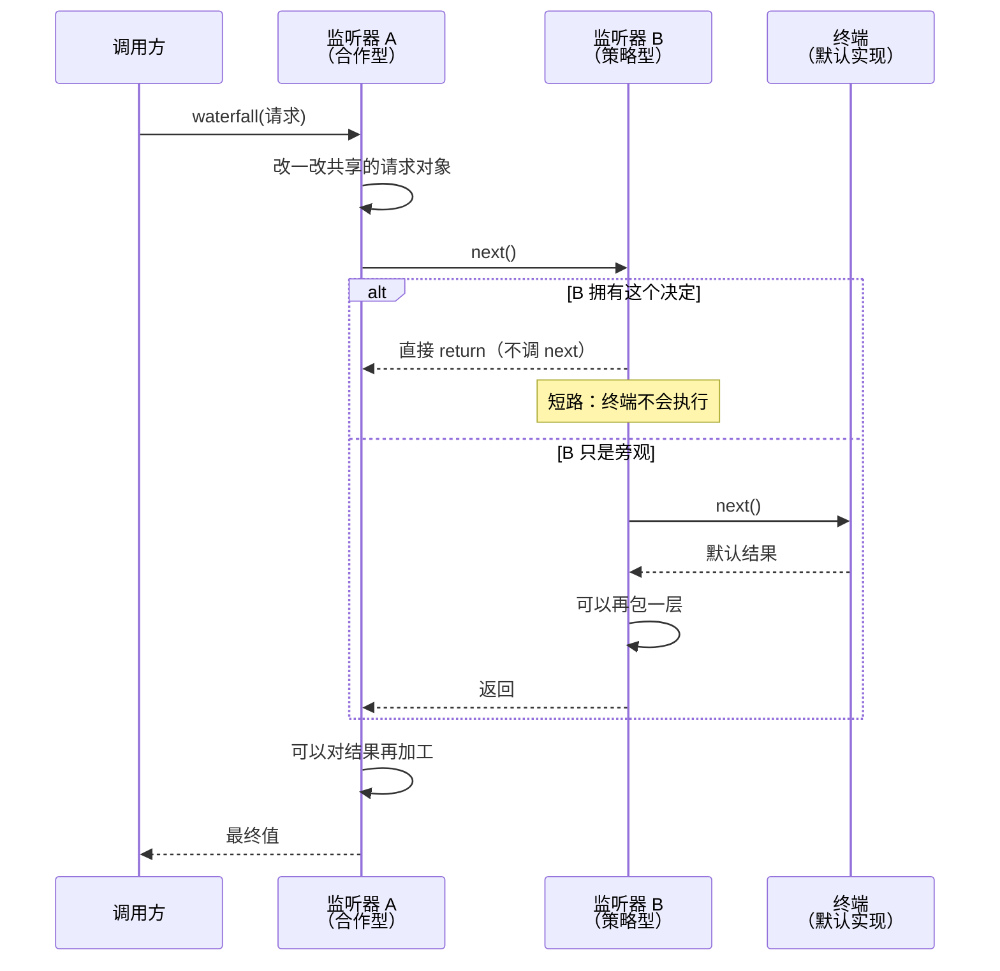

# Cordis 内核：为什么"一切皆插件"不是口号

> **你在哪**：第一个深度篇。运行示例的第 1–2 步（启动、建会话）由内核完成，但它其实无处不在——后面每一篇讲的每一个部件，都是挂在这棵树上的插件。
>
> **读完你会知道**：Cordis 用哪五个概念撑起整个内核、四种事件派发模式各自的语义、waterfall 的 `next()` 为什么是"环绕中间件"而不是"回调链"，以及"没有特权核心"这句话在代码层面的实际后果。

---

## 一、角色回顾

**拥有**：插件的挂载、依赖解析、卸载；服务注册表；事件派发；效果回滚。
**在示例中出场**：第 1 步（挂载整棵插件树）、第 2 步（挂载 preset 子树并接上作用域父子链），以及此后每一次跨部件调用——因为所有部件都是通过它找到彼此的。

一句话：**Cordis 是 DSH 底下那个对"agent"一无所知的框架。** 它是 DSH 从 [cordiverse/cordis](https://github.com/cordiverse/cordis) vendored（内联）进来的，设计出处是一篇叫 *A Programming Paradigm for Spatiotemporal Composability*（时空可组合性的一种编程范式）的论文。

## 二、五个概念

官方 primer 把 Cordis 压成五句话，逐句拆开看：

### 1. 插件就是实现了 Service 的对象

> "A plugin is an object that implements Service. It can be a function with optional `inject` and `apply(ctx)` fields, or a `Service` subclass whose lifecycle Cordis mounts into the current context."

两种写法：一个带 `apply(ctx)` 的函数，或者一个 `Service` 子类。没有第三种。没有"插件清单文件"，没有"注册中心"——**插件就是一个对象**。

### 2. 上下文是一个服务仓库

> "A context is a repository of services. A service claims a stable `ctx.<key>` such as `ctx.tools`, `ctx.llm`, or `ctx.sessions`."

这是整个架构的地基。别的插件**按 key 找服务，而不是 import 具体实现**：

```ts
// 消费者写的是这个
await ctx.tools.execute(input)

// 而不是这个
import { ToolRuntime } from '@deepseek-ai/dsh-tools'
```

一个字符串 key 就是一次间接寻址。**"可替换"这三个字的全部技术含量，就在这一层间接上。** 换掉 `ctx.tools` 的提供者，所有消费者一行都不用改。

回顾一下第 3 篇那张表，DSH 的核心 key：

| `ctx` key | 谁提供 | 干什么 |
|---|---|---|
| `ctx.sessions` | `core/session` | 会话日志 |
| `ctx.systemPrompt` | `core/system-prompt` | 提示装配 |
| `ctx.tools` | `core/tools` | 工具注册与执行 |
| `ctx.agents` | `core/agent` | agent 注册表与 `agent/*` 事件 |
| `ctx.agentLoop` | `core/agent-loop` | **默认驱动**（注意：是"默认"） |
| `ctx.llm` | `llm/llm` | 消息词汇表与适配器接缝 |

最值得盯着看的是最后两行之间的关系：`core/agent` 声明**接口**，`core/agent-loop` 提供**一个实现**。官方文档写得很直白：

> "Extension plugins depend on `agent` — including when they need the initiating Agent — and **never on `agent-loop` directly, so the loop stays swappable**."
> （扩展插件依赖 `agent`……而绝不直接依赖 `agent-loop`，所以循环保持可替换。）

**连循环都只是一个实现。** 这就是"一切皆插件"的最硬的那个证据。

### 3. 依赖靠 `inject` 声明，不靠启动顺序

> "A plugin that names required services waits until those services exist, so **load order is expressed through service requirements rather than manual boot sequencing**."

插件声明"我需要 `ctx.tools` 和 `ctx.llm`"，然后就等着。谁先谁后由依赖图算出来。

这条的实际价值在**热重载**时才显出来：卸载 `ctx.tools` 的提供者，所有 inject 了它的插件会先被停掉；换一个新的挂上去，它们再自己起来。第 5 篇会讲到 `cordis.patch.yml` 是被文件监听器盯着的——你改一行配置，对应的子树就地重组，进程不用重启。

### 4. 通信靠类型化事件

事件名通过 TypeScript 的**声明合并**（declaration merging）扩展，所以一个插件加的事件，对全仓库都是类型安全的。派发模式有四种，**并且模式是公开契约的一部分**——一个事件只能用它声明的那种方式派发：

| 模式 | 会 await 吗 | 顺序 | 有返回值吗 | 用来干什么 |
|---|---|---|---|---|
| `emit` | 否 | 注册顺序 | 无 | **通知**：我干了件事，你们看着办 |
| `waterfall` | 否 | 注册顺序 | **有** | **拦截**：你们可以改我手上这个东西 |
| `parallel` | 是 | 全部并发 | 无 | **扇出**：都去干，我等你们干完 |
| `serial` | 是 | 注册顺序 | 有 | **依次决策**：一个个来，谁先给答案算谁的 |

新事件要在 JSDoc 里写 `@mode` 标签，仓库有生成的目录检查"声明的模式"和"实际派发的方式"是否一致。

### 5. 注册是可撤销的效果

> "Prompt sections, tool schemas, adapters, providers, and listeners are installed through `ctx.effect()` or `ctx.on()` so reload and teardown unwind them predictably."

每一个注册都返回一个 disposer。插件卸载 → 它装过的所有东西按相反顺序回滚。文档里那条实践规则值得抄下来：

> "Every registration should have a disposer... If teardown order matters, keep the related work in one effect so disposal unwinds in the intended sequence."

## 三、Waterfall：这个项目最需要理解的一个机制

DSH 的所有关键拦截点——`agent/pre-step`、`system-prompt/assemble`、`llm/stream`、`tools/pre-execute`、`tools/execute`、`tools/post-execute`——**全是 waterfall**。理解它就理解了这个项目一半的扩展方式。

Cordis 的 waterfall 不是常见的"回调链"，而是 **around 中间件**（环绕式）：

> "A listener receives `(...args, next)`. **Call `next()` to delegate** the possibly wrapped result to the next service; **return without `next()` to short-circuit**. Values propagate through `next()`'s return value."



*这张图回答的问题：一个 waterfall 监听器怎么做到"改请求""改结果""直接接管"三件事。*

两种典型写法，官方文档明确区分：

- **合作型**（cooperative）：改一改共享的请求/决策对象，然后 `next()` 委托下去。绝大多数监听器是这种。
- **策略型**（single-decision）：这个事件本来就是问一个问题（"这次工具调用放不放行？"），谁有答案谁直接 return，不调 `next()`。**短路是设计，不是滥用**。

还有一条纪律：**只观察、不决策的监听器必须 `next()`**。忘了调，就等于悄悄接管了整条链。

`prepend: true` 只在"必须比普通注册更早跑"时用——这是个逃生舱，不是常规手段。

## 四、"没有特权核心"的实际后果

把前面几节合起来，得到一句在架构文档里出现的话：

> "**There is no privileged core to patch**: you extend dsh by mounting a plugin beside the others, and registrations are effects that unwind when their plugin unloads."

具体后果有三条：

**其一，扩展的方式是"并排挂一个"，不是"改一个"。** 传统插件系统里，你能做的事被"宿主留了什么口子"限定死。这里没有宿主——想改循环行为，要么监听它的 waterfall，要么写一个新的 driver 顶掉 `ctx.agentLoop`。

**其二，配置就是架构。** 一份 YAML 决定了这个进程里存在哪些服务、谁提供、谁消费。这也意味着**读一个 DSH 部署，要从读它的配置树开始**（第 5 篇）。

**其三，卸载必须和挂载一样可靠。** 因为热重载是常态：改配置文件 → 子树重组 → 旧插件的所有注册回滚。任何忘了写 disposer 的注册，都会变成一个"卸载了却还在"的幽灵——所以 `ctx.effect()` 不是可选风格，是硬要求。

### 一个必须知道的配置侧细节

Loader 支持 `!!js` 表达式节点——配置里可以写 JavaScript：

```yaml
- id: persistent-bash
  name: '@deepseek-ai/dsh-tool-bash-persistent'
  disabled: !!js process.platform === 'win32'
```

这是 `minimal` preset 里的真实配置。`config` 字段在**插件依赖激活后**求值一次，`disabled` 字段在**每一次挂载决策时**求值。所以"这一行在 Windows 上不挂载"是配置本身能表达的事，不需要代码里写 if。

## 五、失败行为

| 出什么事 | 内核怎么办 |
|---|---|
| 某插件 import 失败 | Loader settle 时以"失败的 entry + 阶段"拒绝；`boot()` 释放半成品上下文并带上 bin 名包一层错误 |
| 某 entry 启用了却没有 fiber（依赖没齐） | `assertEntriesLoaded` 抛错，**列出每一个未解析的插件名** |
| 某 entry 挂上了但激活失败 | `assertEntriesActivated` 等到它失败，把**原始调用栈**带进启动失败信息；对还挂着的 entry 报出它缺哪些服务 |
| 用户改配置文件改错了 | HMR 保留上一棵好树继续跑，广播 `hmr/config-update-failed` |
| 启动过程中某个界面已经占住了终端 | boot 失败时先跑那棵树自己的 teardown（恢复终端 raw mode 等），再打印错误退出 |

最后一条特别能说明这个项目的成熟度：**它认真处理了"启动到一半失败，但终端已经被改过设置"这种事**。

## ⚓ 回到示例

**第 1 步**（`dsh web` 启动）在内核这一层的完整含义：

1. `boot()` 建立根上下文，装上 Loader；
2. 组装层算出一份 entry 列表（第 5 篇），交给 `cordis:include` 挂载；
3. Loader **并发**挂载这些 entry——所以"顺序"是靠 `inject` 声明的依赖算出来的，不是配置文件里的行序；
4. 等整棵树 settle，然后 `assertEntriesLoaded` + `assertEntriesActivated` 两道审计；任何一个插件没起来，启动就失败并且**告诉你是哪个、缺什么**；
5. 返回根上下文，Web 服务器插件此时已经在 `127.0.0.1:3080` 上了。

**第 2 步**（新建会话）：`agent-presets` 服务把标准模式那份 `agent.cordis.yml` 挂成一棵**子树**（每进程只挂一次），然后把你这个 agent 的作用域 key **parent 到**这棵子树的作用域上。于是：

- 这份 preset 注册的工具、提示段落，在你的 agent 上可见；
- 另一个会话如果用的是极简模式，它 parent 到另一棵子树，**两边互相看不见**；
- 名字解析是"最近的赢"（shadowing）：agent 层 → preset 层 → 全局层。

这就是为什么同一个进程里可以跑着工具集完全不同的会话——**作用域父子链 + 服务 key 间接寻址**，两个机制合起来的效果。

---

**上一篇** ← [03 · 概念地图](03-concept-map.zh.md)
**下一篇** → [05 · 组装层：Profile、Bundle、Patch 与 Agent Preset](05-composition.zh.md)
**回到** → [系列索引](index.md)
