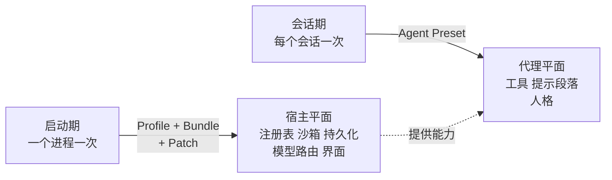
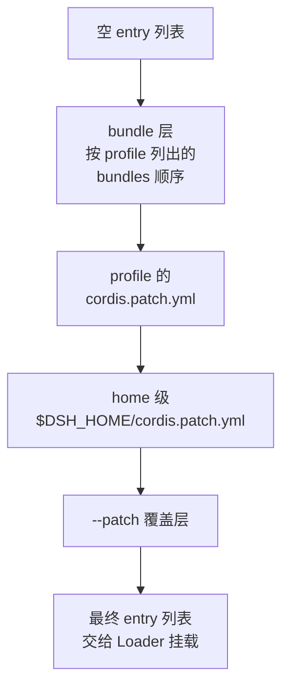
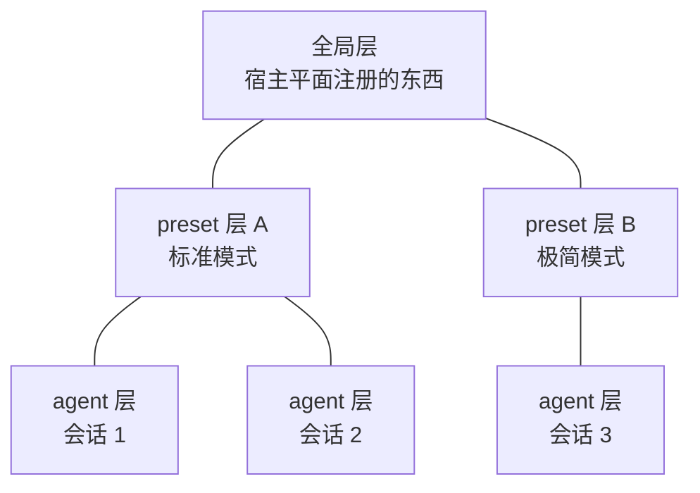

# 组装层：Profile、Bundle、Patch 与 Agent Preset

> **你在哪**：运行示例的第 1–2 步。第 4 篇讲了内核"怎么挂"，这一篇讲**"挂什么"是谁决定的**。
>
> **读完你会知道**：一棵插件树是怎么从空列表叠出来的、`dsh --dump-config` 为什么是这个项目最该先跑的命令、**宿主平面与代理平面**这条分界线，以及一个 preset 为什么必须待在带 `isolate` 的 group 里。

---

## 缩写对照表

| 缩写 | 英文全称 | 中文 |
|---|---|---|
| YAML | YAML Ain't Markup Language | 一种配置文件格式 |
| CLI | Command Line Interface | 命令行界面 |
| HMR | Hot Module Replacement | 模块热替换 |
| npm / pnpm | Node Package Manager / performant npm | Node 包管理器 |
| ACL | Access Control List | 访问控制列表 |
| PTY | Pseudo Terminal | 伪终端 |

---

## 一、角色回顾

**拥有**：决定"这次启动挂哪些插件、按什么顺序"（启动期），以及"这个会话用哪一份 agent 组合"（会话期）。
**在示例中出场**：第 1 步（`dsh web` 组装启动树）、第 2 步（挂载标准模式 preset）。

关键在于**两个时间尺度**：



*这张图回答的问题：为什么同一个 DSH 进程里，一部分东西全局只有一份，另一部分每个会话各有一套。*

## 二、启动期：四层补丁叠出一棵树

### 三个名词

| 名词 | 是什么 | 存在哪 |
|---|---|---|
| **Profile（配置档）** | 一个具名组合。列出它要叠哪些 bundle，装着它自己安装的外部插件，还有用户自己的 `cordis.patch.yml` | `$DSH_HOME/profiles/<name>/`（`$DSH_HOME` 默认 `~/.dsh`） |
| **Bundle（捆绑包）** | 一份"配置行 + 它挂载的代码"的分发格式。它插进来的东西，**仍然能被上层补丁改** | npm 包，`package.json` 里声明 `"dsh": { "bundle": { "patch": "./cordis.patch.yml" } }` |
| **Patch（补丁）** | 按 id 定位某一行，**整体替换**它的 `config`，或者 `insert` 新行 | bundle 里一份、profile 里一份、home 里一份、命令行 `--patch` 再叠一层 |

出厂的 profile 模板有两个：`web` 和 `headless`（首次使用自动初始化）。出厂的 bundle 有三个：

- **`dsh-base`** —— 每个 profile 的第一层：模型适配器、工具、持久化、沙箱与审批策略、设置、凭据、遥测。
- **`dsh-web-app`** —— 加上浏览器应用（Web 服务器、客户端运行时、UI 主题、会话查询缓存等）。
- **`dsh-headless`** —— 加上一个一次性运行器，**完全没有服务器**。

### 叠加顺序



注意 home 级补丁**排在 profile 补丁之后**，也就是说 home 的优先级更高——一台机器上的全局偏好可以压过单个 profile。

### 这个设计里最讲究的一点

组合算法用的是 include 插件**自己的**补丁算法（`entryListSchema` / `applyEntryPatches`）。这意味着：

```sh
dsh --profile web --dump-config
```

打出来的树，**和真正 boot 的树在算法层面不可能漂移**——它们跑的是同一段代码。文档里那句话值得记住：

> "To see the tree your machine actually boots: `dsh --profile web --dump-config`. **Any row it prints can be replaced by a patch of your own.**"

**这是读懂任何一个 DSH 部署的入口。** 不要去猜"我这个环境里有没有装 X"，dump 一下就知道了。输出还很贴心：每一段连续的、来自同一个源文件和同一组补丁层的行，前面会有一行 `# ==` 注释标明出处，而整份输出仍然是一个可加载的 YAML 文档。

### 一个真实的行长什么样

`minimal` preset 里的一段（`!!js` 表达式见第 4 篇）：

```yaml
- id: persistent-bash
  name: '@deepseek-ai/dsh-tool-bash-persistent'
  disabled: !!js process.platform === 'win32'
  config:
    timeoutMs: 300000
    description: |-
      Run commands in a bash shell
      * State is persistent across command calls and discussions with the user.
      ...
```

四个字段就是全部：`id`（补丁靶心）、`name`（插件包名）、`disabled`（挂不挂）、`config`（配置）。**连给模型看的工具描述文本都在配置里**——想改工具的提示词，不用改代码。

### 补丁的一个坑

> "A user patch **replaces the whole matched config** — an id-targeted patch does not deep-merge, so a profile override restates the bundle fields it keeps."

按 id 打补丁是**整体替换 config**，没有深合并。所以你想只改 `timeoutMs`，得把这一行原本的其他 config 字段**全部重抄一遍**。这是个刻意的取舍（没有合并语义就没有合并歧义），但抄漏了就会静默丢配置。

## 三、宿主平面 vs 代理平面

这是理解 DSH 组合模型的关键分界线，`agent.cordis.yml` 的注释里写得非常清楚：

> "This file is an AGENT-PLANE composition... The host composition (`base.cordis.yml` + `web.cordis.yml`) keeps everything a preset must not own: **the registries themselves, the sandbox and approval stack, persistence, and the model route.**"

| | 宿主平面（Host plane） | 代理平面（Agent plane） |
|---|---|---|
| 谁定义 | profile + bundle | agent preset |
| 什么时候组装 | 进程启动时，一次 | 会话创建时（每进程每 preset 挂一次） |
| 装的是什么 | **注册表本身**、沙箱、审批、持久化、模型路由、界面 | **工具**、提示段落、人格 |
| 例子 | `ctx.tools` 这个服务、`ctx.sandbox`、`session-persistence-jsonl` | `tool-bash`、`tool-fs`、`persona` |

一句话记法：**宿主平面提供"能力和规则"，代理平面决定"这个会话能用哪些"。**

为什么必须分开？因为审批和沙箱**不能由 preset 拥有**——否则一个 preset 就能把自己的沙箱关掉。安全策略必须在会话组合之外。

### `isolate` 这条硬规则

preset 文件的注释里有一条强制要求：

> "A service row here **MUST** sit inside a group carrying an `isolate` realm. Without one it publishes into the root realm, where it is process-global — another preset publishing the same name collides, and a host reader would resolve one preset's instance for every session; `dsh-agent-presets` **rejects that at mount**."

翻译：preset 里如果要挂**服务**（不只是工具），必须包在一个带 `isolate` 的 `cordis:group` 里，否则这个服务会发布到根 realm，变成进程全局的——第二个会话挂同一个 preset 就撞名。`isolate: true` 表示"entry 私有的 realm"，即本次挂载自己的实例。

`minimal` preset 里的实际写法：

```yaml
- id: persistent-shell
  name: cordis:group
  group: true
  isolate:
    terminals: true          # 这个 group 私有一份 ctx.terminals
  config:
    - id: pty
      name: '@deepseek-ai/dsh-terminal'
    - id: persistent-bash
      name: '@deepseek-ai/dsh-tool-bash-persistent'
```

## 四、Agent Preset：会话级组合

### 挂载模型

一个 preset 是一个目录，里面有一份 `agent.cordis.yml`（组合）和可选的 `preset.yml`（显示名与描述）。挂载语义是这样的：

> "The roster mounts it **ONCE per process** under a standing scope, and each session that names it **joins by having its agent scope key parented to the mount's**."

即：**一次挂载，多个会话共用**。工具和提示段落只存在一份，覆盖每一个加入的 agent；插件内部按 Session/Agent 给自己的状态分键，所以会话之间仍然是隔开的。

解析顺序是"最近的赢"：`agent → preset → global`。



*这张图回答的问题：三个会话共用一个进程，为什么会话 3 看不见标准模式的工具。*

### 出厂的四个 preset

| 目录 | `preset.yml` 里的名字 | 关键差异 |
|---|---|---|
| `standard` | 标准模式 | 全套：bash/pwsh、fs、fs-search、jobs、skill、goal、plan-mode、compaction、subagent（含 codex / claude-code）、workflow、ralph、ask-user、todo、web |
| `code` | PTC 模式 | 同上，但工具以 SDK 形式呈现，模型写 TypeScript 程序调用 |
| `minimal` | 极简模式 | **只有两个工具**，人格 `complete: true` + `includeRuntimeContext: false` |
| `cordis` | 创造模式 | 标准模式 + 运行时检查 + 插件实验 + preset 创作指导 |

标准模式的人格行，可以看到变量插值：

```yaml
- id: persona
  name: '@deepseek-ai/dsh-persona'
  config:
    text: >-
      You are a coding agent powered by the {{model}} model.
      Your working directory is {{cwd}}.
```

`{{model}}` 和 `{{cwd}}` 在装配时从 agent 自己的路由和工作区解析（第 8 篇讲变量机制）。

### 创作与切换

- **创作只能靠复制**（`copy()`）：整目录拷贝一个已有 preset 到用户根目录下，然后改文件。没有任何组合文本跨越这个接缝——所以复制品和原件一样可加载。复制时会丢掉源的 `name` 和 roster `order`（否则新旧两个 preset 在列表里无法区分），保留 description 供你改。
- **切换只能在"还没产出任何东西"的空会话上做**（`recompose()`）。这是产品规则不是技术限制：中途换工具集，会留下"新组合根本没有这些工具"的历史工具调用。网关在协议层拒绝，回 `agent-preset-locked`。
- **切换是一条会话事件**（`agent-preset/selected`），不是改 header。因为 preset 决定模型看见哪些工具 schema 和提示段落——按"模型可见即已记录"的规矩（第 6 篇），它必须能从日志重建。

### 子代理怎么组合

子 agent 通过 `composeFrom()` **绑定到父的那次挂载**，而不是按 id 重新挂一次。两个理由都很实在：

1. 父启动之后组合文件被改过 → 重新挂会给孩子一个**不同的世代**；
2. 组合文件被删了 → 重新挂会让孩子直接失败，而父还在正常跑。

而且绑定是**同步的**，这正是进程内子代理驱动能在同步创建窗口里用它的原因。

## 五、失败行为

| 出什么事 | 怎么办 |
|---|---|
| preset 目录的组合文件缺失或加载不了 | 仍然**列出来**并标 `broken` + 原因（跳过的话，这个 id 还占着磁盘却没人看得见，你连删都不知道删什么） |
| preset 目录名不合 `[a-z0-9][a-z0-9-]*` | 直接跳过——没有任何副本能占用这个 id |
| 补丁指向一个不存在的 entry id | 打一行 stderr 警告（不是致命错） |
| `cordis.patch.yml` 是空文件或只有注释 | **抛错**（它解析出来是"什么都不是"，而不是"空列表"）。想禁用这一层要写 `[]` |
| 用户改配置改错了 | HMR 保住上一棵好树，广播 `hmr/config-update-failed` |
| 会话运行中，preset 文件被改了 | 已加入的会话**继续跑它加入的那一代**；新会话开下一代（用 mtime + size 做世代戳） |

最后一条是很好的工程判断：**一个正在跑的会话，其组合应该比它的源文件活得久。**

## ⚓ 回到示例

**第 1 步**的完整展开：

```sh
npx @deepseek-ai/dsh web        # 等价于 dsh --profile web
```

1. `$DSH_HOME/profiles/web/` 不存在 → 从模板自动初始化；
2. 读 `package.json` 里的 `dsh.profile.bundles` = `[dsh-base, dsh-web-app]`；
3. 从空列表开始叠：`dsh-base` 的补丁插入约 70 行（`llm`、`session`、`agent`、`sandbox`、`approval`、`tool-bash`、`tool-fs`、`subagent`……），然后 `dsh-web-app` 的补丁插入 Web 侧的行（`webserver`、`api-gateway`、`client-runtime`、`ui-theme`……）并**按 id 覆盖**若干基础行；
4. 叠 profile 补丁、home 补丁（你要是没写过，这两层是空的）；
5. 交给 Loader 挂载 → Web 服务器起在 `127.0.0.1:3080`。

**第 2 步**：你新建会话，preset 默认是 `standard`。`agent-presets` 服务：

1. 在 agent 工厂的 `setup(agentCtx)` 钩子里被调用——**这是唯一支持的调用点**，因为只有这里 agent 还没发布，组合失败可以整体回滚；
2. 确保标准模式那棵子树已挂载（single-flight，本进程第一个会话挂，后面的复用）；
3. 把你 agent 的作用域 key parent 到这棵子树；
4. 从此，标准模式注册的 `bash`、`str_replace_editor`、`read_file`、`subagent`…… 对你这个会话可见。

**你的示例句子会用到的三个工具（读文件、编辑、跑命令），全部来自这一步挂上去的 preset。** 如果你当时选的是极简模式，第 8 步的 `read_file` 就根本不存在——模型只能用 bash 里的 `cat`。

---

**上一篇** ← [04 · Cordis 内核](04-cordis.zh.md)
**下一篇** → [06 · 会话日志：唯一真相源](06-session-log.zh.md)
**回到** → [系列索引](index.md)
