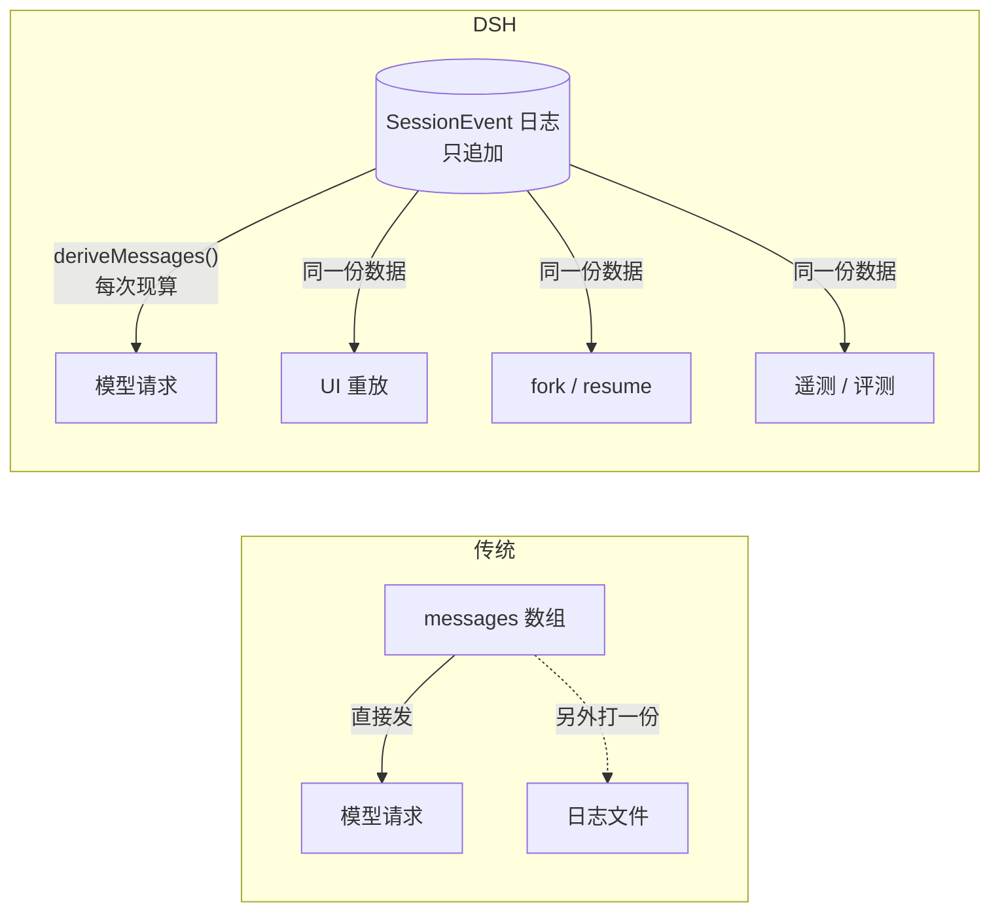
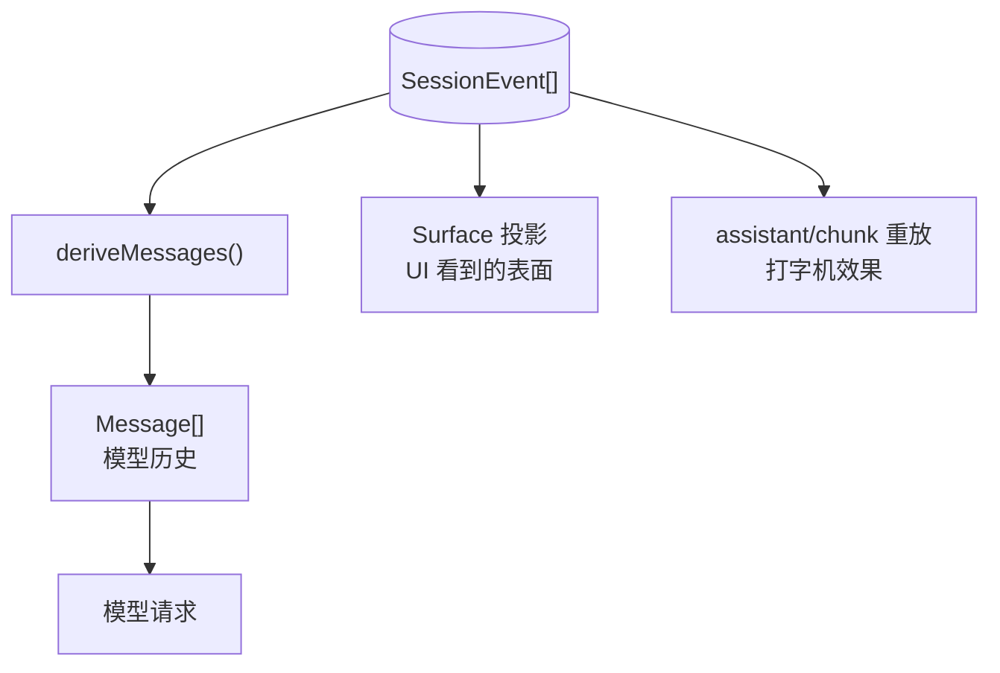

# 会话日志：唯一真相源，以及"模型可见即已记录"

> **你在哪**：运行示例第 3–12 步几乎每一步都在写它。这是 DSH 里唯一一个"所有人都要打交道"的部件。
>
> **读完你会知道**：`SessionEvent` 事件表逐条是什么、为什么消息历史是**派生**的而不是存下来的、为什么连原始流式分片都要落盘，以及那条把整个架构钉住的不变量：**模型可见即已记录**。

---

## 一、角色回顾

**拥有**：只追加的 `SessionEvent` 日志，以及从它派生模型历史的投影函数。
**在示例中出场**：第 3 步 `turn/start`、第 4 步 `step/start` + `user/message`、第 7 步 `assistant/chunk*` + `assistant/message`、第 8/9/11 步 `tool/call` + `tool/result`、第 12 步 `turn/end`。

官方定义：

> "A `Session` is an **append-only log** of typed `SessionEvent`s — the single source of truth for an agent's whole interaction history. **The LLM message history is derived from the log, never stored separately**; replay is re-derivation from the same events."

## 二、为什么是事件溯源

先说清楚它替代了什么。朴素做法是维护一个 `messages: Message[]` 数组，每轮往后 push。问题在于：

| 你想做的事 | 数组做法的困难 |
|---|---|
| 重放 UI（包括打字机效果） | 数组里只有最终文本，流式分片早丢了 |
| 从历史某点分叉一条新会话 | 得深拷贝并小心处理引用 |
| 上下文压缩后还能看到原文 | 压缩改写了数组，原文没了 |
| 复盘"模型当时到底看见了什么" | 数组是**结果**，不是**过程**：注入的上下文、被裁剪的部分、系统提示的当时版本，全不在里面 |
| 崩溃恢复 | 得决定什么时候 flush 整个数组 |

事件溯源把这些变成同一件事的自然结果：**日志是过程，历史是从过程算出来的结果。**



*这张图回答的问题：为什么"日志"在 DSH 里不是旁路，而是主干道。*

## 三、事件表逐条读

`SessionEventMap` 是**可合并扩展**的——插件用 TypeScript 声明合并加自己的事件类型（比如压缩接缝加 `compaction/start` / `compaction/summary` / `compaction/end`，钩子协议加 `hook/invoked` / `hook/result`）。核心这些：

### 边界事件

| 事件 | 载荷 | 说明 |
|---|---|---|
| `turn/start` | `{ turn }` | 在**认领输入之前**就开了。所以一个被拒绝的、什么都没干的 turn，日志里也有记录 |
| `turn/end` | `{ turn, reason }` | 带结束原因 |
| `step/start` | `{ turn, step }` | 一次模型请求 + 它引发的工具执行 |
| `step/end` | `{ turn, step }` | |

一个反直觉但很重要的细节：**turn 可以有零个 step**。

> "Rejection, empty input, cancellation, or failure may close it with no step."

这不是 bug，是刻意的：**日志要记录"尝试过"这件事**，哪怕这次尝试被拦截器一票否决。

### 内容事件

| 事件 | 载荷 | 说明 |
|---|---|---|
| `user/message` | `UserMessage` | 三种来源共用一个事件：**人类直接输入**、`agent.inject()` 的**合成上下文**（文件变更通知、子目录的 AGENTS.md、skill 内容、cron 通知……）、**目标续跑轮次**。三者的 `content` 都原样投影，靠 `source` 区分 |
| `assistant/chunk` | `{ turn, step, chunk }` | **原始流式分片**，token 级重放保真 |
| `assistant/message` | `{ turn, step, message, usage?, interrupted? }` | 一个 step 组装好的助手消息，**派生历史用的是这条**。带 token 用量——模型输出和它的计量一起走，没有单独的 usage 记录 |
| `tool/call` | `{ turn, step, callId, name, arguments }` | `arguments` 是**模型原样产出的 JSON 字符串，未解析** |
| `tool/result` | `{ turn, step, message, error?, meta? }` | `meta` 是工具私有的呈现载荷，核心不理解它的形状，但**必须可 JSON 序列化**（`append` 会用 `isJsonValue` 运行时校验） |

`assistant/message` 有两处设计值得停一下：

- **中途取消**会把已交付的文本/推理前缀定稿成这条事件，并标 `interrupted: true`，未派发的工具调用则不出现。所以"这次被打断了"是一个**显式标记**，而不是靠回合边界反推出来的。
- **空内容也记**。派生历史会跳过空内容，但持久事件保留了 usage 和 `sourceEventSeqs`（精确列出是哪些 `assistant/chunk` 组成的，哪怕是空列表）。

### 日志专用事件（不进派生历史）

| 事件 | 干什么 |
|---|---|
| `todo/write` | 整份 todo 列表快照，重放时后写覆盖先写 |
| `request/header` | 下一次请求的**完整头部**，在这个 step 内、派发之前追加。只用于重建，不进历史 |
| `request/context` | 路由与容量元数据，**只在变化时**记 |
| `session/end-seed` | 标记"构造种子"结束：在它之前的事件来自 resume / fork / replay，本次生命周期一个都没产生 |

`request/header` 这条特别值得注意：**系统提示的当时版本是被记下来的**。这就是"每次运行都可追溯"落到实处的地方——你能重建"第 3 个 step 那一刻，模型看到的前缀一字不差是什么"。

## 四、那条不变量：模型可见即已记录

架构文档里的原话：

> "**Model-visible means logged.** Anything that reaches a model request must be reconstructable from the log, and **a runtime invariant asserts it**. This is why a new model-visible input requires a new session event: extend `SessionEventMap` and render from the log."

三层含义：

1. **对插件作者是硬约束。** 你想给模型加一句话？不能在组装请求时偷偷塞进去。要么注册成提示段落（会进 `request/header`），要么走 `agent.inject()`（会成为一条 `user/message`）。
2. **它被运行时断言。** 不是文档里的君子协定，是有代码在查。
3. **它解释了很多看起来啰嗦的设计。** 比如为什么 preset 切换要发一条会话事件（第 5 篇）——因为 preset 决定工具 schema，而工具 schema 是模型可见的。

## 五、派生：日志怎么变成模型历史



关键点：

- **`deriveMessages()` 每次现算。** 没有缓存的历史副本，就没有"缓存和日志不一致"这种 bug。
- **Surface（表面）是另一套投影。** 日志里有一部分事件是"会产生消息的"（`SurfaceEventType`），另一些（如 `compaction/*`、`hook/*`）不是——它们没有 `surfaceOp`，因此不进表面也不进派生历史。
- **压缩是"表面替换"，不是删日志。** 压缩产生一次 `SurfaceFoldReplacement`：表面被替换成摘要，但**原始事件一条没少**。所以复盘时你还能看见被摘要掉的原文。

## 六、持久化是隔壁的接缝

日志本身是内存中的事件序列；**怎么变持久是另一个可替换的接缝**（`persistence`，出厂实现是 `session-persistence-jsonl`，即一行一个 JSON 事件）。

这个分离带来一条有意思的规则：

> "The loop **does not await a flush at turn boundaries**: `dsh-session-checkpoint-policy` owns the per-request durability checkpoint, and consumers that read storage after `whenIdle()` flush themselves."

即：**循环不在回合边界等落盘**。落盘节奏由一个独立的检查点策略插件决定（想改成"每个 step 都 fsync"或者"内存里跑完再落"，换那个插件就行）。

序列号是**连续的**（包括原始分片在内），持久化层可以逐字节原样存下这份规范日志。

## 七、失败行为

| 出什么事 | 怎么办 |
|---|---|
| 某工具往 `meta` 里塞了不可序列化的东西 | `Session.append` 的 `isJsonValue` 运行时校验**在源头拒绝**——所以重放时一定能还原出一模一样的卡片 |
| 某插件想给模型加信息但没落日志 | 运行时不变量断言失败 |
| turn 被拦截器拒绝了 | `turn/start` + `turn/end` 照写，中间没有 step。日志记录了"发生过一次尝试" |
| 流到一半被取消 | 已交付的前缀定稿为 `assistant/message` 并标 `interrupted: true`；完全没内容则连这条都没有 |
| `turn/end` 落盘失败 | 实时报错，但**不阻止后续工作**（成功才提交这个 turn） |
| 从一条持久化会话恢复 | 找**最后一条** `session/end-seed`：在它之前的都是种子历史。已经以它结尾的种子不会被重复标记，所以反复打开一个没动过的会话不会让日志变长 |

## ⚓ 回到示例

把第 3–12 步的日志摊开，你会看到大致这样一串（`seq` 是连续序号）：

```
seq 1   turn/start        { turn: 1 }
seq 2   step/start        { turn: 1, step: 1 }
seq 3   user/message      "读一下 package.json，给 README 补一个 Quick Start…"
seq 4   request/header    { header: <完整系统提示 + 工具 schema>, reason: ... }
seq 5   assistant/chunk   { chunk: block-start(text) }
seq 6   assistant/chunk   { chunk: text-delta "我先" }
...                        （几十上百条原始分片）
seq 41  assistant/message { message: <文本 + 一个 tool_use>, usage: {...} }
seq 42  tool/call         { callId: 'c1', name: 'read_file',
                            arguments: '{"path":"package.json"}' }   ← 原样字符串
seq 43  tool/result       { callId: 'c1', message: <文件内容> }
seq 44  step/end          { turn: 1, step: 1 }
seq 45  step/start        { turn: 1, step: 2 }        ← 同一个 turn 的第二步
...
seq 78  tool/result       { callId: 'c2', message: <编辑成功>,
                            meta: { diff: '...' } }   ← README 的 diff 挂在这
...
seq 96  tool/call         { callId: 'c3', name: 'bash',
                            arguments: '{"command":"pnpm lint"}' }
seq 97  tool/result       { callId: 'c3', message: <lint 输出> }
seq 99  step/end          { turn: 1, step: 3 }
seq 100 turn/end          { turn: 1, reason: {...} }
```

三个观察：

1. **一个 turn，三个 step。** 因为工具每次都"欠一次请求"——模型要看到结果才能决定下一步。第 7 篇会讲这个判定。
2. **`seq 4` 那条 `request/header` 让这次运行可复现。** 你能拿它重建"第一次请求时模型看到的完整前缀"。
3. **`seq 78` 的 `meta`** 就是 UI 上那张 diff 卡片的数据来源。因为它在日志里，所以**关掉浏览器再打开，卡片一模一样**——重放不是"再渲染一次"，是"从同一份事实再投影一次"。

而第 10 步那次审批弹窗呢？审批有自己的一对**日志专用**审计事件（`approval/asked` / `approval/decided`），策略变更则是 `approval/policy`。它们不进派生历史（模型不需要知道你点了什么），但复盘时它们在。

---

**上一篇** ← [05 · 组装层](05-composition.zh.md)
**下一篇** → [07 · Agent Loop：一个 turn 到底发生了什么](07-agent-loop.zh.md)
**回到** → [系列索引](index.md)
