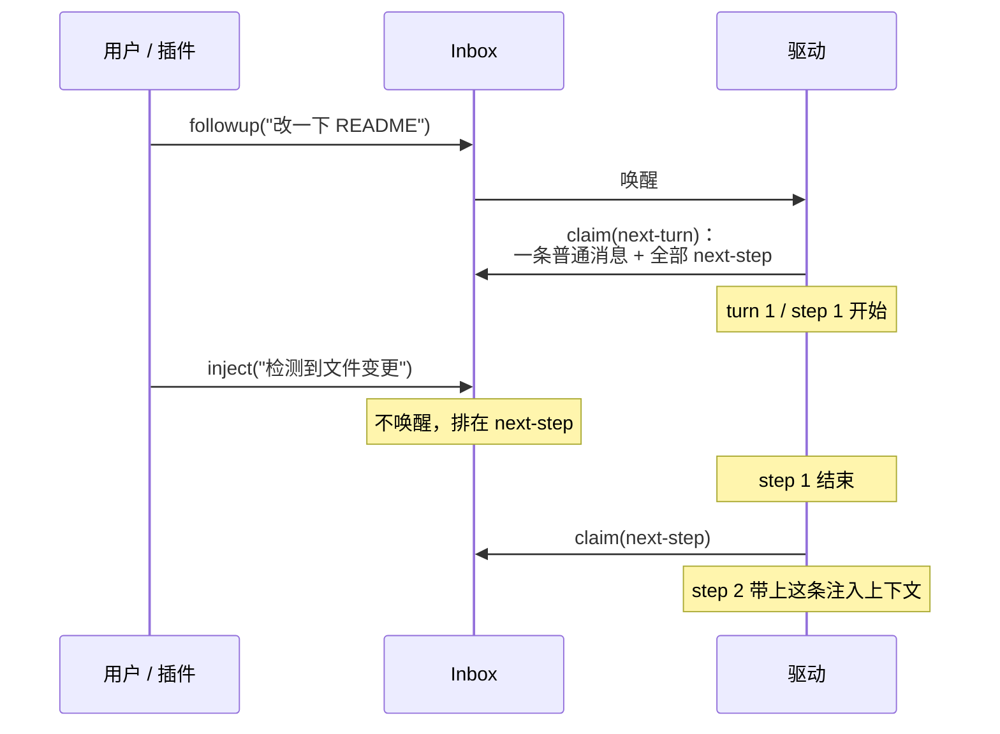
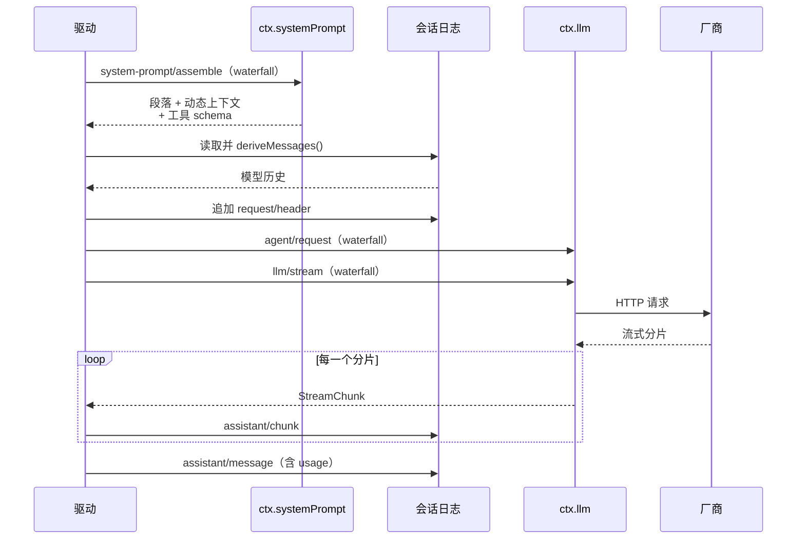
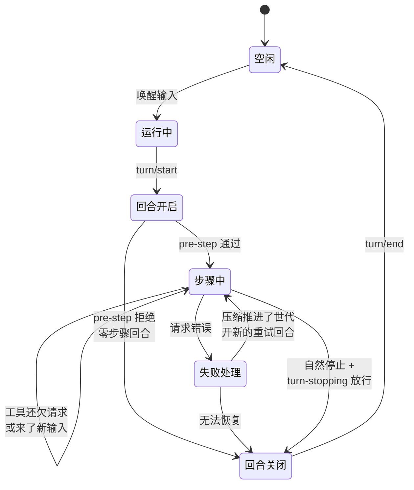

# Agent Loop：一个 turn 到底发生了什么

> **你在哪**：运行示例的第 3、4、9、12 步——也就是"驱动"本身。这是整个系列最长的一篇。
>
> **读完你会知道**：turn 与 step 的精确定义、inbox 两条队列与 `followup`/`steer`/`inject` 的区别、`agent/pre-step` 这个"决定模型看见什么"的拦截点、工具调用的并发调度，以及取消、错误恢复、压缩重试如何在同一条时间线上共存。

---

## 缩写对照表

| 缩写 | 英文全称 | 中文 |
|---|---|---|
| LLM | Large Language Model | 大语言模型 |
| SDK | Software Development Kit | 软件开发工具包 |
| UI | User Interface | 用户界面 |

---

## 一、角色回顾

**拥有**：把"用户说了句话"变成"一个或多个模型请求 + 工具执行"的驱动过程；turn/step 边界；取消与错误恢复。
**刻意不做**：不决定模型看见什么、不决定工具能不能跑、不知道怎么跟厂商说话。
**在示例中出场**：第 3 步（唤醒、`turn/start`）、第 4 步（认领 + pre-step）、第 9 步（判定"还欠一次请求"，开下一个 step）、第 12 步（终止检查点 + `turn/end`）。

注意包的划分：`core/agent` 声明 `Agent` 接口、注册表和 `agent/*` 事件词汇；`core/agent-loop` 是**实现这个接口的那个具体驱动**。扩展插件只依赖前者。**这个循环是可以整个换掉的。**

## 二、Turn 与 Step 的精确定义

术语表里的定义（三级，别混）：

| 术语 | 定义 |
|---|---|
| **step（步骤）** | 一次模型请求 + 它的响应引起的工具执行。 |
| **turn（回合）** | 一次对"已认领输入"的排干；模型和它的工具都停下来、或终止策略介入时结束。**包含零个或多个 step**。 |
| **round（轮次）** | 更外层的策略迭代，比如一个 goal round 或一次 Ralph 尝试。轮次计数属于那个策略，不是每个 turn 都算。 |

架构文档里那段伪码，是理解这个循环最快的路径：

```text
turn/start
  claim next-step input plus one queued message      认领输入
  assemble prompt sections + tool schemas            装配前缀
  -> agent/pre-step                   reject | enter(messages)
     reject, or a first enter rewritten empty -> close the turn with no step
     step/start
     append entered messages as user/message
     derive model history from the log               从日志派生历史
     agent/request -> llm/stream -> assistant/chunk* -> assistant/message
     tool/call* -> tools/pre-execute -> tools/execute
                -> tools/post-execute -> tool/result*
     step/end
     tools owe another request, or next-step input arrived -> claim -> next step
  -> agent/turn-stopping
turn/end
```

三个要点：

1. **`turn/start` 在认领输入之前。** 所以"被拒绝的尝试"也有 turn 记录（第 6 篇）。
2. **`step` 循环的退出条件是"不欠东西"**：工具还欠一次请求（模型需要看结果），或者 `next-step` 队列里来了新东西，就再来一步。
3. **`agent/turn-stopping` 是终止检查点**，`serial` 模式、**没有 `next()`**——它是最后一道"要不要接着干"的关卡（目标续跑就挂在这里）。

## 三、Inbox：两条队列，三个别名

输入通过**一个 inbox** 到达驱动，但 inbox 有两条有序队列：

```ts
type InboxTarget = 'next-turn' | 'next-step'
```

对应三个便捷方法（都是 `send(message, target, wakeup)` 的固定预设别名）：

| 方法 | target | 唤醒驱动？ | 语义 |
|---|---|---|---|
| `followup(msg)` | `next-turn` | 是 | 普通追问。**它会成为自己那个 turn 里唯一的普通消息** |
| `steer(msg)` | `next-step` | 是 | 转向。驱动闲着就开一个 turn；正在跑就在**下一个 step 边界**消费 |
| `inject(msg)` | `next-step` | **否** | 注入模型可见的上下文，**不唤醒**。正在跑的驱动会在最近的 step 边界认领；闲着的驱动就一直挂着，直到别的消息把它叫醒 |

`inject` 的"不唤醒"是刻意的：文件变更通知、skill 内容、子目录的 AGENTS.md 这类东西，**应该搭下一趟车，而不是自己发一趟车**。



*这张图回答的问题：注入的上下文什么时候才会真正到达模型。*

认领的规则很精确：`claim(target)` 拿走"**全部** `next-step` 输入 + 在 turn 边界时**一条** `next-turn` 消息"，通过纯删除 splice 完成、**不发 discarded 通知**（那是取消的语义），驱动另外为每条消息发 claimed 通知。

## 四、`agent/pre-step`：决定模型看见什么

这是整个循环最重要的扩展点。

> "`agent/pre-step` decides what the model sees. Listeners may **rewrite the claimed messages or reject them outright**; a rejected or empty first claim still closes a durable turn that spent no step, so the log records the attempt."

它是 waterfall，返回值**是权威的**：

- `enter(messages)` —— 进入这一步，可以是被改写过的消息；
- `reject` —— 拒绝，这个 turn 花不掉任何 step 就关闭。

三类典型监听者：

| 监听者 | 干什么 |
|---|---|
| **压缩插件**（`dsh-compaction-basic`） | 在派生请求**之前**检查上下文压力，够触发就先剪枝工具结果、再做摘要 |
| **策略钩子** | 比如"这个会话不允许在非工作时间开新步骤" |
| **上下文增强** | 在消息进入之前补一段说明 |

有一条纪律和第 4 篇讲的 waterfall 语义一致：**包了 `next()` 的监听器要保留下游的消息**，除非你就是要替换它们。

## 五、一个 step 内部：请求怎么发出去



*这张图回答的问题：从"该发请求了"到"响应落进日志"，中间经过哪些可拦截的点。*

注意有**两层** waterfall：`agent/request`（构造请求，可以改路由、改参数）和 `llm/stream`（发起流，**在适配器查找之前**——所以监听器可以短路整次调用，或者把一个一次性请求路由到别处）。

## 六、工具调度：barrier 与滚动池

模型一次可能要求调好几个工具。驱动的做法：

> "classify pending call by `executionMode`" → "barriers and bounded rolling pool, **reclassify before start**"

```ts
type ToolExecutionMode =
  | { kind: 'parallel' }    // 可以和兄弟调用重叠
  | { kind: 'exclusive' }   // 独占，并且形成一道顺序屏障
```

规则：

- 谁能并行由工具自己的 `isConcurrencySafe(args)` 决定，**只有返回 `true` 才算加入**；省略、抛异常、返回非 `true`、参数非法，全部按独占处理（fail-safe 的默认值）。
- 独占调用形成 **barrier**：它前面的并行组要跑完，它自己单独跑，然后后面的才开始。
- 并行组是**有界滚动池**，不是无脑全并发。
- **开始之前会重新分类**——因为前一个调用可能改变了世界。

结果处理有个细节：`tool/result` 是按**模型顺序**（模型请求它们的顺序）落日志的，不是按完成顺序。所以并发执行不会让日志里的因果关系乱掉。

## 七、取消、错误与恢复

### 取消

```ts
type AgentCancelCause =
  | { kind: 'user' }      // 用户点了停
  | { kind: 'parent' }    // 父 agent 停了
  | { kind: 'hook'; reason: string }
  | { kind: 'disposed' }  // agent 被销毁
```

`cancel(cause, { keepInbox })`：清掉排队和转向的工作（除非 `keepInbox`），中止当前活动。**第一个原因获胜。**

有一条很讲究的信息学纪律：

> "Durable `turn/end` retains the coarse `{ kind: 'aborted' }` outcome; **recording who requested cancellation would require a separate durable event rather than overloading the terminal result**."

即：日志里只记"被中止了"，**不记是谁取消的**——想记就另开一条持久事件，别往终态结果里塞。

### 状态只有两个

```ts
type AgentStatus = 'idle' | 'running'
```

`running` 描述的是"驱动在排干"这个区间，**可能跨越连续几个排队的 turn**，它**不证明某个 turn 还开着**。销毁不是第三种状态，它把 agent 从注册表里摘掉并发 `agent/disposed`。

### 请求失败与恢复

适配器失败有两条被认可的路径（第 9 篇细讲），但**恢复发生在循环这一层**：

1. step 关闭（`step/end`）；
2. `agent/request-error` waterfall 拿到：错误对象、不可变事实、之前重试过的事实、这条路由的重试策略、turn 信号；
3. 监听器修好之后返回 `{ kind: 'retry' }`；
4. 没人处理 → 结构化失败成为这个 turn 的错误。

### 压缩恢复：一条时间线上的精细舞步

`dsh-compaction-basic` 用两个触发点：

- **`agent/pre-step`** —— 请求派生**之前**的压力检测；
- **`agent/request-error`** —— 只对**规范的上下文溢出**错误码（`CONTEXT_WINDOW_EXCEEDED`）反应。

任一触发点合格后：先做可选的工具结果剪枝，再做摘要选择。然后是这句关键的话：

> "Recovery works between the closed failed step and failed turn close, and **opens a fresh retry turn only when pruning or summarization advances the surface replacement generation**; otherwise the original request error remains authoritative."

翻译：只有当剪枝/摘要**真的推进了表面替换的世代**（也就是真的腾出了空间），才开一个新的重试 turn；否则原来那个错误说了算。**这是防死循环的锁**——压缩没压出东西就别重试。



*这张图回答的问题：一个 agent 从闲置到闲置，中间可能走哪几条路。*

## 八、失败行为小结

| 出什么事 | 循环怎么办 |
|---|---|
| pre-step 拒绝 | 认领的那批消息保持已删除状态，开着的 turn 花不掉任何 step |
| 模型返回空 | 适配器映射成 `EMPTY_RESPONSE` 错误码，默认**可重试**（第 9 篇） |
| 工具超时 | 由 `tools/execute` 的包装器（超时策略插件）执行；它是**协作式**的——工具必须转发 `exec.signal` |
| 同进程工具卡死 | 注册表**无法硬杀**同进程代码；它保住取消语义但不抛弃那个 promise |
| 用户在取消收敛过程中又发了消息 | 唤醒输入排到下一个 turn，等被中止的活动收敛到 idle 后再跑；`disposed` 级取消则把它停在那 |
| 上下文溢出且压缩压不出东西 | 原错误保持权威，**不会无限重试** |

## ⚓ 回到示例

**第 3 步**（你按下回车）在循环里的完整含义：

1. Web UI 调 `agent.followup(msg)` → `agent/inbox/spliced` + `agent/inbox/inserted` 两条通知发给 UI；
2. 排队的活唤醒驱动 → `agent/status: running`；
3. `turn/start { turn: 1 }` 落日志。

**第 4 步**：驱动 `claim('next-turn')` —— 拿走你这一条消息，外加当时 `next-step` 里的一切（这个例子里是空的）。然后 `agent/pre-step` waterfall 跑起来：压缩插件看了一眼上下文压力，判断"才第一句话，没压力"，`next()` 委托下去。返回 `enter([你的消息])` → `step/start { turn: 1, step: 1 }` → 你的消息作为 `user/message` 落日志。

**第 9 步**是这一篇最该盯的地方。第 8 步的 `read_file` 结果回来之后，驱动判断：

> "tools owe another request" —— **工具还欠一次请求**

因为模型调了工具，它必须看到结果才能继续。于是**不关 turn**，直接开 `step/start { turn: 1, step: 2 }`。这就是为什么第 6 篇那份日志里是"一个 turn，三个 step"。

**第 10 步**的审批弹窗期间，驱动在干什么？它在等 `tools/pre-execute` 这个 waterfall 返回——审批是异步的，但对循环来说它只是"这个 step 里的一次工具执行还没settle"。**turn 一直开着，状态一直是 `running`**。你要是这时点了停，`cancel({kind:'user'})` 会中止整个活动，日志里留下 `turn/end { reason: aborted }`。

**第 12 步**：模型给了总结、没有新的工具调用、`next-step` 队列空了 → 自然停止条件满足 → `agent/turn-stopping`（serial，无 `next()`）问一圈"还有谁要接着干吗"。这个例子里没有活跃目标，所以没人接 → `turn/end { turn: 1 }` → `agent/status: idle`。

---

**上一篇** ← [06 · 会话日志](06-session-log.zh.md)
**下一篇** → [08 · 系统提示装配：模型看见的前缀是被"拼"出来的](08-system-prompt.zh.md)
**回到** → [系列索引](index.md)
