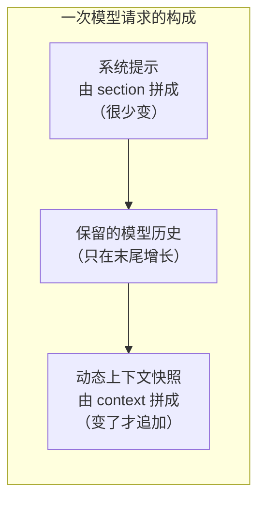
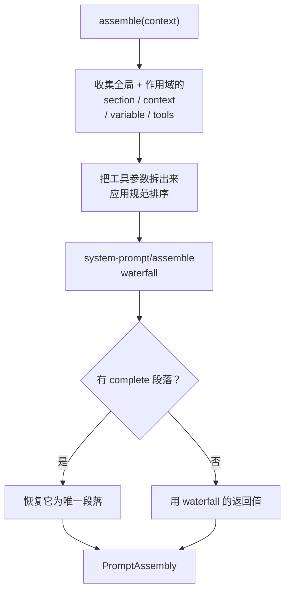

# 系统提示装配：模型看见的前缀是被"拼"出来的

> **你在哪**：运行示例的第 5 步。上一篇讲了循环在什么时候调它，这一篇讲它内部怎么把一堆插件的贡献拼成一段前缀。
>
> **读完你会知道**：`PromptSection` 的 order 约定、`complete` 段落如何独占整个系统提示、`PromptContext` 为什么必须和 section 分开（这关系到 KV Cache 命中率），以及工具 schema 如何被挑选、遮蔽、过滤。

---

## 缩写对照表

| 缩写 | 英文全称 | 中文 |
|---|---|---|
| KV Cache | Key-Value Cache | 键值缓存，推理侧复用相同前缀的机制 |
| LLM | Large Language Model | 大语言模型 |
| API | Application Programming Interface | 应用程序编程接口 |

---

## 一、角色回顾

**拥有**：把各插件注册的提示段落、动态上下文、工具 schema、变量，按序装配成一次请求的前缀。
**刻意不做**：不发请求、不缓存——每次装配都重新求值。
**在示例中出场**：第 5 步，每个 step 各一次。

服务 key 是 `ctx.systemPrompt`，四个注册方法 + 一个装配方法：

```ts
section(section: PromptSection): () => void     // 提示段落
context(context: PromptContext): () => void     // 动态上下文
variable(name, provider): () => void            // 变量
tools(provider): () => void                     // 工具 schema 提供者
assemble(context?): Promise<PromptAssembly>     // 装配
```

注意每个方法都返回一个 disposer——第 4 篇讲的"注册即可撤销效果"。

## 二、Section：有序拼接的提示段落

```ts
interface PromptSection {
  readonly name: string      // 唯一，重复注册直接抛错
  readonly order: number     // 升序拼接
  readonly text: string | ((context: AssembleContext) => string)
  readonly complete?: boolean
}
```

### order 约定

文档写死了这几档：

| order | 放什么 |
|---|---|
| `-100` | **harness 身份**（"你是一个跑在 XX 里的 agent"） |
| 负数（其他） | 也在人格之前渲染，比如 `harness:source`（告诉 agent DSH 源码在磁盘哪） |
| `0` | **部署人格**（persona） |
| `100–199` | **工具指引** |

标准模式那份 persona 就注册在 order 0：

```yaml
- id: persona
  name: '@deepseek-ai/dsh-persona'
  config:
    text: >-
      You are a coding agent powered by the {{model}} model.
      Your working directory is {{cwd}}.
```

### text 可以是函数

`text` 既可以是静态字符串，也可以是**每次装配都用当次 `AssembleContext` 求值的函数**。这就是为什么"不缓存"是设计而不是偷懒——段落内容可能依赖当前作用域、当前工作区、当前权限策略。

### `complete`：独占整个系统提示

```ts
readonly complete?: boolean
```

标了 `complete` 的段落，会**成为唯一的系统提示段落**。但注意它的执行顺序很讲究：

> "Assembly still runs the cooperative waterfall so tools, contexts, and variables can be resolved, **then restores this exact section as the sole prompt section**. More than one effective complete section makes assembly fail."

即：waterfall 照跑（工具 schema、上下文、变量都要解析），跑完之后**把这个段落恢复成唯一段落**。所以 waterfall 监听器**改不了**这个作用域的系统提示——这是给评测用的强隔离。

极简模式的配置正是这么写的：

```yaml
- id: persona
  name: '@deepseek-ai/dsh-persona'
  config:
    text: You are a helpful software engineer assistant.
    complete: true
    includeRuntimeContext: false
```

一句人格 + 独占 + 连运行时上下文都不要。**这就是第 1 篇说的"把变量按死"的具体实现。**

## 三、Context：为什么它必须和 Section 分开

```ts
interface PromptContext {
  readonly name: string
  readonly order: number
  readonly text: string | ((context: AssembleContext) => string)
}
```

字段几乎和 `PromptSection` 一样，只少了 `complete`。那为什么要两个类型？

答案在文档的一句话里：

> "`PromptContext` is the **cache-safe counterpart** to `PromptSection`. The assembly resolves and orders these contributions, while agent-loop **logs their complete current snapshot after retained model history** only when it changed or compaction removed it."

关键在**位置**：



*这张图回答的问题：为什么"当前时间""当前权限策略"这类会变的东西不能写进系统提示。*

如果把"当前审批策略是 ask 还是 never"塞进系统提示，那么**每次策略一变，整个前缀就变了**——KV Cache 全部失效，每一次请求都要从头算。把它放在保留历史**之后**，作为一条 `user/message` 快照追加，前缀就稳定了，缓存能一直命中。

这条设计在仓库里是有纪律的：几乎每个包的 README 都有一节 **"KV Cache effect"**，说明这个插件对缓存的影响。比如 `app-boot` 的那节写着：`addHarnessSourceSection` 放的是**系统提示头部**的一行短文本，**在每请求内容之前**，所以跨回合不会让缓存失效。

顺便，这也解释了第 6 篇那条 `request/context` 事件为什么"**只在路由或容量变化时**才记"——同一个思路：不变的东西不要制造噪音。

## 四、Variable：`{{model}}` 是怎么解析的

```ts
variable(name: string, provider: (context: AssembleContext) => string | undefined): () => void
```

- 名字规则：`[a-z][a-z0-9_]*`；重复或非法直接抛错。
- 段落文本里写 `{{variable}}`，**在 `renderPrompt` 阶段插值**（不是注册时）。
- provider 可以返回 `undefined`，但**渲染一个引用了它的段落就会失败**——刻意不给你静默的空字符串。

作用域规则和其他注册一样：**scoped 变量遮蔽同名全局变量**。所以 `{{model}}` 在不同会话里解析成不同的值，是作用域链的自然结果（第 4、5 篇）。

## 五、工具 schema：装配期才决定模型能看见哪些工具

```ts
tools(provider: (context: AssembleContext) => ToolProviderResult): () => void

interface ToolProviderResult {
  readonly schemas: readonly ToolSchema[]      // 本次装配可见的
  readonly knownNames?: readonly string[]      // 限制前的名字全集
}
```

`knownNames` 这个字段体现了很好的产品直觉：它是**限制前**的名字全集，用来区分两种情况——

- 你配置里写的工具名**打错了**（这个名字压根不存在）；
- 这个工具**存在，但在当前作用域里被刻意隐藏了**。

两种情况的报错应该不一样。

### 遮蔽与过滤

工具可见性由三层机制共同决定（术语表里的定义）：

| 机制 | 效果 |
|---|---|
| **shadowing（遮蔽）** | 最具体的赢：作用域内的同名工具**替换**全局的同名工具，仅对该作用域生效。这是"每个 agent 一套人格 / 一套工具变体"的实现方式 |
| **restriction（限制）** | `tools.restrict` 过滤**全局**工具集（多个限制按交集叠加）；作用域内注册的工具在过滤**之后**合并进来 |
| **scope-local 注册** | 只属于一个作用域的工具，不向下继承给子代理 |

有一条特别重要的一致性保证：

> "A filtered-away global tool is **absent from the prompt AND refuses execution, indistinguishably from a nonexistent one**."

被过滤掉的工具，**既不出现在提示里，也拒绝执行**——和不存在的工具**无法区分**。没有"模型看不见但能调"的后门。

### 谁在装配时被排除

第 10 篇会讲 `ToolDefinition` 有一堆宿主专用字段（`execute`、`timeoutMs`、`isConcurrencySafe`、`presentCall`……）。注册表的 `schemas()` 用**显式白名单**构造给模型看的 `ToolSchema[]`：

> "`output`/`execute`/`finalizeContent`/`timeoutMs`/`isConcurrencySafe`/`presentCall`/`presentResult` **must never leak into a model request**."

白名单而不是黑名单——加新字段时默认是安全的。

## 六、装配流程



*这张图回答的问题：从注册的碎片到一次请求的前缀，中间发生了什么。*

`system-prompt/assemble` 是一个 **scope-filtered（作用域过滤）** 的 waterfall：作用域内的监听器只收到该作用域的装配。返回值是权威的——除了 `complete` 段落会在之后被恢复。

还有一个小而有用的开关：

```ts
suppressRuntimeContext(): () => void
```

在调用方作用域里**压制所有动态运行时上下文贡献**，但不改变拥有或强制这些事实的服务。极简模式的 `includeRuntimeContext: false` 走的就是这条路——**压制的是呈现，不是能力**。

## 七、失败行为

| 出什么事 | 怎么办 |
|---|---|
| 两个插件注册同名 section | 抛错（同一层内重复） |
| order 是 NaN / Infinity | 抛错 |
| 有效的 `complete` 段落多于一个 | **装配失败** |
| 变量 provider 返回 `undefined`，而某段落引用了它 | 渲染失败（不给静默空串） |
| 工具 provider 返回了保留名 `TOOL_ORDER_REST` | 装配失败 |
| 任何提供者变化 | 发 `system-prompt/change`（**不做作用域过滤**——全局变化影响每个作用域） |

## ⚓ 回到示例

**第 5 步**，你那句话进入 `step/start` 之后，`assemble()` 被调用，产出物大致是：

```
[order -100]  harness 身份段落
[order   0]   人格：You are a coding agent powered by
              deepseek-chat model. Your working directory
              is /Users/you/my-project.        ← {{model}} {{cwd}} 已插值
[order 100+]  工具指引段落（bash 怎么用、编辑器怎么用……）
─────────────
工具 schema：read_file / str_replace_editor / bash /
             grep / glob / subagent / todo_write / ...
             （标准模式 preset 注册的那一套，
               经过本作用域的遮蔽与限制之后）
─────────────
保留的模型历史（第一步时是空的）
─────────────
动态上下文快照：当前工作区、当前权限策略（workspace-write + ask）、
               当前时间……      ← 这部分在历史之后，保护 KV Cache
```

整份东西作为 `request/header` 落进日志（第 6 篇的 `seq 4`）。

**到了第 9 步（第二个 step）**，装配又跑了一次。这次：

- section 部分**一个字节都没变** → 前缀稳定 → KV Cache 命中；
- 历史长了（多了第一步的助手消息和工具结果）；
- 动态上下文**只在变了的时候**才重新追加一份快照——你没改权限策略，所以没变。

**到了第 10 步之后**：如果你在审批弹窗里选了"以后都别问"（把策略改成 `never`），那么权限策略这个动态上下文**变了**——于是一份新的完整快照会追加在保留历史之后。**注意它不会去改系统提示。** 这就是把 section 和 context 分成两个类型的全部理由。

---

**上一篇** ← [07 · Agent Loop](07-agent-loop.zh.md)
**下一篇** → [09 · LLM 接缝：把"厂商协议"关进一个可替换的盒子](09-llm-adapter.zh.md)
**回到** → [系列索引](index.md)
