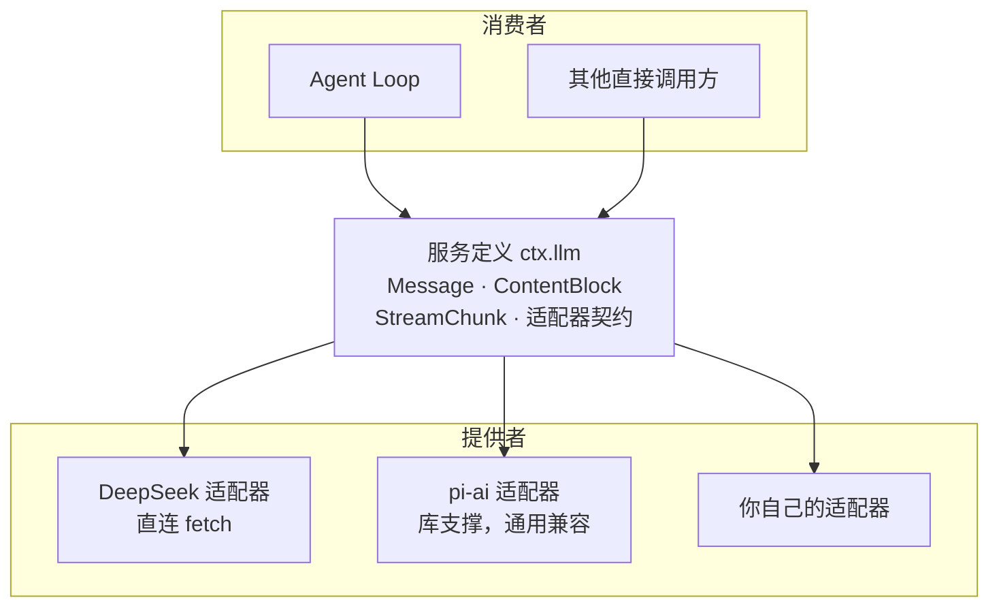
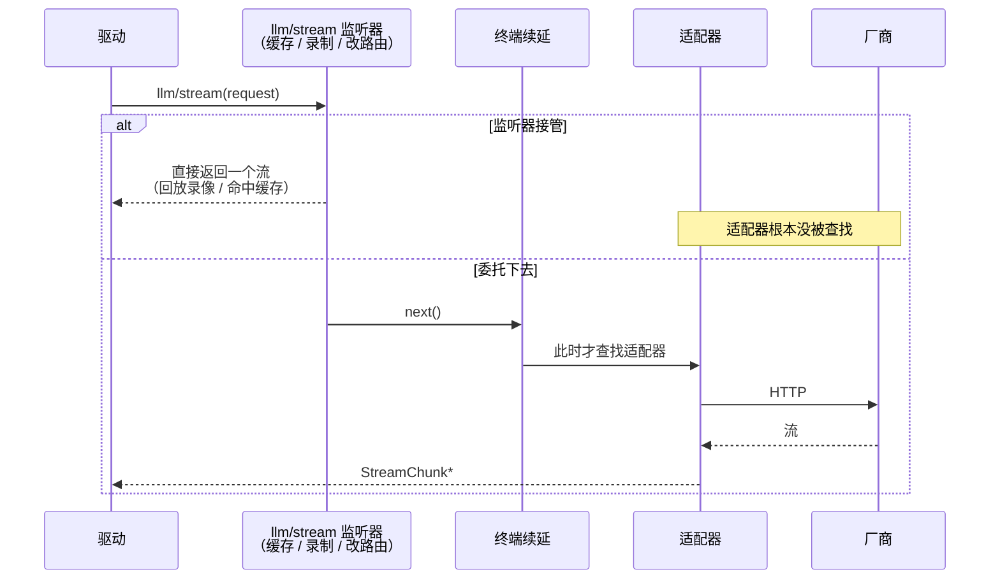

# LLM 接缝：把"厂商协议"关进一个可替换的盒子

> **你在哪**：运行示例的第 6–7 步。上一篇把前缀装配好了，这一篇讲它怎么变成一次 HTTP 请求、以及流回来的东西怎么变成一条 `assistant/message`。
>
> **读完你会知道**：`LlmAdapter` 的八条契约（每一条都对应一个真实事故）、`llm/stream` waterfall 为什么在适配器查找**之前**、空回复为什么算错误，以及推理链 replay 状态的归属规则。

---

## 缩写对照表

| 缩写 | 英文全称 | 中文 |
|---|---|---|
| LLM | Large Language Model | 大语言模型 |
| HTTP | HyperText Transfer Protocol | 超文本传输协议 |
| JSON | JSON Object Notation | 一种数据交换格式 |
| API | Application Programming Interface | 应用程序编程接口 |
| SDK | Software Development Kit | 软件开发工具包 |

---

## 一、角色回顾

**拥有**：消息与流式分片的词汇表（`Message` / `ContentBlock` / `StreamChunk`）、适配器契约、路由与重试策略。
**刻意不做**：不管 agent 级恢复（一次适配器调用 = 一次厂商尝试）、不管块重组（统一由 `BlockAssembler` 处理）。
**在示例中出场**：第 6 步（发请求）、第 7 步（收流）。

服务 key 是 `ctx.llm`。注意它同时拥有**服务定义**和**消费者**两个角色——文档说这是可以的，因为它们是同一件关切。

## 二、接缝的形状



注册方式：

```ts
ctx.llm.registerAdapter(providers, adapter)
```

一个适配器实例可以拥有多条 provider 路由。`GenerateOptions.provider` 选路由，`GenerateOptions.model` 交给那个适配器解释——**model 不需要在生命周期开始时就注册**。重复的 provider 路由**原子失败**。

模型目录（`listModels()`）是**建议性的，不是白名单**：

> "That catalog is **advisory rather than a request whitelist**: the adapter remains authoritative and may accept unlisted model ids."

这条很实用——你自建的 endpoint 上有一个目录里没有的模型名，照样能用。

## 三、适配器契约：八条，每条都对应一个真实事故

文档原话是 "Every adapter MUST obey these, and every consumer may rely on them"。逐条读，并说明它防的是什么：

### 1. `usage` 必须在 `finish` 之前，`finish` 之后什么都不许有

> "Defer both to the provider's end-of-stream marker so a trailing usage-only chunk can't violate the ordering."

**防的是**：消费者以为流结束了，结果又来了一个只带 usage 的分片。

### 2. 工具调用的 `arguments` 全程保持原始 JSON 字符串

> "Partial fragments stream via `argumentsDelta`; a provider that hands back parsed objects **re-stringifies at `block-end`**."

**防的是**：解析再序列化导致的字节漂移（键顺序、数字格式、Unicode 转义）。第 6 篇说过 `tool/call` 事件里的 `arguments` 是"模型原样产出的、未解析的"——那条日志规则的上游保证就在这里。

### 3. 两条错误路径，一个失败类型

允许 **throw**（传输/协议错误），也允许**以 `finish {kind:'error'|'aborted', failure}` 结束流**（厂商在流内报错，适配器没法在流中间抛）。两条路径携带的是同一个 `LlmFailure`。

**防的是**：消费者要写两套错误处理。

失败之后的动作（第 7 篇讲过）：循环关掉失败的 step，把错误、不可变事实、之前重试过的事实、**serving 时捕获的重试策略**、turn 信号一起交给 `agent/request-error`。

### 4. 一次适配器调用 = 一次厂商尝试

> "Adapters **disable library retries**. Agent-level recovery opens another durable numbered turn; direct `ctx.llm.stream()` callers remain single-attempt."

**防的是**：底层库悄悄重试三次，导致"日志里一次请求，账单上三次"、以及重试对上层不可见。要重试就**开一个新编号的持久 turn**——重试这件事本身也是可追溯的。

### 5. 厂商卡住由传输层兜底

两个正式适配器都暴露 `streamIdleTimeoutMs`，**默认五分钟**。看门狗**只在 `next()` 挂起期间上膛**，整个请求用一个稳定信号，自己到期映射成 `TIMEOUT`，而**更早的调用方中止仍然记为 `ABORTED`**。

**防的是**：厂商流不结束也不报错，agent 永远挂着；以及"超时"覆盖掉"用户取消"这个更准确的原因。

### 6. 上下文溢出只有一个规范错误码

两个 DeepSeek 适配器都通过 `isContextWindowExceededError()` 归一成 `CONTEXT_WINDOW_EXCEEDED`，无论它是抛出来的 HTTP 错误还是流内 finish 错误。

> "Consumers route on the code, **never provider text**."

**防的是**：压缩插件靠正则匹配厂商的错误文案来判断"是不是超长了"——厂商改一次文案就全崩。这也正是第 7 篇那条压缩恢复路径的前提。

### 7. 每个厂商 HTTP 请求都带应用归属头

`attributionHeaders()`（`User-Agent` 基线），并且**用一个 wire 级测试证明它确实加上了**。

### 8. 空回复是可重试错误，不是静默成功

> "Both adapters map a terminal `stop` finish that carried **no content blocks** to `finish {kind:'error'}` with the canonical `EMPTY_RESPONSE` code, and `dsh-llm-retry` retries it by default."

**防的是**：模型返回空，循环以为"它没什么想说的"，于是这个 turn 就这么结束了——用户看着一个空气泡。

## 四、`llm/stream`：为什么拦截点在适配器查找之前

这是一个容易忽略但很有价值的设计：

> "**Adapter lookup happens at the terminal continuation of the `llm/stream` waterfall**, so a listener may short-circuit the call or route a mutable one-shot request before lookup."



*这张图回答的问题：为什么"录制/回放模型响应"这种功能不需要改任何核心代码。*

有一条边界很诚实：驱动在外层 waterfall 返回流句柄时就认为"发生了一次请求尝试"，但**这个边界不证明惰性的终端适配器真的被构造了、或者真的开始了厂商 I/O**。

## 五、请求准备：`prepareCall()` 与它解决的问题

直接调用方用 `resolveCallConfig()`；**agent loop 用 `prepareCall()`**，区别在于后者：

- 在**模型解析、持久化 header 记录、派发**这三件事之间**保持同一个注册**；
- 保留那次精确查找得到的上下文元数据；
- 报告**哪些配置字段是适配器补的默认值**（而不是调用方提出的）。

`PreparedLlmCall.stream()` 还有个防呆：请求的调用配置字段必须和准备时一致，**重用或不匹配都会以 `INVALID_PREPARED_CALL` 失败**。

为什么要这么讲究？因为路由是可以被热替换的（第 4 篇：配置改一行，子树重组）。如果一次请求的"解析模型 → 写 header → 派发"三步跨越了一次路由替换，你会得到一条**记录的 header 和实际发出的请求不一致**的日志。而这直接违反第 6 篇那条不变量。

同理，重试策略也是**在 serving 注册那一刻捕获的**：

> "`llmRetryPolicyOf(stream)` returns the value captured from the serving registration after the call selects it, so **later route disposal or replacement cannot change an in-flight failure's recovery policy**."

## 六、Replay 状态：推理链复用的归属规则

新一代推理模型往往可以复用上一轮的内部推理状态。DSH 的处理方式很值得学：

> "A successful `finish` may carry a `ReplayEnvelope`: opaque response-level metadata plus optional per-block entries **aligned with the emitted block sequence**."

三条规则：

1. **对齐是 harness 的词汇。** 装配丢掉某个内容块时，**同一位置**的 replay 条目也丢掉——所以存下来的元数据永远描述的是存下来的内容。
2. **只在"完全同一个适配器实例"时才传回去。** 历史 provider 和目标 provider 当前必须注册在**同一个适配器实例**上，才把这份私有状态交给它；其他适配器只拿到 provider 中立的内容。
3. **持久内容永远权威。** 读取方适配器用不了这份状态时，**这一条消息降级**成 provider 中立转换 + 一条诊断，**而不是让整个请求失败**。

第 3 条是这个仓库的典型风格：**优化失效时降级，而不是报错。**

## 七、失败行为小结

| 出什么事 | 怎么办 |
|---|---|
| 传输/协议错误 | 适配器 `throw`，`LlmError.failure` 带 `LlmFailure` |
| 厂商在流内报错 | 以 `finish {kind:'error', failure}` 结束流，同一个失败类型 |
| 厂商流卡住 | 五分钟默认空闲超时 → `TIMEOUT`；更早的调用方中止仍记 `ABORTED` |
| 上下文超了 | 归一成 `CONTEXT_WINDOW_EXCEEDED` → 交给压缩恢复路径（第 7 篇） |
| 模型返回空 | `EMPTY_RESPONSE`，默认重试 |
| 重试策略配置里既有 always 模式又留着 normal-only 字段 | 解析器**忽略失效字段**，捕获纯 always 策略 |
| 省略 provider 策略 | 用 normal 默认值：**五次重试** |
| 存下来的 replay 状态读不懂 | 这一条消息降级为中立转换 + 诊断，不失败 |

## ⚓ 回到示例

**第 6 步**完整展开：

1. 驱动调 `prepareCall()`：选中 `deepseek` 路由 → 解析模型（拿到精确模型标识、上下文容量、适配器默认的 `maxTokens`）→ **捕获这条注册**；
2. `request/header` 落日志（第 6 篇 `seq 4`）；
3. `agent/request` waterfall：没人拦，直接过；
4. `llm/stream` waterfall：也没人拦 → 终端续延**此时才查找适配器** → DeepSeek 适配器发出 HTTP 请求，头里带 `attributionHeaders()`；
5. 五分钟空闲看门狗上膛。

**第 7 步**：分片流回来。适配器只需要吐出格式正确的 `StreamChunk`——`block-start` / `block-end` 的 `index` 相关性加上 `BlockAssembler`，让**块重组不是每个适配器各自的问题**。驱动把每一个分片原样写进 `assistant/chunk`（第 6 篇的 `seq 5–40`），流结束后组装成 `assistant/message` 并带上 usage。

这一步里模型输出了一个 `tool_use` 块，`arguments` 是 `'{"path":"package.json"}'` —— **原样字符串，一路没被解析过**（契约 2）。它会以完全相同的字节落进第 8 步的 `tool/call` 事件。

**如果这次请求失败了**会怎样？假设厂商返回 503：

1. 适配器 `throw`，`LlmFailure` 里带错误码；
2. `step/end` 关掉第 1 步；
3. `agent/request-error` waterfall 拿到错误 + serving 时捕获的重试策略（默认五次）；
4. `dsh-llm-retry` 判定可重试 → 修复 → 返回 `{ kind: 'retry' }`；
5. **另开一个新编号的 turn** 重试——所以日志里你会看到 `turn: 2`，而不是"turn 1 的第二次尝试"。**重试在日志里是显式的。**

---

**上一篇** ← [08 · 系统提示装配](08-system-prompt.zh.md)
**下一篇** → [10 · 工具注册表与执行管线：一次工具调用要过五道关](10-tools.zh.md)
**回到** → [系列索引](index.md)
