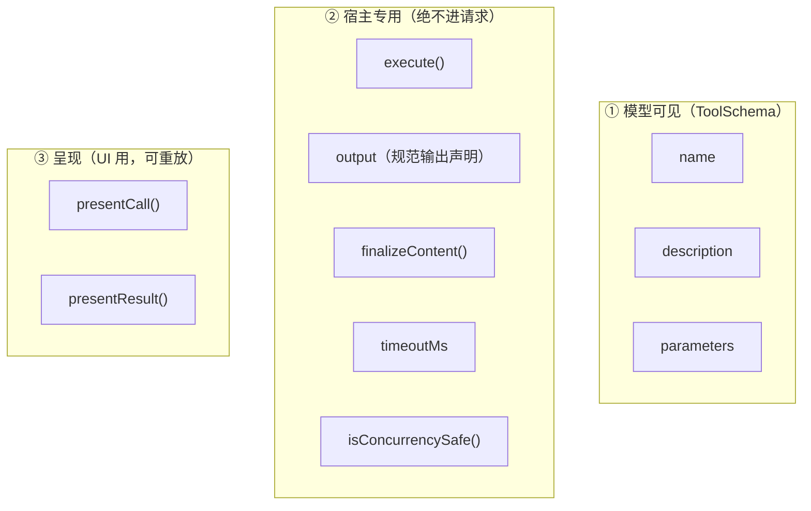
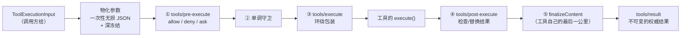

# 工具注册表与执行管线：一次工具调用要过五道关

> **你在哪**：运行示例的第 8、9、10 步。模型说"我要调 `read_file`"之后到结果落进日志之前，中间这一段。
>
> **读完你会知道**：`ToolDefinition` 的字段哪些给模型看哪些绝不能泄漏、五段管线各自能改什么、allow/deny/ask 三态决策与 fail-closed、并发安全声明的默认值为什么是"不安全"，以及 Code Mode 下"模型直呼原生工具"为什么被直接拒绝。

---

## 缩写对照表

| 缩写 | 英文全称 | 中文 |
|---|---|---|
| JSON | JSON Object Notation | 一种数据交换格式 |
| DSL | Domain-Specific Language | 领域特定语言 |
| UI | User Interface | 用户界面 |
| SDK | Software Development Kit | 软件开发工具包 |
| PTC | Programmatic Tool Calling | 程序化工具调用（Code Mode） |

---

## 一、角色回顾

**拥有**：工具定义的注册与作用域过滤；一次调用从"模型说要调"到"结果定稿"的五段管线；并发调度分类。
**刻意不做**：不自己做审批（转交 `ctx.approval`）、不把宿主字段泄漏给模型。
**在示例中出场**：第 8 步（读文件）、第 9 步（编辑）、第 10 步（跑命令，触发审批）。

## 二、`ToolDefinition`：三层字段

一个注册的工具由三部分组成：



*这张图回答的问题：为什么"工具描述"和"工具实现"在这个项目里是同一个对象的不同层。*

`schemas()` 用**显式白名单**构造模型可见部分——第 8 篇提过，加新字段时默认安全。

### 强制的规范输出声明

```ts
interface ToolOutputDefinition {
  readonly schema: JsonSchemaNode                              // 对每个成功值强制校验
  render(args, value): ContentBlock[]                          // 纯投影 → 模型可见内容
  presentationMeta?(args, value): JsonValue                    // 纯投影 → 呈现元数据
}
```

这是**强制字段**。工具的 `execute()` **只返回规范的无损 JSON 值**，怎么把它变成模型看的内容、怎么把它变成 UI 卡片，是两个**纯投影**。

这个拆分买到了什么：**同一次执行的结果，可以在重放时得到一模一样的渲染**。`presentCall` / `presentResult` 的文档明确要求：

> "Pure and side-effect-free: a UI may call it during live streaming **AND a session-log replay**, so it must depend only on `args`."

### 两个宿主专用字段的默认值

```ts
timeoutMs?: number          // 省略 = 没有截止时间
isConcurrencySafe?(args): boolean
```

`isConcurrencySafe` 的语义写得非常严：

> "**Only `true` opts in**; omission, exceptions, non-`true` returns, and invalid `defineTool` arguments are exclusive."

省略、抛异常、返回非 `true`、参数非法——**全部按独占处理**。这是正确的默认值方向：并发是需要证明的，不是默认假设的。

`timeoutMs` 也有一条同样风格的声明性约束：

> "Declaring it **asserts this tool forwards `exec.signal`** to a cooperative implementation that can reach quiescence when the signal aborts."

即：**声明超时 = 你保证你的实现是协作式可取消的**。因为注册表**杀不死同进程代码**——它只能取消，不能强杀。

## 三、五段管线



*这张图回答的问题：一次工具调用有几个可插入点，各自能改什么。*

逐段说：

### ① `tools/pre-execute` —— 三态决策 waterfall

> "Allow, deny, or ask before dispatch. `next()` delegates to allow; **missing approval support turns `ask` into denial**."

- 是 waterfall，**可重排**；
- `next()` 一路委托下去的默认结果是 **allow**；
- 返回 `ask` 但系统里没有审批能力 → **变成拒绝**（fail-closed）；
- 异步的门必须观察 `exec.signal`；注册表在它们 settle 之后**重新检查取消**，但**不抛弃**它们的 promise；
- **作用域过滤派发**：agent 作用域的监听器只收到那个 agent 的调用。

### ② 单调守卫（monotonic guards）

在 waterfall 之后、执行之前的一层。"单调"意味着它们只会**收紧**，不会放松——扩展点可以变得更严格，但不能把已经拒绝的变成允许。

### ③ `tools/execute` —— 环绕式包装

唯一可以**替换那个必需的 signal** 的视图。超时策略插件（`dsh-tool-call-timeout-policy`）就是一个 `tools/execute` 包装器。

### ④ `tools/post-execute` —— 检查或替换结果

### ⑤ `finalizeContent` —— 工具自己的最后一公里

这个回调有几个刻意的设计：

> "The registry **snapshots this callback when execution starts** and invokes it **exactly once for every normalized outcome, including pipeline failures that bypass `tools/post-execute`** ... The callback **must be total and must not throw**."

- 执行开始时快照（中途改注册不影响这次调用）；
- **每个归一化结局都调一次**，包括绕过了 post-execute 的管线失败；
- 所以它拿到的是不可变的执行对象而**不是**类型化参数——因为非法输入和外层管线失败也会到它这儿；
- 返回 `undefined` 表示保留原内容，其余字段仍归注册表所有。

### 最后：`tools/result`

不可变的权威结果。**注册表在 `tools/result` 的观察者跑起来之前，把整个执行对象冻结**。

## 四、两个跨调用机制

工具体拿到的是 `ToolRunContext`，比输入多两个方法：

```ts
deferContext(context: UserMessage): void   // 把上下文推迟到本次结果抵达循环之后
concludeTurn(): void                       // 把成功结果标记为"本回合到此为止"
```

**`deferContext`** 的用途：一个复合工具（比如子代理工具）在内部派发了嵌套调用，嵌套调用产生的上下文需要带回给外层——但**不能在外层调用还开着的时候注入**。所以推迟到 `tool/result` 之后由循环追加。

**`concludeTurn`** 的传播规则很讲究：标记骑在**这次执行自己的结果**上，复合工具从嵌套结果**转发**它，"所以只有权威的嵌套成功才能结束外层的运行"。

## 五、并发调度

驱动向注册表询问每个待处理调用的执行模式：

```ts
type ToolExecutionMode = { kind: 'parallel' } | { kind: 'exclusive' }
```

然后组成 barrier 和有界滚动池（第 7 篇讲过调度侧）。工具侧的义务：

> "Opted-in executions **must not mutate parent-owned state**. Shared state must tolerate concurrent dispatch; recorder races are permitted **only when they commute or fail closed**."

"只有当竞态可交换或者失败关闭时才允许"——这是一句很硬的并发规范。

## 六、Code Mode 下的特殊规则

`code`（PTC）preset 里，模型不直接调工具，而是写一段 TypeScript 程序，由 `run_code` 执行，程序内部通过 SDK 调工具。这带来一个安全问题：**模型能不能绕过 `run_code`，直接调原生工具名？**

答案是不能，而且拒绝发生得非常早：

> "Under `mode: 'code'`, **only calls WITH a parent may execute a native tool name** — a model-direct call (no parent) is **denied as `UNKNOWN_TOOL` before the policy pipeline**."

机制是 `ToolExecutionInput.parent`（外层传输执行的不透明 token）：

- 有 `parent` → 这是 `run_code` 的子派发 → 放行；
- 没有 `parent` → 模型直呼 → **在策略管线之前**就报 `UNKNOWN_TOOL`。

报 `UNKNOWN_TOOL` 而不是"权限拒绝"也是刻意的——在这个模式下，原生工具名对模型来说**本来就不存在**（回想第 8 篇那条"被过滤掉的工具与不存在的工具无法区分"）。

Code Mode 还有一个额外的 waterfall：`tools/code-dispatch-log`，可以改**持久事件里那份结果内容的副本**，而程序拿到的结构化 `value` 和模型可见结果**不受影响**。这样"日志里记什么"和"程序看到什么"可以分别优化。

## 七、失败行为

| 出什么事 | 怎么办 |
|---|---|
| `ask` 决定但没有审批能力 | **拒绝**（fail-closed） |
| 审批返回 `rejected` / `cancelled` / `unavailable` | 一律拒绝——只有 `allowed-once` 才放行 |
| 工具往 `meta` 里塞了不可序列化的东西 | `Session.append` 在源头拒绝（第 6 篇） |
| 工具卡死不响应 signal | 注册表**无法硬杀**同进程代码；它保住调用方的取消语义但不抛弃 promise |
| `finalizeContent` 抛异常 | 违反契约（"must be total and must not throw"） |
| Code Mode 下模型直呼原生工具 | `UNKNOWN_TOOL`，策略管线之前 |
| 某个宿主字段不小心想进模型请求 | 白名单挡住 |

## ⚓ 回到示例

**第 8 步**（`read_file(package.json)`）走完整条管线：

1. 模型输出的 `arguments` 字符串 `'{"path":"package.json"}'` 被解析、**一次性无损物化**、**深冻结**；
2. `tools/pre-execute`：文件工具的策略监听器看了一眼——读工作区内的文件，`next()` 委托 → 默认 **allow**；
3. 守卫层通过；
4. `tools/execute`：超时策略包了一层；
5. `execute()` 通过 `ctx.fs` 读文件（第 11 篇），返回规范 JSON 值；
6. `output.render(args, value)` 把它变成模型可见的 `ContentBlock[]`；
7. `tool/result` 落日志。

**第 9 步**（编辑 README）多一件事：文件工具把**结果时刻的上下文 diff** 挂在 `tool/result` 的 `meta` 上——这就是第 6 篇 `seq 78` 那个 `meta`，也是 UI 上那张 diff 卡片的数据来源。`presentResult(args, result)` 是纯函数，所以**重放时卡片一模一样**。

**第 10 步**（`bash pnpm lint`）是这一篇的重头戏：

1. `tools/pre-execute` 跑起来。权限相关的监听器判断：这是一次会产生副作用的命令执行，当前会话策略是 `ask` → **返回 `ask`，短路，不调 `next()`**（第 4 篇讲的"策略型监听器"）；
2. 注册表把 `ask` 转给 `ctx.approval`（第 11 篇）——**注意注册表自己不弹窗、不认识 UI**；
3. Web UI 的答复者渲染弹窗。审批请求里**故意不带工具参数**——它通过 `callId` 挂在已经流式呈现出来的那次工具调用上，"而不是渲染第二份可能漂移的副本"；
4. 你点允许 → `allowed-once`；
5. **只有 `allowed-once` 才继续**，其余三种结局全部拒绝；
6. 管线继续：守卫 → `tools/execute`（超时包装）→ bash 工具的 `execute()` → `ctx.shell` → 沙箱 → 真正 spawn（第 11 篇）；
7. 输出经 `output.render` 变成模型可见内容 → `tools/post-execute` → `finalizeContent`（bash 工具在这里施加自己的内容长度上限）→ `tool/result`。

第 6 步那个"只有 `allowed-once` 才放行"值得再强调一次：**如果审批服务本身挂了，返回 `unavailable`，这次调用会被拒绝，而不是被放行。** 安全默认值的方向是对的。

---

**上一篇** ← [09 · LLM 接缝](09-llm-adapter.zh.md)
**下一篇** → [11 · 能力接缝：文件、命令、沙箱、审批、子代理](11-capability-seams.zh.md)
**回到** → [系列索引](index.md)
