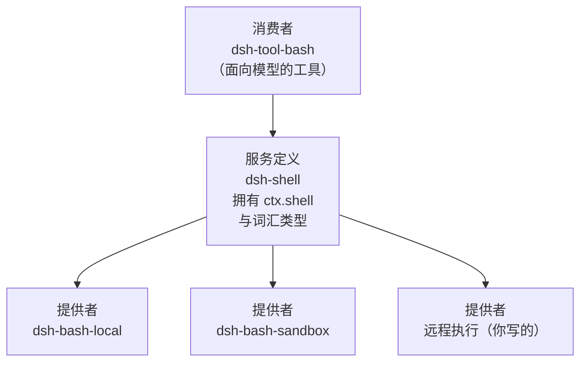
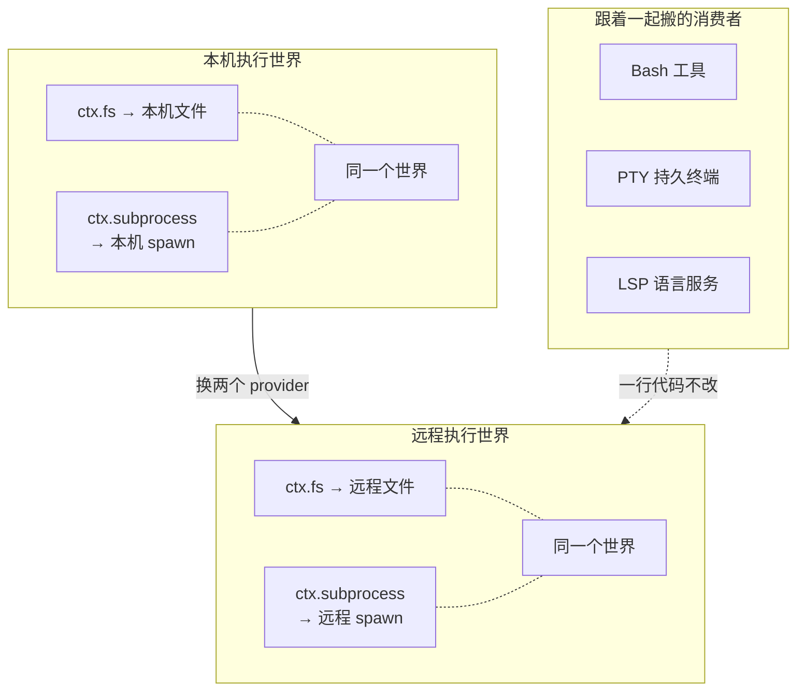
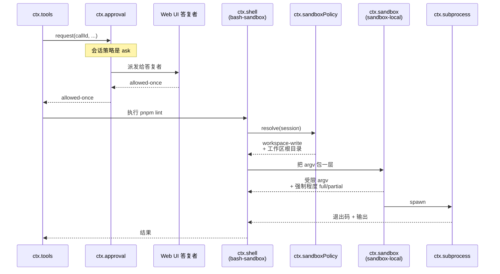

# 能力接缝：文件、命令、沙箱、审批、子代理

> **你在哪**：运行示例的第 8、10、11 步——真正跟外部世界打交道的那一层。这是最后一个深度篇。
>
> **读完你会知道**：接缝的三个角色为什么缺一不可、一次 provider 替换如何把 Bash/PTY/LSP 一起搬到远程、`SandboxMode` 三档策略与"部分执行"这个诚实的事实、审批为什么是 fail-closed，以及子代理接缝如何把 Claude Code 和 Codex 变成可调用的孩子。

---

## 缩写对照表

| 缩写 | 英文全称 | 中文 |
|---|---|---|
| PTY | Pseudo Terminal | 伪终端 |
| LSP | Language Server Protocol | 语言服务器协议 |
| ACL | Access Control List | 访问控制列表 |
| ABI | Application Binary Interface | 应用二进制接口 |
| CI | Continuous Integration | 持续集成 |
| SDK | Software Development Kit | 软件开发工具包 |
| API | Application Programming Interface | 应用程序编程接口 |

---

## 一、角色回顾

**拥有**：真正跟外部世界打交道的能力——读写文件、跑命令、关进沙箱、问用户、派子代理。
**刻意不做**：不互相耦合。
**在示例中出场**：第 8 步（文件）、第 10 步（审批）、第 11 步（命令 + 沙箱）。

## 二、什么才算一个"接缝"

术语表的定义非常严格：

> "**seam** — a *swappable capability* with three roles: a **Service Definition**（拥有 `ctx.<key>` 和词汇类型的 Cordis Service，**抽象类或具体注册表，绝不是 TypeScript `interface`**）, one or more **Service Providers**, and one or more **Consumers**."
>
> "**The seam is the complete capability, never one role**; reserve the term for that meaning."

三个角色，缺一个就不是接缝。仓库给的标准示例是 `packages/shell`：

| 角色 | 包 |
|---|---|
| 服务定义 | `dsh-shell` |
| 提供者 | `dsh-bash-local`、`dsh-bash-sandbox` |
| 消费者 | `dsh-tool-bash` |



角色**通常**各占一个包（因为它们独立演化），但当它们是同一件关切时也可以合并——`dsh-llm` 就同时拥有服务定义和消费者（第 9 篇）。

> "Adding a capability means designing **all three**."

这条对想扩展 DSH 的人是最实用的一句话：**别只写一个实现，先想清楚定义和消费者是谁。**

## 三、接缝的复利：一次替换，整片搬家

架构文档里最有说服力的一段：

> "Seams are why one provider swap changes the whole product. **Filesystem and subprocess providers share one execution world**, so pointing them at a remote sandbox **moves Bash, PTY, and LSP with them, with no provider forks**."



*这张图回答的问题：为什么"把 agent 的执行环境挪到远程"在 DSH 里不是一个大工程。*

之所以能这样，是因为 Bash、PTY、LSP 三个消费者**都不认识"本机"这个概念**——它们只认识 `ctx.fs` 和 `ctx.subprocess`。

## 四、沙箱：三档策略和一个诚实的事实

`ctx.sandbox` 的职责很窄：**把一个同世界子进程的 argv 包进一层文件效果策略里**，而不让消费者耦合到平台运行器。

出厂后端 `dsh-sandbox-local` 覆盖三个平台：Linux 的 bwrap/Landlock、macOS 的 Seatbelt、Windows 的 ACL 受限令牌。

### 三档模式

```ts
type SandboxMode = 'read-only' | 'workspace-write' | 'danger-full-access'
```

| 模式 | 含义 |
|---|---|
| `read-only` | 只允许必需的 sink（POSIX 运行器额外放开 `/dev/null`，因为 shell 需要它） |
| `workspace-write` | 还允许写工作区根目录和后端承诺的临时区 |
| `danger-full-access` | **绕过限制**——注意这个模式的消费者**根本不调用 `ctx.sandbox`**，它直接 spawn 原始 argv |

一个重要的边界声明：

> "**Network and process visibility are outside this vocabulary.**"

**沙箱只管文件效果**，不管网络和进程可见性。说清楚自己不管什么，比含糊地暗示"我很安全"要负责得多。

### "部分执行"是一个被上报的事实

```ts
type SandboxEnforcement = 'full' | 'partial'
```

> "`partial` means an active backend or older kernel ABI cannot govern every promised file effect; **callers requiring an absolute boundary must not treat it as `full`**."

老的 Landlock ABI、Windows ACL 运行器的 Everyone/硬链接边界，都是当前的 partial 情形。这是很难得的诚实：**不是"我们支持沙箱"，而是"在这台机器上我能保证到什么程度"**。

### 策略是按调用携带的，不是钉在 provider 上

```ts
interface SandboxExecutionPolicy {
  mode: SandboxMode
  workspaceRoot: string     // workspace-write 可写的绝对根目录
  sessionId?: SessionId     // 后端按它给每个会话分私有临时目录
}
```

> "carried **PER CALL, not fixed on the provider**: two consumers may confine under different policies at the same instant (bash under `read-only` while a confined child agent needs its state directory writable), and an approved escalated retry is a new call with a wider policy."

同一瞬间，bash 可以是只读，而一个受限子代理需要它的状态目录可写。**并发会话、不同消费者、一次性提权重试，可以向同一个 provider 要不同的边界，而不需要修改 provider 状态。**

还有一个容易被忽略的细节：`workspaceRoot` **先按文件系统语义规范化（解 symlink），再做词法规范化**——所以一个含 `symlink/..` 的 cwd 标识的是**进程真正运行的那个目录**，而不是字符串拼出来的目录。这是一类经典越权的堵法。

## 五、审批：fail-closed 的三态

`ctx.approval` 回答一个问题：**这次具体的动作能不能进行？**

```ts
type ApprovalOutcome = 'allowed-once' | 'rejected' | 'cancelled' | 'unavailable'
type ApprovalPolicy = 'ask' | 'never'
```

四条规则：

1. **只有 `allowed-once` 才放行**，而且它**只授权被问到的那个动作**——不是"这类动作以后都行"。
2. **`unavailable` 按拒绝处理**。缺失的、不拥有的、抛异常的、不符合形状的答复者，一律变成 `unavailable` 而**不是打开闸门**。
3. **`never` 策略是确定性的拒绝**——不派发任何答复者。这是"严格无人值守姿态（CI、后台运行）"，也是"不问就知道结果"的那个策略。
4. **策略的有效值来自会话日志里最后一条 `approval/policy` 事件**，回退到服务配置。`setApprovalPolicy(session, policy)` 是唯一写入路径——**所以重放能重建这个覆盖**（第 6 篇的不变量）。

审批请求**故意不带工具参数**：

> "an answerer attaches the prompt to the already-streamed tool call through `callId` instead of **rendering a second copy that could drift**."

### 权限预设：把两个旋钮捆成一个选择器

沙箱模式和审批策略是**两个独立旋钮**。`ctx.permissionPresets` 把它们捆成用户看得懂的一个选择：

| 预设 | 沙箱 | 审批 |
|---|---|---|
| `workspace-write` | `workspace-write` | `ask` |
| `danger-full-access` | `danger-full-access` | `never` |

这一层**自己不做任何强制**——它只记录意图，然后通过每个旋钮各自的规范写入器写下去。执行、提示叙述、重放，仍然各读各的旋钮。当前值也是**推导出来的**：折叠出会话的有效沙箱模式和审批策略，匹配表里的项；都不匹配就返回派生的 `custom`（`custom` 只能显示，**永远不能作为切换目标**）。

配置错误在插件加载时就失败：表里有叫 `custom` 的项 → 抛错；组合在一个**不限制**的 bash 执行器之上 → 抛错（因为预设是要捆绑沙箱模式的）。

## 六、子代理：把别家产品变成孩子

`ctx.subagents` 是接缝多样性最极端的例子：

> "Subagent providers **vary just as widely behind one interface, from a fresh child agent to a delegated turn in another product**."

出厂的进程内后端有两个（`subagent-spawn-in-process`、`subagent-fork-in-process`），而标准模式 preset 里还有两行：

```yaml
- id: tool-subagent-codex
  name: '@deepseek-ai/dsh-tool-subagent'
- id: tool-subagent-claude-code
  name: '@deepseek-ai/dsh-tool-subagent'
```

**同一个工具包，不同配置，就把 Codex 和 Claude Code 变成了可以派活的子代理。** 这两个 provider 刻意不在 `dsh-base` 的生产依赖闭包里——需要的 profile 单独装对应的 bundle，所以默认安装不会拖进 Claude Agent SDK 和 Codex 的平台负载。

子代理还有几个值得知道的概念：

- **lineage（世系）**：父子关系是**数据**（`parentSession`、持久的 `delegationDepth`、运行时的 `subagentDepth`），**永远不影响可见性**。作用域是两层且扁平的——作用域注册**不向下继承给子代理**，子树行为用世系数据表达。
- **孩子怎么拿到工具**：通过 `composeFrom()` 绑定父的那次 preset 挂载（第 5 篇）。文档有一句很硬的话：*"a child that joins nothing reaches the model with **no tools at all**"*——因为所有面向模型的行都在 agent 平面，全局层是空的。
- **Ralph loop**：一个前台的"全新 agent 反复尝试同一个不可变目标"的工作流。每一轮是一个**全新的子会话**，不带父或前一轮的对话种子；跨轮状态靠**共享工作区**加一份**有界的结构化交接报告**（状态、摘要、证据、下一步、阻塞原因）传递。

## 七、失败行为

| 出什么事 | 怎么办 |
|---|---|
| 没有审批答复者 | `unavailable` → 拒绝 |
| 审批策略是 `never` | 确定性 `rejected`，不派发答复者 |
| 沙箱后端只能部分强制 | 上报 `partial`；需要绝对边界的调用方**必须**区别对待 |
| 消费者要 `danger-full-access` | 根本不调 `ctx.sandbox`，直接 spawn 原始 argv |
| 同时挂了 `fs-sandbox` 和 `dsh-fs-local` | **双重注册 `ctx.fs`，加载失败** |
| Windows 上把 bash 栈恢复回来但没禁用 pwsh 栈 | 两个执行器家族注册同一个 `bash` 服务 → **加载时大声失败** |
| 权限预设表里出现 `custom` | 插件加载时抛错（保留名） |

倒数第二条特别典型：**不完整的配置改法会在加载时炸掉，而不是在运行时给你一个诡异的行为。**

## ⚓ 回到示例

**第 8 步**（读 `package.json`）：`read_file` 工具是消费者，它调 `ctx.fs`。`ctx.fs` 在你这个部署里由 `fs-sandbox` 提供（`dsh-base` 的默认组合），它在本机文件之上加了一层写入围栏。读操作直接过。

**第 10–11 步**（`pnpm lint`）是完整的一条链：



*这张图回答的问题：一次"跑个命令"到底穿过了几个可替换的接缝。*

几个细节：

1. **策略解析在消费者边界**，不在 provider 里。`ctx.sandboxPolicy.resolve()` 拥有优先级和根目录回退逻辑，"**所以 bash 和 fs 不用各自重复一遍**"。
2. **工作区根目录来自会话不可变的 cwd**（正常工具调用），无 agent 的调用才回退到部署配置。
3. 假如你在弹窗里选了"这次拒绝"，链条在第 4 行就断了——`rejected` 不是 `allowed-once`，工具调用以拒绝结束，模型会看到一个失败结果并且**知道是被拒绝了**，可以据此改口。

**把这条链换掉**是这一篇的落脚点。想让 `pnpm lint` 跑在公司的远程执行环境里？换 `ctx.fs` 和 `ctx.subprocess` 两个 provider —— bash、持久终端、LSP **一起搬过去**，工具代码、审批逻辑、日志格式，一行都不用改。

**这就是"一切皆插件"这句口号，在一次真实的 lint 命令上的兑现方式。**

---

**上一篇** ← [10 · 工具注册表与执行管线](10-tools.zh.md)
**下一篇** → [12 · 完整重演：一句话请求的完整旅程](12-walkthrough.zh.md)
**回到** → [系列索引](index.md)
