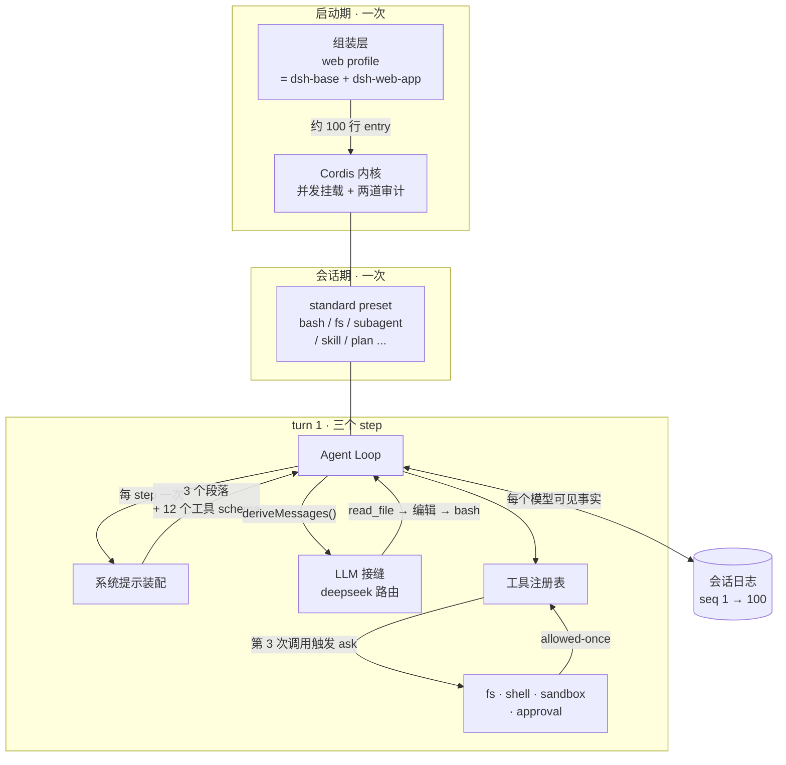

# 完整重演：一句话请求的完整旅程 + 动手练习

> **你在哪**：终点。前面十一篇把八个角色逐个拆开了，这一篇把它们**缝回一条连续的时间线**——同一个示例，这次带着全部深度。
>
> **读完你会知道**：这一分钟里每一毫秒发生了什么、每一个部件在第几步上场、以及每一个都可以怎么被换掉。文末有七个动手练习和一页速查卡。

---

## 一、先把场景重述一遍

```sh
cd ~/my-project
npx @deepseek-ai/dsh web
```

浏览器打开 `http://127.0.0.1:3080` → Settings → Models 填 DeepSeek API key → Choose workspace 选中 `~/my-project` → 新建会话（preset 默认 `standard` 标准模式）→ 发出：

> **"读一下 package.json，给 README 补一个 Quick Start 小节，然后跑一次 `pnpm lint` 确认没问题。"**

## 二、带注解的协作图

这是第 3 篇那张总览图，把这次示例的**具体数据**标在每一跳上：



## 三、时间线：从按下回车到看见总结

### T+0ms · 启动早已完成（第 1 步）

进程起来的时候发生过这些（第 4、5 篇）：

```
resolveDshHome()          → ~/.dsh
profiles/web/package.json → dsh.profile.bundles = [dsh-base, dsh-web-app]
composeEntries()          → 空列表
                            ← dsh-base/cordis.patch.yml     （llm, session, agent,
                                                              sandbox, approval,
                                                              tool-bash, tool-fs, ...）
                            ← dsh-web-app/cordis.patch.yml  （webserver, api-gateway,
                                                              client-runtime, ...）
                            ← profiles/web/cordis.patch.yml （空）
                            ← ~/.dsh/cordis.patch.yml       （空）
mountRootInclude()        → Loader 并发挂载
assertEntriesLoaded()     ✓
assertEntriesActivated()  ✓
                          → http://127.0.0.1:3080
```

想看你自己机器上这棵树：

```sh
dsh --profile web --dump-config
```

### T+0ms · 会话已建好（第 2 步）

`agent-presets.mount(agentCtx, 'standard')` 在 agent 工厂的 `setup()` 窗口里跑过了：标准模式子树本进程挂载一次，你的 agent 作用域 parent 到它。于是 `bash`、`str_replace_editor`、`read_file`、`grep`、`subagent`…… 在你这个会话上可见（第 5 篇）。

### T+5ms · 你按下回车（第 3 步）

```
agent.followup({ role: 'user', content: [...], source: 'human' })
  → agent/inbox/spliced      （UI 收到）
  → agent/inbox/inserted     （UI 收到）
  → 唤醒驱动
  → agent/status: running
  → 日志 seq 1: turn/start { turn: 1 }
```

### T+8ms · 认领与拦截（第 4 步）

```
claim('next-turn')            → 你这一条消息 + next-step 里的一切（空）
  → agent/inbox/claimed       （UI 收到，每条一次）
agent/pre-step  (waterfall)
  → dsh-compaction-basic 监听器：看上下文压力 → 无压力 → next()
  → 返回 enter([你的消息])
  → 日志 seq 2: step/start { turn: 1, step: 1 }
  → 日志 seq 3: user/message { source: 'human', content: [...] }
```

### T+12ms · 装配前缀（第 5 步）

```
systemPrompt.assemble({ scope: <你的 agent> })
  收集：
    section  order -100  harness 身份
    section  order    0  persona（{{model}} {{cwd}} 待插值）
    section  order  100+ 工具指引
    context               工作区 / 权限策略 / 时间
    tools                 read_file, str_replace_editor, bash, grep, glob,
                          todo_write, subagent, ask_user, ...
  → system-prompt/assemble waterfall（作用域过滤）
  → renderPrompt()：{{model}} → deepseek-chat
                    {{cwd}}   → /Users/you/my-project
```

### T+15ms · 发出请求（第 6 步）

```
prepareCall()  → 捕获 deepseek 路由的注册 + 重试策略（默认 5 次）
               → 解析模型：上下文容量、defaultMaxTokens
日志 seq 4: request/header { header: <完整前缀>, reason: ... }
agent/request  (waterfall) → 无人拦截
llm/stream     (waterfall) → 无人拦截 → 终端续延此时才查找适配器
DeepSeek 适配器 → HTTP POST（带 attributionHeaders()）
空闲看门狗上膛（5 分钟）
```

### T+400ms–2s · 流回来了（第 7 步）

```
日志 seq 5..40: assistant/chunk   ← 每一个原始分片，token 级保真
                  block-start(text)
                  text-delta "我先看一下 package.json"
                  block-end
                  block-start(tool_use)
                  argumentsDelta '{"pa'  'th":"pack'  'age.json"}'
                  block-end
日志 seq 41: assistant/message {
               message: <text + tool_use>,
               usage: { input: 3187, output: 42 },
               sourceEventSeqs: [5..40]
             }
```

`arguments` 至此仍是**原样字符串**（第 9 篇契约 2）。

### T+2s · 第一次工具调用（第 8 步）

```
日志 seq 42: tool/call { callId: 'c1', name: 'read_file',
                         arguments: '{"path":"package.json"}' }

ctx.tools.execute({ callId: 'c1', name: 'read_file',
                    arguments: <解析并深冻结>, agent, signal })
  ① tools/pre-execute  → 读工作区内文件 → next() → allow
  ② 单调守卫           → 通过
  ③ tools/execute      → 超时策略包一层
  ④ execute()          → ctx.fs.read('package.json')
  ⑤ output.render()    → ContentBlock[]
  ⑥ tools/post-execute → finalizeContent → tools/result（冻结）

日志 seq 43: tool/result { callId: 'c1', message: <文件内容> }
日志 seq 44: step/end { turn: 1, step: 1 }
```

### T+2.1s · 同一个 turn 的第二步（第 9 步）

判定：**"tools owe another request"** —— 模型必须看到工具结果才能继续。**turn 不关**。

```
日志 seq 45: step/start { turn: 1, step: 2 }
             （装配又跑一次：section 一字节没变 → KV Cache 命中）
             （历史长了；动态上下文没变 → 不追加新快照）
...
日志 seq 77: tool/call   { callId: 'c2', name: 'str_replace_editor', ... }
日志 seq 78: tool/result { callId: 'c2', message: <编辑成功>,
                           meta: { diff: '@@ -1,3 +1,12 @@ ...' } }
                                        ↑ UI 那张 diff 卡片的数据来源
日志 seq 79: step/end { turn: 1, step: 2 }
```

`meta` 必须可 JSON 序列化，否则 `Session.append` 在源头就拒绝（第 6 篇）。因为它在日志里，所以**关掉浏览器再打开，卡片一模一样**——`presentResult()` 是纯函数。

### T+2.2s · 第三步：审批与沙箱（第 10–11 步）

```
日志 seq 96: tool/call { callId: 'c3', name: 'bash',
                         arguments: '{"command":"pnpm lint"}' }

① tools/pre-execute
     权限监听器：会产生副作用的命令 + 会话策略 ask
     → 返回 ask，短路，不调 next()
   注册表 → ctx.approval.request({ callId: 'c3', ... })
                           ↑ 故意不带参数，靠 callId 挂到已呈现的调用上
   日志（审计）: approval/asked { requestId }
   Web UI 答复者 → 弹窗
   ─────────── 你点了「允许」 ───────────
   日志（审计）: approval/decided { requestId, outcome: 'allowed-once' }
   → 只有 allowed-once 才继续

② 守卫 → ③ tools/execute（超时包装）
④ execute() → ctx.shell.run('pnpm lint')
     ctx.sandboxPolicy.resolve({ session })
       → { mode: 'workspace-write',
           workspaceRoot: '/Users/you/my-project',   ← 先解 symlink 再规范化
           sessionId: <本会话> }
     ctx.sandbox.wrap(argv, policy)
       → macOS Seatbelt 包装；enforcement: 'full'
     ctx.subprocess.spawn(受限 argv)
       → 退出码 0，stdout "✔ no problems"
⑤ output.render → ⑥ finalizeContent（bash 施加自己的长度上限）

日志 seq 97: tool/result { callId: 'c3', message: <lint 输出> }
日志 seq 99: step/end { turn: 1, step: 3 }
```

### T+4s · 收尾（第 12 步）

```
模型给出总结文本，没有新的工具调用
next-step 队列为空 → 自然停止条件满足
agent/turn-stopping (serial, 无 next())
  → 目标插件：没有活跃目标 → 不接
日志 seq 100: turn/end { turn: 1, reason: <正常完成> }
agent/status: idle
```

## 四、这一分钟里，每个角色干了什么

| 角色 | 干的活 | 换掉它意味着 |
|---|---|---|
| Cordis 内核 | 挂载约 100 行 entry，解析依赖，两道启动审计 | 换不了也不需要换——它对业务一无所知 |
| 组装层 | 决定这 100 行是哪 100 行；决定这个会话有哪 12 个工具 | 改一份 YAML |
| 会话日志 | 写下 100 条事件；三次派生模型历史 | 换持久化后端（jsonl → 数据库） |
| Agent Loop | 1 个 turn、3 个 step、1 次终止检查点 | 写一个新 driver 顶掉 `ctx.agentLoop` |
| 系统提示装配 | 3 次装配；插值 `{{model}}` `{{cwd}}` | 加/删/改提示段落，或注册 waterfall 监听器 |
| LLM 接缝 | 3 次请求；~120 个分片；1 次 usage 记账 | 换适配器（换厂商 / 换自建端点 / 录制回放） |
| 工具注册表 | 3 次调用过五段管线；1 次 ask 决策 | 加工具、加策略监听器、加超时包装 |
| 能力接缝 | 1 次文件读、1 次文件写、1 次审批、1 次沙箱 spawn | **换两个 provider，整个执行世界搬到远程** |

## 五、回到最初的问题

第 1 篇说，那两百行 demo 和一个能用的 Agent 之间隔着三堵墙：

**第一堵墙（边界情况把两百行变成六千行）**——这一分钟里，你看到了它们各自被安置在哪：截断在 `finalizeContent`，超时在 `tools/execute` 包装器，并发在执行模式分类，取消在 `AgentCancelCause`，上下文超限在 `agent/pre-step` + `CONTEXT_WINDOW_EXCEEDED`，中途打断在 `assistant/message` 的 `interrupted: true`。**它们不再纠缠在一个大循环里，各自有名字、有归属、有契约。**

**第二堵墙（能力被焊死）**——上面那张表最后一列就是答案。**包括循环本身**：`core/agent` 声明接口，`core/agent-loop` 只是"默认实现"。

**第三堵墙（黑盒无法审计）**——那 100 条日志事件就是答案。不是"日志里有这次请求"，而是"模型看见的每一个字节都是一条可重放的事件"，并且有运行时不变量在守着这条规矩。`seq 4` 那条 `request/header` 让你能重建"第一次请求时模型看到的完整前缀"；`minimal` preset 让你能把变量按死，只比较模型本身。

---

## 六、七个动手练习

每个练习验证一篇文章的一个具体论断。建议按顺序做。

### 练习 1 · 看见那棵树（验证第 5 篇）

```sh
npx @deepseek-ai/dsh --profile web --dump-config > tree.yml
wc -l tree.yml
grep -n '# ==' tree.yml | head            # 每段的来源标注
grep -n 'id: sandbox\|id: approval\|id: llm' tree.yml
```

**要观察的**：`# ==` 注释标出了每一段行来自哪个文件、叠了哪些补丁层；整份输出仍然是一个可加载的 YAML 文档。

### 练习 2 · 改一行配置，不改一行代码（验证第 4、5 篇）

在 `~/.dsh/cordis.patch.yml` 里按 id 打一个补丁，改掉某个工具给模型看的 `description`，然后重启并再 dump 一次确认生效。

**要观察的**：补丁是**整体替换 config**（没有深合并）——这一行原本的其他字段你必须重抄。抄漏一个试试，看会怎样。

### 练习 3 · 对比两个 preset 的系统提示（验证第 8 篇）

同一个问题，分别在**标准模式**和**极简模式**下跑一次，然后对比两条会话的 `request/header` 事件。

**要观察的**：极简模式的人格段落标了 `complete: true`，所以它**独占整个系统提示**；`includeRuntimeContext: false` 让动态上下文也不出现。工具 schema 从十几个变成两个。**这就是评测所需的"把变量按死"。**

### 练习 4 · 数一数 turn 和 step（验证第 6、7 篇）

发一个需要三四次工具调用的请求，然后翻会话日志，数 `turn/start` 和 `step/start` 各有几条。

**要观察的**：一个 turn 里有多个 step；`turn/start` 出现在认领输入**之前**。再试一次中途点「停止」，看 `turn/end` 的 reason 变成什么，以及 `assistant/message` 上是否出现了 `interrupted: true`。

### 练习 5 · 让审批失败（验证第 10、11 篇）

把会话的审批策略切到 `never`，然后让 agent 跑一条命令。

**要观察的**：它得到的是**确定性的 `rejected`**，没有任何答复者被派发。这正是 CI / 无人值守场景要的姿态。再想一想：如果审批服务本身崩了会怎样？（答案：`unavailable` → 拒绝，而不是放行。）

### 练习 6 · 写一个 `tools/pre-execute` 监听器（验证第 4、10 篇）

写一个最小插件，监听 `tools/pre-execute`，对任何触碰某个目录的编辑一律返回 `ask`。挂到你的 profile 补丁里。

**要观察的**：你**没有改任何核心代码**；你的监听器是"策略型"的——拥有决定时**不调 `next()`**（第 4 篇）。顺手验证一下：不小心忘了 `next()` 的观察型监听器会发生什么。

### 练习 7 · 读一次源码路径（验证第 3 篇的整张地图）

打开仓库，按这个顺序读，每个文件只看导出的类型：

```
docs/architecture.md                    ← 先读这个（约 100 行，信息密度极高）
packages/core/session/src/types.ts      ← SessionEventMap
packages/core/agent/src/types.ts        ← Agent 接口
packages/core/tools/src/index.ts        ← ToolDefinition + 五段管线
packages/llm/*/src/                     ← LlmAdapter
apps/cli/config/agent-presets/*/agent.cordis.yml   ← 四个 preset 的差异
```

**要观察的**：这四个类型文件加起来就是第 3 篇那张概念地图。以及——**每个包的 README 都有一节 "KV Cache effect"**，说明该插件对提示缓存的影响。这个纪律本身就值得抄走。

---

## 七、速查卡

### 核心服务 key

| key | 拥有 |
|---|---|
| `ctx.sessions` | 只追加会话日志，唯一真相源 |
| `ctx.systemPrompt` | 提示段落 / 动态上下文 / 变量 / 工具 schema 装配 |
| `ctx.tools` | 工具注册表 + 五段执行管线 |
| `ctx.agents` | Agent 接口与注册表（**扩展只依赖它**） |
| `ctx.agentLoop` | 默认驱动（**可替换**） |
| `ctx.llm` | 消息词汇表 + 适配器接缝 |
| `ctx.fs` / `ctx.shell` / `ctx.subprocess` | 文件 / 命令 / 进程 |
| `ctx.sandbox` / `ctx.sandboxPolicy` | 文件效果限制与策略解析 |
| `ctx.approval` / `ctx.permissionPresets` | 审批与权限预设 |
| `ctx.subagents` / `ctx.jobs` / `ctx.goals` | 子代理 / 后台作业 / 目标 |
| `ctx.agentPresets` | preset 花名册与挂载 |

### 事件三域

| 域 | 什么时候用 |
|---|---|
| **会话事件**（落日志，`session/event` 广播） | 这个事实必须**活过重启** |
| **Agent 事件**（`agent/*`，带活的 Agent） | 观察或**拦截**进行中的工作 |
| **能力事件**（`fs/*`、`tools/*`、`telemetry/*`） | 给某个接缝挂策略或适配器，**不用 import 循环** |

### 四种派发模式

| 模式 | await | 返回值 | 用途 |
|---|---|---|---|
| `emit` | 否 | 无 | 通知 |
| `waterfall` | 否 | 有 | **拦截**（around 中间件，`next()` 委托） |
| `parallel` | 是 | 无 | 扇出 |
| `serial` | 是 | 有 | 依次决策 |

### 一个 turn 的骨架

```
turn/start → claim → agent/pre-step → step/start → user/message
  → 装配 → deriveMessages → agent/request → llm/stream
  → assistant/chunk* → assistant/message
  → tool/call* → pre-execute → execute → post-execute → tool/result*
  → step/end → （还欠请求？→ 下一个 step）
→ agent/turn-stopping → turn/end
```

### 三条要背下来的规矩

1. **模型可见即已记录**（Model-visible means logged）——想给模型加东西？先落一条日志事件。
2. **失败即关闭**（fail-closed）——审批 `unavailable` = 拒绝；`ask` 但没有审批能力 = 拒绝；并发安全**只有显式 `true` 才算**。
3. **接缝是三个角色的总和**——加能力就要设计服务定义、提供者、消费者三样，缺一不是接缝。

### 常用命令

```sh
npx @deepseek-ai/dsh web                    # Web UI，127.0.0.1:3080
npx @deepseek-ai/dsh web --no-open          # 不自动开浏览器
npx @deepseek-ai/dsh --profile headless "跑一下测试"   # 一次性任务，打印答案后退出
npx @deepseek-ai/dsh --profile web --dump-config      # 看这台机器实际会挂的树
npx @deepseek-ai/dsh plugin --profile web add <pkg>   # 给 profile 装外部插件
```

---

## 八、继续往下走

- **仓库文档**：`docs/architecture.md`（总图）→ `docs/cordis-primer.md`（内核五个概念）→ `docs/glossary.md`（术语，写得极好）→ `docs/subsystems/`（每个子系统一页）。
- **扩展指南**：`docs/cookbook/` 下有加包、加工具、加 LLM 适配器、加会话节点、加设置卡片的分步指南。
- **事故复盘**：`docs/postmortem/` —— 少见的、把真实事故连同根因写下来的开源目录，比大多数教程更有营养。
- **姊妹系列**：[LLM 全景指南](../llm-fundamentals/index.md)（模型侧）、[多模态大模型](../multimodal/index.md)。本系列讲的是模型**外面**那一层。

---

**上一篇** ← [11 · 能力接缝](11-capability-seams.zh.md)
**回到** → [系列索引](index.md)
