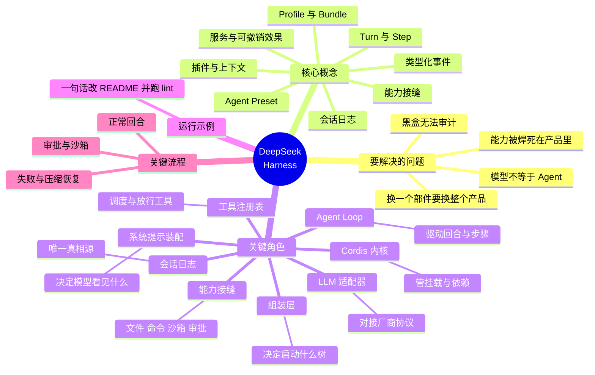
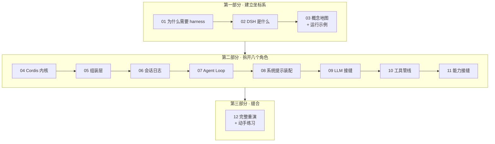

# DeepSeek Harness 深入指南 / DeepSeek Harness Series

[← Back to AI](../README.md)

一个把「**模型 + Harness = Agent**」这句口号拆到源码级别的中文系列。**十二篇文章、一条主线**：从"为什么光有模型不等于有 Agent"开始，拆开 Cordis 内核、组装层、会话日志、Agent Loop、系统提示装配、LLM 接缝、工具管线、能力接缝八个关键角色，最后带着全部深度重跑一遍开篇的示例。

> 对象：DeepSeek 于 2026 年 8 月开源的 [`deepseek-ai/deepseek-harness`](https://github.com/deepseek-ai/deepseek-harness)（命令名 `dsh`），MIT 协议，开发者预览版。本系列所有代码、配置、事件名均取自该仓库 `docs/` 与 `packages/` 的实际内容。
>
> ⚠️ 官方明确写着 **THERE WILL BE COMPATIBILITY-BREAKING CHANGES**（会有破坏性变更）。本系列讲的是**设计骨架**——骨架比 API 稳定得多；具体字段名请以仓库当时的 `docs/architecture.md` 为准。

姊妹系列：[LLM 全景指南](../llm-fundamentals/index.md)、[多模态大模型](../multimodal/index.md)。本系列默认你知道 token、上下文窗口、tool call 是什么；不清楚的话建议先读前者的 03 与 10。

---

## 缩写对照表

| 缩写 | 英文全称 | 中文 |
|---|---|---|
| DSH | DeepSeek Harness | DeepSeek 智能体外壳（命令名 `dsh`） |
| LLM | Large Language Model | 大语言模型 |
| API | Application Programming Interface | 应用程序编程接口 |
| CLI | Command Line Interface | 命令行界面 |
| UI | User Interface | 用户界面 |
| TUI | Terminal User Interface | 终端用户界面 |
| SDK | Software Development Kit | 软件开发工具包 |
| MCP | Model Context Protocol | 模型上下文协议 |
| ACP | Agent Client Protocol | 智能体客户端协议 |
| HMR | Hot Module Replacement | 模块热替换 |
| PTY | Pseudo Terminal | 伪终端 |
| LSP | Language Server Protocol | 语言服务器协议 |
| YAML | YAML Ain't Markup Language | 一种配置文件格式 |
| JSON | JavaScript Object Notation | 一种数据交换格式 |
| PTC | Programmatic Tool Calling | 程序化工具调用（`code` preset 的官方名） |

---

## 一条主线：贯穿全篇的运行示例

> 你在自己的项目目录里敲下 `npx @deepseek-ai/dsh web`，浏览器打开 `http://127.0.0.1:3080`，填好 DeepSeek API key、选好工作区，然后发出一句话：
>
> **"读一下 package.json，给 README 补一个 Quick Start 小节，然后跑一次 `pnpm lint` 确认没问题。"**
>
> 一分钟后：它读了 `package.json`、改写了 `README.md`、弹窗问你「是否允许执行 `pnpm lint`」、你点了允许、命令在沙箱里跑完、它回了一句总结。
>
> **这一分钟里，没有任何一行代码是"harness 的核心"——每一步都是一个可以被替换掉的插件。** 这怎么做到的，以及为什么要这么做？

示例在[第 3 篇](03-concept-map.zh.md)完整定义并浅层追踪成 12 步，之后每篇结尾的 **⚓ 回到示例**都会把当篇的深度接回它，[第 12 篇](12-walkthrough.zh.md)带着全部深度重演一次。

## 全域思维导图

## 阅读地图

## 文章列表与 CSDN 发布状态

### 第一部分 · 建立坐标系

**01 · 为什么需要 harness：模型再强，也不会自己去读文件**

模型交付的只有 token，可 Agent 需要的是"看环境、动手、还能接着干"；2023—2025 年这层壳是怎么长出来的、又是怎么被焊死在各家产品里的；为什么"换一个模型/换一个沙箱/换一个循环"这三件事在闭源产品里都做不到；以及评测复现这个被低估的痛点。

- [x] [01-why.zh.md](01-why.zh.md) — 中文版

**02 · DeepSeek Harness 是什么：定义、边界与生态位置**

一句话定义拆解；"Everything is a plugin. Every run is traceable." 两句设计信条各自换来什么；它**不是**模型、不是 IDE、不是又一个 Agent 编排 SDK；与 Claude Code / Codex / LangGraph / MCP 的关系（它甚至可以把前两者当子代理调用）；四个 preset 的定位。

- [x] [02-what.zh.md](02-what.zh.md) — 中文版

**03 · 概念地图：八个概念、八个角色、一个运行示例**

插件与上下文、服务与可撤销效果、类型化事件、Profile/Bundle、Agent Preset、会话日志、Turn/Step、能力接缝——八个概念按依赖顺序串起来；八个关键角色各自的"唯一职责 / 知道什么 / 刻意不做什么"；协作总览图；以及贯穿全系列的运行示例的完整定义与 12 步浅层追踪。

- [x] [03-concept-map.zh.md](03-concept-map.zh.md) — 中文版

### 第二部分 · 拆开八个角色

**04 · Cordis 内核：为什么"一切皆插件"不是口号**

五个概念撑起整个内核：插件即服务、上下文即服务仓库、`inject` 声明依赖、类型化事件、注册即可撤销效果。`emit`/`waterfall`/`parallel`/`serial` 四种派发模式各自的语义；waterfall 的 `next()` 为什么是 around 中间件；以及"没有特权核心可打补丁"这句话的实际后果。

- [x] [04-cordis.zh.md](04-cordis.zh.md) — 中文版

**05 · 组装层：Profile、Bundle、Patch 与 Agent Preset**

启动时的插件树是从空列表叠出来的：bundle 层 → profile 补丁 → home 补丁 → `--patch` 覆盖层。`dsh --dump-config` 为什么是这个项目最该先跑的命令；**宿主平面 vs 代理平面**这条分界线（谁能拥有注册表、谁只能拥有工具）；一个 preset 为什么必须待在带 `isolate` 的 group 里。

- [x] [05-composition.zh.md](05-composition.zh.md) — 中文版

**06 · 会话日志：唯一真相源，以及"模型可见即已记录"**

`SessionEvent` 事件表逐条读；消息历史是**派生**出来的而不是存下来的；`turn/*`、`step/*`、`user/message`、`assistant/chunk`、`assistant/message`、`tool/call`、`tool/result` 各自记什么；为什么连原始流式分片都要落盘；以及那条运行时不变量：任何进入模型请求的东西都必须能从日志重建。

- [x] [06-session-log.zh.md](06-session-log.zh.md) — 中文版

**07 · Agent Loop：一个 turn 到底发生了什么**

turn 与 step 的精确定义；inbox 的两条队列（`next-turn` / `next-step`）与 `followup`/`steer`/`inject` 三个别名；`agent/pre-step` 这个"决定模型看见什么"的 waterfall；工具调用的并发调度（barrier 与滚动池）；取消、错误恢复与压缩重试如何在同一条时间线上共存。

- [x] [07-agent-loop.zh.md](07-agent-loop.zh.md) — 中文版

**08 · 系统提示装配：模型看见的前缀是被"拼"出来的**

`PromptSection` 的 `order` 约定（-100 身份、0 人格、100–199 工具指引）；`complete` 段落如何独占整个系统提示；`PromptContext` 为什么要和 section 分开——它关系到 KV Cache 命中率；工具 schema 如何在装配期被挑选、被 scope 遮蔽（shadowing）、被 restriction 过滤。

- [x] [08-system-prompt.zh.md](08-system-prompt.zh.md) — 中文版

**09 · LLM 接缝：把"厂商协议"关进一个可替换的盒子**

`LlmAdapter` 的适配器契约逐条读：usage 必须在 finish 之前、工具参数全程保持原始 JSON 字符串、两条错误路径一个失败类型、一次适配器调用就是一次厂商尝试；`llm/stream` waterfall 为什么在适配器查找之前；空回复为什么被判定为可重试错误；以及 replay 状态（推理链复用）的归属规则。

- [x] [09-llm-adapter.zh.md](09-llm-adapter.zh.md) — 中文版

**10 · 工具注册表与执行管线：一次工具调用要过五道关**

`ToolDefinition` 的字段分层（哪些给模型看、哪些绝不能泄漏进请求）；`pre-execute → 单调守卫 → execute → post-execute → finalizeContent → result` 五段管线各自能改什么；allow/deny/ask 三态决策与失败即拒绝；并发安全声明 `isConcurrencySafe`；Code Mode 下"模型直呼原生工具"为什么被直接拒绝。

- [x] [10-tools.zh.md](10-tools.zh.md) — 中文版

**11 · 能力接缝：文件、命令、沙箱、审批、子代理**

接缝的三个角色（服务定义 / 提供者 / 消费者）为什么缺一不可；一次 provider 替换如何把 Bash、PTY、LSP 一起搬到远程沙箱；`SandboxMode` 三档策略与"部分执行"这个诚实的事实；审批为什么是 fail-closed 的；子代理接缝如何把 Claude Code 和 Codex 变成可调用的孩子。

- [x] [11-capability-seams.zh.md](11-capability-seams.zh.md) — 中文版

### 第三部分 · 缝合

**12 · 完整重演：一句话请求的完整旅程 + 动手练习**

从你按下回车到它回出总结，一条连续时间线串起全部十一篇；随后是七个动手练习，每个验证一篇文章的一个具体论断；最后是一页速查卡片。

- [x] [12-walkthrough.zh.md](12-walkthrough.zh.md) — 中文版

---

*勾选框表示已完成中文稿。建议阅读顺序即编号顺序；只想知道"这东西值不值得看"的读者，读 01 + 02 即可；已经在做 Agent 框架的读者可以从 03 直接切入，再挑 04/07/10 三篇。*
