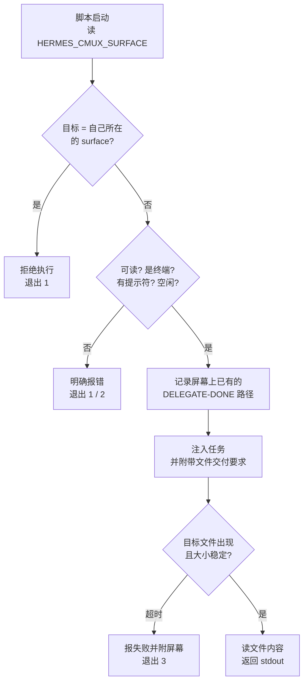

# 让一个 Agent 驱动另一个交互式 Agent：cmux-delegate 的六个坑

让 Hermes Agent（Nous Research 的开源 Agent Harness，代理运行框架）把重活交给 Claude Code 去做，最直觉的方式是 `claude -p "<task>"`——无头、单次、拿 stdout。但它"什么都干不了"：每次写文件都回一句 *blocked pending permission*。

于是自然想到：**复用一个已经开着的交互式会话**——它已经过了各种授权门，还带着仓库上下文。终端复用器 cmux 恰好提供了 `send` 与 `read-screen` 两个原语，看起来一拍即合。

真做下来，**能用，但和最初设想完全不同**：屏幕不能当传输通道，完成信号不能靠屏幕上的标记，而最危险的两个 bug 都是"静默给出错误答案"。本文记录这六个坑，以及它们如何反过来决定了最终设计。

> 环境：Hermes Agent v0.21.0，Claude Code 2.1.26x，cmux（Ghostty 内核，Unix socket 控制），macOS。
> 文中所有标识符均为占位符。

## 缩写对照表 (Abbreviation Glossary)

| 缩写 | 英文全称 | 中文 |
|---|---|---|
| CLI | Command-Line Interface | 命令行界面 |
| TUI | Text-based User Interface | 终端图形界面 |
| PTY | Pseudo-Terminal | 伪终端 |
| UUID | Universally Unique Identifier | 通用唯一标识符 |
| ANSI | American National Standards Institute (escape codes) | 终端控制码 |
| cwd | Current Working Directory | 当前工作目录 |

---

## 1. 先别急着复用会话：两个限制其实是分开的

"无头模式什么都干不了"其实是**两个独立机制**叠在一起，很容易被当成一个。

### 限制一：权限提示无人应答

`claude -p` 默认把权限提示交给 "host"，而无头运行没有 host——于是**任何需要确认的操作都被自动拒绝**。加一个标志即可解决：

```bash
claude -p "<task>" --permission-mode acceptEdits
```

实测对比，同一个任务：

| 调用 | 结果 |
|---|---|
| `claude -p "创建 /tmp/x.txt"` | *the write was blocked pending permission* → 文件未创建 |
| 加 `--permission-mode acceptEdits` | 文件创建成功 |

可选值为 `acceptEdits / auto / bypassPermissions / manual / dontAsk / plan`。`acceptEdits` 同时覆盖文件写入**与命令执行**（实测跑 `git status` 正常），够用且比 `bypassPermissions` 克制。

### 限制二：工作目录边界

加了标志之后仍可能失败——而且是**看起来成功的失败**。Claude Code 只在工作目录内动手，目标路径在外面时它可能**改写到 cwd 里去**：

```
任务：在 /tmp 下建文件（从 ~/workspace 启动）
结果：文件出现在 ~/workspace/，回复却说"已创建"
```

解决是显式授权：`--add-dir /tmp`。

**结论：如果痛点只是"权限"，一个标志就够了，根本不需要复用会话。** 复用会话买到的是另一样东西——热上下文。下面的工程量，只在你确实需要热上下文时才值得。

---

## 2. 机制：cmux 的两个原语

```
cmux send        --surface <ref> <text>    # 向终端注入按键，\n 即回车
cmux read-screen --surface <ref> [--lines N] [--scrollback]
```

三个前置事实，都是实测得来：

- **socket 无 TTY 可用**。`env -i HOME=… PATH=… cmux ping` 返回 `PONG`——意味着 launchd 下的常驻进程也能驱动它。这是整个方案成立的前提。
- **`read-screen` 输出是干净文本，零 ANSI 控制码**。不必处理终端转义。
- **`send` 能透传转义序列**。`$'\033[B'` 成功移动了 TUI 选择器——所以连启动时的信任确认框都能驱动。

surface 用 `surface:N` 这种 ref 定位，但**ref 会在 cmux 重启后重新编号**；`--surface` 同时接受 UUID，配置里应当存 UUID。

---

## 3. 六个坑

### 坑 1：`agent-session` 类型的 surface 不是终端

直觉上应该用 `cmux new-surface --type agent-session --provider claude` 建一个"Claude 会话"。但它是 React 渲染的面板，不是 PTY：

```
Error: invalid_params: Surface is not a terminal
```

正确做法是建普通终端再在里面跑 claude：`--type terminal` + `send "claude\n"`。

### 坑 2：长输出被静默截断，而且"要得多反而拿不到"

让会话输出 60 行，然后用不同参数去读：

| 参数 | 拿到的行数 |
|---|---|
| 默认 | **26 / 60**（只有可见屏幕，LINE-35..60）|
| `--scrollback` | 26 / 60（并无改善）|
| `--lines 100` | **0** |
| `--lines 300` | **0** |

请求超过缓冲区的行数，返回的不是"尽力而为"，而是**空**。这条直接否定了"屏幕即传输通道"的设想。

### 坑 3：完成标记是上一轮的残留

轮询 `· done` 判断完成，会**立刻命中上一轮留在屏幕上的标记**，于是在新回复还没渲染时就去读屏——我第一次测长输出时统计出"1 行"，正是这个原因。

附带一条：完成标记的动词还会变，实测见过 `Cooked for` 与 `Worked for` 两种。要匹配也该匹配 `· done`，而不是动词。

### 坑 4：新会话有启动门

全新会话在抵达提示符前会依次弹出**文件夹信任确认**与 **Chrome 工具确认**。可以用转义序列驱动过去，但更合理的结论是：**surface 应当由人手工准备一次**，而不是每次任务现开。

### 坑 5：脚本把提示词打进了"自己"所在的会话 ⚠️

测试"目标 surface 里没跑 claude"这个分支时，我随手填了当前会话的 surface。脚本看到空闲提示符，判断可注入，于是**把提示词原样打进了正在发起调用的那个会话**——两条"用户消息"凭空出现在对话里。

这不是假想风险：如果 `HERMES_CMUX_SURFACE` 指向操作者自己的标签页，每次委派都会污染它。修法是让脚本先问自己是谁：

```bash
cmux identify   # caller.surface_ref → 当前进程所在的 surface
```

相同则直接拒绝执行。

### 坑 6：返回了上一个任务的答案 ⚠️⚠️

最危险的一个。脚本有个兜底逻辑：如果首选路径没出现文件，就从屏幕上找 `DELEGATE-DONE <path>` 那一行。但**上一轮的这行还在屏幕上，它指向的文件也还在**——于是新任务问 `UUID-OK`，脚本返回了上一轮的 `PONG`。

这本质上是坑 3 换了个马甲：**任何"从屏幕找标记"的逻辑都必须先排除发送前就已存在的那些**。修法是发送前先记录屏幕上已有的路径集合，轮询时跳过它们。

```bash
BASELINE_PATHS="$(grep -oE "DELEGATE-DONE[[:space:]]+/[^[:space:]]+" <<<"$SCREEN" | awk '{print $2}' | sort -u)"
# 轮询时： ! grep -qxF "$alt" <<<"$BASELINE_PATHS"
```

**静默给出错误答案，比明确失败危险得多**——坑 5 和坑 6 都属于这一类，也是最值得写进测试的两条。

---

## 4. 最终设计

六个坑倒推出的契约：**屏幕只用于判断状态，结果一律走文件。**



注入的提示词里固定追加一段：

> 完成后把完整结果写入 `<唯一路径>`，然后只回一行：`DELEGATE-DONE <绝对路径>`，不要打印结果本身。

于是：

- **完成判定** = 文件出现且连续两次轮询大小不变（不依赖屏幕标记，绕开坑 2、3、6）
- **传输** = 文件内容（绕开坑 2）
- **退出码分层**：0 成功 / 1 配置或目标不可用 / 2 目标正忙 / 3 超时

调用方规则同样重要：**任何非零退出都必须回退到 `claude -p` 并说明，绝不允许把失败编成结果**。

### 超时要给够

默认 300 秒太短：一次真实任务跑了约 7 分钟，脚本超时报失败，而文件在两分钟后才出现——**结论正确（当时确实没有结果），但阈值不合理**。改为默认 900 秒。

---

## 5. 可迁移的经验

1. **先确认痛点属于哪一层**。"无头 agent 干不了活"混着权限与工作目录两个机制，前者一个标志就能解决。别用架构去解决一个配置问题。
2. **终端屏幕不是 API**。可见区域有限、请求超量返回空、历史残留会污染判定。要结果就落文件，屏幕只用来判断状态。
3. **任何"扫描屏幕找标记"的逻辑，都要先给屏幕拍个基线**，排除动作发生前就存在的内容。否则读到的是上一轮。
4. **驱动别人之前先确认自己是谁**。能注入输入的自动化，必须能识别并拒绝"注入到自身"。
5. **静默的错误答案是最坏的失败模式**。宁可明确超时退出，也不要返回一个看起来合理的旧结果——这正是坑 6 的教训。
6. **复用会话不改变配额**。它省的是重复加载上下文的 token，不是额度上限；实测过程中订阅额度耗尽了两次。

---

## 结论

"复用已有会话"听起来是个调度问题，实际做下来是个**边界识别问题**：哪些信号可信、哪些是上一轮的残留、自己有没有可能成为自己的目标。

真正决定设计的不是 cmux 提供了什么能力，而是那六个坑——尤其是最后两个静默错误。如果只想解决"无头模式权限不足"，`--permission-mode acceptEdits` 一个标志就够了；只有当热上下文本身有价值时，上面这套工程量才划算。
