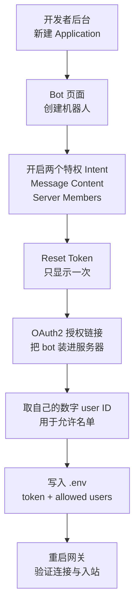

# Hermes Agent 接入 Discord：一次没有踩坑的配置

把 Hermes Agent（Nous Research 的开源 Agent Harness，代理运行框架）接到 Discord 机器人，全程一次通过。相比[飞书接入的三个坑](feishu-integration-troubleshooting.md)，Discord 这次顺利的原因不是它更简单，而是**每一步都在写入配置前做了验证**。

本文记录完整流程，重点在三处**容易混淆但可以提前验证**的地方：两个 19 位雪花 ID 谁是谁、四个凭证里哪个才是登录用的、以及一个"看起来成功实则失效"的开关。

> 环境：Hermes Agent v0.21.0，Discord 自建应用，Gateway（WebSocket）模式。
> 文中所有应用标识、用户标识、令牌均为占位符。

## 缩写对照表 (Abbreviation Glossary)

| 缩写 | 英文全称 | 中文 |
|---|---|---|
| API | Application Programming Interface | 应用程序接口 |
| OAuth2 | Open Authorization 2.0 | 开放授权协议 2.0 |
| DM | Direct Message | 私聊 |
| Intent | Gateway Intent | 网关意图（事件订阅范围）|
| REST | Representational State Transfer | 一种 HTTP 接口风格 |
| Ed25519 | — | 一种椭圆曲线数字签名算法 |
| CLI | Command-Line Interface | 命令行界面 |

---

## 1. 整体流程



关键前提：**Discord 机器人只能通过 OAuth2 授权链接由管理员"安装"进服务器，不能用 `discord.gg` 邀请链接加入**。`discord.gg` 链接是给人用的。这一点后面单独说。

---

## 2. 后台配置

1. 在 [Discord Developer Portal](https://discord.com/developers/applications) 新建 Application，记下 **Application ID**。
2. 左侧 **Bot** 页面自动创建机器人；把 **Public Bot** 打开（使用官方安装链接所必需）。
3. **开启两个特权 Intent**（下节详述）。
4. **Reset Token** 并立即复制——**只显示一次**。

### 这一步最容易静默失败：Message Content Intent

| Intent | 作用 | 是否必需 |
|---|---|---|
| Presence Intent | 在线状态 | 可选 |
| **Server Members Intent** | 成员列表、用户名解析 | **必需** |
| **Message Content Intent** | **读取消息正文** | **必需** |

**没开 Message Content Intent 的表现是最坑的一种**：机器人正常上线、显示绿色在线、收得到消息事件，但**每条消息的文本都是空的**。它看起来完全正常，只是"听不懂"任何话。

这个开关**无法通过 API 验证**，只在运行时暴露。所以它是本次流程里唯一必须靠人工确认的环节——后面用一条真实消息来验收。

---

## 3. 四个凭证，只有一个能用来登录

后台能拿到的标识有好几个，名字都很像，但用途完全不同。这是最容易配错的地方：

| 值 | 形态 | 用途 | 网关需要吗 |
|---|---|---|---|
| **Application ID** | 19 位纯数字（雪花 ID）| 拼接安装链接、标识应用 | 仅安装时用 |
| **Public Key** | 64 位十六进制 | 校验 **HTTP Interactions** 回调签名（Ed25519）| **不需要** |
| **Bot Token** | 三段点分，约 70+ 字符 | **以机器人身份登录** | **需要** |
| 自己的 User ID | 19 位纯数字（雪花 ID）| 允许名单 | 需要 |

两处高频混淆：

- **Public Key 属于另一套架构**。它服务于 Discord 的 HTTP Interactions 模型（Discord 主动 POST 到你的公网地址，你验签）。Hermes 走的是 **Gateway WebSocket**，这个值从头到尾用不上。
- **两个 19 位雪花 ID 长得一模一样**：Application ID 标识机器人，自己的 User ID 标识人。填反了的表现是"机器人在线但拒绝所有人"。

### 取自己的数字 User ID

设置 → 高级设置 → 打开 **开发者模式**，然后右键自己的用户名 → **复制用户 ID**。

> 或者用更稳妥的办法：先把 `DISCORD_ALLOWED_USERS` 留空，发一条消息让它被拒，从日志里读出鉴权实际比对的 ID。这个"用被拒日志反推配置"的方法对任何默认拒绝的通道都成立。

---

## 4. 写入配置前先验证

这是本次没踩坑的关键——**四个 API 调用，在写任何配置之前就把三件事验证完**：

```bash
# 1. 令牌是否有效，登录后是谁
curl -s -H "Authorization: Bot $TOKEN" \
  https://discord.com/api/v10/users/@me
# → {"username":"mybot","id":"<app id>","bot":true}

# 2. 填进允许名单的 ID 是不是一个真实用户
curl -s -H "Authorization: Bot $TOKEN" \
  https://discord.com/api/v10/users/<your-user-id>
# → {"username":"alice","id":"<your-user-id>"}

# 3. 机器人在哪些服务器里（私聊要求双方有共同服务器）
curl -s -H "Authorization: Bot $TOKEN" \
  https://discord.com/api/v10/users/@me/guilds
# → [{"name":"my server","id":"<guild id>"}]

# 4. 不需要令牌也能查应用公开信息（确认某个雪花 ID 是不是 Application ID）
curl -s https://discord.com/api/v10/applications/<snowflake>/rpc
# → {"name":"mybot","bot_public":true,...}
```

第 4 条特别实用：**它不需要任何凭证**，可以用来判定一个 19 位数字到底是应用还是用户——正是前面那处混淆的解药。

---

## 5. 安装到服务器：不是"邀请"

Discord 机器人**没有"接受邀请"这个动作**。它由具备 **Manage Server** 权限的管理员通过 OAuth2 授权链接安装：

```
https://discord.com/oauth2/authorize?client_id=<APP_ID>&scope=bot+applications.commands&permissions=274878286912
```

- `scope=bot+applications.commands` —— 机器人本体 + 斜杠指令
- `permissions=274878286912` —— 推荐权限集：查看频道、发送消息、读取历史、附加文件、嵌入链接、在讨论串发言、添加反应

**`discord.gg/xxxx` 形式的链接对机器人无效**，那是给人加入服务器用的。想把机器人装到另一个服务器，就是再走一次上面这个链接并选择目标服务器。

### 一个反直觉的前提：只想用私聊也必须有服务器

Discord 要求**用户和机器人有共同服务器**才能私聊。所以哪怕只打算私聊，也得先建一个（哪怕只有你和机器人两个成员的）服务器。这不是配置问题，是平台规则。

---

## 6. 写入配置并验收

凭证写进网关真正加载的配置文件——**不是 `~/.zshrc`**。常驻进程由 launchd/systemd 拉起，不会加载 shell 配置文件：

```bash
# ~/.hermes/.env
DISCORD_BOT_TOKEN=<三段点分的令牌>
DISCORD_ALLOWED_USERS=<你的数字 user ID>
```

依赖同样是懒加载的，可以提前装好：

```bash
uv pip install --python <hermes venv>/bin/python "discord.py[voice]==2.7.1"
```

重启网关后，日志应出现：

```
[Discord] Registered /skill command with N skill(s) via autocomplete
[Discord] Connected as mybot#1234
✓ discord connected
```

### 真正的验收：发一条消息

连上不等于能用。**发一条消息，看日志**：

```
inbound message: platform=discord user=alice msg='Hi'
response ready: platform=discord time=2.6s api_calls=1 response=497 chars
[Discord] Sending response to <channel id>
```

这一条同时验证了两件 API 查不到的事：

1. **`msg='Hi'` 有内容** → Message Content Intent 确实开了。如果这里是空的，就是那个"看起来正常"的坑。
2. **没有 `Unauthorized user` 行** → 允许名单填对了，没把 Application ID 当成自己的 ID。

---

## 7. 与飞书对比：Discord 的两个额外收益

| 维度 | Discord | 飞书 |
|---|---|---|
| 审批按钮 | **原生按钮，开箱即用** | 交互卡片需额外配回调，否则点击返回 200340 |
| 斜杠指令 | 自动注册（本次 69 条），带自动补全 | 需文本输入 |
| 身份标识 | 单一雪花 ID | 三层（open_id / user_id / union_id），鉴权只比对一层 |
| 私聊前提 | 需共同服务器 | 无此限制 |

值得记一笔的是：**当飞书的卡片回调尚未配好时，Discord 是更可靠的审批通道**——它的审批按钮是原生组件，不依赖额外的回调配置。

### 会话模型：默认自动开讨论串

日志里的会话键形如 `discord:thread:<id>`——Discord 适配器默认**自动为每条消息开讨论串**，每个串独立会话。想要平铺在频道里对话，用 `DISCORD_AUTO_THREAD` 关闭。

另外，服务器频道内默认**必须 @ 机器人**才响应（私聊不需要）；`DISCORD_FREE_RESPONSE_CHANNELS` 可以让指定频道免 @。多人频道里每个用户的会话默认隔离，由 `group_sessions_per_user` 控制。

---

## 结论

这次顺利的原因可以概括成一句：**在写配置之前，用 API 把每个值验证成"已知量"**——令牌登录后是谁、允许名单里的 ID 是不是真实用户、机器人到底在哪个服务器、某个雪花 ID 是应用还是人。四个 curl 就能全部确认。

剩下唯一无法用 API 验证的，是 Message Content Intent。它的失败形态又恰好是"看起来完全正常"，所以**必须用一条真实消息来验收**，而验收的标志是日志里 `msg=` 后面**有内容**。

一句可迁移的经验：**凡是"发得出去不代表用得了"的能力（意图开关、回调配置、权限作用域），都要用一次真实交互来验收，而不是看连接状态**。
