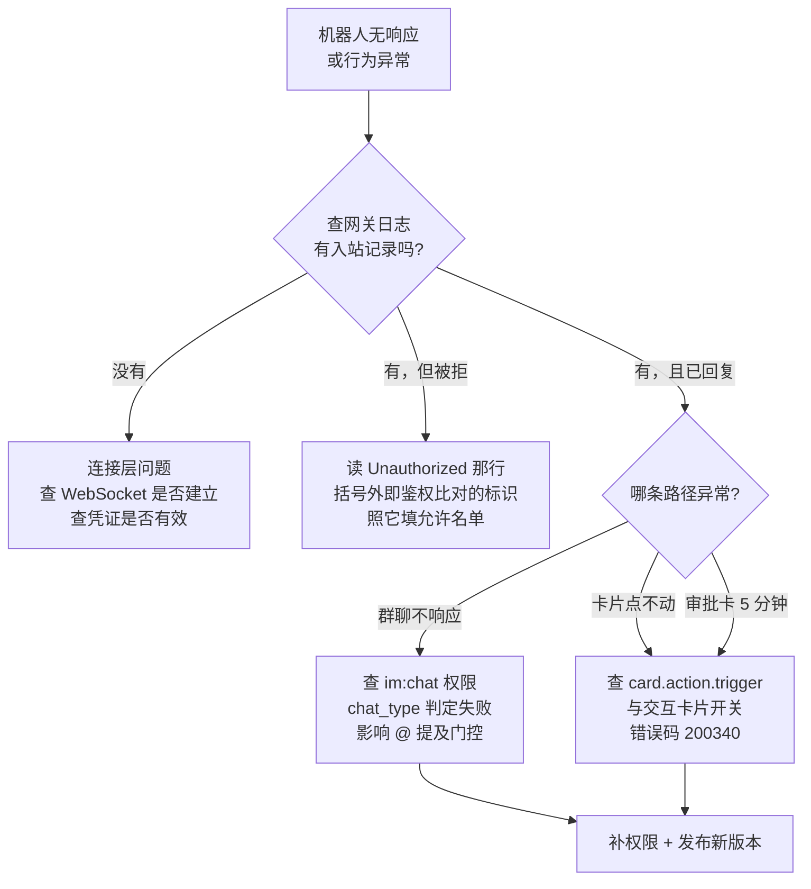

# Hermes Agent 接入飞书：三个坑与排查方法

把 Hermes Agent（Nous Research 的开源 Agent Harness，代理运行框架）接到飞书（Feishu / Lark）机器人上，配置本身只有两个环境变量，但真正花时间的是三个不会立刻报错的坑：**允许名单匹配的是哪一层身份**、**缺失的权限只在特定接口上暴露**、**交互卡片发得出去却点不动**。

三个坑有一个共同特征：**配置看起来是对的，功能看起来是通的，只在某条具体路径上失败**。本文记录症状、根因和排查手法，重点在「怎么定位」而不是「照抄配置」。

> 环境：Hermes Agent v0.21.0，飞书自建应用，WebSocket 长连接模式，macOS 常驻。
> 文中所有应用凭证、用户标识、会话标识均为占位符。

## 缩写对照表 (Abbreviation Glossary)

| 缩写 | 英文全称 | 中文 |
|---|---|---|
| API | Application Programming Interface | 应用程序接口 |
| CLI | Command-Line Interface | 命令行界面 |
| DM | Direct Message | 私聊 |
| SDK | Software Development Kit | 软件开发工具包 |
| WebSocket | — | 全双工长连接协议 |
| IM | Instant Messaging | 即时通讯 |

---

## 0. 基础配置

飞书凭证放在 `~/.hermes/.env`，不是 shell 配置文件——常驻进程由 launchd/systemd 拉起，**不会加载 `~/.zshrc`**，写在那里的 export 对它不可见：

```bash
FEISHU_APP_ID=cli_xxxxxxxxxxxxxxxx
FEISHU_APP_SECRET=xxxxxxxxxxxxxxxxxxxxxxxxxxxxxxxx
FEISHU_CONNECTION_MODE=websocket    # 由客户端主动外连，无需公网回调地址
FEISHU_ALLOWED_USERS=<见第 1 节>
GATEWAY_ALLOW_ALL_USERS=false       # 默认拒绝陌生人
```

依赖是懒加载的，首次使用才装；要让网关启动时就绪，先手工装上：

```bash
uv pip install --python <hermes venv>/bin/python "lark-oapi==1.6.8" "qrcode==7.4.2"
```

验证凭证是否有效，不必等网关起来——直接换取 tenant access token 即可：

```bash
curl -s -X POST https://open.feishu.cn/open-apis/auth/v3/tenant_access_token/internal \
  -H "Content-Type: application/json" \
  -d '{"app_id":"cli_xxx","app_secret":"xxx"}'
# code: 0 → 凭证有效
```

---

## 1. 坑一：允许名单匹配的是租户 `user_id`，不是 `open_id`

### 症状

网关日志显示消息**收到了**，但随即被拒：

```
[Feishu] Inbound dm message received: sender=user:ou_xxxxxxxx text='Hi'
WARNING gateway.run: Unauthorized user: alice-chen (None) on feishu
```

明明 `FEISHU_ALLOWED_USERS` 里写的就是 `ou_xxxxxxxx`，和日志里的 `sender` 完全一致，却仍然被拒。

### 根因：飞书的三层身份

飞书对同一个人有三个不同的标识，作用域各不相同：

| 标识 | 形如 | 作用域 |
|---|---|---|
| `open_id` | `ou_xxxx` | **应用级**——同一个人在不同应用里不同 |
| `user_id` | 形如用户名/工号 | **租户级**——同一企业内唯一 |
| `union_id` | `on_xxxx` | **开发者级**——同一开发者名下跨应用稳定 |

Hermes 解析发送者时的优先级是：

```python
primary_id = user_id or open_id      # 租户级优先于应用级
```

事件里只要带了租户级 `user_id`，它就会**盖过** `open_id` 成为鉴权比对的值。而鉴权是**严格字符串相等**，没有跨层回退：

```python
def _allows(allowed: set[str], candidate: str) -> bool:
    return "*" in allowed or candidate in allowed
```

于是 `ou_xxxxxxxx` 永远匹配不上 `alice-chen`，直接落到默认拒绝分支。

### 关键排查技巧：读懂那行日志

日志格式是 `Unauthorized user: {user_id} ({user_name})`——**括号外**才是鉴权实际比对的标识，括号内是显示名。上面例子里被拒的是 `alice-chen`，不是 `ou_` 开头的那个。

> **通用方法**：不要猜允许名单该填什么。先留空发一条消息，让它被拒，然后从拒绝日志里读出鉴权真正比对的标识——**那行日志就是权威答案**。这个方法对任何默认拒绝的通道都成立。

### 修复：两层都写

```bash
FEISHU_ALLOWED_USERS=alice-chen,ou_xxxxxxxx
```

`open_id` 必须保留：**卡片交互事件的 `user_id` 是 `None`**，那时只能靠 `open_id` 兜底。只写一层，另一条路径就会静默失败。

从其他框架迁移时这是必查项——不同框架选择的身份层不同，把配置整段搬过来往往就踩这个坑。

---

## 2. 坑二：缺少 `im:chat` 权限，只在群聊语义上暴露

### 症状

每条入站消息都会伴随一条告警，但消息本身处理正常：

```
[Feishu] Failed to get chat info for oc_xxxxxxxx: [99991672] Access denied.
One of the following scopes is required: [im:chat:readonly, im:chat, im:chat:read]
```

### 为什么容易被忽略

私聊场景**完全不受影响**——会话名回退成 chat_id，功能照常。于是很容易把它当成噪音。

但 `get_chat_info` 的返回值用于判定 **chat_type（单聊 / 群聊）**，而**群聊的 @ 提及门控依赖 chat_type**。也就是说：私聊一切正常，群聊行为可能异常，而告警文案完全没提到这一点。

### 修复

在开发者后台补授 `im:chat:readonly`，**并发布新版本**——权限变更不发布不生效。

飞书的报错信息本身带了申请链接（`.../auth?q=im:chat:readonly...`），直接点即可。

---

## 3. 坑三：交互卡片发得出去，点不动

### 症状

点击卡片按钮时，飞书弹出：

> Card callback isn't configured for this app yet.

或返回错误码 **200340**。

### 为什么"看起来是好的"

**发送**卡片只需要 `im:message:send` 权限。所以卡片能正常发出、正常渲染、按钮正常显示——**只有点下去才失败**。错误发生在用户交互时，不在发送时，因此配置阶段完全看不出问题。

### 真正的影响：审批链路断了

Hermes 的危险命令审批走的就是交互卡片（Allow Once / Session / Deny）。回调没配好时：

1. 点击按钮 → 返回 200340，审批结果**永远送不回 agent**
2. agent 侧的审批请求一直等待，直到 `approvals.timeout`（默认 **300 秒**）耗尽
3. 超时后**失败关闭**（fail closed），命令被拒

结果就是：从飞书发起的任何需要审批的操作，**卡 5 分钟然后被拒**，而且中间没有任何明显错误。

### 修复：三项配置，WebSocket 模式下只需两项

| # | 配置项 | 位置 |
|---|---|---|
| 1 | 订阅 `card.action.trigger` 事件 | 事件订阅 |
| 2 | 打开 **交互卡片** 能力开关 | 应用能力 → 机器人 |
| 3 | 配置卡片请求地址 | **WebSocket 模式下由 SDK 自动处理，无需配置** |

改完同样要**发布新版本**。

### 应急绕过：用文本指令代替按钮

在后台配置生效前，审批不必依赖按钮——斜杠指令走的是完全独立的路径：

```
/approve            /approve session      /approve always
/approve all        /deny                 /deny <理由>
```

参数解析是宽松的关键词匹配，`/approve on this session` 也能正确识别成 session 级批准。

值得注意的是：**没有配置项可以让飞书审批退回纯文本**——`send_exec_approval` 总是构造卡片。所以后台配置是唯一的根治手段，文本指令只是过渡。

---

## 4. 排查流程总结



三个坑的共同排查起点都是**网关日志**——飞书侧的报错往往只是一个笼统提示，而日志里有精确到标识和权限名的原因。

---

## 5. 三条可迁移的经验

1. **默认拒绝的通道，用"被拒日志"反推配置**。不要猜标识该填哪一个：先让它拒一次，日志会告诉你鉴权实际比对的是什么。这比读文档快，也比猜准确。

2. **区分"发送需要的权限"和"交互需要的权限"**。卡片、审批、回调这类双向能力，发送侧和回调侧的配置是分开的——发得出去不代表点得动。验收时一定要**真的点一下**。

3. **常驻进程不读 shell 配置文件**。凭证要放进进程真正加载的配置文件（这里是 `~/.hermes/.env`）。写在 `~/.zshrc` 里的 export 在手工执行时有效、在服务启动时无效，这类"手工跑得通、定时跑不通"的问题根源常在于此。

---

## 结论

飞书接入的难点不在配置项数量，而在于三处**失败不对称**的设计：身份分三层但鉴权只比对一层；权限缺失只在特定接口暴露；卡片的发送与回调是两套独立配置。

排查的通用抓手只有一个——**读网关日志的原始记录**，而不是相信客户端弹出的笼统提示。三个坑里有两个（身份层、权限名）都能直接从日志里读到精确答案。
