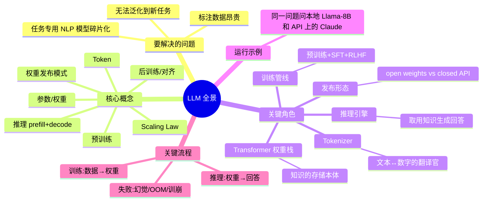

# LLM 全景指南：训练与推理、开源与闭源、参数规模

> **你在哪里**：这是整个指南的地图页。读完你会知道这个指南包回答什么问题、按什么顺序读、以及全部概念的一张总览图。

## 这个指南回答的三个问题

1. **LLM 是怎么"炼"出来又怎么"用"起来的？**——训练（training）与推理（inference）的完整生命周期；
2. **闭源模型（GPT/Claude/Gemini）和开源模型（Llama/Qwen/DeepSeek）到底差在哪？**——不只是"能不能下载"，而是能力、成本、隐私、定制权的系统性权衡；
3. **为什么大家都在乎参数规模（7B、70B、670B）？**——参数量和能力、显存、成本之间的定量关系（Scaling Law）。

## 全域思维导图

## 阅读路线

| 顺序 | 文件 | 回答 |
|---|---|---|
| 1 | [01-why.md](01-why.md) | LLM 出现之前世界的痛点——为什么必然有人发明它 |
| 2 | [02-what.md](02-what.md) | 一句话定义、边界、在生态中的位置 |
| 3 | [03-concept-map.md](03-concept-map.md) | 全部核心概念 + 关键角色 + 全生命周期总览图 |
| 4 | [04-running-example.md](04-running-example.md) | 贯穿全篇的运行示例：一个问题、两个模型 |
| 5 | [05-01 … 05-04 深潜](05-01-training-pipeline.md) | 逐个角色下潜：训练管线 → 推理引擎 → 参数规模 → 开源vs闭源 |
| 6 | [06-walkthrough.md](06-walkthrough.md) | 带着全部深度重跑一遍运行示例 |
| 7 | [07-next-steps.md](07-next-steps.md) | 动手练习与延伸阅读（含本仓库博客系列的衔接） |

**建议**：按顺序通读一遍（约 40 分钟）；之后任何一个深潜文件都可以独立重读，每篇开头有"回到示例"的锚点帮你接回主线。
