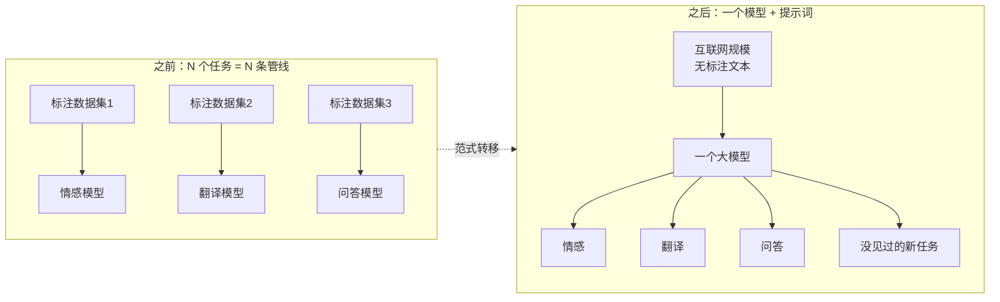

# 01 · WHY：LLM 解决了什么问题

> **你在哪里**：第一站，先看痛点。读完这一篇，你应该能说出"如果 LLM 不存在，有人必须发明它"，并大致猜到它必须长什么样。

## LLM 之前的世界：一个任务一个模型

2018 年以前，NLP（自然语言处理）的工作方式是**任务专用**的：

- 要做情感分析？收集几万条标注数据，训一个情感分类器；
- 要做翻译？再收集平行语料，训一个翻译模型；
- 要做问答/摘要/命名实体识别？各训各的，互不通用。

三个痛点由此而来：

1. **碎片化**：每个任务一套数据、一套模型、一套运维。企业想上十个 NLP 功能，就要养十条模型管线；
2. **标注昂贵**：监督学习吃标注数据，而标注要人一条条写。数据量决定上限，钱和时间决定数据量；
3. **零泛化**：情感分类器对翻译一窍不通。换个任务、甚至换个领域（从影评到财报），模型直接失效，一切从头再来。

## 为什么已有方案不够

| 前辈方案 | 思路 | 卡在哪 |
|---|---|---|
| 规则/模板系统 | 人工编写语言规则 | 语言太灵活，规则永远写不全 |
| 词向量 + 小模型（word2vec 时代） | 预训练词义，任务层另训 | 词义静态、上下文无关，"苹果公司"和"吃苹果"一个向量 |
| 预训练+微调（BERT 时代） | 先大规模预训练，再按任务微调 | 泛化迈出一步，但**每个任务仍要微调出一份专属权重**，碎片化没有根治 |

关键转折是 GPT-3（2020）验证的一件事：**把模型和数据做大到一定程度后，不用微调，只靠提示词（prompt）里给几个例子，模型就能完成没专门训过的任务**（in-context learning）。任务专用管线被一个通用模型 + 一句自然语言指令取代——这就是范式转移的瞬间。

## 塑造这个方案的约束

为什么解法长成"超大参数 + 海量无标注文本 + 预测下一个词"这个样子？三条约束决定的：

1. **标注贵，生文本免费** → 训练目标必须是**自监督**的。"预测下一个 token"天然自带标签（下一个词就在原文里），互联网上万亿级 token 全部变成训练数据；
2. **能力随规模增长且可预测**（Scaling Law，深潜篇细讲）→ 想要更强就做更大，于是参数量从亿级一路飙到万亿级；
3. **训练一次极贵，使用要无限次** → 训练（一次性、数月、数万卡）和推理（持续、毫秒级、面向所有用户）必须彻底分离成两个阶段——这个分离正是后面所有故事的骨架。

## 质量自检

如果 LLM 不存在：每个 NLP 任务仍要单独标数据、单独训练、无法泛化。要根治它，你需要一个**从免费文本中自监督学出通用语言能力的超大模型**，训练一次、到处使用。——它必须被发明。

---

下一篇：[02-what.md](02-what.md) —— 现在可以给它下定义了。返回 [概念地图](03-concept-map.md) · [总览](00-overview.md)
