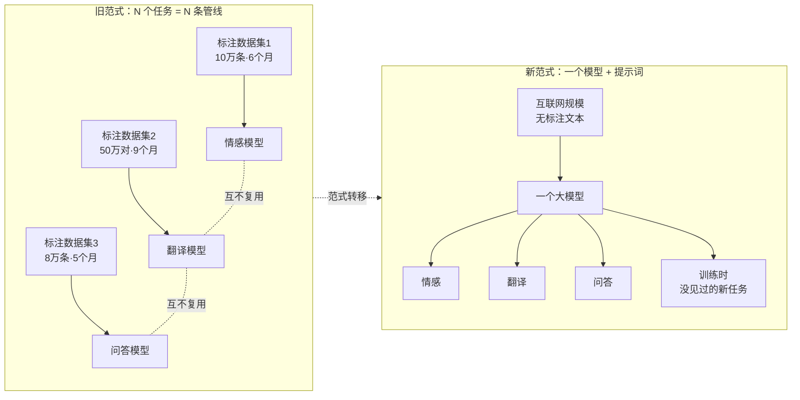
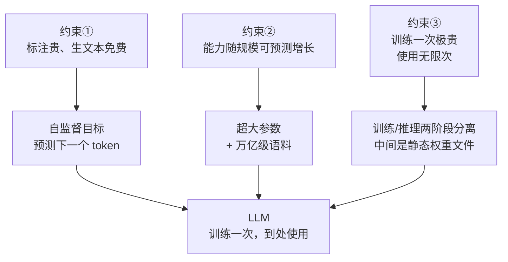

# 为什么会有 LLM：一个任务一个模型的时代是怎么结束的

> 2017 年，如果你要给公司做一套"智能客服"，你的工程排期大概长这样：意图识别模型两个月、情感分析模型一个月、实体抽取模型一个月半、FAQ 匹配模型一个月——四个模型、四份标注数据、四条训练管线、四套上线运维。而且它们彼此一无所知。
>
> 2023 年，同样的需求是一段提示词加一次 API 调用。
>
> 这中间发生的不是"模型变强了"这么简单，而是一次**范式转移**：解决 NLP（Natural Language Processing，自然语言处理）问题的方式被整个替换掉了。这一篇讲清楚旧范式到底卡在哪、四代前辈各自解决了什么又留下了什么，以及三条硬约束如何倒逼出"超大参数 + 海量无标注文本 + 预测下一个词"这个看起来笨拙、实则是唯一解的方案。

---

## 缩写对照表

| 缩写 | 英文全称 | 中文 |
|---|---|---|
| LLM | Large Language Model | 大语言模型 |
| NLP | Natural Language Processing | 自然语言处理 |
| NER | Named Entity Recognition | 命名实体识别 |
| BERT | Bidirectional Encoder Representations from Transformers | 基于 Transformer 的双向编码器表示 |
| GPT | Generative Pre-trained Transformer | 生成式预训练 Transformer |
| RNN | Recurrent Neural Network | 循环神经网络 |
| LSTM | Long Short-Term Memory | 长短期记忆网络 |
| ICL | In-Context Learning | 上下文学习 |

---

## 一、旧世界：一个任务一个模型

2018 年以前，NLP 的工作方式是**任务专用**的。每个业务需求对应一个独立的建模项目：

- 要做情感分析？收集几万条带情感标签的评论，训一个分类器；
- 要做机器翻译？再收集几百万对平行语料，训一个序列到序列模型；
- 要做问答、摘要、NER（命名实体识别）？各训各的，互不通用。

这套流程本身没有错——它在各自的窄任务上确实能做到可用。问题在于它的**扩展性**：

### 痛点一：碎片化，成本随任务数线性增长

每个任务一套数据、一套模型、一套评测、一套上线运维。企业想上十个 NLP 功能，就要养十条彼此独立的模型管线。而这十条管线之间**没有任何复用**——情感分类器学到的语言知识，一点也传不给翻译模型。

更糟的是维护成本：数据分布漂移了要重训，业务规则变了要重标，十条管线就是十份持续投入。很多公司最后的结论是"NLP 投入产出比太低"，于是退回到关键词匹配和正则表达式。

### 痛点二：标注昂贵，数据量决定能力天花板

监督学习吃标注数据，而标注要人一条条写。一条高质量的翻译对、一段准确的摘要，成本以元为单位；要几十万条，预算就是几十万到几百万，周期以月计。

于是形成了一个死结：**数据量决定模型能力上限，而钱和时间决定数据量**。想要模型更强，唯一的办法是花更多钱标更多数据，边际收益还在递减。整个行业的能力上限被标注预算锁死了。

### 痛点三：零泛化，换个任务甚至换个领域就失效

这是最致命的一条。情感分类器对翻译一窍不通——这还能理解。但实际情况更糟：一个在影评上训好的情感分类器，拿去分析财报评论，准确率会显著下降；拿去分析医疗投诉，基本报废。

**模型学到的不是"语言"，而是"这个数据集上的统计规律"。** 换个分布，一切从头再来。



## 二、四代前辈：各自解决了什么，各自卡在哪

范式转移不是凭空发生的。在 LLM 之前，至少有四代方案朝同一个方向努力过，每一代都往前推了一步，也都留下了同一个未解的核心问题。

| 代际 | 代表 | 核心思路 | 解决了什么 | 卡在哪 |
|---|---|---|---|---|
| 一 | 规则 / 模板系统 | 人工编写语言规则与模式 | 在极窄场景可控可解释 | 语言太灵活，规则永远写不全；每加一个场景就是一批新规则 |
| 二 | 词向量（word2vec / GloVe，2013） | 从无标注文本学词义，任务层另训 | **第一次证明"无标注文本里有可提取的知识"** | 词义**静态**、上下文无关——"苹果公司"和"吃苹果"共享同一个向量 |
| 三 | RNN / LSTM 序列模型（2014-2016） | 逐词读入、用隐状态携带上下文 | 词义终于随上下文变化 | 顺序计算无法并行 → 训不大；长距离依赖会衰减 → 记不住远处 |
| 四 | 预训练 + 微调（BERT 时代，2018） | 先大规模预训练通用表示，再按任务微调 | 泛化能力质变，一份预训练养活所有下游任务 | **每个任务仍要微调出一份专属权重**——碎片化被缓解，但没有根治 |

第二代的贡献值得单独强调：word2vec 第一次证明了**免费的无标注文本里藏着可以被提取的语言知识**。这个信念是后面一切的前提。

第三代的失败同样关键：RNN 逐词处理的顺序依赖使它**无法利用大规模并行算力**，这直接导致模型做不大。2017 年 Transformer 用自注意力替掉循环结构，让整个序列可以并行计算——**"能不能训得更大"这个瓶颈第一次被打开**。这是硬件与架构的合谋，也是后面"暴力出奇迹"得以成立的物理前提（架构细节见 [04 · Transformer 内部构造](04-transformer.zh.md)）。

第四代 BERT 已经很接近了。它证明了"预训练一次、下游复用"的巨大价值。但它的使用方式仍是：拿基座 → 针对你的任务准备标注数据 → 微调出一份任务专属权重。**十个任务，还是十份权重、十份标注数据。** 碎片化和标注成本这两条痛点，只是从"训十个模型"降级成"微调十次"。

## 三、转折点：GPT-3 证明的那件事

2020 年，GPT-3 验证了一个此前只是猜想的现象：

> **把模型和数据做大到一定程度后，不需要任何微调——只要在提示词（prompt）里给几个例子，甚至只用一句自然语言描述任务，模型就能完成它从没被专门训练过的任务。**

这个能力叫 **ICL（In-Context Learning，上下文学习）**。它的意义不在于"效果比微调好"——早期其实经常更差——而在于它**取消了下游任务的训练环节本身**：

```
旧：新任务 → 收集标注数据 → 微调 → 部署一份新权重 → 等几周
新：新任务 → 写一句话 → 立刻得到结果
```

碎片化被根治了（一个模型对所有任务）、标注成本被根治了（不需要下游标注）、零泛化被根治了（没见过的任务也能做）。**三个痛点，一次性解决。**

这就是范式转移的瞬间。此后行业的问题从"怎么为这个任务建模"变成了"怎么把这个需求说清楚"——提示词工程（prompt engineering）这个岗位的存在理由就在这里。

## 四、为什么解法必然长成这个样子

回头看，"超大参数 + 海量无标注文本 + 预测下一个词"这个组合显得有些笨拙：为什么是这样，而不是更聪明的设计？答案是三条约束把解空间压得只剩这一个：

### 约束一：标注贵，生文本免费 → 训练目标必须自监督

既然标注是天花板，就必须找到一个**不需要人工标注的训练目标**。"预测下一个 token"完美满足：**下一个词就写在原文里**，标签自带、零成本。

这一条直接把可用训练数据从"人类标注得起的几十万条"扩大到"互联网上的万亿级 token"——数据量提升了七八个数量级。这就是"自监督"三个字的全部含义，也是整个 LLM 时代的经济学地基。

而且这个目标看似简单，实则**极其苛刻**：要准确预测下一个词，模型被迫学会语法、事实、逻辑、常识、代码语义、甚至一定程度的推理——因为这些全都影响下一个词是什么。**一个简单的目标函数，逼出了通用能力。**

### 约束二：能力随规模可预测地增长 → 想要更强就做更大

如果"更大"只是"可能更好"，没人敢投几十亿美元建集群。2020 年 Kaplan 等人发现的 Scaling Law（规模定律）证明了：模型损失随参数量、数据量、算力按**幂律平滑下降**，跨越好几个数量级都成立。

这意味着**能力提升是可预测的工程问题，而不是碰运气的科研赌博**。投入 10 倍算力，能提前算出 loss 降到哪。"大力出奇迹"从玄学变成了可以写进财务模型的投资决策——参数量从亿级一路飙到万亿级，根源在此（定量细节见 [09 · 参数规模与 Scaling Law](09-param-scale.zh.md)）。

### 约束三：训练一次极贵，使用要无限次 → 两个阶段必须彻底分离

预训练一个前沿模型：数万张 GPU、数月时间、数千万到数亿美元，**一次性**。
线上服务：每秒数千请求、毫秒级响应、面向全球用户，**持续无限次**。

这两件事的资源特征完全相反，绝无可能用同一套系统同时满足。于是它们被切成两个彻底分离的阶段，中间隔着一个**静态的权重文件**：

- **训练 = 写入**：把数据压进权重，跑完即退场；
- **推理 = 读取**：只读权重生成回答，永不修改它。

这个分离是后面所有故事的骨架：它解释了为什么你和模型的对话不会让它"学到"任何东西；解释了为什么"开源 vs 闭源"的分叉点恰好在权重文件这里；也解释了为什么训练侧和推理侧的优化技术几乎没有交集。



## 五、三个常见误解

**"LLM 只是把互联网背下来了。"**
如果只是记忆，它无法回答训练语料里根本不存在的问题（比如"用鲁迅的语气解释 Kubernetes 的调度器"）。压缩到一定程度必然产生泛化——这正是它能做没见过的任务的原因。但反过来也成立：压缩是有损的，失真时它会流畅地编（见 [11 · 幻觉的机制](11-hallucination.zh.md)）。

**"Transformer 出来 LLM 就诞生了。"**
Transformer 是 2017 年的架构，GPT-3 是 2020 年的模型。中间三年发生的是算力、数据管线、工程规模的积累。**架构解除了"训不大"的限制，但真正兑现它需要另外三年的基础设施建设**——这也是为什么复现前沿模型至今仍是极少数机构的能力。

**"有了 LLM，专用小模型没用了。"**
恰恰相反。分类、检索、embedding（嵌入）这类高频窄任务，专用小模型在延迟和单位成本上仍然领先几个数量级。真实生产系统常见的架构是**小模型做粗筛、LLM 做难题**。范式转移改变的是默认选项，不是取消了其他选项。

## ⚓ 回到示例

本系列的运行示例（[第 3 篇](03-core-concepts.zh.md)完整定义）是：同一个问题——"写一个 Python 函数判断质数，并解释为什么只需要检查到平方根"——同时发给本地的 Llama-3-8B 和云端的 Claude API。

用旧范式做这件事，你需要：一个代码生成模型（标注数据：几万对"需求→代码"）、一个数学解释模型（标注数据：更难收集），以及把两者串起来的胶水逻辑。周期以季度计。

而现在，**没有任何人为"质数解释"这个任务标注过一条数据、训练过一个模型**。一个通用模型靠一句自然语言完成了代码生成 + 数学论证的复合任务，而且两个不同厂商、不同规模、不同交付形态的模型都能做到。

这就是本篇三个痛点被解决后的日常景象——日常到你几乎不会注意到它。

## 一句话总结

**如果 LLM 不存在**：每个 NLP 任务仍要单独标数据、单独训练、无法泛化，行业能力被标注预算锁死。**要根治它**，你需要一个从免费文本中自监督学出通用语言能力的超大模型，训练一次、到处使用——它必须被发明。

---

**下一篇**：[02 · LLM 到底是什么：定义、边界与生态位置](02-what.zh.md) —— 痛点已明，现在可以下定义了。

**系列目录**：[index.md](index.md)
