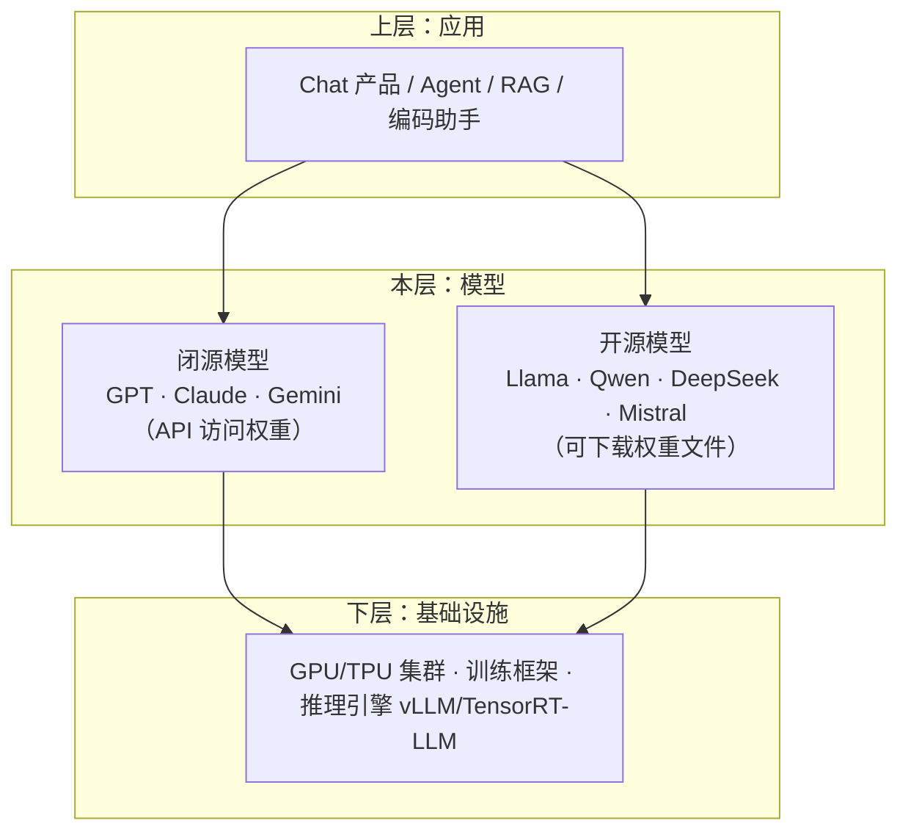

# 02 · WHAT：定义、边界与生态位置

> **你在哪里**：痛点已明，现在下定义、划边界、摆位置。读完你能判断"这东西是什么、不是什么、和谁是邻居"。

## 一句话定义

**LLM（大语言模型）是一个以"预测下一个 token"为唯一训练目标、用互联网规模文本训练出的超大参数 Transformer 神经网络——它把通用语言能力和世界知识压缩进几十亿到上万亿个参数（权重）里，使用时按 token 逐个生成回答。**

拆开对应上一篇的问题：
- "预测下一个 token" → 解决**标注昂贵**（自监督，原文自带答案）；
- "互联网规模文本 + 超大参数" → 解决**零泛化**（规模换通用性）；
- "一个模型压缩全部能力" → 解决**碎片化**（一模型对所有任务）。

## 边界：它不是什么

- **不是数据库**：知识以有损压缩的形式存在参数里，没有"查得到/查不到"的确定性——回忆不准时它会流畅地编（幻觉），这是机制内生的，不是 bug；
- **不是搜索引擎**：训练截止日之后的世界它不知道，需要外接检索（RAG）或工具；
- **不做符号推理保证**：算术、逻辑靠的是"学到的模式"而非计算器语义，正确率高但无证明；
- **训练和使用是彻底分开的两件事**：用户对话不会让模型"学到新知识"——权重在推理时是**只读**的，改变模型只能重新训练/微调。

## 生态位置

- **它坐在什么之上**：GPU 集群、训练框架（PyTorch/JAX）、推理引擎（vLLM、TensorRT-LLM）；
- **什么坐在它之上**：Chat 产品、Agent、RAG 系统、编码助手——全部把 LLM 当作"语言能力的电源插座"；
- **最近的邻居**：
  - **闭源（closed / API）模型**：只暴露 API，权重是商业机密——能力最强梯队，零运维，按 token 付费；
  - **开源（open weights）模型**：权重文件公开下载，可自部署、可微调——控制权归你，算力账单也归你；
  - （同层还有小型专用模型/embedding 模型，是 LLM 的轻量亲戚，不在本指南展开。）

一个必须澄清的用词：所谓"开源模型"绝大多数是 **open weights（开放权重）**——你拿到的是训练结果（权重文件），而**训练数据和完整训练代码通常并不公开**。真正三者全开的（如 OLMo、Pythia）是少数。本指南沿用习惯说法"开源"，但指的是 open weights。

## 质量自检

现在你可以正确分类：Llama-3-70B 是一个开放权重的 LLM；Claude API 是闭源 LLM 的访问方式；vLLM 不是模型，是模型之下的推理引擎；RAG 不是模型，是模型之上的应用模式。——能做这个分类，就可以进入概念地图了。

---

下一篇：[03-concept-map.md](03-concept-map.md) —— 一次摊开全部概念和角色。返回 [总览](00-overview.md)
