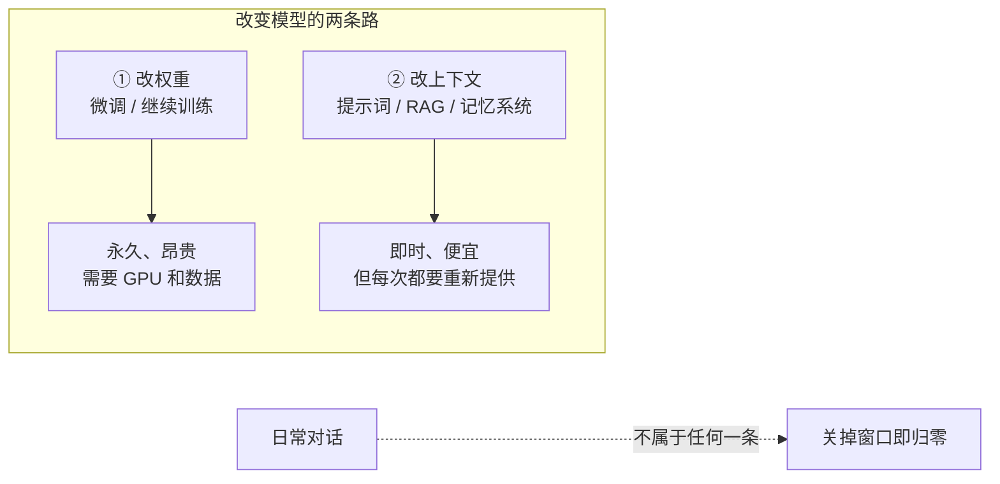
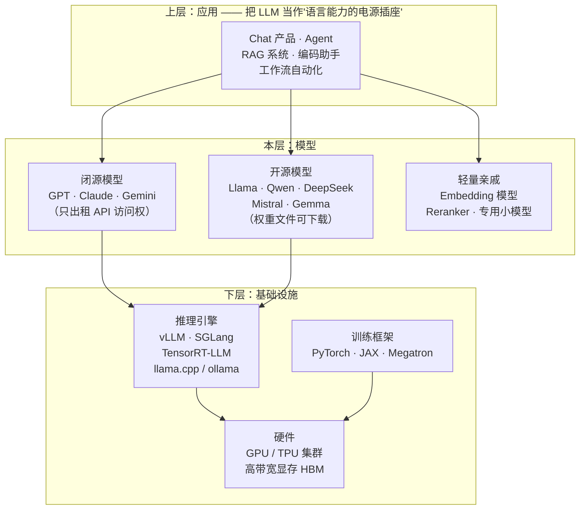

# LLM 到底是什么：定义、边界与生态位置

> 上一篇讲清了 LLM（Large Language Model，大语言模型）**为什么必须被发明**。这一篇给它下定义、划边界、摆位置。
>
> 定义部分不难。真正值钱的是**边界**——知道"它不是什么"，比知道"它是什么"更能防止你在生产环境里踩坑。业界大量的失望案例，根源都是把 LLM 当成了它不是的那个东西：把它当数据库用，于是抱怨它记错；把它当计算器用，于是抱怨它算错；以为聊天能让它学会新知识，于是抱怨它转头就忘。
>
> 这一篇还会顺手解决一个日常困扰：`Llama-3.1-8B-Instruct-Q4_K_M` 这一长串到底每一段在说什么。

---

## 缩写对照表

| 缩写 | 英文全称 | 中文 |
|---|---|---|
| LLM | Large Language Model | 大语言模型 |
| API | Application Programming Interface | 应用程序接口 |
| RAG | Retrieval-Augmented Generation | 检索增强生成 |
| SFT | Supervised Fine-Tuning | 监督微调 |
| GPU | Graphics Processing Unit | 图形处理器 |
| TPU | Tensor Processing Unit | 张量处理器 |
| MoE | Mixture of Experts | 混合专家 |
| VPC | Virtual Private Cloud | 虚拟私有云 |

---

## 一、一句话定义

> **LLM 是一个以"预测下一个 token"为唯一训练目标、用互联网规模文本训练出的超大参数 Transformer 神经网络——它把通用语言能力和世界知识有损压缩进几十亿到上万亿个参数（权重）里，使用时按 token 逐个生成回答。**

这句话每一段都对应上一篇的一个痛点：

| 定义中的片段 | 解决的痛点 | 展开于 |
|---|---|---|
| "预测下一个 token" 为**唯一**训练目标 | 标注昂贵——自监督，原文自带答案 | [06 · 训练管线](06-training-pipeline.zh.md) |
| "互联网规模文本 + 超大参数" | 零泛化——用规模换通用性 | [09 · 参数规模](09-param-scale.zh.md) |
| "一个模型压缩全部能力" | 碎片化——一个模型对所有任务 | [01 · 为什么会有 LLM](01-why.zh.md) |
| "**有损**压缩" | （新引入的代价）——幻觉的根源 | [11 · 幻觉的机制](11-hallucination.zh.md) |
| "按 token **逐个**生成" | （新引入的代价）——速度与成本的物理上限 | [08 · 推理引擎](08-inference-engine.zh.md) |

注意后两行：定义里"有损"和"逐个"这两个词不是修辞，它们各自锁定了 LLM 最主要的两类弱点。整个系列有一半篇幅在处理这两个词的后果。

## 二、边界：它不是什么

这一节是全篇最该记住的部分。

### 它不是数据库

数据库的知识以**离散记录**存放，有"查得到 / 查不到"的确定性边界，查不到时返回空。

LLM 的知识以**有损压缩**的形式弥散在几十亿个浮点数里，**没有"查不到"这个返回值**。当某个事实在权重里压缩失真时，模型不会说"我没有这条记录"，它会用同样流畅的语气生成一个看起来对的答案——因为它的目标函数从来就是"生成合理的下一个 token"，而不是"说真话"。

**这是机制内生的，不是 bug，也不可能靠"再训练一轮"彻底消除。** 它只能被缓解（外接检索、工具调用、引用约束），不能被根除。

### 它不是搜索引擎

模型的知识在训练截止日（knowledge cutoff）那一刻就冻结了。之后世界发生的一切它一无所知，而且——**它通常不知道自己不知道**，因为"我的训练数据截止到什么时候"这件事本身也只是权重里的一条模糊记忆。

要处理时效信息，唯一的正路是把信息**放进上下文**：RAG（Retrieval-Augmented Generation，检索增强生成）、联网搜索工具、或直接粘贴。这也是为什么"上下文窗口"是个如此重要的资源（见 [10 · 上下文窗口](10-context-window.zh.md)）。

### 它不做符号推理保证

算术、逻辑、日期计算，模型靠的是"学到的模式"而非计算器语义。`38 × 47` 它多半能算对，因为这类模式在语料里出现过无数次；但它没有执行乘法算法，只是在做一个非常好的模式匹配。位数一多、结构一变，正确率就会掉。

**正确率高，但没有证明。** 这就是为什么严肃场景的标准做法是给它一个真的计算器（工具调用）——不是因为模型笨，而是因为**符号计算应该由符号系统来做**。

### 推理时它不学习

这一条被误解得最频繁。**权重在推理时是只读的。**

你和模型聊了一整天，它表现得像记住了什么——那只是因为整个对话历史每一轮都被重新塞进上下文里喂给它。关掉窗口，一切归零，权重一个比特都没变。

想真正改变模型，只有两条路：**重新训练 / 微调**（改权重），或者**每次把信息放进上下文**（不改权重）。所谓"AI 记忆"产品，本质上全是后者的工程包装——把该记的东西存在外部，下次对话时检索出来拼进提示词。

### 一张边界速查表

| 你想要的 | LLM 本身能给吗 | 正确做法 |
|---|---|---|
| 精确事实检索 | ❌ 会编 | RAG / 数据库查询后放进上下文 |
| 最新信息 | ❌ 训练截止后一无所知 | 联网搜索工具 |
| 精确计算 | ⚠️ 高正确率但无保证 | 工具调用（代码执行 / 计算器） |
| 记住用户偏好 | ❌ 推理时不学习 | 外部存储 + 每次注入上下文 |
| 确定性输出 | ⚠️ 采样有随机性 | temperature=0，但仍不保证逐字一致 |
| 语言理解、改写、归纳、生成 | ✅ 这是它的主场 | 直接用 |

最后一行才是它真正擅长的事。**把 LLM 用在"语言"上，它是范式级的；把它用在"事实"和"计算"上，它是个不可靠的近似器。**

## 三、生态位置：它坐在谁之上，谁坐在它之上

**它坐在什么之上**：GPU/TPU 集群、训练框架（PyTorch/JAX）、推理引擎（vLLM、TensorRT-LLM、llama.cpp）。这一层决定了模型能不能训得出来、跑得起来、跑得便宜——[08 · 推理引擎](08-inference-engine.zh.md)专门拆它。

**什么坐在它之上**：Chat 产品、Agent、RAG 系统、编码助手。这一层的共同点是：它们都不生产语言能力，只是把 LLM 当作一个可调用的能力源，外加**编排、工具、记忆、检索**这些 LLM 本身不提供的东西。

**最近的邻居，同层的两条路线**：

- **闭源 / API 模型**：只暴露 API，权重是商业机密。能力最强梯队、零运维、按 token 付费；
- **开源 / 开放权重模型**：权重文件公开下载，可自部署、可微调。控制权归你，算力账单也归你。

这两条路线的系统性对比是 [12 · 开源 vs 闭源](12-open-vs-closed.zh.md) 的全部内容。

**同层还有一类容易混淆的亲戚**：embedding（嵌入）模型和 reranker（重排模型）。它们同样是 Transformer、同样预训练而来，但**它们不生成文本**——embedding 模型把一段话压成一个向量供检索用，reranker 给"查询-文档"对打相关性分。RAG 系统里这三者常常同时在场：embedding 模型负责召回、reranker 负责精排、LLM 负责最终生成。**它们不是 LLM 的竞品，是 LLM 的上游流水线。**

## 四、必须澄清的用词："开源"其实是"开放权重"

日常说的"开源模型"，绝大多数准确的说法是 **open weights（开放权重）**。

你下载到的是**训练的结果**（权重文件），而**训练数据和完整训练代码通常并不公开**。这意味着：

- 你可以运行它、微调它、量化它、蒸馏它——**复用结果**；
- 你无法审计它到底吃了什么数据、无法从零复现出这份权重——**复现过程**做不到。

真正三者全开（数据 + 代码 + 权重）的模型如 OLMo、Pythia 是少数，主要服务于研究。而且"能下载"不等于"能随便用"：Llama 的许可证带月活用户量条款，各家的商用条件也不一致——**商用前必须读许可证**。

本系列沿用习惯说法"开源"，但你心里要清楚它指的是 open weights。

## 五、读懂模型名字：`Llama-3.1-8B-Instruct-Q4_K_M`

模型名不是随便起的，每一段都在传递关键信息：

| 片段 | 含义 | 关联章节 |
|---|---|---|
| `Llama` | 模型家族 / 出品方（Meta） | [12 · 开源 vs 闭源](12-open-vs-closed.zh.md) |
| `3.1` | 版本代际——决定架构、训练数据量与截止日 | [06 · 训练管线](06-training-pipeline.zh.md) |
| `8B` | 参数量 80 亿——决定能力、显存、单 token 成本 | [09 · 参数规模](09-param-scale.zh.md) |
| `Instruct` | **已做后训练**的对话版；没有这个后缀的是只会续写的基座（base）模型 | [07 · 后训练细拆](07-post-training.zh.md) |
| `Q4_K_M` | 量化格式——权重从 16 位压到约 4 位，体积降到约 1/4 | [FP16 与 INT4 量化](../llm-inference/fp16-int4-quantization.zh.md) |

两个最容易踩的坑：

1. **误下载 base 模型**：没有 `Instruct` / `Chat` 后缀的版本不会回答问题，只会续写你的话。新手常以为"这模型坏了"；
2. **误判显存需求**：`8B` 的 FP16 权重是 16 GB，但 `Q4` 版本只要约 4.5 GB。看名字最后一段，才知道能不能塞进你的显卡。

还有一个越来越常见的写法是 MoE（Mixture of Experts，混合专家）模型的**双参数标注**，例如"总参数 671B / 激活 37B"——知识容量按总参数算，单 token 成本按激活参数算。这两个数必须分开看，细节见 [09 · 参数规模](09-param-scale.zh.md)。

## ⚓ 回到示例

运行示例里的两个主角，现在可以精确分类了：

- **Llama-3-8B-Instruct**：一个**开放权重**的 LLM。80 亿参数、已做后训练、权重文件（FP16 约 16 GB）在你硬盘上，通过 **ollama**（推理引擎，属于下层基础设施）加载运行；
- **Claude**：一个**闭源** LLM 的 API 访问方式。你拿不到权重，只拿到"prompt 进、token 流出"的接口合约。

而且你现在能做出这些区分：**vLLM 不是模型，是模型之下的推理引擎；RAG 不是模型，是模型之上的应用模式；embedding 模型不是 LLM，是 RAG 流水线里的上游组件。** 这四类东西经常在同一段技术文档里出现，分不清就会一路误解下去。

## 一句话总结

**LLM 是一个把语言能力有损压缩进权重、按 token 逐个生成的通用文本模型。** 它在"语言"上是范式级的，在"事实"和"计算"上是不可靠近似器；它推理时只读、不学习；它坐在推理引擎之上、应用层之下；它以开放权重和闭源 API 两种形态交付，而这两种形态的技术栈完全相同、合约完全不同。

---

**下一篇**：[03 · 七个核心概念：一次摊开整张地图](03-core-concepts.zh.md) —— 定义清楚了，现在铺开全部零件。

**系列目录**：[index.md](index.md)
