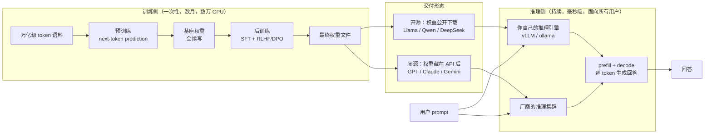

# 03 · 概念地图：全部概念与关键角色，一次摊开

> **你在哪里**：地图页。这里把全部核心概念和关键角色铺开到"一眼可见"的深度——先持有整张地图，再进入任何深潜。

## 3.1 领域映射：从问题到概念

| 现实问题元素 | 系统概念 | 为什么是这个抽象 |
|---|---|---|
| 文本需要变成可计算的单位 | **Token** | 比字符高效、比单词灵活的计量单位；一切成本、上下文、速度都按它计 |
| 学到的知识要存在某处 | **参数（权重，Parameters/Weights）** | 数十亿个浮点数矩阵，知识的有损压缩存储介质；"模型"本体就是这堆数 |
| 从免费文本中学习 | **预训练（Pretraining）** | 以"预测下一个 token"为目标扫过万亿级 token，把语言规律和世界知识压进权重 |
| 会续写 ≠ 会帮忙 | **后训练/对齐（Post-training: SFT + RLHF/DPO）** | 用少量高质量示范和人类偏好，把"续写器"整形成"助手" |
| 存进去的能力要取出来用 | **推理（Inference: prefill + decode）** | 权重只读，按 token 逐个生成；prefill 吃算力、decode 吃带宽 |
| 投入多少资源能换多强能力 | **Scaling Law** | 参数量 × 数据量 × 算力与损失之间的幂律关系——"参数规模为什么重要"的定量答案 |
| 训练结果以什么形式给到用户 | **权重发布模式（open weights vs closed API）** | 同样的权重，公开下载或藏在 API 后——衍生出两个平行生态 |

7 个概念，依赖顺序排列：Token 是计量单位 → 参数是存储 → 预训练/后训练是写入 → 推理是读取 → Scaling Law 是投入产出公式 → 发布模式是交付形态。

## 3.2 关键角色：从概念到组件

| 角色 | Owns（唯一职责） | Knows（持有什么） | Does NOT do（刻意不做） |
|---|---|---|---|
| **Tokenizer** | 文本 ↔ token ID 的双向翻译 | 词表（几万~几十万条目） | 不理解语义；训练时冻结，之后永不改变 |
| **Transformer 权重栈** | 存储全部语言能力与知识 | 几十亿~万亿个参数 | 不存对话状态；推理时只读，不学习 |
| **训练管线** | 把数据变成权重（写入） | 语料、训练目标、GPU 集群 | 不参与线上服务；训完即退场 |
| **推理引擎** | 用权重生成回答（读取） | KV Cache、批调度、采样参数 | 不修改权重；不判断内容真假 |
| **发布与部署形态** | 决定权重如何到达使用者 | 许可证、API 合约、定价 | 不改变模型能力本身——同一份权重，两种交付 |

这张表就是深潜章节的目录：[训练管线](05-01-training-pipeline.md) → [推理引擎](05-02-inference-engine.md) → [参数规模](05-03-param-scale.md)（权重栈的深潜，聚焦"为什么大小如此重要"）→ [发布形态](05-04-open-vs-closed.md)。

## 3.3 协同总览：一个 LLM 的完整生命周期

> 这张图回答：从互联网文本到你收到回答，各角色如何接力。

要点：**训练是写入、推理是读取，中间隔着一个静态的权重文件**；开源和闭源的分叉点就在这个文件是否公开——分叉之后，两边跑的推理原理一模一样。

两个最重要的非正常流（机制在深潜篇展开）：
- **幻觉**：权重是有损压缩，读取失真时模型流畅地编造 → 见 [参数规模](05-03-param-scale.md) 与 [推理引擎](05-02-inference-engine.md)；
- **显存溢出（OOM）**：参数量决定权重体积，超过显存直接跑不起来 → 见 [参数规模](05-03-param-scale.md)。

## 质量自检

你现在应该能在白板上画出"数据 → 预训练 → 后训练 → 权重 → （开源下载 / 闭源 API）→ 推理 → 回答"这条链，并为每个环节说出一句"它为什么必须存在"。还不知道任何环节的内部构造——这正是接下来运行示例和深潜要做的事。

---

下一篇：[04-running-example.md](04-running-example.md) —— 一个问题、两个模型，贯穿全篇的主线。返回 [总览](00-overview.md)
