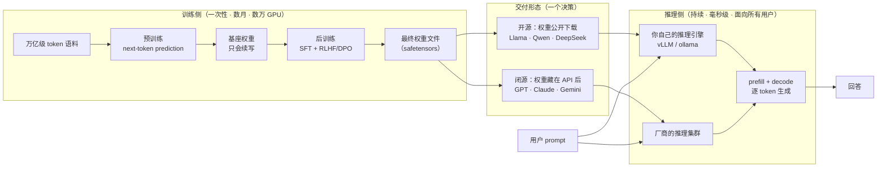

# 七个核心概念：一次摊开整张地图

> 学一个复杂系统最容易犯的错，是一头扎进某个细节——先看懂了注意力机制，却不知道它在整个生命周期的哪一格；或者背熟了 RLHF 的四个模型，却说不清它和推理速度有没有关系。
>
> 这一篇反过来做：**先把全部零件铺在桌面上，摆到"一眼可见"的深度，再进任何一个盒子。** 七个核心概念、五个关键角色、一张全生命周期图，外加一个贯穿后面十篇的运行示例。
>
> 读完这篇你不会懂任何一个细节，但你会拥有一张不会迷路的地图——之后每一篇深潜都是在往地图的某一格里填内容。

---

## 缩写对照表

| 缩写 | 英文全称 | 中文 |
|---|---|---|
| LLM | Large Language Model | 大语言模型 |
| SFT | Supervised Fine-Tuning | 监督微调 |
| RLHF | Reinforcement Learning from Human Feedback | 基于人类反馈的强化学习 |
| DPO | Direct Preference Optimization | 直接偏好优化 |
| KV Cache | Key-Value Cache | 键值缓存 |
| API | Application Programming Interface | 应用程序接口 |
| OOM | Out of Memory | 显存/内存溢出 |
| FP16 | 16-bit Floating Point | 16 位浮点数 |

---

## 一、七个核心概念，按依赖顺序

从"现实世界的问题"到"系统里的抽象"，每个概念都是被某个具体困难逼出来的：

| # | 现实问题 | 系统概念 | 为什么必须是这个抽象 |
|---|---|---|---|
| 1 | 文本要变成可计算的单位 | **Token（词元）** | 比字符高效、比单词灵活的计量单位 |
| 2 | 学到的知识要存在某处 | **参数 / 权重（Parameters / Weights）** | 几十亿浮点数矩阵，知识的有损压缩介质 |
| 3 | 要从免费文本中学习 | **预训练（Pretraining）** | 以"预测下一个 token"为目标扫过万亿级语料 |
| 4 | 会续写 ≠ 会帮忙 | **后训练 / 对齐（Post-training）** | 用少量高质量数据把"续写器"整形成"助手" |
| 5 | 存进去的能力要取出来用 | **推理（Inference）** | 权重只读，prefill + decode 逐 token 生成 |
| 6 | 投入多少资源换多强能力 | **Scaling Law（规模定律）** | 参数 × 数据 × 算力与损失之间的幂律关系 |
| 7 | 结果以什么形式给到用户 | **权重发布模式** | 同一份权重，公开下载或藏在 API 后 |

这七个不是并列关系，而是**一条有向的链**：

```
Token（计量单位）
   ↓ 决定了训练数据和上下文如何被切分
参数（存储介质）
   ↓ 预训练往里写知识，后训练调整取用方式
预训练 → 后训练（写入）
   ↓ 交付一个静态权重文件
推理（读取）
   ↓ Scaling Law 解释了"要多大的参数才够"
Scaling Law（投入产出公式）
   ↓ 最后一个决策：这份权重公开吗
发布模式（交付形态）
```

下面逐个说到"够用就好"的深度。

### 1. Token：一切成本的计价单位

模型不认识文字，只认识数字。**Token 是文本被切分后的最小单位**——大约是一个英文单词、半个到一个汉字、或者一个代码符号。Tokenizer（分词器）负责"文本 ↔ token ID"的双向翻译。

为什么它排在第一位？因为**几乎所有你关心的量都以 token 计价**：上下文窗口的长度是 token 数、API 账单按 token 收费、生成速度是 token/s、KV Cache 的显存占用是"每 token 多少 KB"。搞不清 token，后面所有的数字都读不懂。

一个立刻有用的直觉：同一段中文，在不同模型的 tokenizer 下 token 数可能相差 40% 以上——**同样的问题问不同模型，成本天然不同**。详见 [05 · Tokenizer](05-tokenizer.zh.md)。

### 2. 参数：模型本体就是这堆数

参数（也叫权重）就是模型里那些可训练的浮点数。"8B" = 80 亿个这样的数。

**"模型文件"的全部内容就是这堆数**——没有代码逻辑、没有知识库、没有规则表，只有矩阵。训练是调这些数，推理是读这些数。你对模型能力的一切感受，最终都归结为这几十亿个浮点数取了什么值。

它们排列成 Transformer 架构（详见 [04 · Transformer 内部构造](04-transformer.zh.md)），而这个数字的大小直接决定三件事：**装多少知识、要多少显存、每 token 花多少钱**。

### 3. 预训练：99% 的算力花在这里

给定前文预测下一个 token，与真实答案算交叉熵损失，反向传播更新权重——**没有人工标签，下一个词就写在原文里**。

万亿级 token 语料、数万张 GPU、数月时间。产出叫**基座模型（base model）**：一个极强的续写器。它知道很多，但不会以助手的方式回答你。

### 4. 后训练：从"会续写"到"会帮忙"

基座模型问它"法国的首都是哪？"，可能续写"这是小学地理试卷的第 3 题"——因为语料里这句话后面更常跟着这种文本。**知识已经在里面了，但取不出来。**

后训练用 SFT（监督微调）教会它"看到问题就回答问题"的行为格式，再用 RLHF / DPO 这类偏好优化让它"回答得好"。数据量只有预训练的万分之一，对可用性的影响却是决定性的。四代工具的细拆见 [07 · 后训练细拆](07-post-training.zh.md)。

### 5. 推理：prefill 吃算力，decode 吃带宽

一次生成分两段：**Prefill（预填充）**并行吃下全部输入 token，**Decode（解码）**逐个吐出输出 token。中间靠 **KV Cache（键值缓存）**避免重复计算。

关键认知：这两段的瓶颈完全不同。Prefill 是算力受限（决定首字延迟），Decode 是**内存带宽受限**（决定逐字速度）——因为每生成一个 token 都要把全部权重从显存搬一遍。这个不对称解释了 API 定价为什么输入输出不同价、长对话为什么越聊越慢。详见 [08 · 推理引擎](08-inference-engine.zh.md)。

### 6. Scaling Law：为什么行业敢砸千亿

模型损失随参数量、数据量、算力按**幂律平滑下降**，跨越多个数量级都成立。这把"更大是否更好"从玄学变成了可预测的工程学——投入 10 倍算力，能提前算出效果落在哪。

它同时也是"为什么 8B 和前沿模型有肉眼可见的差距"的定量答案，以及"为什么今天的 8B 远强于三年前的 8B"的解释。见 [09 · 参数规模与 Scaling Law](09-param-scale.zh.md)。

### 7. 发布模式：技术栈相同，合约不同

训练管线产出权重文件后只剩一个决策：**这个文件公开吗？** 公开 → 开源生态（下载、自部署、微调）；不公开 → 闭源生态（API 出租、按 token 计费）。

分叉之后，两边跑的推理原理**一模一样**。差别不在技术，在交付合约、成本模型、隐私边界和定制权。见 [12 · 开源 vs 闭源](12-open-vs-closed.zh.md)。

## 二、五个关键角色：谁负责什么，谁刻意不做什么

概念是名词，角色是**承担职责的组件**。理解一个系统的捷径，是搞清每个角色"唯一负责什么"和"刻意不做什么"——后者往往比前者信息量更大。

| 角色 | Owns（唯一职责） | Knows（持有什么） | **Does NOT do（刻意不做）** |
|---|---|---|---|
| **Tokenizer** | 文本 ↔ token ID 的双向翻译 | 词表（几万~几十万条目） | 不理解语义；训练前冻结，此后**永不改变** |
| **Transformer 权重栈** | 存储全部语言能力与知识 | 几十亿~万亿个参数 | 不存对话状态；推理时**只读**，不学习 |
| **训练管线** | 把数据变成权重（写入） | 语料、训练目标、GPU 集群 | 不参与线上服务；训完即退场 |
| **推理引擎** | 用权重生成回答（读取） | KV Cache、批调度、采样参数 | 不修改权重；**不判断内容真假** |
| **发布与部署形态** | 决定权重如何到达使用者 | 许可证、API 合约、定价 | 不改变模型能力本身 |

三条最容易被忽略、但解释了大量现象的"刻意不做"：

- **Tokenizer 训练前冻结** → 这就是为什么模型的分词缺陷（数不清字母、中文效率低）无法靠后续训练修复，它是被焊死的；
- **权重推理时只读** → 这就是为什么对话不会让模型学到东西，为什么所有"AI 记忆"都是上下文工程；
- **推理引擎不判断真假** → 这就是为什么幻觉不会在这一层被拦截。引擎忠实地从概率分布里采样，它没有"这句话是不是真的"这个概念。

## 三、全生命周期：一张图看完所有角色的接力



**这张图的核心信息只有一句**：训练是写入、推理是读取，中间隔着一个**静态的权重文件**；开源和闭源的分叉点就在这个文件是否公开——分叉之后，两边的物理原理完全一致。

图上还有两个不在正常流程里、但你一定会遇到的分支：

- **幻觉**：权重是有损压缩，读取失真时模型流畅地编造 → [11 · 幻觉的机制](11-hallucination.zh.md)；
- **显存溢出（OOM）**：权重体积 + KV Cache 超过显存，直接跑不起来 → [09 · 参数规模](09-param-scale.zh.md) 与 [10 · 上下文窗口](10-context-window.zh.md)。

## 四、贯穿全系列的运行示例

从这里开始，本系列所有文章共享同一个场景。**每篇结尾的"⚓ 回到示例"都会把当篇的深度接回它**，最后一篇带着全部深度重演一遍。

### 场景

你在笔记本上用 **ollama** 跑着开源的 **Llama-3-8B-Instruct**，同时开着闭源的 **Claude API**。同一个问题发给两边：

> **"写一个 Python 函数判断质数，并解释为什么只需要检查到平方根。"**

两边都给出了正确代码。但 Claude 的解释明显更严谨——它完整论证了平方根的数学原因，还自发处理了 0、1、负数这些边界情况。

**为什么？** 这个问题的完整答案需要动用地图上的每一个概念。

### 浅层追踪：每一步谁在场上

**第 0 步 · 能力从哪来（早已发生）**
两个模型的能力都来自各自的**训练管线**。数月前，万亿级 token 语料被**预训练**压缩进**参数**，再经**后训练**变成听话的助手，产出一份静态**权重文件**。你提问时，训练早已结束退场。

**第 1 步 · 两条路，同一份原理**
- 本地这路（**开源**）：Llama-3-8B 的权重文件（FP16 约 16 GB）躺在你硬盘上，ollama 把它加载进统一内存；
- 云端这路（**闭源**）：Claude 的权重你永远看不到，请求进入厂商的推理集群——那边的原理与你本地一模一样，只是规模大得多。

**第 2 步 · Tokenizer 上场**
两边各自的 **Tokenizer** 把你的问题切成 token ID 序列。各家词表不同，切法不同，**token 数也不同**。

**第 3 步 · 推理引擎读权重**
**Prefill** 并行吃下全部输入 token 并写出 KV Cache；**Decode** 开始逐 token 生成——每个 token 都要把全部权重读一遍。8B 在笔记本上约十几 token/s；Claude 那边模型更大，靠数据中心 GPU 和批处理照样流畅。

**第 4 步 · 参数规模显形**
代码两边都对——质数判断在语料里出现过成千上万次，8B 的容量足够。但**解释质量**分出了高下：更大的参数规模意味着更强的推理链条（Scaling Law 在起作用），前沿模型的后训练投入也远更充分。

**第 5 步 · 回答返回，两张不同的收据**
本地这轮对话从未离开你的电脑（开源部署的隐私属性）；API 那路按输入/输出 token 计费，账单和数据治理条款是闭源交付形态的一部分。

### 这个示例触到了地图上的一切

| 概念 / 角色 | 在示例中的落点 | 哪一篇展开 |
|---|---|---|
| Token / Tokenizer | 第 2 步，两家词表切分同一问题 | [05](05-tokenizer.zh.md) |
| 参数 / 权重栈 | 16 GB 的 Llama 文件 vs 看不见的 Claude 权重 | [04](04-transformer.zh.md) · [09](09-param-scale.zh.md) |
| 预训练 | 第 0 步，两边代码都写对的原因 | [06](06-training-pipeline.zh.md) |
| 后训练 | 第 0 步，解释质量差距的一半原因 | [07](07-post-training.zh.md) |
| 推理引擎 | 第 1、3 步，ollama 与厂商集群跑同一套 prefill+decode | [08](08-inference-engine.zh.md) |
| Scaling Law / 参数规模 | 第 4 步，能力差与 16 GB 这个数字本身 | [09](09-param-scale.zh.md) |
| 上下文窗口 | 第 2~3 步，30 个输入 token 占了窗口的多少 | [10](10-context-window.zh.md) |
| 幻觉 | 示例里**没有**发生——但换个冷门问题就会 | [11](11-hallucination.zh.md) |
| 开源 vs 闭源 | 第 1、5 步，下载权重 vs 调 API | [12](12-open-vs-closed.zh.md) |

## 一句话总结

**七个概念串成一条链**：Token 是计量单位 → 参数是存储介质 → 预训练/后训练是写入 → 推理是读取 → Scaling Law 是投入产出公式 → 发布模式是交付形态。**五个角色各司其职**，其中三条"刻意不做"（词表冻结、权重只读、引擎不判真假）解释了 LLM 大部分让人意外的行为。

你现在应该能在白板上画出"数据 → 预训练 → 后训练 → 权重 → （开源下载 / 闭源 API）→ 推理 → 回答"这条链，并为每个环节说出一句它为什么必须存在。**但你还不知道任何一个盒子里面长什么样**——从下一篇开始，逐个打开。

---

**下一篇**：[04 · Transformer 内部构造：那几十亿个参数到底排成什么样](04-transformer.zh.md) —— 打开最大的那个盒子。

**系列目录**：[index.md](index.md)
