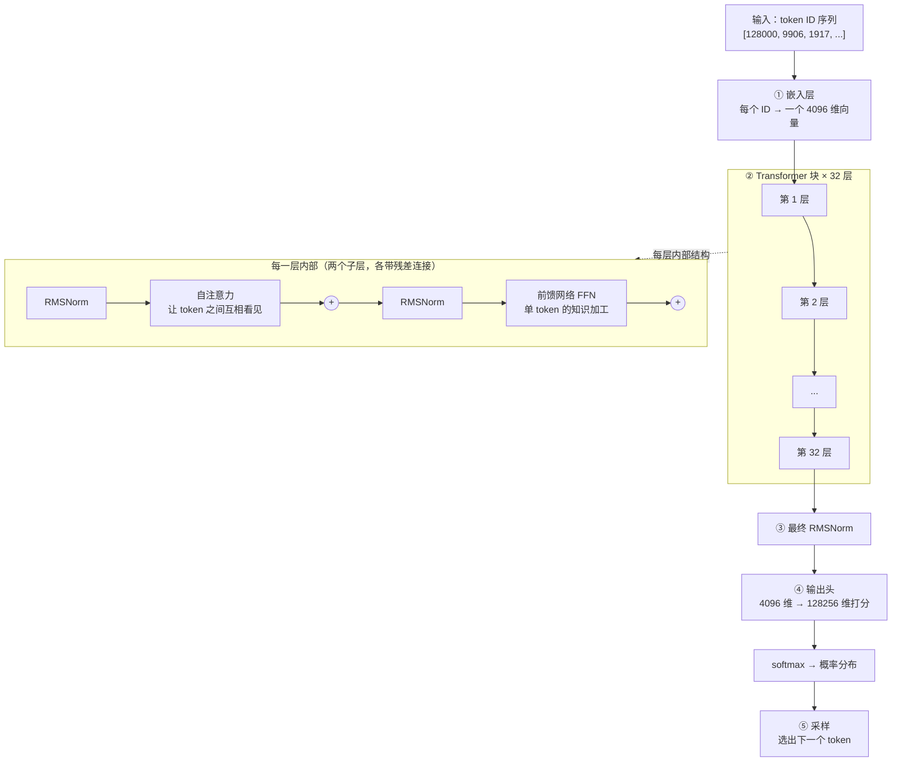

# Transformer 内部构造：那几十亿个参数到底排成什么样

> 前面反复说"知识被压缩进权重里"。但权重不是一堆散乱的数——它们被组织成一个高度规整的结构，而这个结构决定了模型能学到什么、算得多快、显存怎么花。
>
> 这一篇打开这个盒子。我们会跟着**一个 token 走完全程**：从一个整数 ID 开始，经过嵌入层、32 层相同的计算块、最后变成一个覆盖 12.8 万个候选词的概率分布。然后我们会**手算一遍 Llama-3-8B 的 80 亿参数是怎么凑出来的**——把每个矩阵的形状加起来，误差不到 0.5%。
>
> 不需要你会矩阵微积分。需要的只是：知道矩阵乘法是"一堆数进去、另一堆数出来"，以及愿意跟着算几个乘法。

---

## 缩写对照表

| 缩写 | 英文全称 | 中文 |
|---|---|---|
| FFN | Feed-Forward Network | 前馈网络 |
| MLP | Multi-Layer Perceptron | 多层感知机（此处与 FFN 同义） |
| Q / K / V | Query / Key / Value | 查询 / 键 / 值 向量 |
| MHA | Multi-Head Attention | 多头注意力 |
| GQA | Grouped-Query Attention | 分组查询注意力 |
| MoE | Mixture of Experts | 混合专家 |
| RoPE | Rotary Position Embedding | 旋转位置编码 |
| RMSNorm | Root Mean Square Normalization | 均方根归一化 |
| SwiGLU | Swish-Gated Linear Unit | Swish 门控线性单元 |
| KV Cache | Key-Value Cache | 键值缓存 |

---

## 一、总览：一个 token 的完整旅程

先看全景，再逐站细说。



用一句话概括这张图：**每个 token 先变成一个向量，然后在 32 层里反复经历"和别的 token 交换信息（注意力）→ 自己消化一遍（FFN）"，最后被投影成一个对全词表的打分。**

这 32 层**结构完全相同，参数各不相同**——同一套算子重复 32 遍，每一遍带着自己那份权重。

两个子层的分工是理解 Transformer 的关键，值得先记住：

- **自注意力负责"通信"**：token 之间横向交换信息。这是唯一一个让不同位置互相影响的地方；
- **FFN 负责"计算"**：每个 token 独立加工自己的向量，与其他位置完全无关。这是存放大部分知识的地方。

## 二、① 嵌入层：从整数到向量

Tokenizer 交给模型的是一串整数（详见 [05 · Tokenizer](05-tokenizer.zh.md)）。第一件事是把每个整数换成一个稠密向量。

嵌入层本质上就是**一张巨大的查找表**：词表里每个 token 占一行，行的宽度是模型的隐藏维度 $d_{\text{model}}$。Llama-3-8B 的这张表是 $128256 \times 4096$——12.8 万个 token，每个对应一个 4096 维向量。

```
token ID 9906  →  查表第 9906 行  →  [0.021, -0.335, 0.117, ..., 0.008]（4096 个数）
```

这 4096 个数就是这个 token 的初始"语义坐标"。它们是训练出来的：意思相近的 token，向量方向也相近。

**这张表本身就有 5.25 亿个参数**（128256 × 4096），占 8B 模型的 6.5%——一个经常被忽略的大头。这也是为什么词表大小是个真实的工程权衡：词表翻倍，嵌入层和输出头的参数量都翻倍。

> 注意：这一步之后，"文字"就彻底消失了。模型从此只在向量空间里运算，直到最后一步才变回 token。

## 三、② -A 自注意力：让 token 之间互相看见

这是 Transformer 的核心创新，也是它取代 RNN（循环神经网络）的原因。

### 问题：一个词的意思取决于上下文

"苹果发布了新手机"和"我吃了一个苹果"——两个"苹果"的嵌入向量**完全相同**（查的是同一行表）。要区分它们，模型必须让每个 token 去看其他 token。

### 机制：一次数据库检索

每个 token 的向量分别乘以三个可训练矩阵 $W_Q$、$W_K$、$W_V$，得到三个向量：

$$
Q = XW_Q,\quad K = XW_K,\quad V = XW_V
$$

三者的分工用数据库检索来类比最直观：

- **Q（Query，查询）**：当前 token 的搜索关键词——"我是谁，我需要什么样的上下文"；
- **K（Key，键）**：每个 token 的索引标签——"我是什么，谁该来找我"；
- **V（Value，值）**：每个 token 的实际内容——被匹配上之后真正贡献出去的信息。

计算流程：

$$
\text{Attention}(Q,K,V) = \text{softmax}\!\left(\frac{QK^\top}{\sqrt{d_k}}\right)V
$$

拆成人话四步：

1. 当前 token 的 Q 与**所有**历史 token 的 K 做点积 → 得到一串相似度分数；
2. 除以 $\sqrt{d_k}$ 防止分数过大导致 softmax 饱和（这就是"缩放点积注意力"里的"缩放"）；
3. softmax 归一化成权重，和为 1；
4. 用这些权重对所有 V 加权求和 → 得到当前 token 的新向量。

回到"我吃了一个苹果"：处理"苹果"时，"吃"的 K 与它的 Q 匹配度高，于是"吃"的 V 占了较大权重——**"苹果"的向量被"吃"染色了，从此带上了"水果"的味道**。这就是上下文如何进入词义的全部机制。

### 因果掩码：为什么模型不能看未来

生成式模型训练时，第 5 个位置只能看到第 1~5 个 token，绝不能偷看第 6 个——否则训练就成了作弊，推理时会直接崩溃。

实现方式简单粗暴：在 softmax 之前，把所有"未来位置"的分数设成 $-\infty$，softmax 之后它们的权重就是 0。这张三角形的掩码叫 **causal mask（因果掩码）**。

**它顺便解释了 KV Cache 为什么成立**：既然每个位置只看自己和前面，那么已经算过的 K/V 永远不会因为新 token 的加入而改变——所以可以缓存复用。这个性质是整个推理优化体系的地基（见 [08 · 推理引擎](08-inference-engine.zh.md)）。

### 多头：为什么要"多头"

一次注意力只能表达一种关注模式。但语言里同时存在多种关系：语法依存、指代消解、主题关联、位置邻近……

**多头注意力（MHA）**把 4096 维切成 32 份，每份 128 维，各自独立做一遍上述计算，最后拼回 4096 维再过一个输出矩阵 $W_O$。

- Llama-3-8B：32 个头，每头 128 维（32 × 128 = 4096）；
- 研究发现不同的头确实学出了不同分工——有的专盯前一个 token，有的专门追踪引号配对，有的负责主谓一致。

**GQA（Grouped-Query Attention，分组查询注意力）** 是现代模型的标配优化：Q 保持 32 个头，但 K/V 只用 8 个头，每 4 个 Q 头共享一组 K/V。

为什么这么做？因为**KV Cache 的大小正比于 K/V 的头数**。GQA 把 KV Cache 直接砍到 1/4，长上下文的显存压力大幅缓解，而效果损失很小。这是"架构设计为推理成本让路"的典型案例——细节见 [KV Cache 完全解析](../llm-inference/kv-cache.zh.md)。

### 位置信息：RoPE

注意力机制本身**对顺序无感**——打乱输入顺序，算出的结果一样。所以必须额外注入位置信息。

现代模型普遍用 **RoPE（Rotary Position Embedding，旋转位置编码）**：不是加一个位置向量，而是**按位置把 Q 和 K 向量旋转一个角度**。旋转角度随位置线性增长，于是两个 token 做点积时，结果自然带上了"它们相距多远"的信息。

RoPE 的一个重要性质是**可外推**：训练时只见过 8K 长度，通过调整旋转频率可以在推理时扩展到 128K——这是长上下文模型的技术基础，代价和局限见 [10 · 上下文窗口](10-context-window.zh.md)。

## 四、② -B 前馈网络：被低估的知识仓库

注意力抢走了所有注意力，但**参数的大头其实在 FFN**。

FFN 对每个 token 独立操作，与其他位置完全无关。经典结构是"升维 → 非线性 → 降维"：

$$
\text{FFN}(x) = W_{\text{down}} \cdot \big(\text{Swish}(W_{\text{gate}}\,x) \odot W_{\text{up}}\,x\big)
$$

Llama-3-8B 用的是 **SwiGLU** 变体，三个矩阵：4096 维先升到 **14336** 维（3.5 倍），门控相乘之后再降回 4096 维。

### 为什么升维再降维？

一个广为接受的解释是：**FFN 是一个键值记忆库**。升维后的 14336 个神经元，每一个都可以被看作一条"如果输入向量长这样，就往输出里加这个信息"的规则。升维提供了容纳大量规则的空间，降维把被触发的规则汇总回来。

大量可解释性研究支持这个视角：特定的 FFN 神经元会在特定概念出现时激活（"这是法国相关的"、"这是代码里的循环"）。**如果说注意力负责"从上下文里找信息"，FFN 就负责"从记忆里调信息"。**

### 参数占比：约七成

这是本篇最反直觉的数字之一。Llama-3-8B 每一层里：

| 组件 | 参数量 | 层内占比 |
|---|---|---|
| 注意力（$W_Q, W_K, W_V, W_O$） | ≈ 41.9 M | 19% |
| FFN（gate / up / down） | ≈ 176.2 M | **81%** |

**注意力是 Transformer 的灵魂，但 FFN 是它的仓库。** 后面 [09 · 参数规模](09-param-scale.zh.md) 讲的 MoE（混合专家），动的正是 FFN 这一块——因为那里才有足够的肉可以切。

## 五、把它们堆起来：残差、归一化、深度

32 层结构完全相同的块串起来，中间靠两个不起眼但缺一不可的机制维持稳定：

### 残差连接：给梯度一条高速公路

每个子层的输出不是直接传给下一层，而是 $x + \text{子层}(x)$。

好处是双重的：反向传播时梯度可以沿着这条"+"直通到底层，避免深层网络的梯度消失；正向看，可以理解为**每一层是在往一个共享的"残差流"里增量地写入信息**，而不是彻底重写。这个视角对理解模型内部信息如何逐层累积很有帮助。

### RMSNorm：把数值拽回合理范围

每个子层之前先做一次归一化（现代模型是 **pre-norm**，归一化放在子层前面，训练更稳）。

**RMSNorm（均方根归一化）**是 LayerNorm 的简化版：只按向量的均方根缩放，不做减均值。计算更省、效果相当，已成为主流。

### 深度换的是什么

同样的参数预算，是做"宽而浅"还是"窄而深"？经验答案是**深度带来推理能力**：多步推理需要中间结果被逐层加工，层数不够就没有"思考的步骤"可用。

一个直观的看法：**每一层是一次信息加工的机会。** 32 层意味着一个 token 的表示被反复重写 32 次，每次都能吸收更多上下文、调用更多记忆。这也解释了为什么小模型能背事实（一层就够查表）却做不好多步推理（层数不够走完推理链）。

## 六、④⑤ 输出头与采样：从向量到下一个词

走完 32 层，最后一个位置的向量（4096 维）要变成"下一个 token 是什么"的判断：

1. **输出头**（也叫 LM head）：一个 $4096 \times 128256$ 的矩阵，把 4096 维向量投影成 128256 个分数（logits）——词表里每个 token 一个分；
2. **softmax**：把分数变成概率分布，全部加起来等于 1；
3. **采样**：从这个分布里挑一个 token。

第 3 步是用户唯一能实时控制的环节：

| 参数 | 作用 | 调高会怎样 |
|---|---|---|
| `temperature` | 缩放 logits，改变分布陡峭程度 | 分布变平 → 更随机、更有创意、也更容易胡说 |
| `top-p`（核采样） | 只从累积概率前 p 的候选里选 | 调低 → 更保守，砍掉长尾怪词 |
| `top-k` | 只从概率最高的 k 个里选 | 同上，但用固定个数而非概率阈值 |

关键认知：**采样参数不改变模型的知识，只改变"从既有分布里怎么挑"。** temperature=0 会每次挑最高分的那个（贪心解码），但这既不保证正确，也不保证跨版本逐字一致。

## 七、手算一遍：8B 参数是怎么凑出来的

现在把所有矩阵的形状加起来。Llama-3-8B 的配置：

$$
d_{\text{model}}=4096,\quad L=32 \text{ 层},\quad n_{\text{head}}=32,\quad n_{\text{kv}}=8,\quad d_{\text{ffn}}=14336,\quad |V|=128256
$$

**单层注意力**（GQA：K/V 只有 8 个头，即 8 × 128 = 1024 维）：

| 矩阵 | 形状 | 参数量 |
|---|---|---|
| $W_Q$ | 4096 × 4096 | 16.78 M |
| $W_K$ | 4096 × 1024 | 4.19 M |
| $W_V$ | 4096 × 1024 | 4.19 M |
| $W_O$ | 4096 × 4096 | 16.78 M |
| **小计** | | **41.94 M** |

**单层 FFN**（SwiGLU 三矩阵）：

| 矩阵 | 形状 | 参数量 |
|---|---|---|
| $W_{\text{gate}}$ | 4096 × 14336 | 58.72 M |
| $W_{\text{up}}$ | 4096 × 14336 | 58.72 M |
| $W_{\text{down}}$ | 14336 × 4096 | 58.72 M |
| **小计** | | **176.16 M** |

**汇总**：

| 部分 | 计算 | 参数量 | 占比 |
|---|---|---|---|
| 32 层注意力 | 41.94 M × 32 | 1.34 B | 17% |
| 32 层 FFN | 176.16 M × 32 | 5.64 B | **70%** |
| 嵌入表 | 128256 × 4096 | 0.53 B | 6.5% |
| 输出头 | 4096 × 128256 | 0.53 B | 6.5% |
| 归一化等 | 每层几千个 | ~0.005 B | <0.1% |
| **合计** | | **≈ 8.03 B** | 100% |

对得上。**"8B"这个数字不神秘，它就是这几张表格加起来的和。**

这个练习的价值在于，你现在可以自己回答一堆实际问题：为什么词表大小影响显存？（嵌入 + 输出头 = 13%）为什么 MoE 只扩 FFN？（那里有 70% 的肉）为什么 GQA 能省 KV Cache 而不怎么掉效果？（K/V 只占注意力参数的 20%）

## 八、三个你会遇到的架构变体

| 变体 | 改了哪一块 | 为了什么 | 详见 |
|---|---|---|---|
| **GQA** | 减少 K/V 头数 | KV Cache 砍到 1/4，长上下文可行 | [KV Cache](../llm-inference/kv-cache.zh.md) |
| **MoE** | FFN 拆成 N 个专家，每 token 只激活少数几个 | 总参数（知识容量）暴涨，单 token 计算量不变 | [09 · 参数规模](09-param-scale.zh.md) |
| **长上下文外推** | 调整 RoPE 旋转频率 | 训练 8K，推理 128K | [10 · 上下文窗口](10-context-window.zh.md) |

三者都是同一个主题的变奏：**在不改变"注意力 + FFN"这个基本骨架的前提下，为推理成本让路。** 2017 年那篇论文的骨架，八年后依然站着。

## ⚓ 回到示例

运行示例的第 3 步（"推理引擎读权重"）现在可以看到内部了。你问"写一个 Python 函数判断质数"：

- **嵌入层**：约 30 个 token 各自查表，变成 30 个 4096 维向量；
- **注意力**：处理"质数"这个 token 时，它的 Q 与"判断"、"函数"、"Python" 的 K 强匹配——**上下文告诉模型这是个编程任务而非数学科普**。这一步决定了输出的整体形态；
- **FFN**：某些神经元被"质数"激活，把权重里存的 `is_prime` 相关模式调出来——GitHub 上无数份实现被压缩在这里；
- **32 层反复加工**：浅层处理语法结构，深层组织"先给代码、后给解释"的整体规划；
- **输出头 + 采样**：第一个 token 大概率是 `def`——因为在这个上下文下，`def` 的 logit 远高于其他 12.8 万个候选。

而第 4 步的"解释质量差距"，在这一篇有了结构性的解释：**Claude 的层数更多、隐藏维度更大**。更多的层 = 更多次信息加工 = 更长的推理链可以走完；更大的 FFN = 更大的记忆库。"完整论证平方根原理并自发覆盖边界情况"需要走完好几步推理，这正是深度带来的能力。

## 三个常见误区

**"注意力是模型知识的存放处。"**
不是。注意力负责在上下文里**找**信息，参数只占 17%；知识的大头（70%）在 FFN 里。把两者搞反，就会误判 MoE、GQA 这些优化到底动了什么。

**"层数越多越好。"**
深度和宽度需要配比。极深极窄的模型训练不稳定、并行效率差；主流模型的 $d_{\text{model}}$ 与层数大致同步增长（8B 是 4096/32，70B 是 8192/80）。这是被实验反复校准过的经验配比，不是随便定的。

**"改 temperature 能让模型更准确。"**
temperature 只改变从既有概率分布里采样的方式。如果正确答案在分布里的概率本来就低（模型不知道），调低 temperature 只会让它**更坚定地给出那个错误答案**。分布本身由权重决定，采样参数动不了它。

## 一句话总结

**一个 token 先被查表变成 4096 维向量，然后在 32 个结构相同的层里反复经历"注意力横向通信 + FFN 纵向计算"，最后被投影成 12.8 万维的概率分布并采样。** 参数的 70% 在 FFN（知识仓库），17% 在注意力（信息路由），13% 在词表相关的两张大表。这套骨架从 2017 年至今没变，变的全是围绕推理成本的局部优化。

---

**下一篇**：[05 · Tokenizer：模型眼里的世界不是文字](05-tokenizer.zh.md) —— 回到最开头那个被跳过的步骤：整数 ID 是怎么来的。

**系列目录**：[index.md](index.md)
