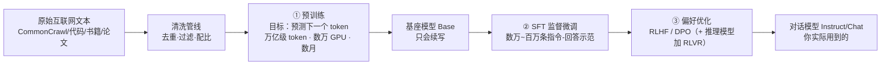

# 深潜 1 · 训练管线：数据如何变成权重

> **你在哪里**：第一个深潜。角色回顾：训练管线**唯一职责是把数据变成权重（写入）**，训完即退场、不参与线上服务。它对应运行示例的**第 0 步**——你提问之前早已发生的一切。

## 内部构造：三级流水线

### ① 预训练：99% 的算力花在这里

**目标函数只有一个**：给定前文，预测下一个 token 的概率分布，与真实下一个 token 算交叉熵损失，反向传播更新权重。没有人工标签——**下一个词就写在原文里**，这就是"自监督"的含义，也是万亿级数据成为可能的原因。

量级感（以 Llama-3 为例）：约 **15T（15 万亿）token** 语料、**1.6 万张 H100** 训练数月、电费和折旧以千万美元计。数据管线本身就是核心竞争力：去重（重复文本会让模型死记硬背）、质量过滤（清洗垃圾页）、配比（代码占多少、多语言占多少——代码比例被普遍认为显著影响推理能力）。

预训练的产物叫**基座模型（base model）**：一个极强的"续写器"。你问它"法国的首都是哪？"，它可能续写"这是小学地理试卷的第 3 题"——因为在训练语料里，这句话后面更常跟着这种文本。**知识已经在里面了，但不会以助手的方式取出来。**

### ② SFT：教会"助手的格式"

监督微调（Supervised Fine-Tuning）用数万到百万条高质量"指令 → 理想回答"示范对继续训练。数据量只有预训练的万分之一，作用却是决定性的：模型学会**"看到问题就回答问题"**这个行为模式。SFT 之后，"法国的首都是哪？"会得到"巴黎"。

### ③ 偏好优化：从"会回答"到"回答得好"

两个回答都语法正确时，哪个更有帮助、更诚实、更安全？这无法写成规则，只能学人类偏好：

- **RLHF**：人类对模型的多个回答排序 → 训一个奖励模型打分 → 用强化学习（PPO）让模型往高分方向调整；
- **DPO**：跳过奖励模型，直接用偏好对优化——更简单稳定，开源社区主流；
- **RLVR（可验证奖励强化学习）**：o1/DeepSeek-R1 一代"推理模型"的关键增量——在数学、代码这类**答案可自动判对错**的任务上做强化学习，模型自发学会先生成长链思考再作答。这是"训练侧的推理能力"近两年最大的变化。

> **递归深潜**：后训练本身是个子系统——SFT 的数据形态与 loss masking、RLHF 的四模型流水线与 KL 惩罚、DPO 的闭式解、RLVR/GRPO 的机制与各自的失败模式，全部细节见 [01a-post-training.md](05-01a-post-training.md)。

## 与邻居的契约

- **上游**（数据管线）：吃清洗后的 token 序列——tokenizer 在训练开始前就已冻结，词表从此永不改变；
- **下游**（推理引擎）：交付一个静态权重文件，格式如 safetensors——这是训练与推理之间**唯一的接口**。推理引擎不关心权重怎么来的，训练管线不关心权重怎么被用；
- **发布形态**：同一份权重文件，从这里分叉走向公开下载或 API 深锁（见[深潜 4](05-04-open-vs-closed.md)）。

## ⚓ 回到示例

运行示例第 0 步展开——"两个模型的能力从哪来"：

- 你本地的 **Llama-3-8B-Instruct**：Meta 用 15T token 预训练出 8B 基座，再做 SFT + DPO 后训练，把最终权重（约 16 GB FP16）公开发布。它能写对质数函数，是因为 GitHub 上成千上万份质数判断代码被压进了这 80 亿参数；它"听得懂你要函数+解释"，是 SFT 的功劳；
- API 后的 **Claude**：同样的三级管线，但参数规模更大、后训练投入重得多（更多轮偏好优化、宪法式对齐、推理强化）。示例第 4 步"解释更严谨、边界情况更周全"的差距，一半来自下一个深潜讲的参数规模，另一半就来自这里——**后训练的深度**。

## 失败行为

- **训练崩溃（loss divergence）**：几万卡跑数月，loss 突然飙升——回滚 checkpoint、跳过坏数据批次是日常操作；
- **数据污染**：评测集混进训练数据 → 跑分虚高，实际能力不符——这是对比开源/闭源模型跑分时必须警惕的；
- **死记硬背（memorization）**：去重不彻底时模型逐字背诵训练文本，带来版权与隐私风险；
- **对齐税与过度对齐**：后训练把行为收得太紧，模型变得过度拒答、能力受损——对齐强度是门手艺，不是越多越好。

---

下一篇：[02-inference-engine.md](05-02-inference-engine.md) —— 权重文件交出来之后，怎么被读取。返回 [概念地图](03-concept-map.md) · [总览](00-overview.md)
