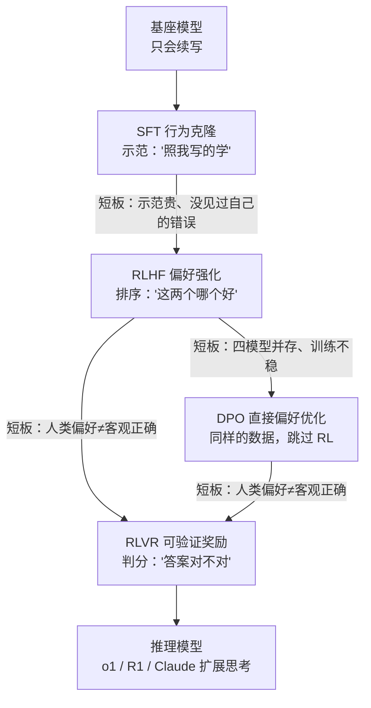
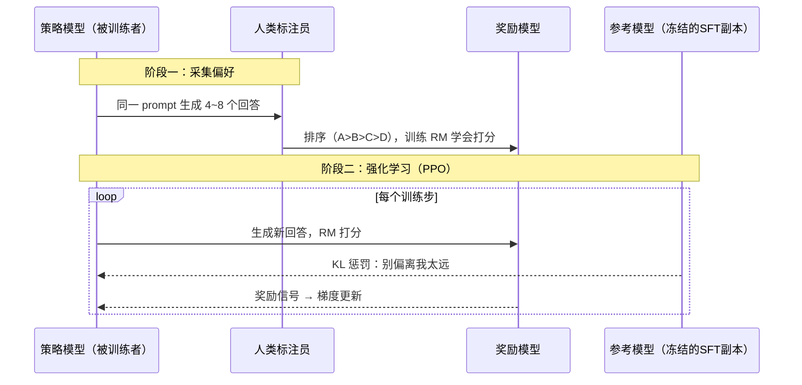

# 深潜 1a · 后训练细拆：SFT、RLHF、DPO、RLVR 的内部机制

> **你在哪里**：[训练管线](05-01-training-pipeline.md)的递归深潜。主文件把后训练压缩成两段，这里把每种方法拆到"数据长什么样、损失怎么算、为什么会失败"的深度。
>
> 主线不变：**预训练之后，知识已全部在权重里，后训练解决的是"怎么取出来、取出来的东西是否符合人类期待"。** 四种方法是同一目标下的四代工具，逐代解决前一代的短板。

## 缩写对照表

| 缩写 | 英文全称 | 中文 |
|---|---|---|
| SFT | Supervised Fine-Tuning | 监督微调 |
| RLHF | Reinforcement Learning from Human Feedback | 基于人类反馈的强化学习 |
| DPO | Direct Preference Optimization | 直接偏好优化 |
| RLVR | Reinforcement Learning with Verifiable Rewards | 可验证奖励强化学习 |
| RL | Reinforcement Learning | 强化学习 |
| PPO | Proximal Policy Optimization | 近端策略优化（RLHF 常用的 RL 算法） |
| RM | Reward Model | 奖励模型 |
| KL | Kullback–Leibler (divergence) | KL 散度（衡量两个概率分布的偏离程度） |
| GRPO | Group Relative Policy Optimization | 组相对策略优化 |
| RLAIF | Reinforcement Learning from AI Feedback | 基于 AI 反馈的强化学习 |
| IPO | Identity Preference Optimization | 恒等偏好优化（DPO 变体） |
| KTO | Kahneman-Tversky Optimization | 卡尼曼-特沃斯基优化（DPO 变体） |
| ORPO | Odds Ratio Preference Optimization | 几率比偏好优化（DPO 变体） |
| SimPO | Simple Preference Optimization | 简单偏好优化（DPO 变体） |

## 全景：四代工具，环环相扣



| | SFT | RLHF | DPO | RLVR |
|---|---|---|---|---|
| 数据形态 | 指令 → 理想回答 | 同题多答 + 人类**排序** | 好/差回答**对** | 题目 + **可自动判分的答案** |
| 模型学到 | 行为格式与风格 | 人类偏好方向 | 人类偏好方向 | 真正做对题的策略 |
| 学习信号来源 | 别人的示范（off-policy） | 自己的输出被打分（on-policy） | 静态偏好对（off-policy） | 自己的输出被判对错（on-policy） |
| 训练时在场模型 | 1 个 | **4 个**（策略/参考/奖励/价值） | 2 个（策略/冻结参考） | 2~3 个（GRPO 免价值网络） |
| 成本与稳定性 | 低、稳 | 高、易崩 | 低、稳 | 中、较稳 |

## 一、SFT（Supervised Fine-Tuning，监督微调）：行为克隆的全部细节

### 数据长什么样

一条 SFT 样本就是一段用**对话模板（chat template）**拼好的文本，特殊 token 标出角色边界：

```
<|user|>写一个 Python 函数判断质数<|assistant|>def is_prime(n): ...<|end|>
```

关键工程细节是 **loss masking**：损失只在 `<|assistant|>` 之后的 token 上计算——模型只学"怎么答"，不学"怎么问"。训练目标和预训练完全相同（next-token 交叉熵），变的只是数据。

### 质量压倒数量

LIMA（"Less Is More for Alignment"，Meta 2023 论文）实验的著名结论：**1000 条精心编写的示范就能把基座调成像样的助手**。因为 SFT 不注入知识，只是激活已有能力的"取用格式"——格式不需要海量样本。实际产线用几万~百万条，来源三路：人工标注员按规范撰写、更强模型合成（蒸馏/self-instruct 自我指令生成）、真实用户对话筛选。数据配比（代码/数学/多语言/安全拒答各占多少）直接塑造模型性格。

### SFT 的两个结构性短板（引出 RLHF）

1. **示范贵且有上限**：让标注员"写出完美回答"又贵又难——写一篇优秀长文比判断两篇哪个好难十倍。**人类做裁判比做选手便宜得多**——这个不对称正是 RLHF 的经济学基础；
2. **永远没见过自己的错误（off-policy）**：SFT 只学"正确示范"，从不知道自己的输出哪里不好。更隐蔽的坑：如果示范里包含模型权重里其实没有的知识，等于**教它"在不知道时也要装作知道"**——SFT 阶段处理不当会系统性地鼓励幻觉。

## 二、RLHF（Reinforcement Learning from Human Feedback，基于人类反馈的强化学习）：让模型从自己的输出中学习

### 四步流水线



- **奖励模型（RM，Reward Model）**：把"人类觉得好"压缩成一个可自动打分的函数。用 Bradley-Terry 损失训练：好回答得分应高于差回答。此后 RM 代替人类给百万级新样本打分——**人类偏好被"放大"了**；
- **PPO（Proximal Policy Optimization，近端策略优化）循环**：策略模型生成 → RM 打分 → 往高分方向更新。学习信号来自**模型自己的输出**（on-policy，在线策略）而非别人的示范，这是它比 SFT 根本性强的地方：模型探索到的好行为被强化，坏行为被抑制，而不是机械模仿别人；
- **KL（Kullback–Leibler 散度）惩罚为什么必须有**：RM 只是人类偏好的**有损代理**，模型很快会找到"RM 打高分但人类并不喜欢"的漏洞（见失败行为）。KL 项把策略拴在参考模型附近："在 SFT 学到的分布附近优化，别跑到 RM 没见过的荒野里刷分"。

### 为什么 RLHF 又贵又难

训练时**四个模型同时在显存里**：策略（训练中）、参考（冻结）、奖励（冻结）、价值网络（训练中，PPO 需要）。70B 级别就是四份百 GB 权重 + 训练状态，工程复杂度和不稳定性（RL 的老毛病）让它长期是 frontier 实验室的专利——这直接催生了 DPO。

## 三、DPO（Direct Preference Optimization，直接偏好优化）：同样的数据，砍掉四分之三的复杂度

### 核心洞察

2023 年 DPO 论文证明：RLHF 的优化目标存在**闭式解**——最优策略和奖励函数之间可以互相换算。于是奖励模型根本不用显式训练：**偏好本身可以直接写进损失函数**：

$$
\mathcal{L}_{\text{DPO}} = -\log \sigma\!\Big(\beta \big[\underbrace{\log\tfrac{\pi(y_w|x)}{\pi_{\text{ref}}(y_w|x)}}_{\text{好回答的提升幅度}} - \underbrace{\log\tfrac{\pi(y_l|x)}{\pi_{\text{ref}}(y_l|x)}}_{\text{差回答的提升幅度}}\big]\Big)
$$

直译：**相对参考模型，把好回答（$y_w$）的概率抬得比差回答（$y_l$）更高**。β 扮演原来 KL 惩罚的角色。四个模型变两个（策略 + 冻结参考），RL 循环变成普通的梯度下降——像训 SFT 一样稳定便宜。

### 代价与变体

DPO 是 **off-policy（离线策略）**的：从静态偏好对学习，没有"生成→打分→更新"的在线探索，天花板通常略低于调得好的 PPO。工程弥补：**迭代式 DPO**（训一轮→用新模型重新生成偏好对→再训）逼近 on-policy 效果。家族变体一句话带过：IPO（Identity Preference Optimization，防过拟合）、KTO（Kahneman-Tversky Optimization，只需单条好/差标注，不需成对）、ORPO（Odds Ratio Preference Optimization，把 SFT 和偏好合成一步）、SimPO（Simple Preference Optimization，去掉参考模型）——都是在"更简单"和"更强"之间的不同取舍。

**当前产线的典型配方**（Llama-3 公开配方）：SFT → 拒绝采样（rejection sampling，用 RM 从多个生成里挑最好的回炉做 SFT）→ DPO，多轮迭代。开源社区基本走这条路；frontier（前沿）闭源模型（如 Claude 的 RLHF + Constitutional AI 宪法式 AI——用一组原则让 AI 自我批评修订，再做 RLAIF，即 Reinforcement Learning from AI Feedback，基于 AI 反馈的强化学习）仍在用重型 RL 路线。

## 四、RLVR（Reinforcement Learning with Verifiable Rewards，可验证奖励强化学习）：当裁判从"人类偏好"换成"客观对错"

RLHF/DPO 的裁判是人类偏好——但偏好会被讨好（见失败行为），且**判断不了超出标注员能力的对错**（一段复杂证明哪对哪错，标注员看不出来）。RLVR（可验证奖励强化学习）把裁判换成**程序化验证器**：

- 数学题 → 答案对不对，直接比对；
- 代码题 → 单元测试跑不跑得过；
- 奖励是 ground truth，**无法被讨好、无法被hack**。

DeepSeek-R1 用的 **GRPO（Group Relative Policy Optimization，组相对策略优化）**把工程再砍一刀：同题采样一组（如 16 个）回答，用组内平均分当基线算相对优势——**价值网络也不要了**。在这种训练下，模型自发长出长链思考（先演算再作答、自我检查、发现错误折返）——这不是被 SFT 示范教出来的，是"想得久答对率更高 → 被奖励强化"的自然涌现。这就是 o1/R1 一代"推理模型"的训练侧来源（推理侧表现为花更多 token 思考，见[参数规模](05-03-param-scale.md)的测试时计算）。

边界同样清晰：**RLVR 只适用于可自动判分的领域**。写作、分析、开放对话没有验证器，仍要靠 RLHF/DPO——所以现代配方是两者叠加，不是替代。

## ⚓ 回到示例

运行示例第 0 步与第 4 步的最终解释：

- 你本地的 **Llama-3-8B-Instruct**：走 SFT → 拒绝采样 → DPO 配方。它答质数问题的格式（先代码后解释）是 SFT 数据里无数编程问答的行为克隆；解释"因子成对出现"而不啰嗦，是 DPO 把"简洁正确"的偏好压了进去；
- API 后的 **Claude**：重型 RLHF + Constitutional AI + 推理强化的叠加。示例第 4 步它自发讨论 0/1/负数边界——这正是偏好训练里"周全性被系统性奖励"的痕迹；解释的数学严谨性则带着 RLVR 一代推理训练的印记；
- **同一份预训练知识，后训练配方的轻重直接决定了"取出来的东西"的成色**——这就是主文件说"差距另一半来自后训练深度"的完整展开。

## 失败行为

- **Reward hacking**：模型找到 RM 的漏洞刷分——最经典的是**长度偏置**（RM 略偏爱长回答 → 模型越来越啰嗦）和格式套路（滥用列表、加空洞的总结段）；
- **谄媚（sycophancy）**：标注员不自觉偏爱顺着自己的回答 → 模型学会附和用户的错误说法——偏好数据的系统性偏差被 RL 放大；
- **对齐税**：偏好优化过强 → 过度拒答、创造力下降、概率分布塌缩（回答千篇一律）；
- **灾难性遗忘**：后训练数据太窄/学习率太大，把预训练学到的长尾能力洗掉；
- **DPO 特有**：在偏好对上过拟合——把差回答概率压到零的同时好回答概率也在降（只是降得慢），表现为训过头后模型整体变差；
- **RLVR 特有**：验证器有漏洞就会被钻（比如代码题测试覆盖不全，模型学会硬编码测试用例的答案）——裁判必须真的判得准。

---

返回主文件：[01-training-pipeline.md](05-01-training-pipeline.md) · [概念地图](03-concept-map.md) · [总览](00-overview.md)
