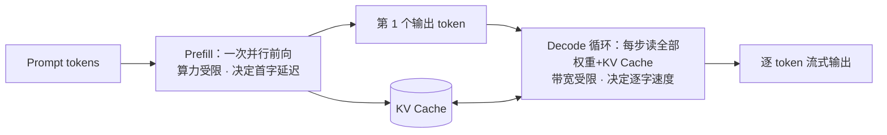

# 深潜 2 · 推理引擎：权重如何被读取

> **你在哪里**：第二个深潜。角色回顾：推理引擎**唯一职责是用权重生成回答（读取）**，绝不修改权重。它对应运行示例的**第 1~3 步**——ollama 和厂商集群都在跑同一套原理。
>
> 本仓库的博客系列已把这一层写透，本篇给足主干、细节链接过去，不重复。

## 内部构造：两阶段 + 一块缓存

一次生成 = **Prefill**（并行吃下全部输入，算力受限）+ **Decode**（逐 token 自回归生成，内存带宽受限）+ **KV Cache**（缓存历史 token 的 Key/Value，把平方级重复计算降为线性）。

三个关键量级（细账见博客）：

- **Decode 的天花板由带宽决定**：每 token 要读一遍全部权重。70B/FP16 = 140 GB，A100 带宽 2 TB/s → 单流上限约 14 token/s，此时算力利用率不到 1%；
- **KV Cache 按 token 计的显存**：Llama-3-70B 约 320 KB/token，8K 上下文一条就是 2.6 GB；
- **生产靠批处理救吞吐**：continuous batching 把几十个请求拼在一起分摊权重搬运成本；PagedAttention 管显存碎片。

深入阅读（本仓库博客系列）：
- [一次 LLM 推理的完整旅程](../llm-inference/llm-inference-process.zh.md) —— prefill/decode、TTFT/TPOT、计费的物理解释；
- [KV Cache 完全解析](../llm-inference/kv-cache.zh.md) —— Q/K/V 原理、显存账、优化生态。

## 与邻居的契约

- **上游**：接收训练管线交付的静态权重文件 + tokenizer 词表——加载后**只读**；
- **下游**：对应用层暴露"prompt 进、token 流出"的接口（本地是 ollama/vLLM 的 HTTP 端口，云端是厂商 API——**契约形状完全一样**，这正是开源/闭源可以互换集成的原因）;
- **采样参数**是用户对引擎唯一的运行时控制面：temperature、top-p、max_tokens——影响的是"从概率分布里怎么挑"，不影响分布本身。

## ⚓ 回到示例

运行示例第 1~3 步展开：

- **第 1 步**：`ollama run llama3` 把 16 GB 权重加载进你 MacBook 的统一内存；同一时刻，Claude 的权重常驻在数据中心几百张 GPU 上被数万用户分时共享；
- **第 2 步**：你的问题约 30 个 token，两家 tokenizer 各自切分（Llama 词表 128K 条目，切法与 Claude 不同——所以"同一段话在不同模型里 token 数不同"）；
- **第 3 步**：本地 prefill 30 个 token 几乎瞬间完成，decode 以约 15 token/s 逐字吐出——你看到的正是打字机效果；Claude 那边模型大得多，单 token 搬运成本更高，但 continuous batching + 更快的 HBM 让你感受到的速度不落下风。**两边跑的是同一套物理，差别只在规模和工程。**

## 失败行为

- **OOM**：权重 + KV Cache 超过显存直接崩——参数规模的硬约束（下一篇展开）；
- **幻觉在这一层的表现**：引擎忠实地从概率分布采样，**它没有真假判断**——权重里压缩失真的知识会被同样流畅地读出来；temperature 调高会放大这一点；
- **截断**：碰到 max_tokens 上限回答戛然而止;
- **慢**：上下文越长 KV Cache 越大，decode 每步搬运越多，长对话越聊越慢——机制见 KV Cache 博客。

---

下一篇：[03-param-scale.md](05-03-param-scale.md) —— 16 GB 这个数字从哪来，为什么 8B 和 frontier 差距肉眼可见。返回 [概念地图](03-concept-map.md) · [总览](00-overview.md)
