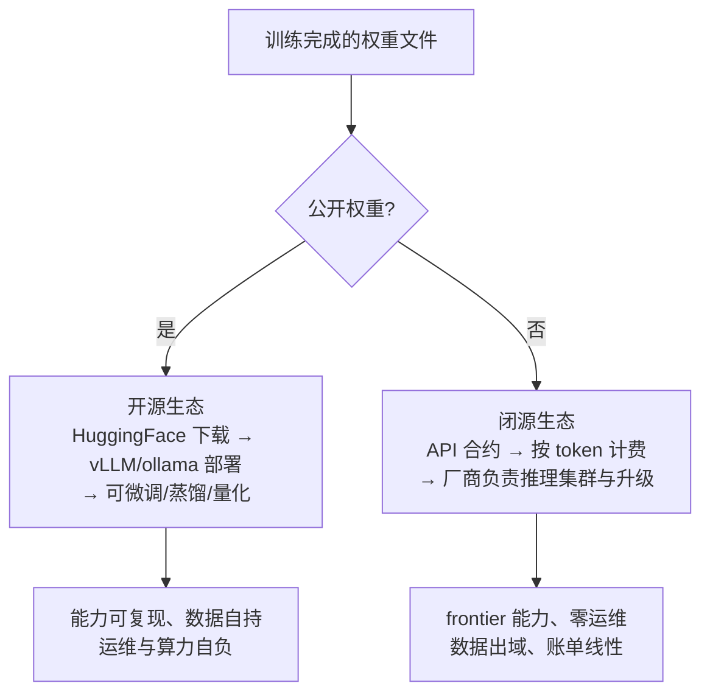

# 深潜 4 · 开源 vs 闭源：同一份权重，两种交付

> **你在哪里**：最后一个深潜。角色回顾：发布形态**决定权重如何到达使用者，但不改变模型能力本身**。它对应运行示例的**第 1、5 步**——下载权重 vs 调 API，隐私自持 vs 按 token 计费。

## 分叉点在哪

训练管线产出权重文件后，只有一个决策：**这个文件公开吗？**

- **公开** → open weights：任何人可下载、自部署、微调。代表：Llama（Meta）、Qwen（阿里）、DeepSeek、Mistral、Gemma（Google）；
- **不公开** → closed API：权重是商业机密，能力只通过 API 出租。代表：GPT（OpenAI）、Claude（Anthropic）、Gemini（Google）。

再次强调 [02-what](02-what.md) 的澄清：所谓"开源"绝大多数是 **open weights**——训练数据与完整训练代码通常不公开，你能复用结果但无法复现过程。许可证也各有约束（Llama 有用户量条款，Qwen/DeepSeek 较宽松）——**商用前必须读许可证**，"能下载"不等于"能随便用"。

## 系统性对比

| 维度 | 开源（自部署） | 闭源（API） |
|---|---|---|
| **能力上限** | 追赶极快（DeepSeek-R1 时刻），但最前沿通常晚 6~12 个月 | Frontier 能力的第一现场 |
| **成本模型** | 前期投入（GPU/运维）+ 边际成本趋近电费；量大更划算 | 零前期投入，按 token 付费线性增长；量小更划算 |
| **数据隐私** | 数据不出你的机器/VPC——合规刚需场景的决定性优势 | 数据经过厂商（有企业级合规承诺，但信任模型不同） |
| **定制权** | 全量微调、LoRA、改采样器、蒸馏，权重任你处置 | 有限微调接口 + prompt 工程 |
| **运维负担** | 推理引擎、显存规划、扩缩容全归你 | 全归厂商，你只管调 API |
| **可控性/稳定性** | 权重版本永久固定，行为可复现 | 厂商升级/下线模型，行为可能漂移 |
| **生态** | HuggingFace、ollama、vLLM、开放微调社区 | 官方 SDK + 工具生态（function calling、缓存定价等） |

**决策的实质不是"哪个好"，而是三个问题**：① 数据能不能出域？② 用量大到摊平自建成本了吗？③ 需要的能力在开源前沿之内吗？——三个"是"选开源，任何一个硬性"否"基本就定了方向。

## 两个生态如何互相塑造

这不是静态对峙，而是持续互动：

- **开源追赶定价**：每次开源模型逼近 frontier（Llama-3、DeepSeek-R1），闭源 API 都应声降价或推出更强档位——开源是整个市场的价格锚；
- **闭源反哺开源**：蒸馏让开源小模型间接吸收闭源大模型的能力（许可证对此多有限制，但趋势明确）；
- **混合架构成为主流**：生产系统常见"敏感数据走本地开源模型、复杂任务走闭源 API"的路由设计——两种交付形态在同一个应用里共存。

## ⚓ 回到示例

运行示例第 1、5 步展开：

- **第 1 步的本质**：你能 `ollama pull llama3`，是因为 Meta 把权重文件放上了公网；你永远不能 `ollama pull claude`，因为那份权重是 Anthropic 的核心资产。分叉之后两边的 prefill/decode 原理一模一样（[深潜 2](05-02-inference-engine.md)）——**开源/闭源之分不在技术栈，在交付合约**；
- **第 5 步的本质**：本地这轮对话从未离开你的笔记本——医疗、金融场景里这一条就足以定选型；API 那路，你的 30 个输入 token 和几百个输出 token 按价目表计费，走的正是[推理经济学](../llm-inference/llm-inference-process.zh.md)那套物理成本；
- **示例里没发生但值得知道**：如果你想让 8B 记住你公司的内部术语，你可以直接 LoRA 微调它——这是闭源路线给不了的深度定制权。

## 失败行为

- **开源侧**：许可证违规商用（法律风险）；下载到被投毒/篡改的第三方权重（供应链风险——认准官方仓库和哈希校验）；自部署安全配错，推理端口裸奔公网；
- **闭源侧**：厂商模型升级导致 prompt 行为漂移，回归测试形同虚设；API 限流/宕机成为你的可用性上限；深度绑定后的迁移成本（vendor lock-in）；
- **共同的**：无论哪种形态，幻觉、越狱、注入攻击都存在——交付形态不改变模型的内生弱点。

---

四个深潜完毕。下一篇：[06-walkthrough.md](06-walkthrough.md) —— 带着全部深度，重跑运行示例。返回 [概念地图](03-concept-map.md) · [总览](00-overview.md)
