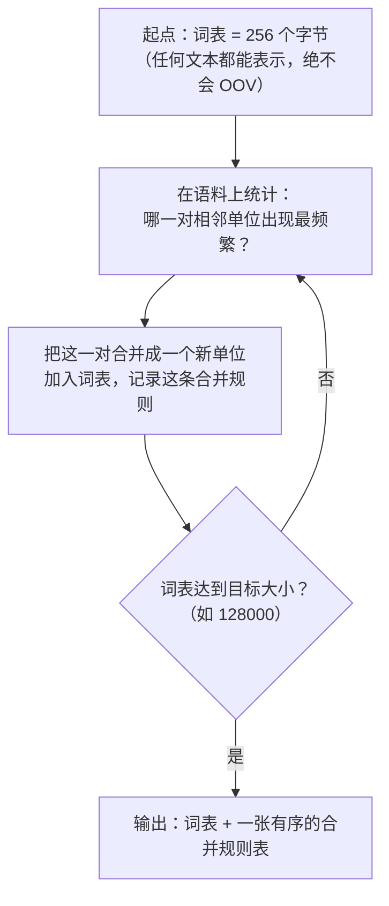

# Tokenizer：模型眼里的世界不是文字

> 问任何一个大模型："strawberry 这个单词里有几个字母 r？"——很长一段时间里，最强的模型也会理直气壮地回答"2 个"。
>
> 这经常被当成"AI 果然还很笨"的笑话。但真相更有意思：**模型压根没看见那些字母。** 在它眼里，`strawberry` 是三个整数，字母 r 从来没有单独出现在它的输入里。这不是智力问题，是感知问题——就像让你数一张你从没见过的图片里有几个红点。
>
> 这一篇讲 Tokenizer（分词器）：它怎么工作、为什么中文比英文贵、为什么它造成的缺陷训练不掉、以及它如何默默决定你的 API 账单。它是整个流水线里**唯一在训练开始前就被冻结、之后永不改变**的组件——这个性质带来了全部麻烦。

---

## 缩写对照表

| 缩写 | 英文全称 | 中文 |
|---|---|---|
| BPE | Byte-Pair Encoding | 字节对编码 |
| UTF-8 | Unicode Transformation Format 8-bit | 8 位 Unicode 转换格式 |
| OOV | Out-Of-Vocabulary | 词表外（未登录词） |
| LLM | Large Language Model | 大语言模型 |
| API | Application Programming Interface | 应用程序接口 |
| CJK | Chinese-Japanese-Korean | 中日韩（统一表意文字） |

---

## 一、为什么需要它：三种切法的两难

模型只吃数字，所以文本必须先被切成有限个"最小单位"，每个单位对应一个整数 ID。问题是——切多细？

| 切法 | 词表大小 | 优点 | 致命缺陷 |
|---|---|---|---|
| **按字符** | 几百 | 词表极小、永不会遇到未知词 | 序列极长（一句话上百个单位），信息密度太低，模型学不动长距离关系 |
| **按单词** | 几十万~无穷 | 序列短、语义单位天然完整 | 遇到没见过的词（新造词、拼写错误、专业术语）直接失效；中文没有空格无法切；形态变化（run/running/ran）各占一个坑位 |
| **按子词** | 几万~几十万 | **两者的折中** | 切法需要学习，且切完就固定 |

**子词（subword）方案赢了**，理由很直接：高频词整个保留（`the`、`是`），低频词拆成常见片段（`tokenization` → `token` + `ization`），彻底没见过的字符串则退回字节级——**永远不会有"未知词"**。

一个直观的规模感：英文平均**约 4 个字符 = 1 个 token**，或者说 **100 个 token ≈ 75 个英文单词**。

## 二、BPE 是怎么学出来的

主流模型用的是 **BPE（Byte-Pair Encoding，字节对编码）**。它的训练算法简单到可以在纸上跑：



### 手动走一遍

假设语料里反复出现 `low`、`lower`、`lowest`。起始时每个字符是一个单位：

```
第 0 步： l o w   /   l o w e r   /   l o w e s t
```

统计发现 `l` + `o` 这一对出现最频繁 → 合并：

```
第 1 步： lo w    /   lo w e r    /   lo w e s t
```

接着 `lo` + `w` 最频繁 → 合并：

```
第 2 步： low     /   low e r     /   low e s t
```

再接着 `e` + `r` 高频 → 合并成 `er`：

```
第 3 步： low     /   low er      /   low e s t
```

重复几万次之后，词表里就自然长出了 `low`、`er`、`est` 这些**没有人为定义、纯粹从统计中浮现的语言片段**。它们往往恰好对应词根和词缀——但这是频率统计的副产品，不是语言学设计。

**推理时**只需按训练时记录的合并规则顺序，对新文本重放一遍合并即可。这一步是确定性的：同一个 tokenizer，同一段文本，永远切出同一个结果。

### "字节对"里的"字节"

现代 BPE 从 **UTF-8 字节**而不是字符起步。这个选择很关键：256 个字节能表示地球上任何文本——emoji、生僻字、二进制乱码，全都能被切出来，只是切得很碎。**代价是碎片化，但永远不会崩。**

## 三、词表大小：一个真实的工程权衡

| 词表 | 代表模型 | 后果 |
|---|---|---|
| 32,000 | Llama-2 | 嵌入层小，但非英语文本被切得极碎 |
| 100,277 | GPT-3.5 / GPT-4（cl100k） | 多语言效率明显改善 |
| 128,256 | Llama-3 系列 | 中文/代码效率大幅提升 |
| ~200,000 | GPT-4o（o200k） | 多语言进一步优化 |

词表变大的收益是**同样的文本切出更少的 token**——上下文能装更多内容、生成更快、账单更便宜。

代价在 [04 · Transformer 内部构造](04-transformer.zh.md) 里算过：嵌入表和输出头都是 $|V| \times d_{\text{model}}$。Llama-3-8B 的词表从 32K 扩到 128K，这两张表从约 2.6 亿参数涨到约 10.5 亿——**多出来的 8 亿参数全花在"认字"上**，占了 8B 模型的 10%。

**行业的选择很明确：这笔钱值得花。** 因为词表参数是一次性成本，而 token 效率是每一次调用都要付的成本。

## 四、中文税：为什么同样的话，中文更贵

这是最有实感的一节。同一句话在不同 tokenizer 下的大致 token 数：

| 文本 | 字符数 | Llama-2 (32K) | GPT-4 (cl100k) | Llama-3 (128K) |
|---|---|---|---|---|
| `Hello, how are you today?` | 25 | ~8 | ~7 | ~7 |
| `你好，今天过得怎么样？` | 11 | ~20 | ~12 | ~8 |

同样的语义，早期模型上中文的 token 数可能是英文的 2~3 倍。原因很直白：**训练语料以英语为主，高频英文片段被大量合并进词表；中文字符出现频率相对低，很多汉字没能拿到自己的词表位，只能退回 UTF-8 字节表示——一个汉字 3 个字节 = 3 个 token。**

这个"中文税"是实打实的成本：

- **账单直接多付**：API 按 token 计费，同样的内容多花一倍多的钱；
- **上下文窗口缩水**：标称 8K token 的窗口，装中文可能只相当于英文的一半内容；
- **生成更慢**：输出同样长度的中文要生成更多 token，而 decode 是逐 token 的（见 [08 · 推理引擎](08-inference-engine.zh.md)）。

**这也是国产模型（Qwen、DeepSeek、GLM 等）在中文场景的一个结构性优势**：它们的词表针对中文语料训练，中文 token 效率显著更高——同样的预算能塞进更多内容。选型时这一条经常被忽略，但它直接体现在账单上。

Llama-3 把词表扩到 128K 后中文效率大幅改善，说明这是个可以通过工程投入解决的问题，只是需要在设计阶段就做决定——因为**词表冻结之后再也改不了**。

## 五、Tokenizer 造成的缺陷，训练不掉

现在回到开头的 strawberry。

### 数不清字母

`strawberry` 在多数 tokenizer 下被切成三块，类似：

```
["str", "aw", "berry"]  →  [1618, 675, 15717]
```

模型的输入是 `[1618, 675, 15717]`。**字母 `r` 从来没有作为一个独立单位出现过。** 让它数 r 的个数，相当于让你数一个你只知道编号、没见过内容的东西。

它有时能答对，是因为语料里恰好有人讨论过这个单词的拼写——那是**记住了**，不是**数出来的**。

**这个缺陷无法靠加大模型或多训练来修复**，因为信息在进入模型之前就已经丢失了。真正的解法只有两个：让模型调用工具（写段代码数一数），或者改 tokenizer（而它已经冻结了）。

### 算术为什么不稳

数字的切法在不同模型间差异很大：

- **Llama 系列**：每个数字单独成一个 token（`4096` → `4`,`0`,`9`,`6`）——切法稳定一致，对齐容易；
- **GPT 的 cl100k**：数字按最多 3 位一组切（`4096` → `409`,`6`；但 `1234` → `123`,`4`）——**同一个数字在不同上下文里可能切法不同**。

竖式加法需要个位对个位。当"个位"这个概念在 token 层面不稳定时，模型只能靠记忆而非算法来做加法——位数一多就掉链子。这是 [02 · LLM 到底是什么](02-what.zh.md) 里"不做符号推理保证"的一个具体机制来源。

### Glitch tokens：词表里的幽灵

最诡异的一类问题。BPE 的词表是在一份语料上统计出来的，而模型训练用的是另一份（通常清洗更严格）的语料。于是可能出现：**某个字符串在建词表时高频，进了词表；但在训练时被清洗掉了，模型几乎没见过它。**

这个 token 的嵌入向量因此几乎没被训练过，停留在随机初始化附近。碰到它，模型会给出完全无法预测的输出——重复、答非所问、甚至拒绝复述它。最著名的例子是 GPT-2/GPT-3 词表里的 `SolidGoldMagikarp`（一个 Reddit 用户名）。

这个现象是"tokenizer 和训练数据必须来自同一分布"这条工程纪律的反面教材。

### 格式敏感

`" hello"`（带前导空格）和 `"hello"` 是**两个不同的 token**，ID 不同，嵌入向量不同。这解释了一些看似玄学的提示词现象：结尾多一个空格、缩进多两格、换行符位置不同，模型的行为可能真的会变——因为你送进去的确实是不同的整数序列。

## 六、一条硬约束：词表冻结，永不可改

Tokenizer 在训练开始**之前**就要确定，之后整个生命周期都不能动。原因很物理：

**嵌入表的每一行都绑定了一个特定的 token ID。** 改词表 = 行的含义全部错位 = 几十亿参数学到的一切作废。这不是"重训一下嵌入层"能解决的，因为所有上层参数都是在这套语义坐标上训练出来的。

所以：

- Tokenizer 的所有缺陷**在模型出生前就已经注定**；
- 换 tokenizer 意味着**从零重新预训练**，成本以千万美元计；
- 各家模型的词表互不兼容，这也是"同一段话在不同模型里 token 数不同"的根本原因。

这就是 [03 · 七个核心概念](03-core-concepts.zh.md) 里"Tokenizer 角色的 Does NOT do：训练前冻结，此后永不改变"这一条的完整含义。

## 七、实用建议

1. **算成本前先数 token，别数字数**。用 `tiktoken`（OpenAI）或 HuggingFace 的 `AutoTokenizer` 实测目标模型的切分结果——尤其是中文和代码，估算误差可能超过 2 倍；
2. **中文重度场景把 token 效率纳入选型**。中文 token 效率高的模型，等价于单价打了折；
3. **别让模型做字符级操作**。数字母、反转字符串、判断回文——一律交给工具调用；
4. **提示词里保持格式稳定**。空格、缩进、换行的微小变化会改变 token 序列；做 A/B 测试时要把它们控制住；
5. **上下文预算按 token 规划**。"我的文档有 5 万字"和"我的文档占多少 token"是两个问题，后者才决定装不装得下（见 [10 · 上下文窗口](10-context-window.zh.md)）。

## ⚓ 回到示例

运行示例的**第 2 步**现在可以精确展开了。你的问题：

> "写一个 Python 函数判断质数，并解释为什么只需要检查到平方根。"

- **Llama-3 的 tokenizer**（128K 词表）：中文部分切得还算高效，`Python` 这类高频技术词是单个 token，整句大约 30 个 token；
- **Claude 的 tokenizer**：词表和合并规则完全不同，同一句话切出的**token 数和边界都不一样**。

这就是为什么"同一个问题问不同模型，输入 token 数不同"——两边的账单基准从第一步起就分岔了。

而**第 4 步**的能力差距里，也藏着 tokenizer 的一份贡献：切分越合理，同样的上下文预算能装下越多真实信息，模型"看到"的语义单位也越完整。这份差异不体现在任何参数量对比表里，但它一直在起作用。

顺带一提：示例里模型要写的 `n ** 0.5` 和 `int(...)`，在代码语料上训练充分的 tokenizer 里往往是紧凑的少数几个 token——**tokenizer 对代码的友好程度，直接影响模型的代码能力**。这也是为什么现代模型的词表训练语料里代码占了相当比例。

## 一句话总结

**Tokenizer 是模型与文字之间唯一的翻译官，用 BPE 从语料统计中学出一套子词切法，训练前冻结、此后永不改变。** 它决定了你的 token 账单、上下文的真实容量、中文相对英文的成本劣势，以及一批无法通过训练修复的结构性缺陷——因为那些信息在进入模型之前就已经丢失了。

---

**下一篇**：[06 · 训练管线：数据如何变成权重](06-training-pipeline.zh.md) —— 零件看完了，看它们是怎么被"炼"出来的。

**系列目录**：[index.md](index.md)
