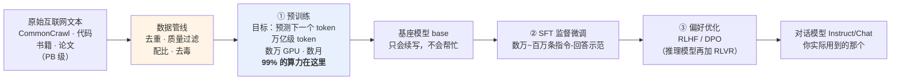

# 训练管线：数据如何变成权重

> 一个模型的能力，在你第一次调用它之前的好几个月就已经完全确定了。
>
> 那几个月里发生的事：几十 PB 的互联网原始数据被清洗成几十 TB 的高质量语料；上万张 GPU 连续运转数月，把 80 亿到数千亿个随机初始化的浮点数一点点推向某个特定的取值组合；期间 loss 曲线可能突然爆炸，工程师半夜爬起来回滚 checkpoint。最后产出一个几十 GB 的文件。
>
> 这一篇讲这条管线：**数据怎么清洗、算力怎么组织、为什么产出的"基座模型"根本不会回答问题、以及真实的故障长什么样。** 它对应运行示例的第 0 步——你提问之前早已发生、且再也不会重来的一切。

---

## 缩写对照表

| 缩写 | 英文全称 | 中文 |
|---|---|---|
| SFT | Supervised Fine-Tuning | 监督微调 |
| RLHF | Reinforcement Learning from Human Feedback | 基于人类反馈的强化学习 |
| DPO | Direct Preference Optimization | 直接偏好优化 |
| RLVR | Reinforcement Learning with Verifiable Rewards | 可验证奖励强化学习 |
| GPU | Graphics Processing Unit | 图形处理器 |
| FLOPs | Floating Point Operations | 浮点运算次数 |
| DP / TP / PP | Data / Tensor / Pipeline Parallelism | 数据 / 张量 / 流水线并行 |
| MFU | Model FLOPs Utilization | 模型算力利用率 |
| LR | Learning Rate | 学习率 |

---

## 一、三级流水线：全景

三个阶段的资源分配极度不均衡，这一点必须先建立直觉：

| 阶段 | 数据量 | 算力占比 | 决定了什么 |
|---|---|---|---|
| 预训练 | 万亿级 token | **~99%** | **知识和能力的上限** |
| SFT | 数万~百万条 | <1% | 行为格式（会不会答问题） |
| 偏好优化 | 数万~数十万对 | <1% | 回答的品质、安全、风格 |

**一句话概括**：预训练决定模型"能做到什么"，后训练决定"愿意怎么表现"。后训练无法凭空创造预训练没有的能力，但它决定了那些能力能不能被正常取用。

## 二、数据管线：真正的护城河

大家都能拿到 CommonCrawl（公开的网页抓取数据集）。为什么模型能力差那么多？很大一部分答案在这一步——**数据清洗是各家最不愿意公开的部分**。

原始互联网数据的质量惨不忍睹：模板化的导航栏、机翻的垃圾内容、SEO 农场、几百个网站转载同一篇文章。直接拿来训练，效果远不如清洗后的一小部分。

### 四道工序

**① 去重（deduplication）**

同一段文本重复出现多次，模型会从"理解规律"退化成"死记硬背"。研究反复证明去重能显著提升效果并降低死记硬背风险。

去重分两级：文档级（整篇一样的删掉，常用 MinHash 做近似匹配）和段落级（跨文档的重复段落）。互联网数据经过去重通常要掉 50% 以上。

**② 质量过滤（quality filtering）**

早期用启发式规则（文本长度、标点比例、停用词占比、是否有大量重复行）。现在主流做法是**训一个小的质量分类器**——用高质量文本（如维基百科、书籍）做正样本，随机网页做负样本，给每个文档打分，低分的丢掉。

**③ 配比（data mixture）**

这是最像"手艺"的一步。语料由多个来源按比例混合：网页、代码、书籍、论文、多语言、数学。比例直接塑造模型性格：

- **代码占比被普遍认为显著影响推理能力**——即使你只关心自然语言任务，加代码也有用。一个流行的解释是代码提供了大量结构化的、有严格因果链条的文本；
- **数学和论文**提升逻辑与专业能力；
- **多语言比例**决定非英语性能——这也和 [05 · Tokenizer](05-tokenizer.zh.md) 讲的词表设计相互呼应。

**④ 去毒与合规（safety filtering）**

移除个人隐私信息、极端有害内容、明确的版权风险内容。这一步做得太狠会伤害能力（模型需要见过负面样本才知道如何拒绝），做得太松则是法律和安全风险——又一个没有标准答案的权衡。

### 一个越来越重要的变量：合成数据

高质量的人类文本正在见底——公开互联网上"值得训练"的部分是有限的。于是各家越来越多地用更强的模型生成训练数据（改写、扩写、生成教科书式的解释）。

这带来一个开放问题：**用模型生成的数据训模型，会不会导致质量逐代退化（model collapse，模型崩溃）？** 目前的经验是"配比得当时有效，全靠合成则危险"，但这仍是一个活跃的研究前沿。

## 三、① 预训练：99% 的算力花在这里

### 目标函数只有一个

给定前文，预测下一个 token 的概率分布，与真实的下一个 token 算交叉熵损失，反向传播更新全部权重：

$$
\mathcal{L} = -\frac{1}{N}\sum_{i=1}^{N} \log P_\theta(t_i \mid t_1, \dots, t_{i-1})
$$

没有人工标签——**下一个词就写在原文里**。这就是"自监督"的全部含义，也是万亿级数据成为可能的唯一原因（[01 · 为什么会有 LLM](01-why.zh.md) 的约束一）。

值得再强调一次这个目标的苛刻程度：要准确预测下一个词，模型被迫学会语法、事实、代码语义、算术、逻辑推理、甚至角色一致性——因为这一切都影响下一个词是什么。**一个极简的目标函数，逼出了通用能力。**

### 真实的量级感

以 Llama-3-70B 公开披露的数据为参照：

| 维度 | 量级 |
|---|---|
| 语料 | 约 **15T（15 万亿）token** |
| 算力 | **1.6 万张 H100**，训练数月 |
| 成本 | 电费 + 折旧，以千万美元计 |
| 单次前向-反向 | 每个 token 约 6 × 参数量 FLOPs |

最后一行是个有用的估算公式：**训练总算力 ≈ 6 × 参数量 × token 数**。代入 70B 和 15T：$6 \times 7\times10^{10} \times 1.5\times10^{13} \approx 6.3\times10^{24}$ FLOPs。这个数字就是"为什么只有少数机构能训前沿模型"的最直接答案。

### 算力怎么组织：三种并行

一个 70B 模型的权重加上优化器状态（Adam 需要为每个参数额外存动量和方差）远超单张 GPU 的显存。所以训练必须切开，业界用三种并行的组合：

| 并行方式 | 切什么 | 代价 |
|---|---|---|
| **数据并行（DP）** | 把 batch 切给不同 GPU，各算各的梯度再同步 | 每步都要全局同步梯度，通信量大 |
| **张量并行（TP）** | 把单个矩阵切开，多张卡合算一次矩阵乘法 | 通信极频繁，只适合同一节点内的高速互联 |
| **流水线并行（PP）** | 把不同的层放在不同 GPU 上，像流水线一样传递 | 会产生"气泡"（有些卡在等上游），需要精细调度 |

三者叠加使用（称为 3D 并行）。衡量效率的指标是 **MFU（Model FLOPs Utilization，模型算力利用率）**——实际有效算力占理论峰值的比例。**前沿训练能做到 40%~50% 就算很好了**，剩下的全被通信、同步、气泡吃掉。这个数字直观地说明了大规模训练的工程难度：一半的钱花在了"让卡协同"上。

### 训练过程中的调度

不是简单地"跑到底"。几个关键调度：

- **学习率调度（LR schedule）**：先 warmup（从 0 慢慢升到峰值，避免早期震荡），然后余弦衰减到很小的值。**结束时的低学习率阶段对最终质量影响很大**；
- **数据退火（annealing）**：训练末期把语料配比调向高质量子集（教科书、精选代码），用较低学习率再跑一段。这是近年被广泛采用的技巧，收益明显；
- **Checkpoint（检查点）**：每隔一段时间保存全部权重和优化器状态。这不是可选项——几万卡跑几个月，硬件故障是常态而非例外，没有 checkpoint 就意味着一次故障损失几周。

### 产出：一个只会续写的基座模型

预训练的产物叫**基座模型（base model）**——一个极强的续写器。

你问它"法国的首都是哪？"，它可能续写：

> "……B. 里昂 C. 马赛 D. 波尔多。正确答案是 A。第 4 题：德国的首都是……"

因为在训练语料里，这句话后面**最常跟着的就是这种文本**。它没有理解错，它完美地完成了任务——只是任务是"续写"，不是"回答"。

**知识已经全部在里面了，但不会以助手的方式取出来。** 这就是后训练存在的全部理由。

> 想亲眼看到这个现象，去下载一个不带 `Instruct` 后缀的模型试试（[13 · 完整重演](13-walkthrough.zh.md) 的动手练习里有具体命令）。这是所有练习里最能带来"啊哈"感的一个。

## 四、② SFT：教会"助手的格式"

SFT（Supervised Fine-Tuning，监督微调）用数万到百万条高质量"指令 → 理想回答"示范继续训练。训练目标和预训练**完全相同**（next-token 交叉熵），变的只有数据。

数据量只有预训练的万分之一，作用却是决定性的：模型学会**"看到问题就回答问题"**这个行为模式。SFT 之后，"法国的首都是哪？"会得到"巴黎"。

一个关键的工程细节是 **loss masking（损失掩码）**：损失只在助手回复的 token 上计算，用户提问部分不计入——**模型只学"怎么答"，不学"怎么问"**。

## 五、③ 偏好优化：从"会回答"到"回答得好"

两个回答都语法正确、都切题时，哪个更有帮助、更诚实、更安全？这写不成规则，只能学人类偏好：

- **RLHF**：人类对多个回答排序 → 训一个奖励模型 → 用强化学习让模型往高分方向调整；
- **DPO**：跳过奖励模型，直接用偏好对优化——更简单稳定，开源社区主流；
- **RLVR**：在数学、代码这类**答案可自动判对错**的任务上做强化学习，模型自发学会先长链思考再作答——这是 o1/DeepSeek-R1 一代"推理模型"的训练侧来源。

> **递归深潜**：这三者的数据形态、损失函数、在场模型数量与各自的失败模式，全部细节见 [07 · 后训练细拆](07-post-training.zh.md)。它是整个系列里最技术性的一篇。

## 六、与邻居的契约

- **上游（数据管线）**：吃清洗后的 token 序列——**tokenizer 在训练开始前就已冻结**，词表从此永不改变（[05 · Tokenizer](05-tokenizer.zh.md)）；
- **下游（推理引擎）**：交付一个静态权重文件（格式如 safetensors）。**这是训练与推理之间唯一的接口**——推理引擎不关心权重怎么来的，训练管线不关心权重怎么被用；
- **发布形态**：同一份权重文件，从这里分叉走向公开下载或 API 深锁（[12 · 开源 vs 闭源](12-open-vs-closed.zh.md)）。

这个"唯一接口"的性质很重要：它意味着训练侧和推理侧的技术栈可以完全独立演进。你可以用一年前训的模型配今年最新的推理引擎，也可以把同一份权重跑在完全不同的硬件上。

## ⚓ 回到示例

运行示例第 0 步的完整展开——"两个模型的能力从哪来"：

- **你本地的 Llama-3-8B-Instruct**：Meta 用约 15T token 预训练出 8B 基座（那里面有 GitHub 上成千上万份 `is_prime` 实现，以及数学教材里的平方根论证），再做 SFT + DPO 后训练，把最终权重（FP16 约 16 GB）公开发布。
  - 它**能写对质数函数**，是因为这个模式在预训练语料里出现过无数次；
  - 它**听得懂"要函数 + 要解释"**，是 SFT 的功劳；
  - 它的解释**简洁而不啰嗦**，是 DPO 把"简洁正确"的偏好压进去的结果。

- **API 后的 Claude**：同样的三级管线，但参数规模更大、数据配比更精细、后训练投入重得多（更多轮偏好优化、宪法式对齐、推理强化）。

示例第 4 步"解释更严谨、边界情况更周全"的差距，来源可以精确拆成两半：**一半来自参数规模**（[09 · 参数规模](09-param-scale.zh.md)），**另一半就来自这里——后训练的深度**。

## 七、真实的失败行为

这一节的内容在论文里很少见，但它是这条管线的日常。

**训练崩溃（loss divergence）**
几万卡跑数月，loss 曲线突然飙升，模型"训崩"。原因可能是学习率过高、某批数据异常、数值精度溢出、或者纯粹的硬件位翻转。标准操作是回滚到上一个 checkpoint、跳过坏批次、降学习率重来。**这不是罕见事故，是常规运维。**

**数据污染（contamination）**
评测集的题目混进了训练数据 → 跑分虚高，实际能力不符。这在对比开源/闭源模型的 benchmark 排名时是头号警惕对象——**尤其当一个模型在某个榜单上异常突出而在实际使用中平平时**。各家都在做去污染检测，但没人能保证做干净。

**死记硬背（memorization）**
去重不彻底时，模型会逐字背诵训练文本。这既是版权风险（背出受版权保护的原文），也是隐私风险（背出语料里混入的个人信息）。模型越大，记忆倾向越强。

**灾难性遗忘（catastrophic forgetting）**
后训练数据太窄或学习率太大时，预训练学到的长尾能力被洗掉。表现是模型在目标任务上变好，在其他任务上悄悄变差——**不报错，只是退化**。这也是自己微调开源模型时最常踩的坑。

**对齐税（alignment tax）与过度对齐**
后训练把行为收得太紧，模型变得过度拒答、创造力下降、回答千篇一律。对齐强度是门手艺，不是越多越好——细节见 [07 · 后训练细拆](07-post-training.zh.md)。

## 一句话总结

**训练管线的唯一职责是把数据变成权重，跑完即退场。** 它的 99% 算力花在预训练上（决定能力上限），剩下不到 1% 花在后训练上（决定能不能用）。数据清洗是真正的护城河，分布式训练的一半开销花在让卡协同，而它交给下游的只有一样东西：一个静态的、只读的权重文件。

---

**下一篇**：[07 · 后训练细拆：SFT、RLHF、DPO、RLVR 四代工具](07-post-training.zh.md) —— 把上面第五节压缩的三段展开成一整篇。

**系列目录**：[index.md](index.md)
