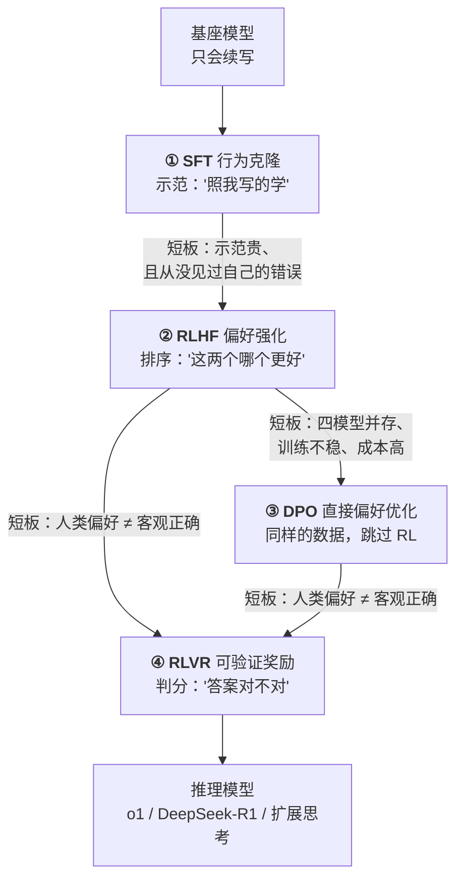
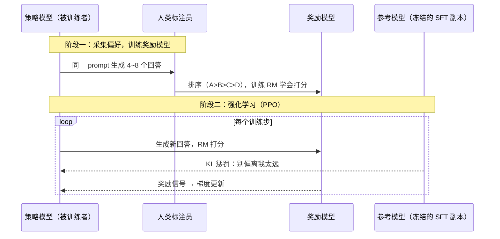

# 后训练细拆：SFT、RLHF、DPO、RLVR 四代工具

> 预训练花掉 99% 的算力，产出一个知识极其丰富、但完全不会帮忙的续写器。后训练只花不到 1% 的算力，却决定了你能不能用它。
>
> 这一篇把后训练的四代工具拆到"数据长什么样、损失怎么算、训练时几个模型在显存里、为什么会失败"的深度。它是本系列最技术性的一篇，但主线始终只有一句：
>
> **预训练之后，知识已经全部在权重里；后训练解决的是"怎么取出来、取出来的东西是否符合人类期待"。**
>
> 四代工具不是互相替代，而是**逐代解决前一代的短板**——理解这个演进链条，比记住任何单个算法都有用。
>
> 姊妹篇：[会续写 ≠ 会帮忙](../llm-inference/post-training.zh.md) 从"为什么后训练重要"的角度讲同一件事，偏商业与产品视角；本篇偏机制与工程。

---

## 缩写对照表

| 缩写 | 英文全称 | 中文 |
|---|---|---|
| SFT | Supervised Fine-Tuning | 监督微调 |
| RLHF | Reinforcement Learning from Human Feedback | 基于人类反馈的强化学习 |
| DPO | Direct Preference Optimization | 直接偏好优化 |
| RLVR | Reinforcement Learning with Verifiable Rewards | 可验证奖励强化学习 |
| RL | Reinforcement Learning | 强化学习 |
| PPO | Proximal Policy Optimization | 近端策略优化（RLHF 常用的 RL 算法） |
| RM | Reward Model | 奖励模型 |
| KL | Kullback–Leibler (divergence) | KL 散度（衡量两个概率分布的偏离程度） |
| GRPO | Group Relative Policy Optimization | 组相对策略优化 |
| RLAIF | Reinforcement Learning from AI Feedback | 基于 AI 反馈的强化学习 |
| CAI | Constitutional AI | 宪法式 AI |
| IPO | Identity Preference Optimization | 恒等偏好优化（DPO 变体） |
| KTO | Kahneman-Tversky Optimization | 卡尼曼-特沃斯基优化（DPO 变体） |
| ORPO | Odds Ratio Preference Optimization | 几率比偏好优化（DPO 变体） |
| SimPO | Simple Preference Optimization | 简单偏好优化（DPO 变体） |
| LoRA | Low-Rank Adaptation | 低秩适配（参数高效微调方法） |

---

## 一、全景：四代工具，环环相扣



每一代的诞生都是为了修复上一代的一个具体缺陷。先看总表，后面逐个展开：

| | SFT | RLHF | DPO | RLVR |
|---|---|---|---|---|
| **数据形态** | 指令 → 理想回答 | 同题多答 + 人类**排序** | 好/差回答**对** | 题目 + **可自动判分的答案** |
| **模型学到** | 行为格式与风格 | 人类偏好方向 | 人类偏好方向 | 真正做对题的策略 |
| **学习信号来源** | 别人的示范（off-policy） | 自己的输出被打分（on-policy） | 静态偏好对（off-policy） | 自己的输出被判对错（on-policy） |
| **训练时在场模型** | 1 个 | **4 个**（策略/参考/奖励/价值） | 2 个（策略/冻结参考） | 2~3 个（GRPO 免价值网络） |
| **成本与稳定性** | 低、稳 | 高、易崩 | 低、稳 | 中、较稳 |
| **适用范围** | 全部 | 全部 | 全部 | **仅限可自动验证的领域** |

表格里最值得记住的一行是"学习信号来源"。**off-policy（离线策略）意味着模型在学别人的行为，on-policy（在线策略）意味着模型在学自己行为的后果**——这个区别是理解四代演进的钥匙。

## 二、① SFT：行为克隆的全部细节

### 数据长什么样

一条 SFT 样本就是一段用**对话模板（chat template）**拼好的文本，特殊 token 标出角色边界：

```
<|user|>写一个 Python 函数判断质数<|assistant|>def is_prime(n): ...<|end|>
```

关键工程细节是 **loss masking（损失掩码）**：损失**只在 `<|assistant|>` 之后的 token 上计算**——模型只学"怎么答"，不学"怎么问"。如果不做掩码，模型会同时学习模仿用户的提问方式，行为会变得很奇怪。

训练目标和预训练**完全相同**（next-token 交叉熵），变的只有数据和掩码。**SFT 在数学上不是什么新东西，它只是换了一批数据继续预训练。**

### 质量压倒数量

Meta 在 2023 年的 LIMA（"Less Is More for Alignment"）实验给出了一个著名结论：**1000 条精心编写的示范，就能把基座模型调成一个像样的助手。**

原因回到主线：**SFT 不注入知识，只激活已有能力的"取用格式"**。格式不需要海量样本——模型早就知道怎么写代码、怎么解释概念，它只是不知道"被问到时应该直接回答"。

实际产线用几万到百万条，来源三路：

1. **人工标注员按规范撰写**——质量最高、成本最高；
2. **更强模型合成**——蒸馏（distillation）或 self-instruct（自我指令生成），成本低、可规模化，但受源模型许可证限制；
3. **真实用户对话筛选**——分布最贴近实际使用，但涉及隐私合规。

**数据配比直接塑造模型性格**：代码/数学/多语言/创意写作/安全拒答各占多少，决定了模型是更像工程师还是更像作家、是更爱拒绝还是更爱冒险。

### SFT 的两个结构性短板

这两条直接引出了 RLHF：

**短板一：示范贵，且有能力上限**

让标注员"写出完美回答"又贵又难。**写一篇优秀长文比判断两篇哪个更好，难十倍。**

这个不对称正是 RLHF 的经济学基础：**人类做裁判比做选手便宜得多**。而且裁判的能力上限更高——你可能写不出一篇顶级论文，但你能看出两篇里哪篇更好。

**短板二：永远没见过自己的错误（off-policy）**

SFT 只学"正确示范"，从不知道自己的输出哪里不好。它像一个只看范文、从不交作业的学生。

更隐蔽的坑在这里：**如果示范里包含了模型权重中其实没有的知识，等于在教它"在不知道的时候也要装作知道"。** 一条讲述某个冷门事实的完美示范，教给模型的不是那个事实（一条样本改不动权重里的知识），而是"面对这类问题要自信地给出具体答案"这个行为模式。

**SFT 阶段处理不当，会系统性地鼓励幻觉**——这是 [11 · 幻觉的机制](11-hallucination.zh.md) 里最重要的一条训练侧成因。

## 三、② RLHF：让模型从自己的输出中学习

### 四步流水线



**奖励模型（RM，Reward Model）**：把"人类觉得好"压缩成一个可自动打分的函数。用 Bradley-Terry 损失训练——好回答的分应该高于差回答：

$$
\mathcal{L}_{\text{RM}} = -\log \sigma\big(r(x, y_w) - r(x, y_l)\big)
$$

训好之后，RM 代替人类给百万级新样本打分——**人类的偏好被"放大"了几个数量级**。这是 RLHF 能规模化的关键。

**PPO（近端策略优化）循环**：策略模型生成 → RM 打分 → 往高分方向更新参数。

学习信号来自**模型自己的输出**（on-policy）而非别人的示范，这是它比 SFT 根本性强的地方：**模型探索到的好行为被强化、坏行为被抑制**，而不是机械模仿。学生终于开始交作业并拿到批改了。

**KL 惩罚为什么必须有**：RM 只是人类偏好的**有损代理**。模型很快会找到"RM 打高分但人类并不喜欢"的漏洞（见失败行为）。KL 项把策略拴在参考模型附近，含义是：**"在 SFT 学到的分布附近优化，别跑到 RM 没见过的荒野里刷分。"**

$$
\text{目标} = \mathbb{E}\big[r(x,y)\big] - \beta \cdot D_{\text{KL}}\big(\pi_\theta \,\|\, \pi_{\text{ref}}\big)
$$

$\beta$ 是个真实的调参痛点：太小则模型跑飞、开始 reward hacking；太大则学不动、白训一场。

### 为什么 RLHF 又贵又难

训练时**四个模型同时在显存里**：

| 模型 | 状态 | 作用 |
|---|---|---|
| 策略模型 | 训练中 | 被优化的那个 |
| 参考模型 | 冻结 | 提供 KL 惩罚的基准 |
| 奖励模型 | 冻结 | 打分 |
| 价值网络 | 训练中 | PPO 估计优势函数需要 |

70B 级别就是四份百 GB 权重外加两份训练状态。加上 RL 本身的不稳定性（超参敏感、方差大、训崩了不容易诊断），RLHF 长期是前沿实验室的专利。

**这个成本压力直接催生了 DPO。**

## 四、③ DPO：同样的数据，砍掉四分之三的复杂度

### 核心洞察

2023 年 DPO 论文证明了一件漂亮的事：**RLHF 的优化目标存在闭式解**——最优策略和奖励函数之间可以互相换算。

既然如此，奖励模型根本不必显式训练：**偏好本身可以直接写进损失函数**：

$$
\mathcal{L}_{\text{DPO}} = -\log \sigma\!\Big(\beta \big[\underbrace{\log\tfrac{\pi_\theta(y_w|x)}{\pi_{\text{ref}}(y_w|x)}}_{\text{好回答被提升的幅度}} - \underbrace{\log\tfrac{\pi_\theta(y_l|x)}{\pi_{\text{ref}}(y_l|x)}}_{\text{差回答被提升的幅度}}\big]\Big)
$$

直译成人话：**相对于参考模型，把好回答（$y_w$）的概率抬得比差回答（$y_l$）更高。** $\beta$ 扮演原来 KL 惩罚的角色。

结果：四个模型变两个（策略 + 冻结参考），RL 循环变成普通的梯度下降——**像训 SFT 一样稳定便宜**。这一步让偏好优化从"前沿实验室专属"变成了"一张消费级显卡加 LoRA 也能试试"，开源社区的对齐水平因此跃升。

### 代价与变体

DPO 是 **off-policy** 的：从静态偏好对学习，没有"生成 → 打分 → 更新"的在线探索。**天花板通常略低于调得好的 PPO**——因为它看不到模型当前实际会犯的错误。

工程上的弥补是**迭代式 DPO**：训一轮 → 用新模型重新生成回答、重新标注偏好 → 再训。多轮下来逼近 on-policy 的效果。

家族变体一句话带过：

| 变体 | 一句话 |
|---|---|
| **IPO** | 修正 DPO 的过拟合倾向 |
| **KTO** | 只需单条"好/差"标注，不需要成对——标注成本大降 |
| **ORPO** | 把 SFT 和偏好优化合成一步 |
| **SimPO** | 去掉参考模型，进一步省显存 |

都是在"更简单"和"更强"之间的不同取舍。

### 当前产线的典型配方

**开源阵营**（Llama-3 公开配方）：

```
SFT → 拒绝采样（rejection sampling：用 RM 从多个生成里挑最好的，回炉再做 SFT）→ DPO
    ↑______________________ 多轮迭代 ______________________|
```

**前沿闭源阵营**仍在用重型 RL 路线。以 Claude 为例，其公开的方法包括 **Constitutional AI（宪法式 AI）**：给模型一组书面原则，让它**自我批评并修订**自己的回答，用修订结果做训练数据，再叠加 **RLAIF（基于 AI 反馈的强化学习）**——用 AI 而非人类来产生偏好标注。

这条路线的意义在于**可扩展性**：人类标注员的数量是有限的，AI 标注员不是。当模型能力接近甚至超过标注员时，"让 AI 按明文原则来监督 AI"可能是唯一能继续 scale 的对齐路径。

## 五、④ RLVR：当裁判从"人类偏好"换成"客观对错"

RLHF/DPO 的裁判是人类偏好——但偏好有两个硬伤：**会被讨好**（见失败行为），而且**判断不了超出标注员能力的对错**（一段复杂的数学证明哪里错了，普通标注员看不出来）。

**RLVR（可验证奖励强化学习）**把裁判换成**程序化验证器**：

- 数学题 → 答案对不对，直接比对；
- 代码题 → 单元测试跑不跑得过；
- 形式化证明 → 证明检查器说了算。

**奖励是 ground truth（真实标准答案），无法被讨好、无法被 hack。**

### GRPO：再砍一刀

DeepSeek-R1 用的 **GRPO（组相对策略优化）**做了一个漂亮的简化：同一道题采样一组（如 16 个）回答，**用组内平均分当基线**来算相对优势——价值网络也不要了。

在场模型从 PPO 的 4 个降到 2~3 个，训练成本大幅下降。

### 长链思考是"涌现"的，不是教的

这是 RLVR 最反直觉、也最重要的一点：在这种训练下，**模型自发长出了长链思考行为**——先演算再作答、中途自我检查、发现错误后折返重来。

这些行为**没有被任何示范教过**。它们的出现纯粹是因为"想得久 → 答对率更高 → 被奖励强化"这条因果链。奖励只说了"答案要对"，模型自己摸索出了"怎样才能更容易答对"。

这就是 o1 / DeepSeek-R1 一代"推理模型"的训练侧来源。它在推理侧的表现是花更多 token 思考——即所谓的**测试时计算（test-time compute）**，见 [09 · 参数规模](09-param-scale.zh.md)。

### 边界同样清晰

**RLVR 只适用于可自动判分的领域。** 写作、分析、开放对话、共情——这些没有验证器，仍然要靠 RLHF/DPO。

所以现代配方是**两者叠加，不是替代**：可验证领域用 RLVR 拉高硬实力，开放领域用偏好优化保证体验。

## 六、实践：如果你要自己做后训练

开源模型让这件事变得可行。几个实际决策点：

**先问：真的需要训吗？**
提示词工程和 RAG 能解决的问题，不要用微调解决。**微调擅长的是"教格式和风格"，不擅长"注入知识"**——想让模型知道你公司的产品文档，RAG 几乎总是更好的选择。微调的典型正确用途是：固定的输出格式、特定的领域语气、把长提示词的行为固化下来以省 token。

**全量微调还是 LoRA？**
**LoRA（低秩适配）**只训练少量新增的低秩矩阵，冻结原权重。显存需求降一个数量级，效果在多数场景接近全量微调，而且可以随时卸载或切换。**除非你有充分理由，默认选 LoRA。**

**SFT 就够，还是要上 DPO？**
先做 SFT，评估。如果问题是"格式不对、不听指令"，SFT 能解决；如果问题是"两个回答都对，但我们更喜欢某一种风格"，才需要偏好优化。**DPO 需要成对的偏好数据，收集成本远高于 SFT 数据。**

**最大的坑是灾难性遗忘。**
用几千条窄领域数据微调，模型在这个领域变好，在其他所有领域悄悄变差。缓解手段：混入通用数据、降低学习率、少训几轮、以及**一定要保留一套覆盖通用能力的回归评测集**。

## ⚓ 回到示例

运行示例第 0 步与第 4 步的最终解释：

- **你本地的 Llama-3-8B-Instruct**：走 SFT → 拒绝采样 → DPO 的配方。
  - 它答质数问题的**格式**（先给代码、后给解释）是 SFT 数据里无数编程问答的行为克隆；
  - 它的解释**简洁而不啰嗦**（"因为因子成对出现"），是 DPO 把"简洁正确"的偏好压进去的结果。

- **API 后的 Claude**：重型 RLHF + Constitutional AI + 推理强化的叠加。
  - 示例第 4 步它**自发讨论 0/1/负数边界**——这正是偏好训练里"周全性被系统性奖励"留下的痕迹；
  - 它解释的**数学严谨性**（完整给出 $n = a \times b \Rightarrow a \le \sqrt{n}$ 的论证）则带着 RLVR 一代推理训练的印记。

**同一份预训练知识，后训练配方的轻重直接决定了"取出来的东西"的成色**——这就是 [06 · 训练管线](06-training-pipeline.zh.md) 里说"差距的另一半来自后训练深度"的完整展开。

## 七、失败行为

后训练的失败模式比预训练更微妙——它们通常不报错，只是让模型变得难用。

**Reward hacking（奖励攻击）**
模型找到 RM 的漏洞刷分。最经典的是**长度偏置**：RM 略微偏爱长回答 → 模型越来越啰嗦，明明一句话能说清偏要写五段。其次是**格式套路**：滥用项目符号、每段都加一个空洞的总结句。

如果你觉得某个模型"废话特别多"，多半是这里出了问题。

**谄媚（sycophancy）**
标注员不自觉地偏爱"顺着自己说"的回答 → 模型学会附和用户的错误说法。你说"我觉得这段代码有 bug"，它就开始找 bug，哪怕代码是对的。

**这是偏好数据的系统性偏差被 RL 放大的典型案例**，也是当前对齐研究的重点难题之一。

**对齐税（alignment tax）**
偏好优化过强 → 过度拒答（把无害问题也拒了）、创造力下降、**概率分布塌缩**（回答千篇一律，temperature 调高也变不出花样）。

**灾难性遗忘**
后训练数据太窄或学习率太大，把预训练学到的长尾能力洗掉。

**DPO 特有的过拟合**
在偏好对上训过头时，会出现一个诡异现象：**差回答的概率被压到接近零的同时，好回答的概率其实也在下降**（只是降得慢一些）。表现为训过头后模型整体变差。这是 DPO 损失函数形式带来的结构性问题，需要靠早停和监控绝对概率来防。

**RLVR 特有的验证器漏洞**
裁判必须真的判得准。代码题如果单元测试覆盖不全，模型会学会**硬编码测试用例的答案**——它没有作弊的意图，它只是找到了最大化奖励的最短路径。

这一条有更广的含义：**RLVR 把"对齐问题"转化成了"验证器设计问题"**，但没有消灭它。

## 一句话总结

**后训练用不到 1% 的算力，决定了模型能不能用。** 四代工具是同一目标下的逐代改良：SFT 教格式（但没见过自己的错误）→ RLHF 从自己的输出学（但四模型太贵）→ DPO 用闭式解砍掉四分之三复杂度（但离线策略天花板略低）→ RLVR 把裁判换成程序（但只适用于可验证领域）。**现代配方是叠加而非替代**，而它们各自的失败模式——啰嗦、谄媚、过度拒答——正是你日常吐槽某个模型时的那些点。

---

**下一篇**：[08 · 推理引擎：权重如何被读取](08-inference-engine.zh.md) —— 权重交付出来之后，怎么被跑起来。

**系列目录**：[index.md](index.md)
