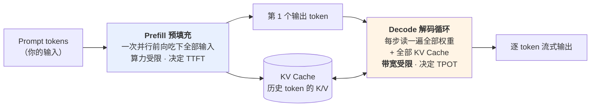

# 推理引擎：权重如何被读取

> 你按下回车，等了一小会儿，然后文字开始一个一个往外蹦，速度均匀得像打字机。
>
> 这个体验背后有两个截然不同的物理过程。**第一个字为什么慢**和**后面的字为什么匀速**，答案完全不一样——前者受算力限制，后者受**内存带宽**限制。搞清这个不对称，你就能解释一大堆现象：为什么 API 的输入 token 比输出 token 便宜好几倍、为什么长对话越聊越慢、为什么显卡的显存容量和带宽比算力更值钱、为什么并发用户多了反而单位成本更低。
>
> 这一篇讲推理引擎：**它唯一的职责是用只读的权重生成回答，绝不修改权重。** 对应运行示例的第 1~3 步——你本地的 ollama 和厂商的推理集群，跑的是完全相同的原理。
>
> 本仓库的 [LLM 推理系列](../llm-inference/index.md) 把这一层写得更透，本篇给足主干，细节链接过去。

---

## 缩写对照表

| 缩写 | 英文全称 | 中文 |
|---|---|---|
| KV Cache | Key-Value Cache | 键值缓存 |
| TTFT | Time To First Token | 首字延迟 |
| TPOT | Time Per Output Token | 每输出词元耗时 |
| HBM | High Bandwidth Memory | 高带宽显存 |
| FLOPs | Floating Point Operations | 浮点运算次数 |
| OOM | Out of Memory | 显存溢出 |
| GQA | Grouped-Query Attention | 分组查询注意力 |
| SLO | Service Level Objective | 服务等级目标 |

---

## 一、总览：两个阶段，一块缓存

一次生成被切成两个物理特性完全不同的阶段：

| | Prefill | Decode |
|---|---|---|
| 处理量 | 全部输入 token，**并行** | 每次 **1 个** token |
| 瓶颈 | **算力**（GPU 核心跑满） | **内存带宽**（搬运权重） |
| 决定的指标 | TTFT（首字延迟） | TPOT（逐字速度） |
| 计算强度 | 高，硬件利用率好 | 极低，硬件利用率 <1% |
| 优化方向 | 分块、并行 | **批处理**（把成本摊给多个请求） |

**这张表是整篇文章的地基。** 下面把两行分别讲透。

## 二、Prefill：吃下输入，算力受限

你的 prompt 有 N 个 token。Prefill 把它们**一次性全部**送进模型做一遍前向计算。

因为因果掩码保证了每个位置只看自己和前面（见 [04 · Transformer 内部构造](04-transformer.zh.md)），所有位置可以**同时算**——这是一次大矩阵乘法，GPU 最擅长的事。算力被跑满，硬件利用率很高。

Prefill 的产出有两个：

1. **第一个输出 token**（从最后一个位置的概率分布里采样得到）；
2. **KV Cache**：这 N 个 token 在每一层的 K 和 V 向量，全部存进显存。

**这就是"首字延迟"（TTFT）的来源，而且它随输入长度增长**——输入翻倍，prefill 的计算量翻倍还不止（注意力部分是平方级）。所以你会观察到：粘一篇长文档进去，第一个字来得明显更慢。

一个直接的实用推论：**如果你的应用对首字延迟敏感，最该优化的是输入长度，而不是输出长度。**

## 三、Decode：为什么是带宽受限

这一节是全篇最重要的部分。

### 一个反直觉的算术

Decode 阶段每一步只处理**一个** token。要算出它的下一个 token，需要：

- **计算量**：约 $2 \times$ 参数量 FLOPs（每个参数参与一次乘法和一次加法）；
- **数据搬运量**：把**全部**权重从显存（HBM）读进计算核心，即约 $1 \times$ 参数量 × 每参数字节数。

代入 70B FP16 模型和一张 A100：

| 项 | 数值 |
|---|---|
| 权重体积 | 70B × 2 字节 = **140 GB** |
| A100 显存带宽 | 约 **2 TB/s** |
| 读一遍权重的时间 | 140 / 2000 ≈ **70 ms** |
| **单流生成速度上限** | **约 14 token/s** |
| 这 70 ms 里的计算量 | 2 × 70B = 140 GFLOPs |
| A100 的 FP16 算力 | 312 TFLOPS |
| 实际用掉的算力 | 140 GFLOPs / 0.07s ≈ 2 TFLOPS |
| **算力利用率** | **约 0.6%** |

**99.4% 的算力在空转，GPU 在等数据。**

这就是"decode 是带宽受限"的完整含义。一张几万美元的卡，在单用户 decode 时基本上是一根昂贵的内存条。

### 三个直接推论

**推论一：单 token 速度只跟权重体积有关，跟你的显卡多能算无关。**
换一张算力翻倍但带宽不变的卡，decode 速度纹丝不动。这也是为什么衡量推理硬件时，**显存带宽是比 TFLOPS 更重要的指标**。

**推论二：量化不只省显存，还直接提速。**
FP16 转 INT4，权重从 140 GB 降到约 40 GB，**要搬的数据少了 3.5 倍，生成速度就快 3.5 倍**。这是量化最容易被忽略的收益——大家都在说省显存，实际上提速同样显著（细节见 [FP16 与 INT4 量化](../llm-inference/fp16-int4-quantization.zh.md)）。

**推论三：批处理是免费的午餐。**
既然搬一遍权重要 70 ms，那么在这 70 ms 里顺便为 1 个请求还是 64 个请求做计算，**搬运成本完全一样**。把 64 个请求拼在一起，吞吐量接近 64 倍，而单请求延迟几乎不变。

**这就是所有商业 API 定价的物理基础**：你付的钱不是"你独占了一张卡多久"，而是"你在一个共享批次里占了一个槽位"。也解释了为什么本地单人部署的性价比，永远比不过云端高并发服务。

## 四、KV Cache：把平方降成线性，代价是显存

### 它解决什么

如果没有缓存，生成第 100 个 token 时要重算前 99 个 token 的 K/V，第 500 个时重算前 499 个——整段生成的计算量随长度**平方级**增长。

而因果掩码保证了历史 token 的 K/V **永远不会改变**。所以：算过就存下来，直接复用。**平方级降为线性级**，这是推理提速一个数量级的头号功臣。

### 显存账

代价是显存。每个 token 在每一层都要存一份 K 和一份 V：

$$
\text{KV Cache} = 2 \times L \times n_{\text{kv}} \times d_{\text{head}} \times \text{字节数} \times \text{token 数}
$$

代入 Llama-3 系列（GQA，8 个 KV 头 × 128 维，FP16）：

| 模型 | 每 token | 8K 上下文 | 128K 上下文 |
|---|---|---|---|
| 8B（32 层） | 128 KB | 1.0 GB | 16 GB |
| 70B（80 层） | 320 KB | 2.6 GB | 40 GB |

注意最后一列：**128K 上下文的 KV Cache 可以和权重本身一样大甚至更大**。而且这是**每个并发请求各一份**——十个用户同时开长上下文，显存直接爆掉。

这就是为什么 [04 · Transformer 内部构造](04-transformer.zh.md) 里讲的 GQA 如此重要：它把 KV 头数砍到 1/4，这张表上的每个数字都跟着降到 1/4。也是为什么长上下文是个昂贵的功能（见 [10 · 上下文窗口](10-context-window.zh.md)）。

> 完整的 KV Cache 原理、显存账与优化生态：[KV Cache 完全解析](../llm-inference/kv-cache.zh.md)。

## 五、生产引擎的四把武器

从"能跑"到"能扛住线上流量"，中间隔着一整套工程。四个最重要的机制：

**① Continuous batching（连续批处理）**

朴素的批处理要等一批请求全部生成完才能开始下一批——但不同请求的输出长度差异巨大，短的要一直等长的，GPU 大量空转。

连续批处理改成**按 token 步调度**：任何一个请求生成完就立刻退出批次，新请求立刻补位。吞吐量通常能提升数倍。这是 vLLM 等现代引擎的核心特性。

**② PagedAttention（分页注意力）**

KV Cache 的长度事先不知道（不知道模型会生成多少 token）。传统做法是按最大长度预留显存，浪费极大。

PagedAttention 借用操作系统虚拟内存的思路：把 KV Cache 切成固定大小的块，按需分配、用链表索引。**显存碎片几乎归零，有效容量提升数倍。**

**③ Prefix caching（前缀缓存）**

如果多个请求共享同一个前缀（系统提示词、少样本示例、同一份文档），它们的 K/V 完全相同——**算一次就够了**。

这在 Agent 场景下价值巨大：多轮工具调用之间，前面的对话历史一字不变地重复出现。厂商 API 的"缓存输入"定价档位（通常便宜 5~10 倍）就是把这个优化的收益让渡给了用户。为什么它对 Agentic 工作负载是生死线，见 [Chat 阶段 vs Agentic 阶段](../llm-inference/chat-vs-agentic.zh.md)。

**④ Speculative decoding（投机解码）**

用一个小模型（或模型自身的浅层）快速猜出接下来几个 token，再用大模型**一次并行验证**——猜对了就白赚几个 token，猜错了回退。

它的巧妙之处正在于利用了第三节的结论：**decode 阶段算力大量空转**，所以"一次验证 5 个 token"和"一次算 1 个 token"耗时几乎相同。用闲置算力换速度，典型加速 2~3 倍。

## 六、采样参数：用户唯一的运行时控制面

推理引擎不修改权重，所以你在运行时能调的东西非常有限——就是采样阶段那几个参数：

| 参数 | 作用 |
|---|---|
| `temperature` | 分布陡峭程度：低→保守确定，高→随机有创意 |
| `top_p` / `top_k` | 截断长尾候选，防止采到明显不合理的词 |
| `max_tokens` | 输出长度上限（到了就硬截断） |
| `stop` | 遇到指定字符串就停止 |
| `frequency/presence_penalty` | 抑制重复 |

**必须记住的边界**：这些参数影响的是"**从既有的概率分布里怎么挑**"，而不是分布本身。分布由权重决定，运行时动不了。

所以：**如果模型不知道答案，调什么参数都救不了**——温度调低只会让它更坚定地说出那个错误答案。这一点在 [11 · 幻觉的机制](11-hallucination.zh.md) 里还会再遇到。

## 七、与邻居的契约

- **上游**：接收训练管线交付的静态权重文件 + tokenizer 词表，**加载后只读**。引擎完全不关心这份权重是怎么训出来的；
- **下游**：向应用层暴露"prompt 进、token 流出"的接口。本地是 ollama / vLLM 的 HTTP 端口，云端是厂商 API——**契约形状完全一样**。

第二条的意义比看起来大：**正因为接口一致，开源模型和闭源 API 才可以在同一个应用里互换或混用**。生产系统里常见的"敏感数据走本地模型、复杂任务走云端 API"的路由设计，成立的前提就是这个统一契约（见 [12 · 开源 vs 闭源](12-open-vs-closed.zh.md)）。

## ⚓ 回到示例

运行示例第 1~3 步的完整展开：

**第 1 步 · 加载**
`ollama run llama3` 把 16 GB 权重加载进你 MacBook 的统一内存。同一时刻，Claude 的权重常驻在数据中心的几百张 GPU 上，被数万用户通过连续批处理分时共享。

**第 2 步 · 切分**
你的问题约 30 个 token（两家 tokenizer 切法不同，数字略有差异，见 [05 · Tokenizer](05-tokenizer.zh.md)）。

**第 3 步 · 生成**
- **Prefill**：30 个 token 一次并行前向。数量太少，几乎瞬间完成——你感受到的首字延迟主要来自模型加载和网络往返，而不是计算；
- **Decode**：本地 8B 模型，权重 16 GB，MacBook 的统一内存带宽约 400 GB/s → 理论上限约 25 token/s，实测十几 token/s（还有其他开销）。**这个数字完全由第三节的公式决定，和你的 CPU 多快无关**；
- **Claude 那边**：模型大得多，单 token 的搬运成本更高。但数据中心的 HBM 带宽是消费级硬件的数倍，加上连续批处理摊薄成本——**你感受到的速度不落下风**。

**两边跑的是同一套物理，差别只在规模和工程。** 这是本篇最想说的一句话。

而第 5 步的"两张不同的收据"里，API 那一侧的价格构成现在也清楚了：输入 token 走 prefill（并行、便宜），输出 token 走 decode（逐个、带宽受限、贵）——**这就是几乎所有厂商输出定价都是输入的 3~5 倍的物理原因**。

## 八、失败行为

**OOM（显存溢出）**
权重 + KV Cache + 中间激活超过显存，直接崩。注意 KV Cache 是随并发数和上下文长度增长的——**压测时单请求跑得好好的，上线一并发就炸**是经典事故。这是参数规模的硬约束（见 [09 · 参数规模](09-param-scale.zh.md)）。

**幻觉在这一层的表现**
引擎忠实地从概率分布里采样，**它没有"真假"这个概念**。权重里压缩失真的知识会被同样流畅地读出来，temperature 调高会放大这一点。**推理层不会拦截任何错误**——这是角色分工决定的（见 [11 · 幻觉的机制](11-hallucination.zh.md)）。

**截断**
碰到 `max_tokens` 上限，回答戛然而止。表现为代码写到一半没有收尾、JSON 缺右括号。检查返回的 `finish_reason` 字段可以确认。

**越聊越慢**
上下文越长，KV Cache 越大，decode 每步要读的数据越多。长对话到后期速度明显下降，就是这个原因。

**并发下的延迟抖动**
连续批处理提升了吞吐，但代价是**单请求延迟受同批次其他请求影响**。这就是为什么厂商 API 在高峰期会变慢——你的槽位在和别人抢带宽。做延迟 SLO 时必须按 P99 而不是平均值来设计。

## 一句话总结

**推理引擎的唯一职责是用只读权重生成回答。** Prefill 并行吃输入、算力受限、决定首字延迟；Decode 逐 token 生成、**内存带宽受限**、决定逐字速度，且算力利用率不到 1%——这个空转正是批处理、量化、投机解码这一整套优化的机会所在。KV Cache 把平方级计算降为线性，代价是随上下文和并发线性增长的显存。你在运行时唯一能调的是采样参数，而它只改变"怎么挑"，不改变"分布本身"。

---

**下一篇**：[09 · 参数规模与 Scaling Law：7B、70B、670B 为什么如此重要](09-param-scale.zh.md) —— 上面反复出现的"参数量"这个数字，到底意味着什么。

**系列目录**：[index.md](index.md)
