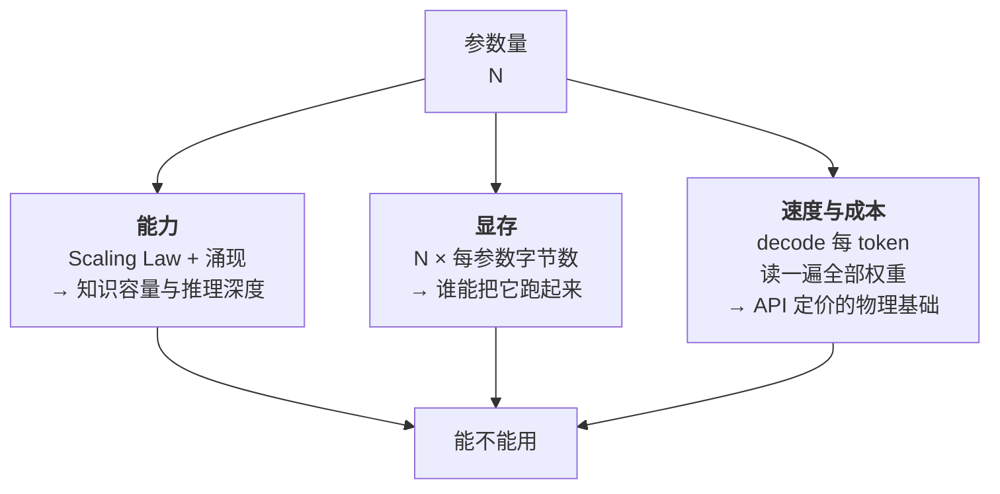
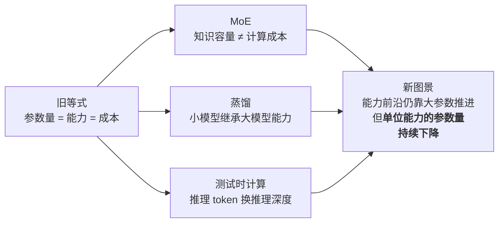

# 参数规模与 Scaling Law：7B、70B、670B 为什么如此重要

> 挑模型时，你看到的第一个数字通常是参数量。7B、70B、670B——这个数字到底承载了多少信息？
>
> 答案是：**它同时决定了三件几乎不相关的事**——模型能装多少知识（能力上限）、需要多少显存（谁能跑起来）、每个 token 花多少钱（成本结构）。一个数字，三重命运。
>
> 但这个等式正在被三股力量打破：MoE（混合专家）让"总参数"和"激活参数"分家；蒸馏让小模型继承大模型的能力；测试时计算让模型可以"用推理时间换参数容量"。今天读一张模型规格表，光看一个参数量已经不够了。
>
> 这一篇讲清楚这个数字的三重含义，以及它正在如何失效。对应运行示例的第 4 步：代码两边都对，解释质量却分出高下。

---

## 缩写对照表

| 缩写 | 英文全称 | 中文 |
|---|---|---|
| MoE | Mixture of Experts | 混合专家 |
| FP16 / BF16 | 16-bit Floating Point / Brain Float 16 | 16 位浮点 / 脑浮点 16 |
| INT4 / INT8 | 4-bit / 8-bit Integer | 4 位 / 8 位整数 |
| FLOPs | Floating Point Operations | 浮点运算次数 |
| OOM | Out of Memory | 显存溢出 |
| HBM | High Bandwidth Memory | 高带宽显存 |
| LLM | Large Language Model | 大语言模型 |
| GPU | Graphics Processing Unit | 图形处理器 |

---

## 一、参数到底是什么

参数（也叫权重）就是模型里那些可训练的浮点数——[04 · Transformer 内部构造](04-transformer.zh.md) 里手算过的那些矩阵：$W_Q/W_K/W_V/W_O$、FFN 的三张大表、词嵌入表。

"8B" = 80 亿个这样的数。**模型文件的全部内容就是这堆数。** 训练是调这些数，推理是读这些数。

一个数字，锁定三件事：

逐个看。

## 二、能力维度：Scaling Law

### "更大就是更好"的定量版

2020 年 Kaplan 等人的论文改变了整个行业的投资逻辑。他们发现：**模型损失随参数量 $N$、数据量 $D$、算力 $C$ 按幂律平滑下降**，而且跨越好几个数量级都成立：

$$
L(N) \approx \left(\frac{N_c}{N}\right)^{\alpha_N}, \qquad L(D) \approx \left(\frac{D_c}{D}\right)^{\alpha_D}
$$

关键不是公式本身，而是**"平滑"和"可外推"**这两个性质带来的后果：

> **能力提升变成了可预测的工程问题。** 你可以在小规模上跑几个点，拟合曲线，然后提前算出投入 100 倍算力后 loss 会落在哪。

这就是行业敢押注千亿美元建集群的数学依据。**"大力出奇迹"从玄学变成了可以写进财务模型的投资决策**——这一点怎么强调都不过分。在此之前，"把模型做大"是一个赌博；在此之后，它是一条有斜率的曲线。

### Chinchilla：参数和数据要配比

2022 年 DeepMind 的 Chinchilla 论文打了一个重要的补丁。

Kaplan 的工作被普遍解读为"参数越多越好"，于是当时的大模型（GPT-3 的 175B、Gopher 的 280B）普遍**参数过大、数据不足**。Chinchilla 证明：**给定固定算力预算，参数量和数据量应该同比例增长**，最优配比约为**每个参数 20 个 token**。

证据是决定性的：Chinchilla 用 70B 参数 + 1.4T token，**全面击败了 280B 参数 + 300B token 的 Gopher**——参数只有四分之一，效果更好，推理还更便宜。

**"更大"必须是"更大且喂得更饱"，否则是浪费算力。**

### 后 Chinchilla 时代的反转

但 Chinchilla 只优化了**训练成本**。而现实是：**训练一次，推理无限次。**

如果一个模型要服务几十亿次请求，那么在训练阶段多花点钱换一个更小、推理更便宜的模型，是压倒性划算的。于是行业整体转向"**小模型 + 超量数据**"：

| 模型 | 参数 | 训练 token | token/参数 | 相对 Chinchilla 最优 |
|---|---|---|---|---|
| Chinchilla 建议 | — | — | 20 | 1× |
| Llama-3-8B | 8B | 15T | **约 1900** | **约 90×** |
| Llama-3-70B | 70B | 15T | 约 214 | 约 11× |

**这就是"今天的 8B 远强于三年前的 8B"的完整解释。** 不是架构有多大突破，而是同样大小的模型被喂了几十倍的数据。训练时多花的钱，被推理时省下的钱和更广的可部署性赚了回来。

从"训练最优"转向"推理最优"，是过去三年模型设计上最重要的一次思路转变。

### 涌现：以及一个必要的警告

除了平滑提升，还有一类现象叫**涌现（emergent abilities）**：某些能力在小模型上近乎为零，跨过某个规模阈值后快速出现——多步推理、复杂指令遵循、上下文学习、思维链。

这解释了运行示例第 4 步："写对质数代码"是 8B 就充分掌握的高频模式；"把平方根原理讲透、自发覆盖 0/1/负数边界"需要更长的推理链条，而推理链的长度和深度是随规模增强的（[04 · Transformer](04-transformer.zh.md) 里讲的"层数 = 加工次数"在这里对应上了）。

**但必须补一个警告**：2023 年 Schaeffer 等人的研究指出，一部分所谓"涌现"可能是**评测指标造成的假象**——如果用"完全正确才算分"这类非连续指标去衡量，能力看起来就是突然出现的；换成连续指标（如逐 token 的对数似然），曲线其实是平滑上升的。

结论是审慎版的：**能力确实随规模显著增强，但"某个能力在某个参数量突然解锁"这个叙事，要打折扣看待。**

## 三、物理维度：参数量就是显存账单

$$
\text{权重显存} \approx \text{参数量} \times \text{每参数字节数}
$$

| 模型 | FP16（2 字节） | INT8（1 字节） | INT4（约 0.5 字节） | 意味着 |
|---|---|---|---|---|
| **8B** | 16 GB | 8 GB | ~4.5 GB | 量化后笔记本、甚至手机可跑 |
| **70B** | 140 GB | 70 GB | ~40 GB | FP16 要 2×A100；INT4 单张 48G 卡勉强 |
| **670B**（DeepSeek-V3 满血） | ~1.3 TB | ~670 GB | ~350 GB | 多机集群起步 |

**这是"参数规模为什么重要"最硬的一半：它直接划定了谁能把模型跑起来。**

参数量因此形成了一道清晰的**可及性阶梯**：

- **1B~8B**：个人设备级。笔记本、手机、树莓派；
- **8B~70B**：单机多卡级。一台工作站或一台云服务器；
- **数百 B**：集群级。多机互联，运维复杂度陡增。

对开源生态而言，这个阶梯就是**实际可用性的分界线**。一个 670B 的开源模型，权重公开但绝大多数人跑不起来——"能下载"和"能用上"之间隔着一张显存账单。

别忘了还要加上 KV Cache（[08 · 推理引擎](08-inference-engine.zh.md) 算过：70B 在 8K 上下文下每个并发请求 2.6 GB）和中间激活。**实际显存需求通常是权重体积的 1.2~2 倍**，具体取决于上下文长度和并发数。

### 速度同理

Decode 阶段每个 token 都要把全部权重读一遍。所以：

> **参数量翻倍 ≈ 单 token 搬运成本翻倍 ≈ 生成速度减半 ≈ API 单价翻倍。**

这是 API 定价阶梯的物理基础，也是为什么厂商总在推"小而快"的档位（Haiku、mini、flash 之类）——它们服务的是那些不需要顶级推理能力、但对延迟和成本敏感的场景。

## 四、打破"参数量 = 能力"的三股力量

上面的等式在 2023 年还基本成立，现在已经不够用了。

### ① MoE：一个数字拆成两个

**MoE（Mixture of Experts，混合专家）**把 Transformer 每层的 FFN 拆成 N 个"专家"，再加一个路由器（router）决定每个 token 送去哪几个专家。

关键在于 [04 · Transformer 内部构造](04-transformer.zh.md) 算过的那个数字：**FFN 占了全部参数的约 70%**。这里才有足够的肉可以切。

以 DeepSeek-V3 为例：

| 指标 | 数值 | 决定什么 |
|---|---|---|
| **总参数** | 671B | **知识容量** —— 相当于一个 671B 模型能装的东西 |
| **单 token 激活参数** | 37B | **计算成本** —— 每 token 的算力开销相当于 37B 模型 |
| **显存需求** | 按 671B 算 | **全部专家都要常驻显存** |

**这三行必须分开读**：知识容量按总参数、计算速度按激活参数、显存按总参数。

MoE 的取舍因此很清晰：**用显存换能力**。你得有地方放下全部 671B 的权重，但每个 token 只需付 37B 的计算账。这对云端大规模服务是绝佳交易（显存是固定投入，计算是边际成本），对个人部署则相当不友好。

**看模型规格表时，两个数字都要看。** 只看"671B"会高估它的推理成本，只看"37B"会低估它的部署门槛。

### ② 蒸馏：把大模型的能力压进小模型

**蒸馏（distillation）**让小模型（学生）学习大模型（老师）的输出——不只学最终答案，还学完整的概率分布，信息量远大于硬标签。

今天市面上强得反常的小模型，**背后几乎都有一个大模型老师**。这也是"今天的 8B 远强于三年前的 8B"的另一半原因（前一半是超量数据）。

它同时是开源与闭源生态之间一条隐秘的通道：闭源模型的能力通过蒸馏间接流入开源小模型。各家许可证对此多有限制，但趋势明确（见 [12 · 开源 vs 闭源](12-open-vs-closed.zh.md)）。

### ③ 测试时计算：用推理时间换参数容量

这是最新、也最具颠覆性的一根杠杆。

推理模型（o1 / DeepSeek-R1 一代）在回答前先生成一长串思考过程。同一个模型，**思考得越久，难题的正确率越高**——而这条曲线本身也呈现出类似 Scaling Law 的规律，被称为**测试时计算的规模定律**。

它的含义是：**能力不再只能通过"在参数侧花容量"获得，也可以通过"在推理侧花 token"获得。**

这个转变的产品后果很直接：
- 定价模型变复杂了——同一个模型，同一个问题，账单可能相差十倍（思考 token 也要计费）；
- 延迟从秒级变成分钟级，交互形态从"聊天"转向"提交任务、等结果"；
- 一个 32B 的推理模型可能在数学题上打败一个 400B 的普通模型——**但只在可以慢慢想的任务上**。

这项能力的训练侧来源是 RLVR，见 [07 · 后训练细拆](07-post-training.zh.md)。

### 三股力量的合力

**最后一句是本节的结论**：前沿能力依然要靠更大的模型来推进，但"达到某个能力水平所需的参数量"每年都在显著下降。这既是开源模型能持续逼近闭源的原因，也是本地部署越来越可行的原因。

## 五、选型时怎么用这些知识

一个实用的决策顺序：

1. **先看能不能跑起来**——参数量 × 字节数 + KV Cache，对照你的显存。这是硬门槛，过不了后面都不用谈；
2. **再看是不是 MoE**——如果是，用总参数算显存、用激活参数估速度；
3. **再看训练数据量**——同样是 8B，喂 15T 和喂 1T 的差距巨大。技术报告里的 token 数比参数量更能说明问题；
4. **最后才看 benchmark**——而且要警惕（下一节）。

## ⚓ 回到示例

运行示例第 4 步的完整展开——三个数字全部落地：

**16 GB 从哪来**：8B × 2 字节（FP16）= 16 GB。你硬盘上那个权重文件的大小，由参数量直接决定。它能装进 MacBook 的统一内存，**这就是你能本地跑它的全部原因**。换成 70B，这个数字变成 140 GB，故事直接结束。

**为什么代码两边都对**：质数判断在语料中是极高频的模式，8B 的容量加上 15T token 的超量训练（后 Chinchilla 策略的直接受益）足以牢固掌握。**这类任务上，参数规模的边际收益已经趋近于零**——花十倍的钱买不到更对的 `is_prime`。

**为什么解释分高下**：严谨的数学论证、自发覆盖边界情况，属于随规模增强的深层能力——更多的层意味着更长的推理链可以走完，更大的 FFN 意味着更丰富的记忆可以调用。Claude 的参数规模（加上更重的后训练）在"知识之上的推理与组织"上拉开了差距。

**而你为此付费**：更大的参数 = decode 时每 token 更高的搬运成本 = 更贵的 API 单价。你在示例第 5 步收到的账单，根子就在这里。

## 六、失败行为

**装不下：OOM**
显存不足直接崩溃，参数规模最硬的失败。逃生通道主要是量化——INT4 的精度损失在多数场景可以接受，体积降到约 1/4，速度还快 3~4 倍（见 [FP16 与 INT4 量化](../llm-inference/fp16-int4-quantization.zh.md)）。

**容量不足的软失败——比 OOM 更危险**
小模型在长尾知识上压缩失真更严重 → **幻觉率更高、复杂指令跟丢、多步推理中途断链**。

危险在于：**它不报错，只是悄悄变差。** OOM 会立刻告诉你"跑不了"，而容量不足只会让你的产品在生产环境里以 15% 的概率给出看起来合理的错误答案。这是选型时最容易低估的风险（见 [11 · 幻觉的机制](11-hallucination.zh.md)）。

**跑分幻觉**
小模型经过针对性优化，可以在单项 benchmark 上超越大模型，但泛化面（没刷过的任务）差距仍在。加上训练数据污染的可能（见 [06 · 训练管线](06-training-pipeline.zh.md)），**单一 benchmark 排名的信息量远低于它看起来的样子**。

务实的做法：用你自己业务的真实样例建一套私有评测集，几十条就够，它比任何公开榜单都有用。

**MoE 的部署陷阱**
看到"激活参数 37B"就以为能在两张卡上跑——实际需要放下全部 671B 权重。这是新手在 MoE 时代最常踩的坑。

## 一句话总结

**参数量一个数字，同时决定能力上限（Scaling Law + 涌现）、显存门槛（参数 × 字节数）、单 token 成本（decode 读全部权重）。** Chinchilla 说参数和数据要配比，后 Chinchilla 时代为了推理成本而给小模型灌超量数据；而 MoE、蒸馏、测试时计算这三股力量正在拆解"参数量 = 能力"这个等式——**能力前沿仍靠大参数推进，但单位能力的参数量在持续下降。**

---

**下一篇**：[10 · 上下文窗口：128K 到底意味着什么](10-context-window.zh.md) —— 另一个被写在规格表第一行的数字。

**系列目录**：[index.md](index.md)
