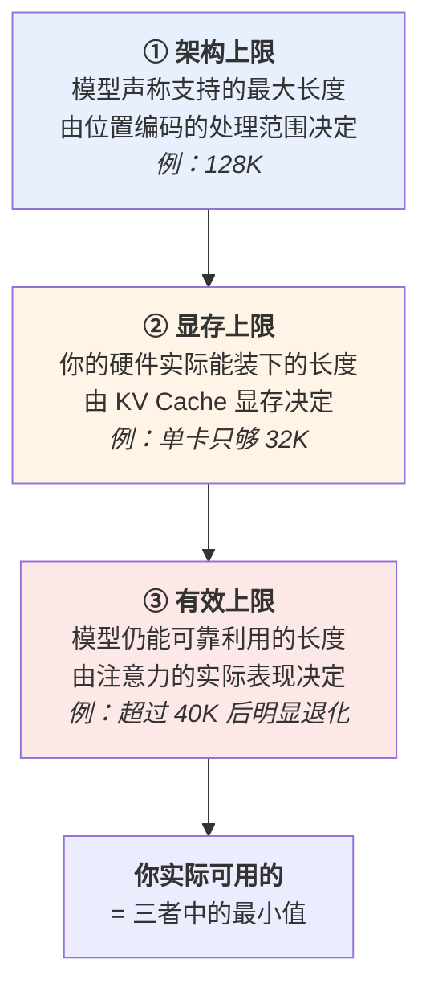

# 上下文窗口：128K 到底意味着什么

> "支持 128K 上下文"——大约相当于一本 20 万字的小说。听起来你可以把整个代码库、整本手册、整年的聊天记录都塞进去，然后让模型融会贯通。
>
> 实际试过的人都知道不是这么回事。塞到七八成的时候，模型开始遗漏中间的内容、抓不住跨段落的关系、回答变慢、账单飙升。**标称能装下，不等于装满了还好用。**
>
> 这一篇讲清楚上下文窗口的三重上限（架构、显存、有效）、位置信息是怎么进入模型的、128K 这样的长窗口是怎么"接出来"的、为什么中间的内容最容易被忽略，以及由此推导出的四条上下文工程准则。
>
> 这也是本系列里最直接影响你日常写提示词的一篇。

---

## 缩写对照表

| 缩写 | 英文全称 | 中文 |
|---|---|---|
| RoPE | Rotary Position Embedding | 旋转位置编码 |
| PI | Position Interpolation | 位置插值 |
| NTK | Neural Tangent Kernel | 神经正切核（此处指 NTK-aware 缩放方法） |
| YaRN | Yet another RoPE extensioN method | 一种 RoPE 扩展方法 |
| KV Cache | Key-Value Cache | 键值缓存 |
| RAG | Retrieval-Augmented Generation | 检索增强生成 |
| TTFT | Time To First Token | 首字延迟 |
| GQA | Grouped-Query Attention | 分组查询注意力 |

---

## 一、上下文窗口是什么

**上下文窗口是模型在一次前向计算中能同时"看见"的 token 总数。**

三个必须澄清的点：

**① 它是输入 + 输出的总预算**
对多数模型，128K 是"提示词 + 生成内容"的总和，不是各自 128K。你的提示词占了 120K，就只剩 8K 可以用来回答了。

**② 它是模型唯一的工作记忆**
[02 · LLM 到底是什么](02-what.zh.md) 讲过：**权重在推理时只读，模型不会从对话中学习**。所以上下文窗口里装的东西，就是模型在这一刻知道的**全部**当下信息。

多轮对话之所以看起来有记忆，是因为**整个对话历史每一轮都被重新完整地送进去**。窗口一满，最早的内容就得被丢掉或压缩——那才是真正的"遗忘"。

**③ 它按 token 计，不按字符计**
"我的文档有 5 万字"和"我的文档占多少 token"是两个问题。中文的 token 效率因模型而异，估算误差可能超过一倍（见 [05 · Tokenizer](05-tokenizer.zh.md)）。

## 二、三重上限：标称的、能跑的、好用的

这是本篇最重要的框架。**"128K"这个数字实际上有三个不同的天花板，而它们通常差得很远。**



**规格表上写的是①，你的账单和 OOM 由②决定，而你的效果由③决定。** 大部分关于长上下文的失望，都来自把①当成了③。

下面分别讲这三个上限从哪来。

## 三、① 架构上限：位置信息如何进入模型

### 注意力本身对顺序无感

一个容易被忽略的事实：[04 · Transformer 内部构造](04-transformer.zh.md) 里的注意力机制，本质上是对一个**集合**做加权求和——打乱输入顺序，算出的结果完全一样。

但语言显然依赖顺序（"狗咬人"和"人咬狗"）。所以位置信息必须被额外注入。

### RoPE：用旋转编码相对位置

现代模型普遍使用 **RoPE（Rotary Position Embedding，旋转位置编码）**。它的做法很巧妙：不是给向量**加**一个位置向量，而是**按位置把 Q 和 K 向量旋转一个角度**。

把每两个维度看成一个复平面上的点，位置 $m$ 处的向量按角度 $m\theta$ 旋转。于是当位置 $m$ 的 Q 和位置 $n$ 的 K 做点积时，结果里自然出现了 $(m-n)$ 这个**相对距离**：

$$
\langle f(q, m), f(k, n)\rangle = g(q, k, m-n)
$$

**这个性质是长上下文的技术基础**：模型学到的是"相隔多远"的规律，而不是"在第几个位置"的绝对记忆。相对关系天然比绝对位置更容易外推。

同时使用多个不同频率的 $\theta$（高频捕捉近距离、低频捕捉远距离），让模型能同时感知局部语法和长程结构。

### 长窗口是"接"出来的

一个反直觉的事实：**几乎没有模型是直接用 128K 长度从头训练的**。

原因是 prefill 的注意力计算量随长度**平方增长**——在 128K 上做完整预训练，成本高到不可接受。实际做法是分两步：

1. **主体预训练用短上下文**（4K~8K），性价比最高；
2. **训练末期做长上下文扩展**：调整 RoPE 的旋转频率，再用少量长文档继续训练一小段。

调整频率的主流方法有几代：

| 方法 | 思路 | 特点 |
|---|---|---|
| **直接外推** | 什么都不改，直接输入更长的序列 | 效果崩溃——模型没见过这些旋转角度 |
| **PI（位置插值）** | 把位置坐标整体压缩，"假装"序列没那么长 | 简单有效，但损失高频细节（近距离分辨率下降） |
| **NTK-aware 缩放** | 高频少压、低频多压 | 保住了局部分辨率，效果明显更好 |
| **YaRN** | 分频段处理 + 注意力温度补偿 | 目前的常用方案，扩展倍数更大 |

**这个"先短后长"的训练方式，正是有效上限（③）低于架构上限（①）的根本原因**：模型在长距离上的训练量，比在短距离上少了几个数量级。它见过 128K 的样子，但见得不多。

## 四、② 显存上限：长上下文很贵

[08 · 推理引擎](08-inference-engine.zh.md) 算过 KV Cache 的账，这里把它放到长上下文的语境下重看：

| 模型 | 每 token KV | 8K | 32K | 128K |
|---|---|---|---|---|
| Llama-3-8B（32 层，GQA） | 128 KB | 1.0 GB | 4.0 GB | **16 GB** |
| Llama-3-70B（80 层，GQA） | 320 KB | 2.6 GB | 10 GB | **40 GB** |

注意最后一列：**8B 模型在 128K 上下文下的 KV Cache（16 GB）和它的 FP16 权重（16 GB）一样大。**

而且这是**每个并发请求各一份**。十个用户同时开长上下文，显存需求就是权重 + 10 份 KV Cache。**这就是为什么厂商对长上下文单独定价、为什么自部署时"标称 128K"经常实际只能跑 16K。**

### 三笔账，一起涨

长上下文的代价不止显存：

| 代价 | 增长方式 | 你的感受 |
|---|---|---|
| **显存** | 线性（每 token 固定开销） | 并发上不去，容易 OOM |
| **首字延迟** | **平方**（注意力计算） | 粘一篇长文档，第一个字等很久 |
| **逐字速度** | 线性（decode 每步要读整个 KV Cache） | 长对话越聊越慢 |
| **金钱** | 线性（按输入 token 计费） | 每轮都重新为整个历史付费 |

第四行值得特别注意：**多轮对话中，每一轮都要把完整历史重新发送一遍**。一个 20 轮的长对话，你可能为最初那段系统提示词付了 20 次钱。

**前缀缓存（prefix caching）就是为此存在的**——共享前缀的 K/V 只算一次，厂商 API 通常为缓存命中的输入提供 5~10 倍的折扣（见 [08 · 推理引擎](08-inference-engine.zh.md)）。在 Agent 这类长历史反复调用的场景里，用不用得上前缀缓存，成本可能差一个数量级（见 [Chat 阶段 vs Agentic 阶段](../llm-inference/chat-vs-agentic.zh.md)）。

## 五、③ 有效上限：Lost in the Middle

### 现象

2023 年斯坦福的一项研究给出了一个被反复复现的发现：**把关键信息放在长上下文的不同位置，模型的召回率呈现明显的 U 形曲线**——开头和结尾的信息最容易被用到，**中间的最容易被忽略**。

这个现象被称为 **"lost in the middle"（中段遗失）**。

```
召回率
  高 |  ●                                    ●
     |    ●                              ●
     |       ●                        ●
     |          ●  ●  ●  ●  ●  ●  ●
  低 |________________________________________
      开头          中间部分            结尾
```

### 为什么

几个相互叠加的原因：

1. **训练分布**：长文档中，开头（标题、摘要、引言）和结尾（结论）承载的信息密度天然更高，模型学到了这个先验；
2. **注意力预算是稀缺的**：softmax 归一化意味着注意力权重总和为 1。**上下文越长，平均分到每个 token 的注意力越少**——信号被稀释了；
3. **位置编码的外推区**：中间靠后的位置往往落在训练时见得最少的距离区间上。

### 一个重要的区分：检索 ≠ 推理

现在的模型在"大海捞针"（needle-in-a-haystack）测试上普遍表现优异——在 128K 文本里藏一句话，让模型找出来，准确率接近 100%。厂商也乐于展示这个结果。

**但这个测试严重高估了长上下文的实际可用性。** 找一句明显异常的话，和**在几十个分散的事实之间做多步推理**，是两个难度天差地别的任务。后者才是真实场景（"对比这三份合同的违约条款差异"、"这个代码库里哪些地方受这次改动影响"）。

**经验法则**：单点检索的有效长度接近标称长度；**多点关联推理的有效长度通常只有标称值的三分之一到一半**。

## 六、上下文工程的四条准则

前面的机制，直接推导出四条实操准则。

### 准则一：位置比长度更重要

既然是 U 形曲线，就**把最关键的信息放在开头或结尾**。

一个具体且有效的技巧：**处理长文档时，把问题同时放在文档之前和文档之后**。前面的那份定调，后面的那份保证它落在注意力最强的位置上。

系统提示词放最前（它需要全程生效），最终指令放最后（它决定当下要做什么）——中间夹的是参考材料。

### 准则二：少即是多

**塞满上下文几乎总是错的。**

与其把整个代码库塞进去，不如先检索出最相关的 5 个文件。RAG 之所以在长上下文模型时代依然重要，原因就在这里——**它不只是为了绕过长度限制，更是为了提高信噪比**。

无关内容不是中性的，它是**噪声**：它稀释注意力、增加延迟、推高账单，还可能把模型带偏。

### 准则三：给它结构

长上下文里，清晰的结构标记（XML 标签、Markdown 标题、明确的分隔符）能显著提升模型定位信息的能力：

```
<document id="contract-A" title="供货合同 A">
...
</document>

<document id="contract-B" title="供货合同 B">
...
</document>

<task>对比上述两份合同的违约条款差异</task>
```

这不是玄学：结构标记给了注意力机制明确的锚点，让"找到 contract-B 的违约条款"这件事有迹可循。

### 准则四：把长任务拆开

需要在 100K 上下文里做复杂多步推理时，**分阶段处理几乎总是优于一次塞入**：

```
阶段一：分别总结每份文档 → 得到 5 份摘要
阶段二：基于 5 份摘要做对比分析
```

每个阶段的上下文都短、都在有效区间内，而且中间结果可复用、可检查、可调试。**代价是多几次调用，收益是可靠性和可观测性。**

## ⚓ 回到示例

运行示例的输入只有约 30 个 token——**连 8K 窗口的 0.4% 都不到**。所以本篇讲的所有问题，在示例里一个都没有出现：没有中段遗失、没有 KV Cache 压力、没有平方级的 prefill 延迟。

**这恰恰说明了一件事**：日常的短问答，几乎用不到上下文窗口这个资源；而一旦进入"把整个代码库交给它"、"分析这一年的会议纪要"、"跑一个 50 轮工具调用的 Agent"这类场景，上下文窗口就立刻变成**最先见底的那个资源**。

把示例改造一下，问题就都出来了：

> "读完我这个 3 万行的项目，写一个 `is_prime` 并说明它应该放在哪个模块、与现有的 `math_utils` 如何整合。"

- **架构上限**：3 万行代码约 40 万 token，**超出 128K 窗口三倍**——装不下，必须先检索（准则二）；
- **显存上限**：即使装得下，本地 8B 在 128K 下需要 16 GB KV Cache + 16 GB 权重，MacBook 直接跪；
- **有效上限**：即使显存够，"整合现有模块"是典型的多点关联推理，中段的相关代码大概率被忽略；
- **成本**：Claude 那边这一次调用的输入 token 是原示例的一万倍——账单和延迟都会让你重新设计这个流程。

**正确的做法是准则四**：先检索相关模块 → 再基于摘要设计 → 最后写代码。这也正是所有严肃的 AI 编码工具的实际架构。

## 七、失败行为

**静默截断**
上下文超限时，有些框架会自动丢弃最早的消息且不告警。表现为模型突然"忘记"了前面说过的约定。**永远检查框架的截断策略**——它默认丢的可能恰好是你的系统提示词。

**中段信息被忽略**
最隐蔽的失败：模型给出了一个流畅、自信、但遗漏了关键条款的答案。**它不会告诉你"我没看清中间那部分"。**

**长对话质量退化**
随着历史累积，早期的指令被稀释，模型逐渐"跑偏"——不再遵守最初设定的格式或角色。缓解办法是定期把关键约束重述在最新一轮里。

**成本失控**
多轮 Agent 场景下，每一轮都重发完整历史，token 消耗随轮数**平方级**累积。没有前缀缓存的话，账单会以令人震惊的速度增长。

**用长上下文替代 RAG**
"窗口够大了，直接全塞进去"——这个想法在信噪比、成本、延迟三个维度上同时失败。**长上下文和 RAG 是互补的，不是替代关系。**

## 一句话总结

**上下文窗口是模型唯一的工作记忆，它有三个不同的上限**：规格表写的架构上限、你的硬件决定的显存上限、以及模型实际还能可靠利用的有效上限——**后者通常只有前者的三分之一到一半**。长窗口是靠 RoPE 频率调整"接"出来的，所以长距离上训练不足；注意力预算被稀释，导致中段信息最容易丢失。实践上：**把关键信息放在首尾、只放该放的、给它结构、把长任务拆开。**

---

**下一篇**：[11 · 幻觉的机制：为什么它编得如此流畅](11-hallucination.zh.md) —— 前面每一篇都提到它，现在正面拆开。

**系列目录**：[index.md](index.md)
