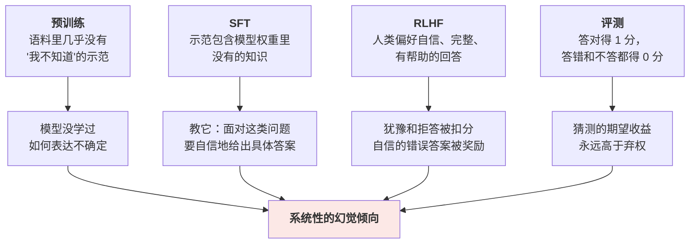

# 幻觉的机制：为什么它编得如此流畅

> 你问一个模型某个冷门技术细节，它给出了一段结构完整、术语准确、逻辑通顺的回答，还附了一篇论文标题和作者。你去查——**论文不存在**。
>
> 最让人不安的不是它错了，而是**它错得毫无破绽**。回答的流畅程度、自信程度、细节丰富程度，和它答对时完全一样。没有任何信号提示你"这一段是编的"。
>
> 前面每一篇都把幻觉当作失败行为提了一句。这一篇正面拆开它：**为什么它是有损压缩的必然产物、为什么训练管线的三个阶段都在系统性地鼓励模型不懂装懂、为什么流畅度和正确性是两个完全独立的维度、以及哪些手段真的有用、哪些只是心理安慰。**
>
> 核心结论先说：**幻觉不是 bug，是这类系统的固有属性。你能做的是把它压到可接受范围并建立检测机制，而不是消除它。**

---

## 缩写对照表

| 缩写 | 英文全称 | 中文 |
|---|---|---|
| RAG | Retrieval-Augmented Generation | 检索增强生成 |
| SFT | Supervised Fine-Tuning | 监督微调 |
| RLHF | Reinforcement Learning from Human Feedback | 基于人类反馈的强化学习 |
| RLVR | Reinforcement Learning with Verifiable Rewards | 可验证奖励强化学习 |
| LLM | Large Language Model | 大语言模型 |
| API | Application Programming Interface | 应用程序接口 |

---

## 一、四类幻觉，成因各不相同

"幻觉"是个笼统的词，把成因不同的几类错误混在了一起。分开看才能对症下药：

| 类型 | 表现 | 主要成因 | 有效对策 |
|---|---|---|---|
| **① 事实性编造** | 编造不存在的论文、API、人名、数据 | 权重里没有这条知识，但模型不知道自己没有 | RAG、工具调用、引用约束 |
| **② 记忆失真** | 知识大体正确但细节错位（年份、版本号、参数名） | 有损压缩的细节丢失 | 检索核对、让模型给出出处 |
| **③ 上下文不忠实** | 材料就在上下文里，回答却与之矛盾 | 注意力被稀释、中段遗失 | 缩短上下文、结构化标记、引用定位 |
| **④ 推理链断裂** | 每一步看着都对，结论却错 | 多步推理中的误差累积 | 分步验证、思维链、外部验算 |

**最危险的是②和③**，因为它们混在大量正确内容里，最难被发现。①反而相对好抓——去查一下就知道了。

而 [10 · 上下文窗口](10-context-window.zh.md) 里讲的中段遗失，正是③的直接来源：**材料明明给了，模型却没看进去。** 很多被归咎于"模型太笨"的案例，其实是上下文工程问题。

## 二、根因一：知识是有损压缩，没有"查不到"这个返回值

[02 · LLM 到底是什么](02-what.zh.md) 里的这条边界，是理解幻觉的起点。

**数据库**：知识以离散记录存放，查不到就返回空。有明确的"知道 / 不知道"边界。

**LLM**：15T token 的语料被压缩进 80 亿个浮点数——**压缩比高达数千倍**。这个压缩必然是有损的，而且损失是**不均匀**的：

- 高频知识（Python 语法、著名历史事件）被反复强化，压缩得很好；
- 低频知识（某个小众库的某个参数、某个地方志里的细节）在权重里只留下了模糊的影子。

关键在于：**当模型去"读取"一条模糊的记忆时，它得到的不是"空"，而是一个仍然会产生概率分布的向量。**

**架构里根本没有一个地方可以返回"我没有这条记录"。** 每一层都必然输出一个向量，输出头必然产出一个覆盖全词表的分布，采样必然选出一个 token。**整条流水线上不存在"弃权"这个选项**——除非模型学会了主动生成"我不知道"这几个字，而这恰恰是最难教的（见第四节）。

## 三、根因二：目标函数是"合理"，不是"真"

[06 · 训练管线](06-training-pipeline.zh.md) 讲过，预训练的唯一目标是最大化下一个 token 的似然：

$$
\mathcal{L} = -\sum_i \log P_\theta(t_i \mid t_{<i})
$$

**这个目标函数里没有任何一项衡量"真实性"。** 它奖励的是"生成符合训练分布的文本"。

而在训练语料里，一个虚构的论文引用和一个真实的论文引用，**在文本形式上完全无法区分**——同样的格式、同样的术语密度、同样的句式。模型学到的是"论文引用长什么样"，而不是"哪些论文真的存在"。

这就是"**为什么它编得如此流畅**"的完整答案：

> **流畅度和正确性，是两个完全独立的维度。**

流畅度来自对语言形式的建模，这个模型学得极好；正确性来自对世界事实的准确压缩，这个是有损的。**前者的高水平不但不保证后者，反而会掩盖后者的失败**——因为人类习惯用"说得有条理"来推断"说得对"，而这个启发式在 LLM 面前彻底失效。

这也解释了一个常见观察：**模型在自己不擅长的领域，往往显得比在擅长领域更自信**。因为在不擅长的领域，它只剩下形式可以模仿了。

## 四、根因三：训练管线的三个阶段都在鼓励"不懂装懂"

这是最反直觉、也最重要的一节。幻觉不只是"没学好"的结果，**训练流程本身在系统性地强化它**。

### 预训练阶段：语料里没有"我不知道"

互联网文本有一个强烈的偏差：**人们不写自己不知道的东西**。

没有人会发一篇博客说"关于这个 API 的第三个参数，我不确定"。文本要么是自信的断言，要么根本不存在。于是模型在预训练里几乎**没有见过"表达不确定"的示范**，它学到的语言分布中，"不确定"这个模式本身就是稀缺的。

### SFT 阶段：教它"在不知道时也要装作知道"

这是 [07 · 后训练细拆](07-post-training.zh.md) 里提过的那个隐蔽的坑，值得再展开一次。

假设一条 SFT 示范是标注员写的、关于某个冷门事实的完美回答。模型的权重里其实没有这条知识。那么这条样本教给模型的是什么？

**不是那个事实**——一条样本改不动权重里的知识储备。

**而是一个行为模式**："面对这类看起来需要具体事实的问题，要给出一个自信、具体、格式规范的答案。"

**换句话说：SFT 在教模型模仿一个'比它知道得更多的人'的说话方式。** 数据准备时若不按模型的实际知识边界做筛选，SFT 就成了幻觉的放大器。

正确的做法是**知识边界感知的 SFT**：先探测模型对某个问题是否真的知道，对它不知道的问题，示范答案应该是"我不确定"而不是标准答案。这个做法有效，但工程成本高，产线上做得并不普遍。

### RLHF 阶段：人类偏好自信

标注员在两个回答之间选择时，**系统性地偏好更自信、更完整、更有帮助的那个**。一个说"我不太确定，可能是……"的回答，几乎总是输给一个直接给出答案的回答——即使后者是错的，标注员也未必看得出来。

于是偏好优化把"自信"这个特征直接压进了权重。

还有一个可测量的后果：**RLHF 会损害模型的置信度校准（calibration）**。基座模型的输出概率与实际正确率的对应关系相对可靠——它说 70% 的时候，大约真有 70% 的对。而经过 RLHF 之后，这个对应关系明显变差，模型倾向于对所有回答都表现出高置信。

**换句话说，对齐让模型更好用，同时让"它有多确定"这个信号变得更不可信。** 这是对齐税（alignment tax）的一种具体形式。

### 评测阶段：猜比不答划算

最后一环常被忽略：**主流评测基准的计分方式是"答对得 1 分，答错得 0 分，弃权也得 0 分"。**

在这个规则下，猜测的期望收益**永远不低于**弃权。一个诚实说"我不知道"的模型，在排行榜上必然输给一个大胆猜测的模型。

**行业按这个标准优化了好几年。** 想让模型学会承认无知，评测规则就必须先给弃权正的收益（比如答错倒扣分）——这是一个正在被讨论、但尚未成为主流的改变。

## 五、什么时候最容易发生

把风险因素列出来，就有了一张实用的预警清单：

| 风险因素 | 为什么 |
|---|---|
| **长尾 / 冷门知识** | 压缩失真最严重的区域 |
| **精确的数字、日期、版本号、引用** | 记忆失真的重灾区，且错了很难被察觉 |
| **虚假前提的问题**（"请介绍 X 的第三代产品"，而 X 只出过两代） | 模型倾向于接受前提并顺着编，而非质疑它 |
| **小模型** | 容量不足 → 压缩失真更严重（见 [09 · 参数规模](09-param-scale.zh.md)） |
| **高 temperature** | 放大长尾采样，更容易滑向低概率的错误路径 |
| **长上下文的中段** | 注意力稀释，材料在却看不见（见 [10 · 上下文窗口](10-context-window.zh.md)） |
| **多步推理链** | 每步的小误差累积放大 |
| **要求引用来源** | 讽刺的是，这个要求本身会诱发编造格式完美的假引用 |

**第三行的"虚假前提"值得单独强调**：这是生产环境中最容易被触发、也最少被测试的一类。用户的问题里往往隐含着错误假设，而模型的默认行为是配合而非纠正——**这是 RLHF 谄媚倾向的直接后果**（见 [07 · 后训练细拆](07-post-training.zh.md)）。

## 六、能治什么，治不了什么

按"实际有效性"排序，而不是按"听起来先进"排序：

### 真正有效的

**① RAG / 工具调用——把事实搬到上下文里**

**这是唯一能从根本上改变问题性质的手段**：不再依赖权重里的模糊记忆，而是把权威材料直接放进上下文，让模型做"阅读理解"而不是"回忆"。

但它把问题**转移**了，没有消灭它：
- 检索不到 → 模型可能退回去用记忆编（所以必须明确指令"材料中没有就说没有"）；
- 检索到了但被中段遗失 → 变成了③类幻觉；
- 检索到了错误材料 → 模型忠实地复述错误。

**RAG 把"模型可靠性问题"变成了"检索质量 + 上下文工程问题"** ——后者可控得多，但不是免费的（相关讨论见 [为什么大量公司上了 RAG，却很少真正做成？](../concepts/why-rag-projects-fail.zh.md)）。

**② 让符号系统做符号工作**

算术、日期计算、数据查询、代码执行——一律交给工具。[02 · LLM 到底是什么](02-what.zh.md) 的边界表就是这个意思。**别指望靠提示词让模型算对，给它一个计算器。**

**③ 明确授予"弃权"的许可**

在系统提示词里明确写"如果不确定或材料中没有，请直接说明，这是被鼓励的行为"。

这有实际效果——因为它在推理时部分抵消了训练阶段积累的"必须给答案"倾向。**成本几乎为零，是性价比最高的一条。**

**④ 自洽性检查（self-consistency）**

同一个问题采样多次。如果模型真的知道，多次回答会高度一致；如果是编的，**不同次的编法通常不一样**。

这是目前最实用的自动化幻觉检测手段之一（学术上有"语义熵"等更精细的版本）。代价是 N 倍的推理成本，适合用在高风险的关键判断上。

**⑤ 结构性约束**

要求模型只能引用给定材料中的原句、必须给出出处的定位（第几段）、输出结构化格式并做后置校验。**把"可验证性"设计进输出格式本身**。

### 帮助有限的

- **"请不要编造"**：单独使用效果很弱。模型不是"想编"，它压根不知道自己在编；
- **调低 temperature**：能减少长尾采样带来的随机错误，但**如果模型的错误答案本身就是高概率的，调低只会让它更坚定地说错**（[08 · 推理引擎](08-inference-engine.zh.md) 里强调过这一点）；
- **换更大的模型**：能降低幻觉率，但降不到零。而且大模型编得更像真的，**某种意义上更危险**；
- **微调**：能改风格和格式，**很难注入知识**。想让模型知道你的产品文档，RAG 几乎总是优于微调（见 [07 · 后训练细拆](07-post-training.zh.md) 的实践一节）。

### 系统层面：把它当作确定会发生的事来设计

这是最重要的一条心态转变。

**不要设计一个"假设模型说的都对"的系统。** 该有的是：关键输出的验证环节、高风险动作的人工确认、可追溯的引用、以及出错时的降级路径。

**RLVR 的启示在这里同样适用**（见 [07 · 后训练细拆](07-post-training.zh.md)）：当任务的正确性可以被程序验证时，就应该验证——单元测试、schema 校验、数据库比对、交叉引用。**能自动验证的地方，就不要依赖模型的自我报告。**

## ⚓ 回到示例

运行示例里**没有发生幻觉**——两个模型都写对了 `is_prime`，解释也都正确。这本身就很说明问题：

> 质数判断是预训练语料里的超高频模式，**压缩得极好、失真极小**。这类问题上，即使 8B 模型也几乎不会出错。

**日常使用中"模型很靠谱"的印象，很大程度上来自我们问的大多是这类高频问题。**

把问题往长尾方向挪一点，风险立刻显现：

> "写一个 Python 函数判断质数，用 `sympy` 库里那个专门做确定性素性测试的函数，并说明它在 1.12 版本里的参数变化。"

- **8B 模型**：`sympy` 的具体 API 细节属于长尾知识，版本变更信息更是。它极可能给出一个**格式完全正确、名字看起来很合理、但并不存在**的函数名和参数——因为它学到了"sympy 的函数名长什么样"，没学到"哪些函数真的存在"；
- **Claude**：容量更大、这部分知识压缩得更好，答对的概率高得多。但**它同样没有"我不确定"这个返回值**，遇到真正的知识边界时，同样会编。差别是概率，不是性质。

**而"版本 1.12 的参数变化"这一问还叠加了虚假前提风险**：如果根本没有 1.12 这个版本，模型的默认行为是接受这个前提并编造一段变更说明，而不是反问"你确定有这个版本吗"。

**正确的做法**：给它工具去查真实的库文档（对策①），或者明确告诉它"不确定就说不确定"（对策③），或者干脆自己 `pip show sympy` 一下。

## 一句话总结

**幻觉是有损压缩的必然产物，不是可以修掉的 bug。** 架构里不存在"查不到"这个返回值，目标函数奖励的是"合理"而非"真实"，而训练管线的四个环节——预训练语料没有不确定示范、SFT 教它模仿更博学的人、RLHF 奖励自信、评测让猜测优于弃权——都在系统性地强化它。**流畅度和正确性是两个独立维度，前者的高水平恰恰掩盖了后者的失败。** 实践上：把事实搬进上下文、把计算交给工具、明确允许弃权、对关键输出做自洽性检查，并且**按"它一定会出错"来设计系统**。

---

**下一篇**：[12 · 开源 vs 闭源：同一份权重，两种交付](12-open-vs-closed.zh.md) —— 最后一个分叉。

**系列目录**：[index.md](index.md)
