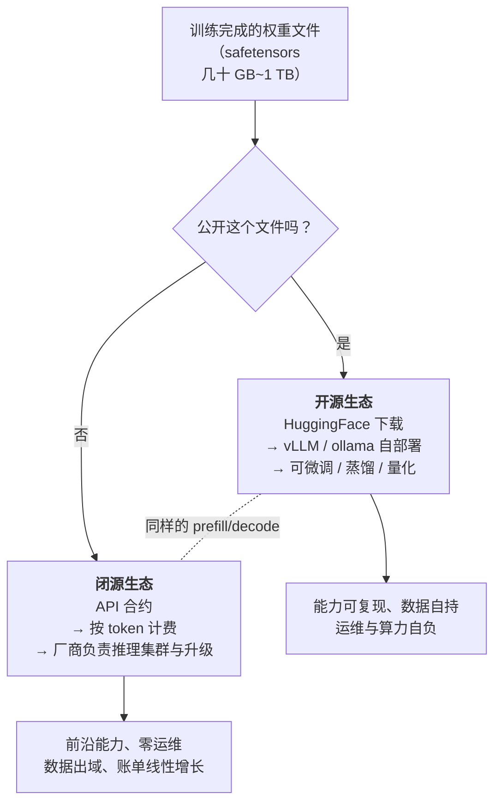
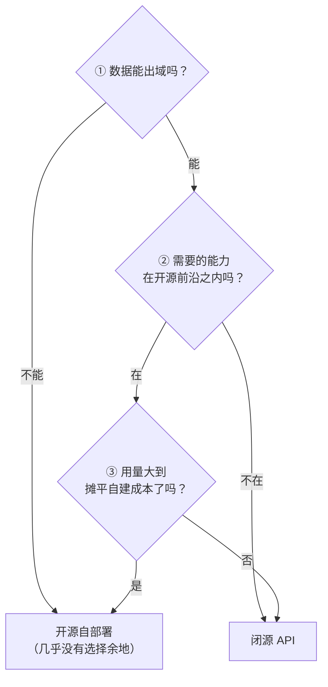

# 开源 vs 闭源：同一份权重，两种交付

> 训练管线跑完，产出一个几十 GB 的文件。接下来只剩一个决策：**这个文件公开吗？**
>
> 就这一个二选一，分叉出了两个平行生态、两套成本模型、两种隐私边界、两类风险。而分叉之后，两边跑的推理原理**一模一样**——同样的 prefill/decode、同样的 KV Cache、同样的采样参数。
>
> 这一篇讲清楚：分叉点到底在哪、七个维度的系统对比、三个问题如何定选型、自建到底什么时候才划算、以及两个生态如何持续互相塑造。它对应运行示例的第 1 步和第 5 步——下载权重 vs 调 API，隐私自持 vs 按 token 计费。

---

## 缩写对照表

| 缩写 | 英文全称 | 中文 |
|---|---|---|
| API | Application Programming Interface | 应用程序接口 |
| VPC | Virtual Private Cloud | 虚拟私有云 |
| LoRA | Low-Rank Adaptation | 低秩适配（参数高效微调方法） |
| SLA | Service Level Agreement | 服务等级协议 |
| TCO | Total Cost of Ownership | 总拥有成本 |
| GDPR | General Data Protection Regulation | 通用数据保护条例 |
| MAU | Monthly Active Users | 月活跃用户数 |
| MoE | Mixture of Experts | 混合专家 |

---

## 一、分叉点在哪

- **公开** → **open weights（开放权重）**：任何人可下载、自部署、微调。代表：Llama（Meta）、Qwen（阿里）、DeepSeek、Mistral、Gemma（Google）；
- **不公开** → **closed API（闭源 API）**：权重是核心商业资产，能力只通过接口出租。代表：GPT（OpenAI）、Claude（Anthropic）、Gemini（Google）。

**关键认知**：这个分叉发生在权重文件这一层，而不是技术栈的任何其他地方。分叉之后两边跑的都是 [08 · 推理引擎](08-inference-engine.zh.md) 讲的同一套物理。**开源和闭源之分不在技术，在交付合约。**

## 二、再次澄清："开源"其实是"开放权重"

[02 · LLM 到底是什么](02-what.zh.md) 提过一次，这里必须说透，因为它直接影响你的法务判断。

一个真正意义上的开源软件，你能拿到源代码、能审计、能从头构建。而一个"开源模型"，你拿到的是：

| 要素 | 通常公开吗 | 意味着 |
|---|---|---|
| **权重文件** | ✅ 公开 | 可以运行、微调、量化、蒸馏 |
| 模型架构与推理代码 | ✅ 公开 | 可以理解它怎么跑 |
| **训练数据** | ❌ 通常不公开 | **无法审计它学了什么**、有无版权/隐私问题 |
| 完整训练代码与配方 | ❌ 通常不完整 | **无法从零复现出这份权重** |

**你能复用结果，但无法复现过程。** 真正三者全开的模型（OLMo、Pythia 等）是少数，主要服务于研究。

### 许可证：能下载 ≠ 能随便用

各家的许可证差异很大，且**都不是标准开源许可证**：

- **Llama 系列**：自有许可证，包含月活用户数（MAU）阈值条款——超过一定规模需要单独申请商用授权；早期版本还限制"用其输出去训练其他模型"；
- **Qwen / DeepSeek / Mistral 部分模型**：条款相对宽松，部分采用 Apache-2.0；
- **Gemma**：自有条款，附带使用政策限制。

**商用之前必须读许可证，而且要读你实际用的那个版本的许可证。** 同一个家族的不同规格、不同代际，条款可能不同。这是开源路线上最容易被忽略、后果最实在的风险。

## 三、七维度系统对比

| 维度 | 开源（自部署） | 闭源（API） |
|---|---|---|
| **能力上限** | 追赶极快（DeepSeek-R1 时刻），但最前沿通常晚 6~12 个月 | 前沿能力的第一现场 |
| **成本模型** | 前期投入（GPU / 运维）+ 边际成本趋近电费；**量大更划算** | 零前期投入，按 token 线性增长；**量小更划算** |
| **数据隐私** | 数据不出你的机器 / VPC——合规刚需场景的决定性优势 | 数据经过厂商（有企业级合规承诺，但信任模型不同） |
| **定制权** | 全量微调、LoRA、改采样器、蒸馏、改架构——权重任你处置 | 有限的微调接口 + 提示词工程 |
| **运维负担** | 推理引擎、显存规划、扩缩容、监控全归你 | 全归厂商，你只管调 API |
| **可控性 / 稳定性** | 权重版本永久固定，**行为可复现** | 厂商升级 / 下线模型，**行为可能漂移** |
| **生态** | HuggingFace、ollama、vLLM、开放微调社区 | 官方 SDK、工具生态（函数调用、缓存定价、批处理接口） |

有两行值得单独展开。

### "行为可复现"这一条被严重低估

闭源 API 的模型是会变的。厂商推送一次更新，你精心调好的提示词可能突然行为漂移；某个旧版本被下线，你的回归测试基线就没了。

而开源权重文件下载下来就是你的，**十年后跑还是同样的输出**（同样的采样种子下）。对于需要审计留痕、需要长期行为一致性的场景（金融、医疗、法务），这一条经常是决定性的。

### "能力上限"的差距在缩小，但形态在变

开源追赶的速度确实惊人。但要注意一个结构性变化：**前沿模型越来越多地把能力堆在"重型后训练 + 测试时计算"上**（见 [07 · 后训练细拆](07-post-training.zh.md) 和 [09 · 参数规模](09-param-scale.zh.md)），而这两项恰恰是最难被开源社区复现的——它们需要的不是权重，而是大规模的偏好数据采集和 RL 基础设施。

## 四、自建到底什么时候才划算

"量大更划算"这句话需要一个具体的算法。核心结构是：

$$
\text{自建成本} = \underbrace{\text{GPU 租赁/折旧}}_{\text{按小时计，与用量无关}} + \underbrace{\text{运维人力}}_{\text{常被漏算}} \qquad\text{vs}\qquad \text{API 成本} = \text{单价} \times \text{token 量}
$$

**自建是固定成本，API 是变动成本。** 交叉点由三个变量决定：

**① 利用率（最重要的变量）**
一张卡包月是全天候计费的，但你的流量有波峰波谷。如果日均利用率只有 15%，你实际上在为 85% 的空转付费。**API 的单价里已经包含了厂商用高并发批处理摊薄成本的收益**（见 [08 · 推理引擎](08-inference-engine.zh.md) 的批处理一节）——你自建时很难达到同样的批次密度。

**② 模型规格**
需要 70B 才够用，还是 8B 就行？8B 量化后可能一张消费级卡就够，交叉点很低；70B 要多卡，交叉点高得多。

**③ 隐藏成本**
推理引擎调优、显存规划、扩缩容、监控告警、模型升级、故障响应——**这部分几乎总是被低估**。一个能维护生产级推理服务的工程师，其人力成本可能就超过了你省下的 API 费用。

**经验性的结论**：
- **持续高负载 + 中小模型够用 + 已有运维团队** → 自建通常划算；
- **流量波动大 / 需要前沿能力 / 团队没有推理运维经验** → API 几乎总是更划算；
- **中间地带** → 先用 API 跑起来，等用量稳定且账单变成真实痛点时再评估迁移。

**不要在产品验证期自建。** 这是最常见的过早优化。

## 五、三个问题定选型

抛开所有细节，实际决策通常归结为三个问题：

顺序很重要：**①是硬约束，②是能力约束，③才是经济性问题。**

如果医疗数据不能出内网，那么后面两个问题都不用问了——即使 API 更便宜、能力更强，也不是选项。反过来，如果你需要的是最前沿的推理能力，开源那边根本没有对等物，成本再优也无从谈起。

**三个"是"选开源，任何一个硬性"否"基本就定了方向。**

## 六、两个生态如何互相塑造

这不是静态对峙，而是一个持续的反馈循环。

### 开源是整个市场的价格锚

每一次开源模型逼近前沿（Llama-3、DeepSeek-R1、Qwen 各代），闭源 API 都应声降价或推出更强的低价档位。

原因很直接：**当一个能力水平可以被免费下载时，为这个能力收费的空间就消失了**。闭源厂商的定价权只存在于"开源还够不到"的那一段能力区间——而这个区间在被持续压缩。

**即使你从不打算自部署，开源生态也在直接压低你的 API 账单。**

### 闭源反哺开源

蒸馏（见 [09 · 参数规模](09-param-scale.zh.md)）让开源小模型可以间接吸收闭源大模型的能力。许可证对此多有限制，执行也困难，但趋势明确：**能力从闭源向开源的渗透，比权重本身的流动快得多。**

### 混合架构成为主流

生产系统里最常见的其实不是二选一，而是**按任务路由**：

| 任务类型 | 走哪边 | 理由 |
|---|---|---|
| 高频、简单、量大（分类、抽取、改写） | 本地小模型 | 成本、延迟 |
| 涉及敏感数据 | 本地模型 / VPC 部署 | 合规 |
| 复杂推理、长文档分析、创意生成 | 闭源 API | 能力 |
| 兜底 / 降级 | 另一边 | 可用性 |

这个设计之所以可行，正是因为 [08 · 推理引擎](08-inference-engine.zh.md) 里说的**统一契约**：两边都是"prompt 进、token 流出"，切换成本主要在提示词调优而非架构改造。

**"开源 vs 闭源"在真实生产系统里，通常不是一道选择题，而是一个路由表。**

## ⚓ 回到示例

运行示例第 1 步和第 5 步的本质：

**第 1 步 · 为什么你能 `ollama pull llama3` 却永远不能 `ollama pull claude`**

因为 Meta 把那个 16 GB 的文件放上了公网，而 Anthropic 没有。就这么简单。

分叉之后，你笔记本上跑的 prefill/decode 和 Anthropic 集群上跑的**原理完全一致**——差别只在模型规模、硬件档次和工程成熟度。**开源/闭源之分不在技术栈，在交付合约。**

**第 5 步 · 两张不同的收据**

- **本地这路**：这轮对话从未离开你的笔记本，KV Cache 随 ollama 会话释放，成本是几分钱电费。**在医疗、金融、法务场景里，"数据没出去"这一条本身就足以定选型**；
- **API 那路**：你的约 30 个输入 token 和几百个输出 token 按价目表计费，走的正是 [08 · 推理引擎](08-inference-engine.zh.md) 讲的那套物理成本结构（输入走 prefill 便宜、输出走 decode 贵）。你买到了前沿质量，交出了数据经手权和每 token 的钱。

**示例里没发生、但值得知道的第三条路**：如果你想让这个 8B 记住你公司的内部术语和文档规范，你可以直接用 LoRA 微调它——花几十美元、几小时，得到一个永久属于你的专用版本。**这是闭源路线给不了的深度定制权**，也是很多团队最终选择开源的真正理由（不是省钱，是控制权）。

## 七、两侧各自的真实风险

### 开源侧

- **许可证违规商用**：法律风险，且往往在融资尽调或上市审计时才暴露；
- **供应链投毒**：从非官方渠道下载被篡改的权重。**认准官方仓库、校验哈希**——权重文件是可以被植入后门的；
- **部署安全配错**：推理服务端口裸奔公网是真实事故。vLLM/ollama 的默认配置通常没有鉴权；
- **自己微调砸了**：灾难性遗忘导致通用能力退化，而你没有回归评测集所以没发现（见 [07 · 后训练细拆](07-post-training.zh.md)）。

### 闭源侧

- **行为漂移**：厂商升级模型导致提示词效果变化。**没有版本锁定 + 回归测试的团队，迟早会被这一条打到**；
- **可用性天花板**：API 限流、宕机直接成为你的服务上限，你的 SLA 不可能高于上游的 SLA；
- **模型下线**：你依赖的版本被弃用，被迫在给定期限内迁移；
- **供应商锁定（vendor lock-in）**：深度使用某家的私有特性（特定的工具调用格式、缓存机制、结构化输出）后，迁移成本显著上升。

### 共同的

**幻觉、越狱、提示词注入攻击，两边都有。** 交付形态不改变模型的内生弱点——一个开源模型不会因为你能看到权重就少编一点（见 [11 · 幻觉的机制](11-hallucination.zh.md)）。

## 一句话总结

**开源和闭源是同一份权重的两种交付方式**：公开下载给你控制权、隐私、可复现性和定制自由，代价是算力账单和运维负担；API 出租给你前沿能力和零运维，代价是数据出域、行为漂移风险和线性增长的账单。**技术栈完全相同，合约完全不同。** 选型归结为三个问题——数据能否出域、能力够不够、用量摊不摊得平——而在真实的生产系统里，答案往往不是二选一，是一张路由表。

---

**下一篇**：[13 · 完整重演：带着全部深度重跑运行示例](13-walkthrough.zh.md) —— 十二篇的深度，缝成一条连续的时间线。

**系列目录**：[index.md](index.md)
