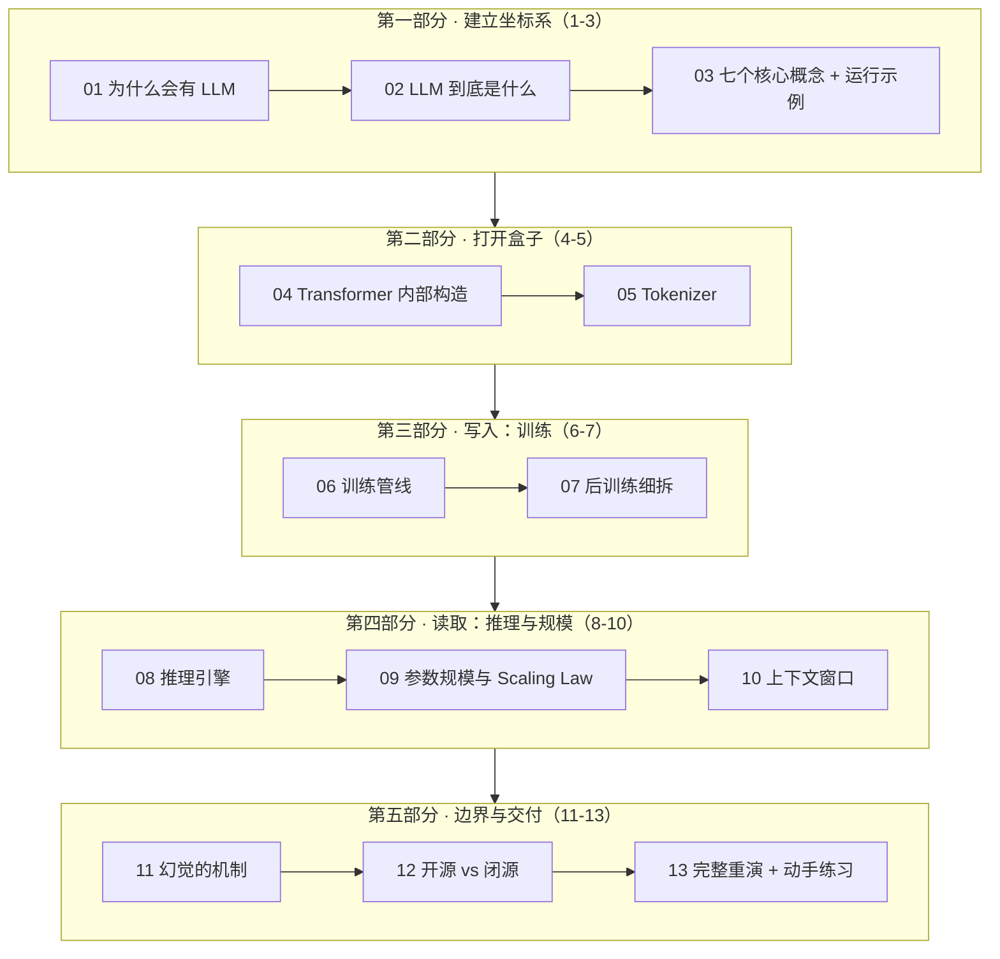

# LLM 全景指南 / LLM Fundamentals Series

[← Back to AI](../README.md)

一个从零开始、层层下潜的大语言模型（LLM，Large Language Model）系列。**十三篇文章、一条主线**：从"为什么必须有人发明它"，一路讲到"它内部长什么样、怎么被训出来、怎么被跑起来、怎么会出错"，最后带着全部深度重跑一遍开篇的示例。

每篇都可独立阅读，但按顺序读收益最大。中文版（`.zh.md`）为主，英文版（`.en.md`）是平行改写而非逐句翻译，逐步补齐。

姊妹系列：[LLM 推理系列](../llm-inference/index.md) —— 本系列第 8 篇的工程侧展开（KV Cache、量化、Agentic 推理经济学）。

姊妹系列：[Transformer 与注意力机制](../transformer/index.md) —— 本系列第 4 篇的完整展开（注意力三连、FFN、残差与归一化、采样）。

---

## 一条主线：贯穿全篇的运行示例

> 你在笔记本上用 ollama 跑着开源的 **Llama-3-8B**，同时开着闭源的 **Claude API**。同一个问题发给两边：
> **"写一个 Python 函数判断质数，并解释为什么只需要检查到平方根。"**
> 两边代码都对，但一边的解释明显更严谨。**为什么？** —— 回答这个问题需要动用本系列的每一篇。

示例在[第 3 篇](03-core-concepts.zh.md)完整定义，之后每篇结尾的 **⚓ 回到示例**都会把当篇的深度接回它，[第 13 篇](13-walkthrough.zh.md)带着全部深度重演一次。

## 阅读地图

## 文章列表与 CSDN 发布状态

### 第一部分 · 建立坐标系

**01 · 为什么会有 LLM：一个任务一个模型的时代是怎么结束的**

2018 年以前 NLP（Natural Language Processing，自然语言处理）的三大痛点——碎片化、标注昂贵、零泛化；从规则系统到词向量到 BERT 的四代尝试各自卡在哪；三条约束如何倒逼出"超大参数 + 海量无标注文本 + 预测下一个词"这个唯一解。

- [x] [01-why.zh.md](01-why.zh.md) — 中文版
- [ ] `01-why.en.md` — English

**02 · LLM 到底是什么：定义、边界与生态位置**

一句话定义拆解；它**不是**什么（不是数据库、不是搜索引擎、不做符号推理保证、推理时不学习）；它坐在谁之上、谁坐在它之上；"开源模型"其实是 open weights（开放权重）这个必须澄清的用词。

- [x] [02-what.zh.md](02-what.zh.md) — 中文版
- [ ] `02-what.en.md` — English

**03 · 七个核心概念：一次摊开整张地图**

Token、参数、预训练、后训练、推理、Scaling Law（规模定律）、权重发布模式——七个概念按依赖顺序串成一条链，五个关键角色各自的"唯一职责"，以及贯穿全系列的运行示例的完整定义。

- [x] [03-core-concepts.zh.md](03-core-concepts.zh.md) — 中文版
- [ ] `03-core-concepts.en.md` — English

### 第二部分 · 打开盒子

**04 · Transformer 内部构造：那几十亿个参数到底排成什么样**

从一个 token 走完全程：嵌入层 → N 层（自注意力 + 前馈网络）→ 输出头 → 概率分布。多头注意力为什么要"多头"，FFN（Feed-Forward Network，前馈网络）为什么占了约七成的参数，残差连接与归一化在防什么，以及手算一遍 8B 参数是怎么凑出来的。

- [x] [04-transformer.zh.md](04-transformer.zh.md) — 中文版
- [ ] `04-transformer.en.md` — English

**05 · Tokenizer：模型眼里的世界不是文字**

BPE（Byte-Pair Encoding，字节对编码）的合并算法；为什么同一句话在不同模型里 token 数不同；为什么中文比英文贵；为什么模型数不清 strawberry 里有几个 r；词表大小的工程权衡与"词表一旦冻结永不可改"的硬约束。

- [x] [05-tokenizer.zh.md](05-tokenizer.zh.md) — 中文版
- [ ] `05-tokenizer.en.md` — English

### 第三部分 · 写入：训练

**06 · 训练管线：数据如何变成权重**

三级流水线（预训练 → SFT → 偏好优化）的完整展开；数据清洗为什么是核心竞争力；一次预训练的真实账单；基座模型（base model）为什么"只会续写不会帮忙"；训练崩溃、数据污染、死记硬背这些真实故障。

- [x] [06-training-pipeline.zh.md](06-training-pipeline.zh.md) — 中文版
- [ ] `06-training-pipeline.en.md` — English

**07 · 后训练细拆：SFT、RLHF、DPO、RLVR 四代工具**

四代对齐工具的数据形态、损失函数、在场模型数量与失败模式；DPO（Direct Preference Optimization，直接偏好优化）的闭式解为什么能砍掉四分之三复杂度；RLVR（可验证奖励强化学习）如何让长链思考自发涌现。（推理侧的姊妹篇：[会续写 ≠ 会帮忙](../llm-inference/post-training.zh.md)）

- [x] [07-post-training.zh.md](07-post-training.zh.md) — 中文版
- [ ] `07-post-training.en.md` — English

### 第四部分 · 读取：推理与规模

**08 · 推理引擎：权重如何被读取**

Prefill（预填充）与 Decode（解码）两阶段的分工；为什么 decode 是内存带宽受限而非算力受限；KV Cache 的显存账；continuous batching（连续批处理）如何救吞吐；采样参数是用户唯一的运行时控制面。

- [x] [08-inference-engine.zh.md](08-inference-engine.zh.md) — 中文版
- [ ] `08-inference-engine.en.md` — English

**09 · 参数规模与 Scaling Law：7B、70B、670B 为什么如此重要**

Scaling Law（规模定律）与 Chinchilla 最优配比；"后 Chinchilla 时代"为什么大家反过来给小模型喂超量数据；显存账单公式；MoE（Mixture of Experts，混合专家）如何把"一个数字拆成两个"；蒸馏与测试时计算这两根新杠杆。

- [x] [09-param-scale.zh.md](09-param-scale.zh.md) — 中文版
- [ ] `09-param-scale.en.md` — English

**10 · 上下文窗口：128K 到底意味着什么**

上下文窗口的三重定义（架构上限、显存上限、有效上限）；位置编码与 RoPE（Rotary Position Embedding，旋转位置编码）外推；"lost in the middle"（中段遗失）现象；为什么长上下文越聊越慢越贵；上下文工程的四条实操准则。

- [x] [10-context-window.zh.md](10-context-window.zh.md) — 中文版
- [ ] `10-context-window.en.md` — English

### 第五部分 · 边界与交付

**11 · 幻觉的机制：为什么它编得如此流畅**

幻觉不是 bug 而是有损压缩的必然产物；四类幻觉各自的成因；为什么训练管线的三个阶段都在系统性地鼓励模型"不懂装懂"；RAG、工具调用、置信度校准各自能治什么、治不了什么。

- [x] [11-hallucination.zh.md](11-hallucination.zh.md) — 中文版
- [ ] `11-hallucination.en.md` — English

**12 · 开源 vs 闭源：同一份权重，两种交付**

分叉点在哪；七维度系统对比；三个问题定选型；两个生态如何互相塑造（开源当价格锚、闭源反哺蒸馏、混合路由成为主流）；两侧各自的真实风险。

- [x] [12-open-vs-closed.zh.md](12-open-vs-closed.zh.md) — 中文版
- [ ] `12-open-vs-closed.en.md` — English

**13 · 完整重演：带着全部深度重跑运行示例 + 动手练习**

从 T-6 个月的训练集群到 T+30s 的两张收据，一条连续时间线串起全部十二篇；随后是七个动手练习，每个验证一篇文章的一个论断；最后是一页带走全部的速查卡片。

- [x] [13-walkthrough.zh.md](13-walkthrough.zh.md) — 中文版
- [ ] `13-walkthrough.en.md` — English

---

*勾选框表示已发布到 CSDN。建议阅读顺序即编号顺序；已有推理基础的读者可从 04 或 08 直接切入。*
