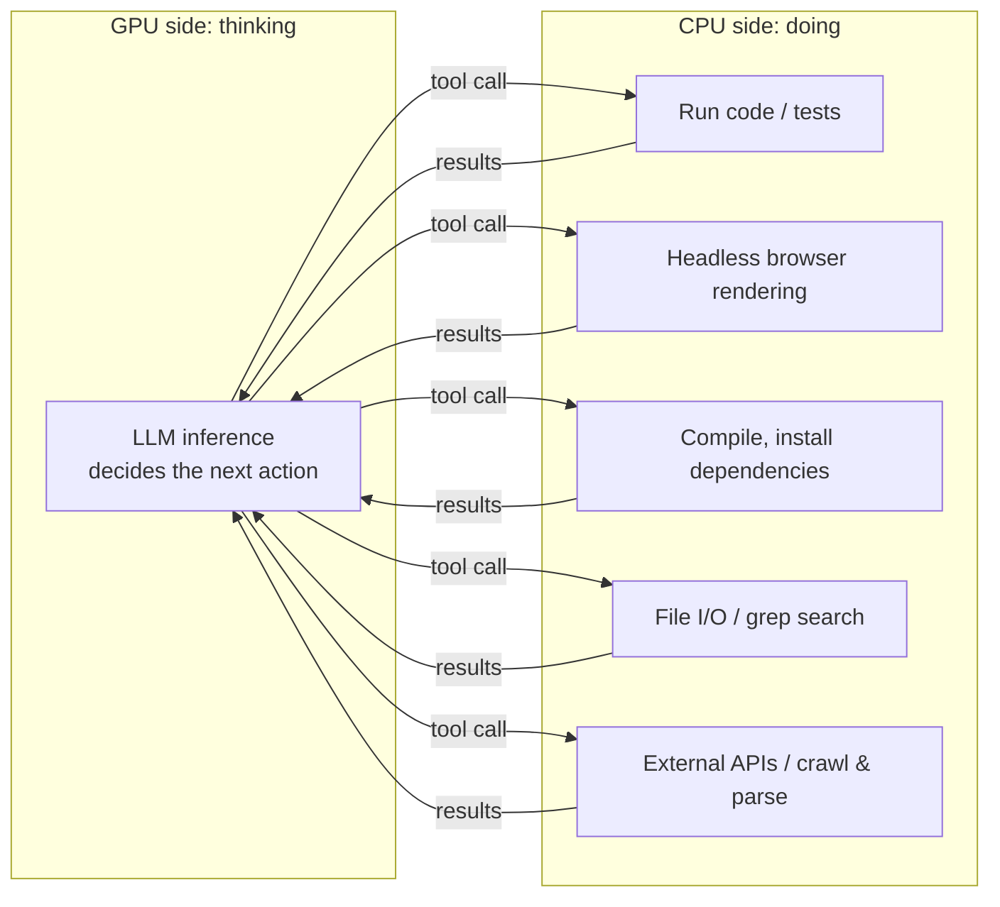
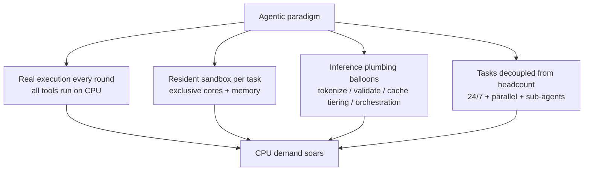

# GPUs Think, CPUs Do: Why Agentic AI Sends CPU Demand Soaring

> The previous article covered how the Chat-to-Agentic shift rewrites inference economics — still from the GPU's point of view. This one changes the angle: as models start doing real work autonomously, another shift is quietly happening in the datacenter — **the CPU demand curve is bending sharply upward**.
>
> That sounds counterintuitive: isn't the LLM business a GPU game? The answer hides in the other half of the agentic loop. Every time the model "thinks" a step (GPU inference), it must actually "do" something — run code, drive a browser, query a database — and all of the *doing* runs on CPUs.

---

## 1. The Workload Changed Shape: Every Inference Round Carries a Real Execution

Recall the agentic loop: the model decides → calls a tool → the result feeds back → it decides again. The "calls a tool" step simply didn't exist in the Chat era — the model emitted text, the human read it, done; the server did almost nothing beyond one GPU inference.

In agentic mode, tool execution happens every single round, and it is pure CPU workload:

Walk through real products and the scale becomes tangible:

- **Coding agents** (Claude Code, Codex): each round may run `pytest` over a test suite, `npm install` hundreds of dependencies, or compile a whole project. That's not "lightweight glue logic" — that's **the daily workload of a CI server**;
- **Computer Use / browser agents**: behind each one sits a real headless browser rendering DOM, executing JavaScript, taking screenshots. A single Chrome instance eats 1–2 cores and several GB of RAM — serving one action of one agent;
- **Research agents** (Deep Research): concurrently crawling dozens of pages, parsing PDFs, extracting tables, cleaning text — all CPU-intensive parsing.

Do the arithmetic: one 50-round agent task = 50 GPU inferences + **50 CPU tool executions**. The second term was zero in the Chat era. That's the first driver of the demand curve.

---

## 2. Sandboxes: Every Agent Needs Its Own Little Computer

The second driver is subtler — and bigger.

An agent executes arbitrary code, so it must be isolated: you cannot let model-generated commands run loose on bare metal. So behind every active agent session stands a dedicated sandbox — a container, a microVM (Firecracker, gVisor), or a full VM — each with its own filesystem, CPU quota, and memory.

This creates a resource model that didn't exist in the Chat era:

| | Chat session | Agentic session |
|---|---|---|
| Server-resident resources | Nearly zero (stateless API request) | One sandbox: 1–4 CPU cores + several GB RAM + disk |
| Lifetime | Milliseconds–seconds (one request) | Minutes–hours (the whole task) |
| When resources free | As soon as the response returns | Only when the task ends |
| Unit of scaling | GPU cards | **Fleets of CPU servers** |

The crucial part is the **asymmetry of occupancy time**. Within one loop iteration, GPU inference takes a few seconds; tool execution — compiling, running tests, loading pages — routinely takes tens of seconds, and the sandbox stays resident for the entire task. In other words:

- **GPUs are time-shared**: continuous batching rotates hundreds of tasks through them at high throughput;
- **Sandboxes are exclusive**: one per task, occupied start to finish.

Ten thousand concurrent agents = ten thousand resident sandboxes = a CPU pool of tens of thousands of cores. E2B, Modal, and the various agent-cloud platforms are, at their core, the business of turning "sandbox fleets rented by the second" into infrastructure — an entirely new category grown by the agentic era.

---

## 3. The Inference Pipeline's Own CPU Overhead Is Ballooning Too

Even ignoring tool execution entirely, agentic workloads multiply the CPU work surrounding inference:

**Tokenization and detokenization.** Every round re-sends tens of thousands of context tokens, and tokenizing is pure CPU string processing. Milliseconds per call is negligible — until you multiply by hundred-round loops and massive concurrency.

**Structured-output constraints and validation.** Tool calls demand strict JSON. The standard solution is constrained decoding: a grammar state machine on the CPU filters illegal tokens at every step, followed by schema validation, parsing, and retry-on-failure. Every round, all on CPU.

**Tiered KV cache storage.** Prefix caches must stay alive across dozens of loop iterations (article two did the math: one long context's cache is gigabytes). GPU memory can't hold that much "warm" cache, so the standard design demotes cold data to **CPU RAM** and even SSD, promoting it back on a hit. Large-memory CPU servers thereby become the inference cluster's cache-pool tier.

**Scheduling and orchestration.** The continuous-batching scheduler, multi-agent orchestration frameworks, message queues, retry logic, end-to-end logging and observability — classic backend workloads that always ran on CPUs, now amplified dozens of times because each user request became a dozens-round loop.

**RAG plumbing.** Vector search, reranking, document chunking, OCR/PDF parsing — any round of an agent's loop can trigger a full RAG pipeline.

---

## 4. The Aggregate Effect: Agents Decouple Compute Demand from Headcount

The first three sections said "each task got heavier." The final layer: **the number of tasks lost its ceiling.**

Chat's total load has a natural cap: humans type slowly, sleep, and have limited attention — one person can only chat so much per day. Agents tear that cap off:

- One person can **run ten agents simultaneously** on different tasks while doing something else entirely;
- Agents run **24/7 unattended**: scheduled jobs, CI integrations, automated pipelines — still compiling and testing at 3 a.m.;
- Agents **spawn sub-agents**, splitting one task into a whole tree of parallel work.

The demand-side driver shifts from "active users" to "number of tasks" — and task count has no biological limit. GPU and CPU demand both get amplified, but the CPU side — stacking "one resident sandbox per task" on top of "one real execution per round" — climbs the steeper curve.

---

## 5. Summary

1. **Workload nature**: Chat is inference only; Agentic alternates inference and execution — and execution runs entirely on CPUs;
2. **Resource model**: every agent needs a resident sandbox (cores + memory + disk) whose occupancy far outlasts the GPU inference itself; the unit of scaling shifts from GPU cards to CPU fleets;
3. **Pipeline overhead**: tokenization, constrained decoding and validation, KV cache demotion to CPU RAM, scheduling and orchestration, RAG pipelines — all CPU loads that scale with round count;
4. **Aggregate decoupling**: agent count isn't bounded by human time; task volume explodes, and the CPU side climbs the steeper curve.

One sentence to close: **GPUs determine how fast an agent thinks; CPUs determine how much work it can actually get done.** The agentic-era datacenter grows a CPU sandbox fleet as vast as the GPU cluster beside it — one is the brain, the other the hands, and the agent moves only when it has both.
