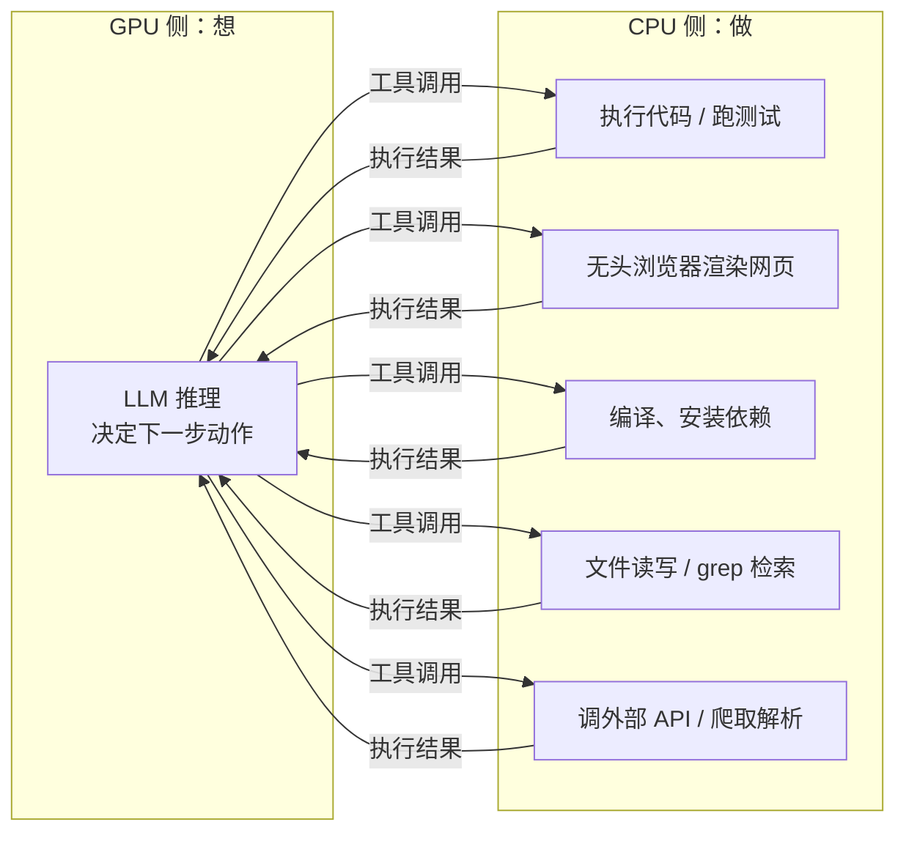
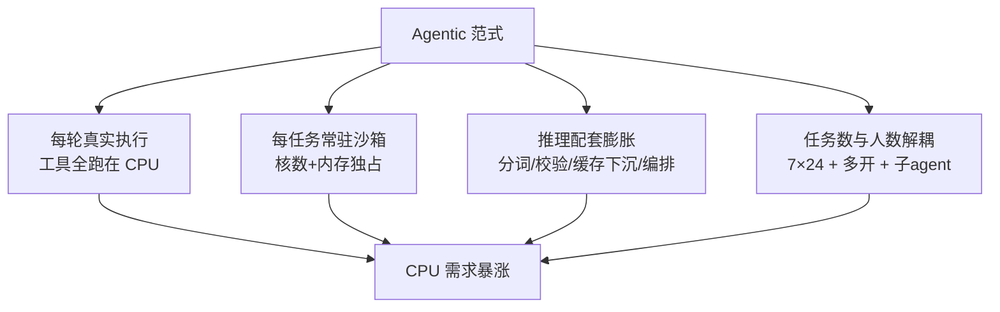

# GPU 负责想，CPU 负责做：为什么 Agentic AI 让 CPU 需求暴涨

> 上一篇讲了 Chat 到 Agentic 的范式切换如何改写推理经济学——那还是站在 GPU 视角。这一篇换个角度：当模型开始自主干活，数据中心里悄悄发生了另一场变化——**CPU 的需求曲线陡然抬头**。
>
> 这听起来反直觉：大模型不是 GPU 的游戏吗？答案藏在 Agentic 循环的另一半里。模型每"想"一步（GPU 推理），就要真实地"做"一件事——跑代码、开浏览器、查数据库——而所有的"做"，都运行在 CPU 上。

---

## 一、负载结构变了：每轮推理都挂着一次真实执行

回顾 Agentic 循环：模型决策 → 调用工具 → 结果喂回 → 再决策。其中"调用工具"这一步在 Chat 时代根本不存在——模型输出文本，人读完，交互结束，服务端除了一次 GPU 推理外几乎什么都没干。

Agentic 模式下，工具调用是每一轮的必经环节，而它恰恰全是 CPU 负载：

对着真实产品看一遍，量级感就出来了：

- **编码 Agent**（Claude Code、Codex）：每轮可能要 `pytest` 跑一遍测试套件、`npm install` 拉几百个依赖、编译整个项目。这不是"轻量胶水逻辑"，这是**一台 CI 服务器的日常负载**；
- **Computer Use / 浏览器 Agent**：背后是一个真实的无头浏览器在渲染 DOM、执行 JS、截图。单个 Chrome 实例就能吃掉 1~2 个核、几 GB 内存——而这只服务一个 agent 的一次操作；
- **研究型 Agent**（Deep Research）：并发爬取几十个网页、解析 PDF、抽取表格、清洗文本，全是 CPU 密集的解析工作。

算一笔账：一次 50 轮的 agent 任务 = 50 次 GPU 推理 + **50 次 CPU 工具执行**。后一项在 Chat 时代的量级是零——这就是需求曲线抬头的第一推动力。

---

## 二、沙箱：每个 Agent 都要一台"专属小电脑"

第二推动力更隐蔽，也更庞大。

Agent 要执行任意代码，就必须隔离——不能让模型生成的命令在裸机上乱跑。于是每个活跃 agent 会话背后，都站着一个独立的沙箱环境：容器、microVM（Firecracker、gVisor）或完整虚拟机，各自带着自己的文件系统、CPU 配额和内存。

这带来一个 Chat 时代不存在的资源模型：

| | Chat 会话 | Agentic 会话 |
|---|---|---|
| 服务端驻留资源 | 几乎为零（无状态 API 请求） | 一个沙箱：1~4 核 CPU + 几 GB 内存 + 磁盘 |
| 生命周期 | 毫秒~秒级（一次请求） | 分钟~小时级（任务全程驻留） |
| 资源释放时机 | 响应返回即释放 | 任务结束才释放 |
| 扩容单位 | GPU 卡 | **CPU 服务器机群** |

最关键的是**占用时长的不对称**。一轮循环里，GPU 推理只占几秒钟；而工具执行——编译、跑测试、网页加载——动辄几十秒，且沙箱在整个任务期间全程驻留。也就是说：

- **GPU 是分时复用的**：靠 continuous batching 在几百个任务间高吞吐轮转；
- **沙箱是独占的**：每个任务一份，从头占到尾。

一万个并发 agent = 一万个常驻沙箱 = 数万核的 CPU 池。E2B、Modal 以及各家 agent 云平台的本质，就是把"按秒起租的沙箱机群"做成基础设施生意——这是 Agentic 时代长出来的一个全新品类。

---

## 三、推理链路自身的 CPU 配套也在膨胀

就算完全不算工具执行，agentic 负载也让推理服务周边的 CPU 工作量成倍增长：

**分词/反分词。** 每轮循环重发几万 token 的上下文，tokenize 是纯 CPU 字符串处理。单次毫秒级可以忽略，乘上百轮循环和海量并发就不可忽略了。

**结构化输出的约束与校验。** 工具调用要求严格的 JSON 格式，主流方案是约束解码（constrained decoding）：CPU 上维护语法状态机，每一步过滤掉不合法的 token；模型输出后还要 schema 校验、解析、失败重试。每轮都跑，全在 CPU。

**KV Cache 分层存储。** 前缀缓存要在几十轮循环之间保活（第二篇算过账：单条长上下文的缓存就是 GB 级）。显存装不下这么多"温缓存"，主流方案是把冷数据下沉到 **CPU 内存**乃至 SSD，命中时再搬回显存。大内存 CPU 服务器由此成了推理集群的缓存池层。

**调度与编排。** Continuous batching 的调度器、多 agent 编排框架、消息队列、重试逻辑、全链路日志与可观测性——这些传统后端负载本来就跑在 CPU 上，agent 把每个用户请求放大成几十轮循环，它们也随之放大几十倍。

**RAG 配套。** 向量检索、重排序、文档切分、OCR/PDF 解析——agent 每一轮都可能触发一整条 RAG 流水线。

---

## 四、总量效应：Agent 把计算需求和"人的数量"解耦

前三节讲的是"每个任务变重了"，最后一层是"任务总数失去了上限"。

Chat 的总负载有天然天花板：人打字慢、要睡觉、注意力有限，一个人一天聊不了多少轮。Agent 撕掉了这层天花板——

- 一个人可以**同时挂十个 agent** 跑不同任务，自己该干嘛干嘛；
- Agent 可以 **7×24 无人值守**运行：定时任务、CI 集成、自动化流水线，凌晨三点照样在编译和跑测试；
- Agent 还会**派生子 agent** 并行工作，一个任务裂变成一棵任务树。

需求侧的驱动变量从"活跃用户数"变成了"任务数"，而任务数没有生理上限。GPU 和 CPU 的需求同时被放大——但 CPU 侧因为"每任务常驻沙箱 + 每轮真实执行"的双重叠加，放大倍数更陡。

---

## 五、总结

1. **负载性质**：Chat 只有推理，Agentic 是"推理 + 执行"交替——执行全在 CPU 上；
2. **资源模型**：每个 agent 需要常驻沙箱（核数 + 内存 + 磁盘），占用时长远超 GPU 推理本身，扩容单位从 GPU 卡变成 CPU 机群;
3. **配套链路**：分词、约束解码与校验、KV 缓存下沉 CPU 内存、调度编排、RAG 流水线，全是随轮数放大的 CPU 负载；
4. **总量解耦**：agent 数量不受人的时间限制，任务总数爆炸式增长，且 CPU 侧放大倍数比 GPU 更陡。

一句话收束：**GPU 决定 agent 想得多快，CPU 决定它干得动多少活。** Agentic 时代的数据中心，是在 GPU 训练/推理集群旁边，再长出一片同样庞大的 CPU 沙箱机群——前者是大脑，后者是手脚，缺了哪个，agent 都动不起来。
